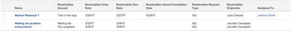

# View: originating issue details for tasks and projects {#view-originating-issue-details-for-tasks-and-projects}

When an issue is converted into a task or a project a resolving object relationship is established between the task or project and the issue. This view displays some of the details of the issue that&nbsp;resolves when the task or project completes.

To apply this view:

1. Go to a list of tasks or a list of projects.
1. From the **View** drop-down menu, select **New View**.

1. In the** Column Preview** area, eliminate all columns except for one.
1. Click the header of the remaining column, then click** Switch to Text Mode**.
1.  Mouse over the text mode area, and click **Click to edit text**.
1. Remove the text you find in the **Text Mode** box, and replace it with the following code:  
   `<pre>column.0.textmode=false column.0.valuefield=name column.0.valueformat=HTML column.0.descriptionkey=name column.0.linkedname=direct column.0.listsort=string(name) column.0.namekey=name column.0.querysort=name column.0.shortview=false column.0.stretch=100 column.0.width=150 column.1.displayname=Resolvables (Issues) column.1.listdelimiter=  column.1.listmethod=nested(resolvables).lists column.1.textmode=true column.1.type=iterate column.1.valueexpression={name} column.1.valueformat=HTML column.2.displayname=Resolvables Entry Date column.2.listdelimiter=  column.2.listmethod=nested(resolvables).lists column.2.textmode=true column.2.type=iterate column.2.valueexpression={entryDate} column.2.valueformat=HTML column.3.displayname=Resolvables Due Date column.3.listdelimiter=  column.3.listmethod=nested(resolvables).lists column.3.textmode=true column.3.type=iterate column.3.valueexpression={plannedCompletionDate} column.3.valueformat=HTML column.4.displayname=Resolvables Actual Completion Date column.4.listdelimiter=  column.4.listmethod=nested(resolvables).lists column.4.textmode=true column.4.type=iterate column.4.valueexpression={actualCompletionDate} column.4.valueformat=HTML column.5.displayname=Resolvables Request Type column.5.listdelimiter=  column.5.listmethod=nested(resolvables).lists column.5.textmode=true column.5.type=iterate column.5.valueexpression={opTaskType} column.5.valueformat=HTML column.6.displayname=Resolvables Originator column.6.listdelimiter=  column.6.listmethod=nested(resolvables).lists column.6.textmode=true column.6.type=iterate column.6.valueexpression={owner}.{name} column.6.valueformat=HTML column.7.descriptionkey=assignedto column.7.linkedname=assignedTo column.7.listsort=nested(assignedTo).string(name) column.7.namekey=assignedto column.7.querysort=assignedTo:name column.7.shortview=false column.7.stretch=0 column.7.textmode=true column.7.valuefield=assignedTo:name column.7.valueformat=HTML column.7.width=150 </pre>`

1.  Click **Save View**.

