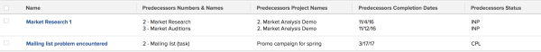

# View: predecessor details {#view-predecessor-details}

This task view shows details of the predecessors of the tasks using a collection view. In a collection view, you can display information about objects that are in a "one-to-many" relationship. In this case, each task (one) can have multiple predecessors (many). The view displays the name of the tasks, as well as its Predecessors' Names, Predecessors' Project Names, Predecessors' Planned Completion Dates, and Predecessors' Statuses.

For information about referencing collections in reports, see [Reference collections in a report](reference-collections-report.md).

To apply this view:

1. Go to a list of tasks.
1. From the **View** drop-down menu, select **New View**.

1. In the** Column Preview** area, eliminate all columns except for one.
1. Click the header of the remaining column, then click** Switch to Text Mode**.
1. Mouse over the text mode area, and click **Click to edit text**.
1. Remove the text you find in the **Text Mode** box, and replace it with the following code:  
   `<pre>column.0.displayname= column.0.linkedname=direct column.0.namekey=name column.0.querysort=name column.0.valuefield=name column.0.valueformat=HTML column.1.displayname=Predecessors Numbers & Names column.1.listdelimiter=  column.1.listmethod=nested(predecessors).lists column.1.textmode=true column.1.type=iterate column.1.valueexpression=CONCAT({predecessor}.{taskNumber},' - ',{predecessor}.{name}) column.1.valueformat=HTML column.2.displayname=Predecessors Project Names column.2.listdelimiter=  column.2.listmethod=nested(predecessors).lists column.2.textmode=true column.2.type=iterate column.2.valueexpression={predecessor}.{project}.{name} column.2.valueformat=HTML column.3.displayname=Predecessors Completion Dates column.3.listdelimiter=  column.3.listmethod=nested(predecessors).lists column.3.textmode=true column.3.type=iterate column.3.valueexpression={predecessor}.{plannedCompletionDate} column.3.valueformat=HTML column.4.displayname=Predecessors Status column.4.listdelimiter=  column.4.listmethod=nested(predecessors).lists column.4.textmode=true column.4.type=iterate column.4.valueexpression={predecessor}.{status} column.4.valueformat=HTML</pre>`

1.  Click **Save View**. 

