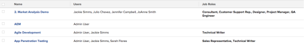

# View: project with all project team users and roles {#view-project-with-all-project-team-users-and-roles}

This project view shows a list of users and job roles assigned to the project team.

>[!NOTE]
>
>&nbsp;If the job role is listed on the same row as a user, this does not imply that the user is filling that role on the project, nor that the user is assigned that role in their profile.

To apply this view:

1. Go to a list of projects.
1. From the **View** drop-down menu, select **New View**.

1. In the** Column Preview** area, eliminate all columns except for one.
1. Click the header of the remaining column, then click** Switch to Text Mode**.
1. Mouse over the text mode area, and click **Click to edit text**.
1.  Remove the text you find in the **Text Mode** box, and replace it with the following code:
   `<pre>column.0.link.linkproperty.0.name=ID column.0.link.linkproperty.0.valuefield=ID column.0.link.linkproperty.0.valueformat=int column.0.link.lookup=link.view column.0.link.valuefield=objCode column.0.link.valueformat=val column.0.linkedname=direct column.0.listsort=string(name) column.0.namekey=name.abbr column.0.querysort=name column.0.shortview=false column.0.stretch=60 column.0.valuefield=name column.0.valueformat=HTML column.0.width=150 column.1.description=Team Users column.1.link.linkproperty.0.name=ID column.1.link.linkproperty.0.valuefield=userID column.1.link.linkproperty.0.valueformat=int column.1.link.page=/userView.cmd column.1.listdelimiter= column.1.listmethod=nested(projectUsers).lists column.1.namekey=user.plural column.1.stretch=30 column.1.type=iterate column.1.valuefield=user:name column.1.valueformat=HTML column.1.width=150 column.2.description=Team Roles column.2.link.linkproperty.0.name=ID column.2.link.linkproperty.0.valuefield=ID column.2.link.linkproperty.0.valueformat=int column.2.link.page=/roleView.cmd column.2.listdelimiter= column.2.listmethod=nested(roles).lists column.2.namekey=jobrole.plural column.2.stretch=10 column.2.type=iterate column.2.valuefield=name column.2.valueformat=HTML column.2.width=150.stretch=0</pre>` 

1. Click **Save View**.

