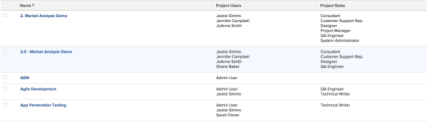

# View: project user list {#view-project-user-list}

You can apply this view in a project list or report to display a list of users that are associated with the project, as well as a list of the job roles they are performing on each project.&nbsp;

The information in this report can also be found in the `<MadCap:conditionalText data-mc-conditions="QuicksilverOrClassic.Quicksilver"> People area</MadCap:conditionalText>` of the project.  

To apply this view to a project list:

1. Go to a list of projects.
1. From the&nbsp;**View**&nbsp;drop-down menu, select&nbsp;**New View**.

1. In the**&nbsp;Column Preview**&nbsp;area, eliminate all columns except for one.
1. Click the header of the remaining column, then click**&nbsp;Switch to Text Mode**.
1. Mouse over the text mode area, and click&nbsp;**Click to edit text**.
1. Remove the text you find in the&nbsp;**Text Mode**&nbsp;box, and replace it with the following code:  
   `<pre>column.0.link.valueformat=val column.0.linkedname=direct column.0.listsort=string(name) column.0.namekey=name.abbr column.0.querysort=name column.0.section=0 column.0.shortview=false column.0.stretch=100 column.0.valuefield=name column.0.valueformat=HTML column.0.width=200 column.1.displayname=Project Users column.1.listdelimiter=&lt;br&gt; column.1.listmethod=nested(projectUsers).lists column.1.textmode=true column.1.type=iterate column.1.valueexpression={user}.{name} column.1.valueformat=HTML column.2.displayname=Project Roles column.2.listdelimiter=&lt;br&gt; column.2.listmethod=nested(projectUserRoles).lists column.2.textmode=true column.2.type=iterate column.2.valueexpression={role}.{name} column.2.valueformat=HTML</pre>`

1.  Click **Save View**. 

