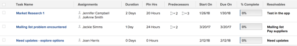

# View: Resolvable Objects in a task or project report {#view-resolvable-objects-in-a-task-or-project-report}

You can display a list of all Resolvable Objects in a project or task view or report.


For more information about Resolvable Objects, see the article [Overview of Resolving and Resolvable Objects](resolving-and-resolvable-objects.md).





Applying this view is identical for tasks and projects.


To apply this view to a task list:


1. Go to a list of tasks which have been converted from issues.
1. From the&nbsp;**View**&nbsp;drop-down menu, select&nbsp;**New View**.

1. In the**&nbsp;Column Preview**&nbsp;area, click **Add Column**.

1. Click the header of the new column, then click**&nbsp;Switch to Text Mode**.
1. Mouse over the text mode area, and click&nbsp;**Click to edit text**.
1. Remove the text you find in the&nbsp;**Text Mode**&nbsp;box, and replace it with the following code:  


   ```
   displayname=Resolvables<br>listdelimiter=<br><br>listmethod=nested(resolvables).lists<br>textmode=true<br>type=iterate<br>valuefield=name<br>valueformat=HTML
   ```


1. Click **Save View**.  
   A list of all Resolvable Objects displays in the new column. The names of the objects in the list cannot be linked directly to the objects.


