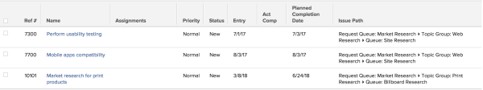

# View: submission path for issues {#view-submission-path-for-issues}

You can display the path through which an issue has been submitted in the view of an issue report. The path indicates the Queue, Topic Group, and Queue Topic where the issue was submitted originally.





To apply this view to an issue list:


1. Go to a list of issues.
1. From the&nbsp;**View**&nbsp;drop-down menu, select&nbsp;**New View**.

1. In the**&nbsp;Column Preview**&nbsp;area, click **Add Column**.

1. Click the header of the new column, then click**&nbsp;Switch to Text Mode**.
1. Mouse over the text mode area, and click&nbsp;**Click to edit text**.
1. Remove the text you find in the&nbsp;**Text Mode**&nbsp;box, and replace it with the following code:  


   ```
   displayname= Issue Path<br>linkedname=direct <br>namekey=displayQueueBreadcrumb <br>valuefield=displayQueueBreadcrumb <br>valueformat=HTML
   ```

   &nbsp;

1. Click **Save View**.


