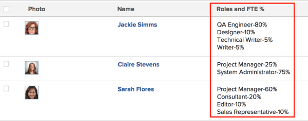

# View: user Job Role percentage of FTE availability {#view-user-job-role-percentage-of-fte-availability}

You can add a column to the view of a user list to display a list of the Job Roles the user is associated with as well as the percentage of FTE availability for each job role, as defined in the user profile.

For information about defining the percentage of FTE availability for users, see [Edit a user's profile](edit-a-users-profile.md).

To add this column to a user view:

1. Go to a list of users.
1. From the&nbsp;**View**&nbsp;drop-down menu, select&nbsp;**New View**.

1. In the**&nbsp;Column Preview**&nbsp;area, click **Add Column**.

1. Click the header of the new column, then click**&nbsp;Switch to Text Mode**.
1. Mouse over the text mode area, and click&nbsp;**Click to edit text**.
1. Remove the text you find in the&nbsp;**Text Mode**&nbsp;box, and replace it with the following code:  
   `<pre>displayname=Roles Time Percentage listdelimiter=
 listmethod=nested(userRoles).lists textmode=true type=iterate valueexpression=CONCAT({role},'-',{timePercentage},'%') valueformat=HTML</pre>`

1. Click **Save**.
1. Click **Save View**.
1. (Optional) Specify a name for your view, then click **Save View**.

