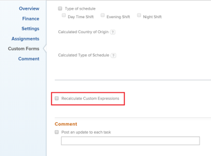

# Group and chart a report by a multi-select custom field

You can group by the value in a multi-select custom field in a `Adobe Workfront` report. Examples of multi-select custom fields are:

* Checkboxes
* Multi-select dropdown menus

You can group by this type of field only by using text mode. For information about using text mode, see the article [Text Mode overview](../../../reports-and-dashboards/reports/text-mode/understand-text-mode.md).

You cannot chart a report by a multi-select custom field. You need to create an additional calculated field that refers to the multi-select custom field to also chart the report by the value of the multi-select custom field.

## Access requirements

You must have the following access to perform the steps in this article:

<table cellspacing="0"> 
 <col> 
 <col> 
 <tbody> 
  <tr> 
   <td role="rowheader">Adobe Workfront plan*</td> 
   <td> 
Any
 </td> 
  </tr> 
  <tr> 
   <td role="rowheader">Adobe Workfront license*</td> 
   <td> 
Plan 
 </td> 
  </tr> 
  <tr> 
   <td role="rowheader">Access level configurations*</td> 
   <td> 
Edit access to&nbsp;Reports,&nbsp;Dashboards,&nbsp;Calendars
 
Edit access to Filters, Views, Groupings
 
Note: If you still don't have access, ask your Workfront administrator if they set additional restrictions in your access level. For information on how a Workfront administrator can modify your access level, see <a href="../../../administration-and-setup/add-users/configure-and-grant-access/create-modify-access-levels.md" class="MCXref xref">Create or modify custom access levels</a>.
 </td> 
  </tr> 
  <tr> 
   <td role="rowheader">Object permissions</td> 
   <td> 
Manage permissions to a report
 
For information on requesting additional access, see <a href="../../../workfront-basics/grant-and-request-access-to-objects/request-access.md" class="MCXref xref">Request access to objects in Adobe Workfront</a>.
 </td> 
  </tr> 
 </tbody> 
</table>

&#42;To find out what plan, license type, or access you have, contact your `Workfront administrator`.

## Group a report by multi-select custom fields

To be able to group by a multi-select custom field, you must have the following prerequisites:

* Build the multi-select custom field in a custom form.  
  For information about building custom forms and adding custom fields to them, see the article [Create or edit a custom form](../../../administration-and-setup/customize-workfront/create-manage-custom-forms/create-or-edit-a-custom-form.md).

* Attach the custom form to objects.
* Populate the multi-select custom field with a value on each object.&nbsp;

To group by a multi-select custom field in a report:

1. Create a report or edit an existing one where you want to add a grouping for a multi-select custom field.  
   For information about creating reports, see the article [Create a custom report](../../../reports-and-dashboards/reports/creating-and-managing-reports/create-custom-report.md).

1. Select the `Groupings` tab.
1. Click `Switch to Text Mode`.

1. Select the text in the `Group your Report` box and replace it with the following code:  
   <pre>group.0.displayname=Multi-select Custom Field Name group.0.valueexpression={DE:Multi-select Custom Field Name} group.0.valueformat=HTML textmode=true</pre>

1. Replace "Multi-select Custom Field Name" with the actual name of your multi-select custom field, as it appears in `Workfront`.&nbsp;&nbsp;
1. Click `Save and Close`.  
   The objects in the report are grouped by the values of the multi-select custom field.  
   The name of the groupings of the report are the names of the multi-select custom field followed by the values selected in the field.&nbsp;

## Chart a report by multi-select Custom Fields

You cannot build a chart in a report by referencing a multi-select custom field. Instead, you can create a calculated field that records the values of the multi-select custom field on a given object and group by the calculated field.&nbsp;

* [Build a calculated custom field that references a multi-select custom field](#building-calculated-field) 
* [Build a chart that references a calculated custom field](#building-a-chart)

### Build a calculated custom field that references a multi-select custom field

To be able to build a calculated field that references a multi-select custom field, you must have the following prerequisites:

* Build the multi-select custom field in a custom form.  
  For information about building custom forms and adding custom fields to them, see the article [Create or edit a custom form](../../../administration-and-setup/customize-workfront/create-manage-custom-forms/create-or-edit-a-custom-form.md).

* Attach the custom form to objects.
* Populate the multi-select custom field with a value on each object.

To build the calculated custom field that references the multi-select custom field:

<ol> 
 <li value="1">Create a custom form, or edit an existing one. For information about creating custom forms, see the article <a href="../../../administration-and-setup/customize-workfront/create-manage-custom-forms/create-or-edit-a-custom-form.md" class="MCXref xref">Create or edit a custom form</a>.</li> 
 <li value="2">Click Add a Field, then Calculated to add the multi-select custom field to the form.</li> 
 <li value="3">In the Label box, name the new calculated field to indicate that it references the multi-select custom field. For example: "Calculated Multi-select Field."</li> 
 <li value="4">In the Calculation box, enter the following code: <pre>{DE:Multi-select Custom Field}</pre><note type="important">
   Replace "Multi-select Custom Field" with the actual name of your multi-select custom field, as it appears in 
   Workfront.
  </note>  </li> 
 <li value="5">(Optional) If the multi-select custom field is already on this form and if this form is already attached to objects, enable the Update previous calculations&nbsp;option. This ensures that the new field is automatically populated with the value from the multi-select custom field as it is added to the forms attached to the objects already.</li> 
 <li value="6">Click Done.</li> 
 <li value="7">Click Save +Close.</li> 
</ol>

### Build a chart that references a calculated custom field

<ol> 
 <li value="1"> Go to the report where you want to add the chart for the calculated field that references the multi-select custom field. </li> 
 <li value="2"> (Optional) To ensure that all the calculated fields that you want to chart by are populated with values, select all the objects in your report, then click Edit. </li> 
 <li value="3"> (Optional and conditional) Enable the Recalculate Custom Expressions field, then click Save Changes.  </li> 
 <li value="4"> Click Report Actions, then Edit. </li> 
 <li value="5">Select the Groupings tab, then click Add Grouping. </li> 
 <li value="6">Add the Calculated Multi-select Field you created as your grouping. </li> 
 <li value="7">Select the Chart tab, and add a chart to your report. For information about adding a chart to a report, see the section <a href="../../../reports-and-dashboards/reports/creating-and-managing-reports/create-custom-report.md#add-a-chart" class="MCXref xref">Add a chart to a report</a> in the article <a href="../../../reports-and-dashboards/reports/creating-and-managing-reports/create-custom-report.md" class="MCXref xref">Create a custom report</a>. </li> 
 <li value="8">Select the Calculated Multi-select Field as one of the fields to display in the chart. </li> 
 <li value="9">Click Save + Close. The report displays the results grouped by the Calculated Multi-select Field in a chart. </li> 
</ol>

