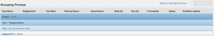

# Grouping: add a fourth grouping to a list {#grouping-add-a-fourth-grouping-to-a-list}

You can have 4 groupings in a matrix report. For more information about matrix reports, see [Create a matrix report](create-matrix-report.md).


You can only have 3 groupings in a standard report through the standard interface. To add a 4th grouping in a standard report, you must use text mode.





For example, you might have a task report which is grouped by Project Name, Progress Status and Planned Completion Date, but you also want to group the report by Assigned To Name.


## Access requirements {#access-requirements}

You must have the following access to perform the steps in this article:

<table style="width: 100%;margin-left: 0;margin-right: auto;mc-table-style: url('../../../Resources/TableStyles/TableStyle-List-options-in-steps.css');" class="TableStyle-TableStyle-List-options-in-steps" cellspacing="0"> 
 <col class="TableStyle-TableStyle-List-options-in-steps-Column-Column1"> 
 <col class="TableStyle-TableStyle-List-options-in-steps-Column-Column2"> 
 <tbody> 
  <tr class="TableStyle-TableStyle-List-options-in-steps-Body-LightGray"> 
   <td class="TableStyle-TableStyle-List-options-in-steps-BodyE-Column1-LightGray" role="rowheader"><span class="mc-variable WFVariables.FullProdNameWF variable varname">Adobe Workfront</span> plan*</td> 
   <td class="TableStyle-TableStyle-List-options-in-steps-BodyD-Column2-LightGray"> <p>Any</p> </td> 
  </tr> 
  <tr class="TableStyle-TableStyle-List-options-in-steps-Body-MediumGray"> 
   <td class="TableStyle-TableStyle-List-options-in-steps-BodyE-Column1-MediumGray" role="rowheader"><span class="mc-variable WFVariables.FullProdNameWF variable varname">Adobe Workfront</span> license*</td> 
   <td class="TableStyle-TableStyle-List-options-in-steps-BodyD-Column2-MediumGray"> <p><span class="mc-variable WFVariables.WFLicense-Plan variable varname">Plan</span> </p> </td> 
  </tr> 
  <tr class="TableStyle-TableStyle-List-options-in-steps-Body-LightGray"> 
   <td class="TableStyle-TableStyle-List-options-in-steps-BodyE-Column1-LightGray" role="rowheader">Access level configurations*</td> 
   <td class="TableStyle-TableStyle-List-options-in-steps-BodyD-Column2-LightGray"> <p>Edit access to&nbsp;Reports,&nbsp;Dashboards,&nbsp;Calendars</p> <p>Edit access to Filters, Views, Groupings</p> <p>Note: If you still don't have access, ask your <span class="mc-variable WFVariables.AdminWF variable varname">Workfront administrator</span> if they set additional restrictions in your access level. For information on how a <span class="mc-variable WFVariables.AdminWF variable varname">Workfront administrator</span> can modify your access level, see <a href="create-modify-access-levels.md" class="MCXref xref">Create or modify custom access levels</a>.</p> </td> 
  </tr> 
  <tr class="TableStyle-TableStyle-List-options-in-steps-Body-MediumGray"> 
   <td class="TableStyle-TableStyle-List-options-in-steps-BodyB-Column1-MediumGray" role="rowheader">Object permissions</td> 
   <td class="TableStyle-TableStyle-List-options-in-steps-BodyA-Column2-MediumGray"> <p>Manage permissions to a report</p> <p>For information on requesting additional access, see <a href="request-access.md" class="MCXref xref">Request access to objects in Adobe Workfront</a>.</p> </td> 
  </tr> 
 </tbody> 
</table>

&#42;To find out what plan, license type, or access you have, contact your *`Workfront administrator`*.


## Add a fourth grouping to a list {#add-a-fourth-grouping-to-a-list}

To add a fourth grouping:


1. Go to a list of tasks.
1. From the `Grouping`drop-down menu, select `New Grouping`.

1. Click `Switch to Text Mode`.
1.  In the available space, add the following code:


   ```
   group.0.linkedname=project<br>group.0.namekey=view.relatedcolumn<br>group.0.namekeyargkey.0=project<br>group.0.namekeyargkey.1=name<br>group.0.valuefield=project:name<br>group.0.valueformat=string<br>group.1.enumclass=com.attask.common.constants.ProgressStatusEnum<br>group.1.enumtype=TASK<br>group.1.linkedname=direct<br>group.1.namekey=progressStatus<br>group.1.type=enum<br>group.1.valuefield=progressStatus<br>group.1.valueformat=val<br>group.2.groupdatesby=WY<br>group.2.linkedname=direct<br>group.2.namekey=plannedCompletionDate<br>group.2.notime=false<br>group.2.valuefield=plannedCompletionDate<br>group.2.valueformat=atDateAsWeekString<br><span class="bold">group.3.valuefield=assignedTo:name</span><br style="font-weight: bold;"><span class="bold">group.3.valueformat=HTML</span><br>textmode=true
   ```


1. Click `Done`, then `Save Grouping`.


