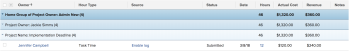

# Grouping: Home Group of Project Owner in a list of hours {#grouping-home-group-of-project-owner-in-a-list-of-hours}

You can display the name of the Home Group of the Project Owner in an Hour list or report.


The grouping also groups the results by the name of the Project Owner and the Project Name.





## Access requirements {#access-requirements}

You must have the following access to perform the steps in this article:

<table style="width: 100%;margin-left: 0;margin-right: auto;mc-table-style: url('../../../Resources/TableStyles/TableStyle-List-options-in-steps.css');" class="TableStyle-TableStyle-List-options-in-steps" cellspacing="0"> 
 <col class="TableStyle-TableStyle-List-options-in-steps-Column-Column1"> 
 <col class="TableStyle-TableStyle-List-options-in-steps-Column-Column2"> 
 <tbody> 
  <tr class="TableStyle-TableStyle-List-options-in-steps-Body-LightGray"> 
   <td class="TableStyle-TableStyle-List-options-in-steps-BodyE-Column1-LightGray" role="rowheader"><span class="mc-variable WFVariables.FullProdNameWF variable varname">Adobe Workfront</span> plan*</td> 
   <td class="TableStyle-TableStyle-List-options-in-steps-BodyD-Column2-LightGray"> <p>Any</p> </td> 
  </tr> 
  <tr class="TableStyle-TableStyle-List-options-in-steps-Body-MediumGray"> 
   <td class="TableStyle-TableStyle-List-options-in-steps-BodyE-Column1-MediumGray" role="rowheader"><span class="mc-variable WFVariables.FullProdNameWF variable varname">Adobe Workfront</span> license*</td> 
   <td class="TableStyle-TableStyle-List-options-in-steps-BodyD-Column2-MediumGray"> <p><span class="mc-variable WFVariables.WFLicense-Plan variable varname">Plan</span> </p> </td> 
  </tr> 
  <tr class="TableStyle-TableStyle-List-options-in-steps-Body-LightGray"> 
   <td class="TableStyle-TableStyle-List-options-in-steps-BodyE-Column1-LightGray" role="rowheader">Access level configurations*</td> 
   <td class="TableStyle-TableStyle-List-options-in-steps-BodyD-Column2-LightGray"> <p>Edit access to&nbsp;Reports,&nbsp;Dashboards,&nbsp;Calendars</p> <p>Edit access to Filters, Views, Groupings</p> <p>Note: If you still don't have access, ask your <span class="mc-variable WFVariables.AdminWF variable varname">Workfront administrator</span> if they set additional restrictions in your access level. For information on how a <span class="mc-variable WFVariables.AdminWF variable varname">Workfront administrator</span> can modify your access level, see <a href="create-modify-access-levels.md" class="MCXref xref">Create or modify custom access levels</a>.</p> </td> 
  </tr> 
  <tr class="TableStyle-TableStyle-List-options-in-steps-Body-MediumGray"> 
   <td class="TableStyle-TableStyle-List-options-in-steps-BodyB-Column1-MediumGray" role="rowheader">Object permissions</td> 
   <td class="TableStyle-TableStyle-List-options-in-steps-BodyA-Column2-MediumGray"> <p>Manage permissions to a report</p> <p>For information on requesting additional access, see <a href="request-access.md" class="MCXref xref">Request access to objects in Adobe Workfront</a>.</p> </td> 
  </tr> 
 </tbody> 
</table>

&#42;To find out what plan, license type, or access you have, contact your *`Workfront administrator`*.


## Group by Home Group of Project Owner in a list of hours {#group-by-home-group-of-project-owner-in-a-list-of-hours}

To apply this grouping:


1. Go to a list of hours.
1. From the  `Grouping` drop-down menu, select  `New Grouping`.

1. Click `Switch to Text Mode`.
1. Remove the text in the  `Group your Report`&nbsp;area.
1.  Replace&nbsp;the text with the following code:


   ```
   group.0.displayname=Home Group of Project Owner<br>group.0.valuefield=project:owner:homeGroup:name<br>group.0.valueformat=HTML<br>group.1.displayname=Project Owner<br>group.1.linkedname=projectOwnerMM<br>group.1.namekey=view.relatedcolumn<br>group.1.namekeyargkey.0=projectOwnerMM<br>group.1.namekeyargkey.1=name<br>group.1.valuefield=projectOwnerMM:name<br>group.1.valueformat=string<br>group.2.displayname=Project Name<br>group.2.linkedname=project<br>group.2.namekey=view.relatedcolumn<br>group.2.namekeyargkey.0=project<br>group.2.namekeyargkey.1=name<br>group.2.valuefield=project:name<br>group.2.valueformat=string<br>textmode=true
   ```

  


1. Click `Save Grouping`.


