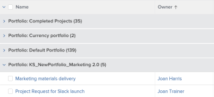
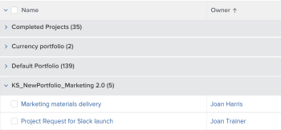

# Grouping: edit the display name in a grouping

You can rename groupings to something more familiar to your users.

For example, when you apply the standard Portfolio Name grouping to a list of projects, the name of the grouping appears as *Portfolio: Name: <name of portfolio>*.

You can modify this grouping using text mode to display a name that is easier to read.

## Access requirements

You must have the following access to perform the steps in this article:

<table cellspacing="0"> 
 <col> 
 <col> 
 <tbody> 
  <tr> 
   <td role="rowheader"><em>Adobe Workfront</em> plan*</td> 
   <td> 
Any
 </td> 
  </tr> 
  <tr> 
   <td role="rowheader"><em>Adobe Workfront</em> license*</td> 
   <td> 
<em>Plan</em> 
 </td> 
  </tr> 
  <tr> 
   <td role="rowheader">Access level configurations*</td> 
   <td> 
Edit access to&nbsp;Reports,&nbsp;Dashboards,&nbsp;Calendars
 
Edit access to Filters, Views, Groupings
 
Note: If you still don't have access, ask your <em>Workfront administrator</em> if they set additional restrictions in your access level. For information on how a <em>Workfront administrator</em> can modify your access level, see <a href="../../../administration-and-setup/add-users/configure-and-grant-access/create-modify-access-levels.md" class="MCXref xref">Create or modify custom access levels</a>.
 </td> 
  </tr> 
  <tr> 
   <td role="rowheader">Object permissions</td> 
   <td> 
Manage permissions to a report
 
For information on requesting additional access, see <a href="../../../workfront-basics/grant-and-request-access-to-objects/request-access.md" class="MCXref xref">Request access to objects in Adobe Workfront</a>.
 </td> 
  </tr> 
 </tbody> 
</table>

&#42;To find out what plan, license type, or access you have, contact your *Workfront administrator*.

## Edit the display name in a grouping

To change the display name in a project grouping:

<ol> 
 <li value="1">Go to a list of projects.</li> 
 <li value="2">From the Groupingdrop-down menu, select New Grouping.</li> 
 <li value="3">Click&nbsp;Add Grouping, and start typing "Portfolio Name" in the First by: field, then select it when it displays in the list.</li> 
 <li value="4">Click Switch to Text Mode.</li> 
 <li value="5"> 
Done one of following:
 
  <ul> 
   <li> 
 Add the following code to the existing text available in the Group your Report box:
 
<code>group.0.displayname=Your </code><code data-mc-edit-date="2019-01-07T12:27:43.3787530-05:00" data-mc-editor="alinawilson" data-mc-comment="Alina: maybe add a screen shot here?" data-mc-initials="AL" data-mc-creator="alinawilson" data-mc-create-date="2019-01-07T12:27:30.8346347-05:00">Value</code> 
 
Or, in this case:
 
<code>group.0.displayname=Portfolio</code> 
 </li> 
   <li> 
Remove all the lines in the text mode interface of the grouping that have the word "name" in them, then add the line:
 
<code>group.0.name=Your Value</code> 
 
Or, in this case:
 
<code>group.0.name=Portfolio</code> 
 
You can also leave the <code>group.0.name</code> line blank, in which case the grouping shows the name of the value you are grouping by.
 
  
 </li> 
  </ul> </li> 
 <li value="6">Click Done, then Save Grouping.</li> 
</ol>

