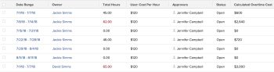

# View: calculate overtime cost in a Timesheet View

Overtime is not calculated by default in *Adobe Workfront*, but you can create a Timesheet report that calculates overtime.

If the user is associated with a Cost per Hour rate in their profile, you can also calculate the amount of cost for the overtime of that user.  
For information about associating users with Cost per Hour rates, see the article [Configure My Settings](../../../workfront-basics/manage-your-account-and-profile/configuring-your-user-profile/configure-my-settings.md).

>[!NOTE]
>
>The Overtime field that you can add to a Timesheet view in a list or a report displays the information found in the Overtime field of the timesheet. This information is updated manually by a user with access to modify the timesheet. For more information about the Overtime field in a timesheet, see the article [Understand the Timesheet layout](../../../timesheets/timesheets/timesheet-layout.md).

## Access requirements

You must have the following access to perform the steps in this article:

<table cellspacing="0"> 
 <col> 
 <col> 
 <tbody> 
  <tr> 
   <td role="rowheader"><em>Adobe Workfront</em> plan*</td> 
   <td> 
Any
 </td> 
  </tr> 
  <tr> 
   <td role="rowheader"><em>Adobe Workfront</em> license*</td> 
   <td> 
<em>Plan</em> 
 </td> 
  </tr> 
  <tr> 
   <td role="rowheader">Access level configurations*</td> 
   <td> 
Edit access to&nbsp;Reports,&nbsp;Dashboards,&nbsp;Calendars
 
Edit access to Filters, Views, Groupings
 
Note: If you still don't have access, ask your <em>Workfront administrator</em> if they set additional restrictions in your access level. For information on how a <em>Workfront administrator</em> can modify your access level, see <a href="../../../administration-and-setup/add-users/configure-and-grant-access/create-modify-access-levels.md" class="MCXref xref">Create or modify custom access levels</a>.
 </td> 
  </tr> 
  <tr> 
   <td role="rowheader">Object permissions</td> 
   <td> 
Manage permissions to a report
 
For information on requesting additional access, see <a href="../../../workfront-basics/grant-and-request-access-to-objects/request-access.md" class="MCXref xref">Request access to objects in Adobe Workfront</a>.
 </td> 
  </tr> 
 </tbody> 
</table>

&#42;To find out what plan, license type, or access you have, contact your *Workfront administrator*.

## Calculate overtime cost in a Timesheet View

To add a calculated Overtime column to a timesheet view:

<ol> 
 <li value="1"> 
Go to a list of timesheets, or create a Timesheet Report.
 
For information about creating reports, see the article <a href="../../../reports-and-dashboards/reports/creating-and-managing-reports/create-custom-report.md" class="MCXref xref">Create a custom report</a>.
 </li> 
 <li value="2"> 
Click Customize View in a list of timesheets.
 
Or
 
Select the Columns (View) tab in a Timesheet report.
 </li> 
 <li value="3"> 
Click Add Column.
 </li> 
 <li value="4"> 
Click Switch to Text Mode.
 </li> 
 <li value="5"> 
In the Show in this column area, click Click to edit text.
 </li> 
 <li value="6"> 
Copy and paste the following text mode code in the Text mode dialog box.
<pre>displayname=Calculated Overtime Cost linkedname=direct namekey=totalHours querysort=totalHours  textmode=true valueexpression=IF({totalHours}>40,({totalHours}-40)*{user}.{costPerHour},{totalHours}*{user}.{costPerHour}) valueformat=currencyStringCurrencyRounded</pre> <note type="note">
    This calculation assumes that the user usually works a 40-hour week.
  </note> </li> 
 <li value="7"> 
Click Save, then name the new view and click Save View in a list of timesheets.
 
Or
 
Click Save + Close in a Timesheet report.
 </li> 
 <li value="8"> 
(Optional and conditional) if you are building a Timesheet report, specify a name for the report, then click Save Report.
 
The cost of the overtime of each user is displayed in the Calculated Overtime Cost column.
  </li> 
</ol>

