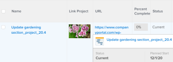

# View: display an image instead of a string in a column {#view-display-an-image-instead-of-a-string-in-a-column}

You can replace the name of an object in a view with an image using text mode. You can also add a link to the image that can open the object it replaces.


>[!NOTE]
>
>Images appear in their actual resolution so try to use small images.





## Access requirements {#access-requirements}

You must have the following access to perform the steps in this article:

<table style="width: 100%;margin-left: 0;margin-right: auto;mc-table-style: url('../../../Resources/TableStyles/TableStyle-List-options-in-steps.css');" class="TableStyle-TableStyle-List-options-in-steps" cellspacing="0"> 
 <col class="TableStyle-TableStyle-List-options-in-steps-Column-Column1"> 
 <col class="TableStyle-TableStyle-List-options-in-steps-Column-Column2"> 
 <tbody> 
  <tr class="TableStyle-TableStyle-List-options-in-steps-Body-LightGray"> 
   <td class="TableStyle-TableStyle-List-options-in-steps-BodyE-Column1-LightGray" role="rowheader"><span class="mc-variable WFVariables.FullProdNameWF variable varname">Adobe Workfront</span> plan*</td> 
   <td class="TableStyle-TableStyle-List-options-in-steps-BodyD-Column2-LightGray"> <p>Any</p> </td> 
  </tr> 
  <tr class="TableStyle-TableStyle-List-options-in-steps-Body-MediumGray"> 
   <td class="TableStyle-TableStyle-List-options-in-steps-BodyE-Column1-MediumGray" role="rowheader"><span class="mc-variable WFVariables.FullProdNameWF variable varname">Adobe Workfront</span> license*</td> 
   <td class="TableStyle-TableStyle-List-options-in-steps-BodyD-Column2-MediumGray"> <p><span class="mc-variable WFVariables.WFLicense-Plan variable varname">Plan</span> </p> </td> 
  </tr> 
  <tr class="TableStyle-TableStyle-List-options-in-steps-Body-LightGray"> 
   <td class="TableStyle-TableStyle-List-options-in-steps-BodyE-Column1-LightGray" role="rowheader">Access level configurations*</td> 
   <td class="TableStyle-TableStyle-List-options-in-steps-BodyD-Column2-LightGray"> <p>Edit access to&nbsp;Reports,&nbsp;Dashboards,&nbsp;Calendars</p> <p>Edit access to Filters, Views, Groupings</p> <p>Note: If you still don't have access, ask your <span class="mc-variable WFVariables.AdminWF variable varname">Workfront administrator</span> if they set additional restrictions in your access level. For information on how a <span class="mc-variable WFVariables.AdminWF variable varname">Workfront administrator</span> can modify your access level, see <a href="create-modify-access-levels.md" class="MCXref xref">Create or modify custom access levels</a>.</p> </td> 
  </tr> 
  <tr class="TableStyle-TableStyle-List-options-in-steps-Body-MediumGray"> 
   <td class="TableStyle-TableStyle-List-options-in-steps-BodyB-Column1-MediumGray" role="rowheader">Object permissions</td> 
   <td class="TableStyle-TableStyle-List-options-in-steps-BodyA-Column2-MediumGray"> <p>Manage permissions to a report</p> <p>For information on requesting additional access, see <a href="request-access.md" class="MCXref xref">Request access to objects in Adobe Workfront</a>.</p> </td> 
  </tr> 
 </tbody> 
</table>

&#42;To find out what plan, license type, or access you have, contact your *`Workfront administrator`*.


## Example: Replace the name of a project in a project view with an image: {#example-replace-the-name-of-a-project-in-a-project-view-with-an-image}


1.  Upload an image to a web site or server external of *`Adobe Workfront`*. You must be able to access the image using your web browser.

   ` `**Tips: **`` 
    
    
    *  Every browser type is different but all are capable of displaying URLs.
    *  Avoid using images that are uploaded to *`Workfront`*. Because images stored in *`Workfront`* are not publicly available and have an access key that expires after a period of time, these images stop displaying in the view over time.
    *  An image saved on your computer does not have an inherent URL. Find a site that provides image hosting and host your image there. Your organization might already have such a site.
    
    

1.  Using your web browser, go to the image that you saved.
1.  Obtain the image's URL by doing the following:

    
    
    1.  Right-click and select `Copy image location`, or `Get link`, depending on your browser. You now have the URL for that specific image and can paste it from your clipboard.
    1.  Ensure that everyone with that link has permissions to view the image by just going to the link and they don't need a login to access it.
    
    

1.  `<MadCap:conditionalText data-mc-conditions="QuicksilverOrClassic.Quicksilver"> Go to a project, click the  <span class="bold">More</span> menu   next to the name of the project, then click  <span class="bold">Edit</span>.</MadCap:conditionalText>` 
1. In the `URL` field, add the link to the image.
1. Navigate to a project view in a list or report and customize the view.
1. Click the header of the column for the `Project Name`, then click `Switch to Text Mode`.

1.  Add the following code to the column to the existing code:


   ```
   displayname=Link Project
   ```


   ```
   image.name=Link Project
   ```


   ```
   image.valuefield=URL
   ```


   ```
   link.linkproperty.0.name=projectID
   ```


   ```
   link.linkproperty.0.value=ID
   ```


   ```
   link.lookup=link.edit
   ```


   ```
   link.page=/view
   ```


   ```
   link.valuefield=objCode
   ```


   ```
   link.valueformat=val
   ```


   ```
   textmode=true
   ```


   ```
   type=image
   ```


   ```
   valueformat=
   ```


   The image you selected replaces the Project Name in the project view and the image is a link to the project.

1. Click `Save View`.


