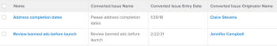

# View: display original issue information on task and project list {#view-display-original-issue-information-on-task-and-project-list}

You can display the following information from the original issue on a view of task and project lists, after the issue has been converted to the tasks and projects in the list:

*  Converted Issue Name
*  Converted Issue Entry Date
*  Converted Issue Originator Name

`For information about creating a view using the standard report builder, see` [Views overview in Adobe Workfront](views-overview.md).

For more information about including additional issue information on projects and tasks lists, also see [View: originating issue details for tasks and projects](view-originating-issue-details-tasks-projects.md).
