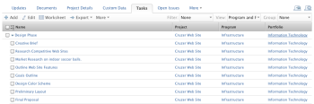

# View: display Program and Portfolio information in a task View {#view-display-program-and-portfolio-information-in-a-task-view}

This task view displays the Program and Portfolio that are associated with the project of the task. This information is not available in the report builder when building a task view. This is information is available only in text mode.

The view also provides links to the Project, Program, and Portfolio from a task list.

## Access requirements {#access-requirements}

You must have the following access to perform the steps in this article:

<table style="width: 100%;margin-left: 0;margin-right: auto;mc-table-style: url('../../../Resources/TableStyles/TableStyle-List-options-in-steps.css');" class="TableStyle-TableStyle-List-options-in-steps" cellspacing="0"> 
 <col class="TableStyle-TableStyle-List-options-in-steps-Column-Column1"> 
 <col class="TableStyle-TableStyle-List-options-in-steps-Column-Column2"> 
 <tbody> 
  <tr class="TableStyle-TableStyle-List-options-in-steps-Body-LightGray"> 
   <td class="TableStyle-TableStyle-List-options-in-steps-BodyE-Column1-LightGray" role="rowheader">Adobe Workfront plan*</td> 
   <td class="TableStyle-TableStyle-List-options-in-steps-BodyD-Column2-LightGray"> 
Any
 </td> 
  </tr> 
  <tr class="TableStyle-TableStyle-List-options-in-steps-Body-MediumGray"> 
   <td class="TableStyle-TableStyle-List-options-in-steps-BodyE-Column1-MediumGray" role="rowheader">Adobe Workfront license*</td> 
   <td class="TableStyle-TableStyle-List-options-in-steps-BodyD-Column2-MediumGray"> 
Plan 
 </td> 
  </tr> 
  <tr class="TableStyle-TableStyle-List-options-in-steps-Body-LightGray"> 
   <td class="TableStyle-TableStyle-List-options-in-steps-BodyE-Column1-LightGray" role="rowheader">Access level configurations*</td> 
   <td class="TableStyle-TableStyle-List-options-in-steps-BodyD-Column2-LightGray"> 
Edit access to&nbsp;Reports,&nbsp;Dashboards,&nbsp;Calendars
 
Edit access to Filters, Views, Groupings
 
Note: If you still don't have access, ask your Workfront administrator if they set additional restrictions in your access level. For information on how a Workfront administrator can modify your access level, see <a href="create-modify-access-levels.md" class="MCXref xref">Create or modify custom access levels</a>.
 </td> 
  </tr> 
  <tr class="TableStyle-TableStyle-List-options-in-steps-Body-MediumGray"> 
   <td class="TableStyle-TableStyle-List-options-in-steps-BodyB-Column1-MediumGray" role="rowheader">Object permissions</td> 
   <td class="TableStyle-TableStyle-List-options-in-steps-BodyA-Column2-MediumGray"> 
Manage permissions to a report
 
For information on requesting additional access, see <a href="request-access.md" class="MCXref xref">Request access to objects in Adobe Workfront</a>.
 </td> 
  </tr> 
 </tbody> 
</table>

&#42;To find out what plan, license type, or access you have, contact your *`Workfront administrator`*.

## Display Program and Portfolio information in a task View {#display-program-and-portfolio-information-in-a-task-view}

To apply this view to a task list:

1. Go to a list of tasks.
1. From the  `View` drop-down menu, select  `New View`.

1. In the `Column Preview`&nbsp;area, eliminate all columns except for one.
1. Click the header of the remaining column, then click `Switch to Text Mode`.
1. Mouse over the text mode area, and click  `Click to edit text`.
1. Remove the text you find in the  `Text Mode`&nbsp;box, and replace it with the following code:  
   `<pre>column.0.descriptionkey=name column.0.link.linkproperty.0.name=ID column.0.link.linkproperty.0.valuefield=ID column.0.link.linkproperty.0.valueformat=int column.0.link.lookup=link.view column.0.link.valuefield=objCode column.0.link.valueformat=val column.0.linkedname=direct column.0.listsort=string(name) column.0.namekey=name.abbr column.0.querysort=name column.0.shortview=false column.0.stretch=100 column.0.valuefield=name column.0.valueformat=HTML column.0.width=150 column.1.descriptionkey=project column.1.link.linkproperty.0.name=ID column.1.link.linkproperty.0.valuefield=project:ID column.1.link.linkproperty.0.valueformat=int column.1.link.lookup=link.view column.1.link.valuefield=project:objCode column.1.link.valueformat=val column.1.linkedname=project column.1.listsort=nested(project).string(name) column.1.namekey=project column.1.querysort=project:name column.1.shortview=false column.1.stretch=0 column.1.valuefield=project:name column.1.valueformat=HTML column.1.width=150 column.2.descriptionkey=program column.2.displayname=Program column.2.link.linkproperty.0.name=ID column.2.link.linkproperty.0.valuefield=project:program:ID column.2.link.linkproperty.0.valueformat=int column.2.link.lookup=link.view column.2.link.valuefield=project:program:objCode column.2.link.valueformat=val column.2.linkedname=project column.2.listsort=nested(project:program).string(name) column.2.namekey=project column.2.querysort=project:program:name column.2.shortview=false column.2.stretch=0 column.2.valuefield=project:program:name column.2.valueformat=HTML column.2.width=150 column.3.descriptionkey=portfolio column.3.displayname=Portfolio column.3.link.linkproperty.0.name=ID column.3.link.linkproperty.0.valuefield=project:portfolio:ID column.3.link.linkproperty.0.valueformat=int column.3.link.lookup=link.view column.3.link.valuefield=project:portfolio:objCode column.3.link.valueformat=val column.3.linkedname=project column.3.listsort=nested(project:portfolio).string(name) column.3.namekey=project column.3.querysort=project:portfolio:name column.3.shortview=false column.3.stretch=0 column.3.valuefield=project:portfolio:name column.3.valueformat=HTML column.3.width=150&nbsp;</pre>`

1. Click  `Save View`.

