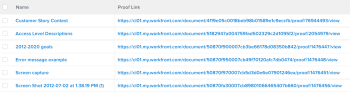
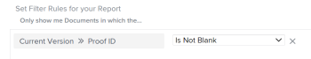

# View: document report with link to a proof

In this document view, you can insert a link to a proof of the current version of the document.

## Access requirements

You must have the following access to perform the steps in this article:

<table cellspacing="0"> 
 <col> 
 <col> 
 <tbody> 
  <tr> 
   <td role="rowheader">Adobe Workfront plan*</td> 
   <td> 
Any
 </td> 
  </tr> 
  <tr> 
   <td role="rowheader">Adobe Workfront license*</td> 
   <td> 
Plan 
 </td> 
  </tr> 
  <tr> 
   <td role="rowheader">Access level configurations*</td> 
   <td> 
Edit access to&nbsp;Reports,&nbsp;Dashboards,&nbsp;Calendars
 
Edit access to Filters, Views, Groupings
 
Note: If you still don't have access, ask your Workfront administrator if they set additional restrictions in your access level. For information on how a Workfront administrator can modify your access level, see <a href="../../../administration-and-setup/add-users/configure-and-grant-access/create-modify-access-levels.md" class="MCXref xref">Create or modify custom access levels</a>.
 </td> 
  </tr> 
  <tr> 
   <td role="rowheader">Object permissions</td> 
   <td> 
Manage permissions to a report
 
For information on requesting additional access, see <a href="../../../workfront-basics/grant-and-request-access-to-objects/request-access.md" class="MCXref xref">Request access to objects in Adobe Workfront</a>.
 </td> 
  </tr> 
 </tbody> 
</table>

&#42;To find out what plan, license type, or access you have, contact your `Workfront administrator`.

## View a document report with link to a proof

To apply this view:

<ol> 
 <li value="1">Go to a list of documents.</li> 
 <li value="2">From the View drop-down menu, select New View.</li> 
 <li value="3">Click Add Column. </li> 
 <li value="4">Click Switch to Text Mode.</li> 
 <li value="5">Hover over the text mode area, and click Click to edit text.</li> 
 <li value="6"> 
Remove the text you find in the Text Mode box, and replace it with the following code:
 
  
 
   
<code>displayname=Proof Link</code> 
 
   
<code>shortview=true</code> 
 
   
<code>textmode=true</code> 
 
   
<code>valueexpression=CONCAT("https://Your domain.my.workfront.com/document/",{currentVersion}.{ID},"/proof/",{currentVersion}.{proofID},"/view")</code> 
 
   
<code>valueformat=HTML</code> 
 
  
 <note type="tip">
   Replace "Your domain" with your actual 
   Workfront domain. For example, if your company's 
   Workfront url is 
   <i>Company.my.workfront.com</i>, your domain is "Company."
  </note> </li> 
 <li value="7"> 
Click&nbsp;Save, then&nbsp;Save View.
 </li> 
 <li value="8"> 
Type a name for the view, then click Save View.
 </li> 
 <li value="9"> 
(Optional) To ensure you display only documents with proofs, add a filter by doing the following:
 
  <ol> 
   <li value="1"> 
Click the Filter drop-down menu, then click New Filter.
 </li> 
   <li value="2"> 
Click Add a Filter Rule and start typing Current Version, then select Current Version Proof ID when it displays in the list.
 </li> 
   <li value="3"> 
Select Is Not Blank for the filter modifier.
 
  
 </li> 
   <li value="4"> 
Click Save Filter, type the name of the filter, then click&nbsp;Save Filter.
 </li> 
  </ol> </li> 
 <li value="10"> 
Click the link in the Proof Link column to access the proof of the last version of the document.
 </li> 
</ol>

