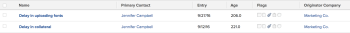

# View: issues with the company name of the originator {#view-issues-with-the-company-name-of-the-originator}

This issue view displays the company name associated with the user who submitted the issue.

## Access requirements {#access-requirements}

You must have the following access to perform the steps in this article:

<table style="width: 100%;margin-left: 0;margin-right: auto;mc-table-style: url('../../../Resources/TableStyles/TableStyle-List-options-in-steps.css');" class="TableStyle-TableStyle-List-options-in-steps" cellspacing="0"> 
 <col class="TableStyle-TableStyle-List-options-in-steps-Column-Column1"> 
 <col class="TableStyle-TableStyle-List-options-in-steps-Column-Column2"> 
 <tbody> 
  <tr class="TableStyle-TableStyle-List-options-in-steps-Body-LightGray"> 
   <td class="TableStyle-TableStyle-List-options-in-steps-BodyE-Column1-LightGray" role="rowheader">Adobe Workfront plan*</td> 
   <td class="TableStyle-TableStyle-List-options-in-steps-BodyD-Column2-LightGray"> 
Any
 </td> 
  </tr> 
  <tr class="TableStyle-TableStyle-List-options-in-steps-Body-MediumGray"> 
   <td class="TableStyle-TableStyle-List-options-in-steps-BodyE-Column1-MediumGray" role="rowheader">Adobe Workfront license*</td> 
   <td class="TableStyle-TableStyle-List-options-in-steps-BodyD-Column2-MediumGray"> 
Plan 
 </td> 
  </tr> 
  <tr class="TableStyle-TableStyle-List-options-in-steps-Body-LightGray"> 
   <td class="TableStyle-TableStyle-List-options-in-steps-BodyE-Column1-LightGray" role="rowheader">Access level configurations*</td> 
   <td class="TableStyle-TableStyle-List-options-in-steps-BodyD-Column2-LightGray"> 
Edit access to&nbsp;Reports,&nbsp;Dashboards,&nbsp;Calendars
 
Edit access to Filters, Views, Groupings
 
Note: If you still don't have access, ask your Workfront administrator if they set additional restrictions in your access level. For information on how a Workfront administrator can modify your access level, see <a href="create-modify-access-levels.md" class="MCXref xref">Create or modify custom access levels</a>.
 </td> 
  </tr> 
  <tr class="TableStyle-TableStyle-List-options-in-steps-Body-MediumGray"> 
   <td class="TableStyle-TableStyle-List-options-in-steps-BodyB-Column1-MediumGray" role="rowheader">Object permissions</td> 
   <td class="TableStyle-TableStyle-List-options-in-steps-BodyA-Column2-MediumGray"> 
Manage permissions to a report
 
For information on requesting additional access, see <a href="request-access.md" class="MCXref xref">Request access to objects in Adobe Workfront</a>.
 </td> 
  </tr> 
 </tbody> 
</table>

&#42;To find out what plan, license type, or access you have, contact your *`Workfront administrator`*.

## View issues with the company name of the originator {#view-issues-with-the-company-name-of-the-originator-1}

To apply this view:

1. Go to a list of issues.
1. From the `View` drop-down menu, select `New View`.

1. In the `Column Preview` area, eliminate all columns except for one.
1. Click the header of the remaining column, then click `Switch to Text Mode`.
1. Mouse over the text mode area, and click `Click to edit text`.
1. Remove the text you find in the `Text Mode` box, and replace it with the following code:  
   `<pre>column.0.descriptionkey=name column.0.link.linkproperty.0.name=ID column.0.link.linkproperty.0.valuefield=ID column.0.link.linkproperty.0.valueformat=val column.0.link.lookup=link.view column.0.link.value=val(objCode) column.0.listsort=string(name) column.0.namekey=name column.0.querysort=name column.0.valuefield=name column.0.valueformat=HTML column.0.width=140 column.1.descriptionkey=originator column.1.link.linkproperty.0.name=ID column.1.link.linkproperty.0.valuefield=ownerID column.1.link.linkproperty.0.valueformat=int column.1.link.lookup=link.view column.1.link.valuefield=owner:objCode column.1.link.valueformat=val column.1.listsort=nested(owner).string(name) column.1.namekey=originator.abbr column.1.querysort=owner:name column.1.valuefield=owner:name column.1.valueformat=HTML column.1.width=151 column.2.descriptionkey=entrydate column.2.listsort=atDateAsAtDate(entryDate) column.2.namekey=entrydate.abbr column.2.querysort=entryDate column.2.valuefield=entryDate column.2.valueformat=atDate column.2.width=75 column.3.descriptionkey=age column.3.listsort=doubleAsDouble(age) column.3.namekey=age column.3.querysort=age column.3.valuefield=howOld column.3.valueformat=val column.3.width=80 column.4.viewalias=statusicons column.4.displayname=Flags column.4.linkedname=direct column.4.namekey=statusicons column.4.valuefield= column.4.valueformat=HTML column.4.querysort= column.4.tile.name=component.issuestatusicons column.4.tile.pdfcomponent=issueStatusIcons column.4.delimiter= column.4.tile.template=/WEB-INF/jsp/lists/components/issueStatusIcons.jsp column.5.description=Originator's Company Name column.5.link.linkproperty.0.name=ID column.5.link.linkproperty.0.valuefield=owner:companyID column.5.link.linkproperty.0.valueformat=int column.5.link.lookup=link.view column.5.link.valuefield=owner:company:objCode column.5.link.valueformat=val column.5.listsort=nested(owner:company).string(name) column.5.name=Originator Company column.5.querysort=owner:company:name column.5.valuefield=owner:company:name column.5.valueformat=HTML column.5.width=151</pre>`

1.  Click `Save View`.

