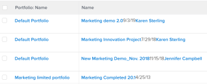
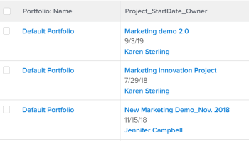

# View: merge information from multiple columns in one shared column

You can merge the information that displays in multiple separate columns and display it in one shared column.

## Access requirements

You must have the following access to perform the steps in this article:

<table cellspacing="0"> 
 <col> 
 <col> 
 <tbody> 
  <tr> 
   <td role="rowheader"><span>Adobe Workfront</span> plan*</td> 
   <td> <p>Any</p> </td> 
  </tr> 
  <tr> 
   <td role="rowheader"><span>Adobe Workfront</span> license*</td> 
   <td> <p><span>Plan</span> </p> </td> 
  </tr> 
  <tr> 
   <td role="rowheader">Access level configurations*</td> 
   <td> <p>Edit access to&nbsp;Reports,&nbsp;Dashboards,&nbsp;Calendars</p> <p>Edit access to Filters, Views, Groupings</p> <p>Note: If you still don't have access, ask your <span>Workfront administrator</span> if they set additional restrictions in your access level. For information on how a <span>Workfront administrator</span> can modify your access level, see <a href="../../../administration-and-setup/add-users/configure-and-grant-access/create-modify-access-levels.md" class="MCXref xref">Create or modify custom access levels</a>.</p> </td> 
  </tr> 
  <tr> 
   <td role="rowheader">Object permissions</td> 
   <td> <p>Manage permissions to a report</p> <p>For information on requesting additional access, see <a href="../../../workfront-basics/grant-and-request-access-to-objects/request-access.md" class="MCXref xref">Request access to objects in Adobe Workfront</a>.</p> </td> 
  </tr> 
 </tbody> 
</table>

&#42;To find out what plan, license type, or access you have, contact your `Workfront administrator`.

## Considerations when sharing or merging columns

* You can merge two adjacent columns and display the information from each column separated by a line break, or you can merge the information in two adjacent columns with no separator between the information from each column.
* You can merge the information from more than two columns by applying the same syntax described in this article to an already shared column and an adjacent one. 
* The 

  ```
  valueformat=HTML
  ```

  line is mandatory in a shared column. Otherwise, the columns contain no information (they will be blank) when the report is exported from `Adobe Workfront`.

* Conditional formatting may not be supported in merged columns.

  The following exceptions exist:

  * When viewing information in `Workfront`, the formatting of the first column is kept and the formatting for all other columns is ignored if the columns that make up a merged column have different formatting from one another,. 
  * When exporting the view to a PDF file, conditional formatting applies to the first column in a merged column. 
  * When exporting the view to an Excel file, merged columns display as separate columns. The individual columns also display their respective conditional formatting rules.

* Columns with the `viewalias` attribute can limit the amount of columns that you can merge. To avoid these limits, avoid using the `viewalias` attribute. If you must include the `viewalias` attribute in a column, make sure that it is the last item listed in the column.

* If you export a list with shared columns to an Excel or Tab Delimited format, these columns are separated out in the exported file.

## Merge data from two columns without a line break

You can merge the data from multiple separate columns to display it in one column with no breaks or spaces between the values from each column.

>[!TIP]
>
>This approach is recommended when you merge two columns that can never show a value for the same record at the same time. For example, in a Work Item report, the Issue Name and Task Name columns can be merged without a line break between them because a Work Item can never have an Issue Name and a Task name at the same time. A Work Item can be either an Issue or a Task in `Workfront`.

To do this:

<ol> 
 <li value="1"> <p>Using text mode for a view, add the following text to the first column you want to merge:</p> <p><code>sharecol=true</code> </p> <p>When you merge the first two columns of a list or report, <span>Workfront</span> precedes each line of text that contains information about the object in the first column with <code>column.0.</code> and the lines of text that contain information about the second column with <code>column.1.</code>. <br>You must precede the column number of the first column with the number of that column. Column counting always starts with the leftmost column of the list or report labeled as <code>column.0.</code>.</p> <p>If you share more than one column, ensure you add the column number in the lines of code that contain the sharing information for each column. </p> 
  <div class="example" data-mc-autonum="<b>Example: </b>">
   <span class="autonumber"><span><b>Example: </b></span></span> 
   <p>The following is the text mode code for a merged column that contains three separate columns, starting with the second column of the list. The merged values are Project&nbsp;Name, Planned Start Date, and Project&nbsp;Owner's name and there is no break between the three values: </p> 
   <p><code>column.1.valuefield=name</code> </p> 
   <p><code>column.1.valueformat=HTML</code> </p> 
   <p><code style="font-weight: bold;">column.1.sharecol=true</code> </p> 
   <p><code>column.2.valuefield=plannedStartDate</code> </p> 
   <p><code>column.2.valueformat=atDate</code> </p> 
   <p><code style="font-weight: bold;">column.2.sharecol=true</code> </p> 
   <p><code>column.3.valuefield=owner:name</code> </p> 
   <p><code>column.3.valueformat=HTML</code> </p>
   <pre></pre> 
  </div> </li> 
 <li value="2"> <p>Click <span class="bold">Save</span>, then <span class="bold">Save View</span>.</p> </li> 
</ol>

## Merge data from two columns with a line break

Do the following to merge the data from multiple columns to display it in one common column with a line break between the values from each column:

<ol> 
 <li value="1"> <p>Add a third column between the two columns you want to merge.</p> 
  <div class="tip_one-tip-with_bullets" data-mc-autonum="<b>Tip: </b>">
   <span class="autonumber"><span><b>Tip: </b></span></span> 
   <ul> 
    <li> <p>The columns you want to merge must be adjacent to each other.</p> </li> 
    <li> <p>You must click the first column that you want to merge.</p> </li> 
   </ul> 
  </div> </li> 
 <li value="2"> <p>Click <span class="bold">Switch to Text Mode</span> and add the following code in the middle column that you added in step 1:</p> <p><code>value=<br></code> </p> <p><code>valueformat=HTML</code> </p> <p><code>width=1</code> </p> <p><code>sharecol=true</code> </p> </li> 
 <li value="3"> <p>Add the following text to the first column:</p> <p><code>sharecol=true</code> </p> 
  <div> 
   <p>When you merge the first two columns of a list or report, <span>Workfront</span> precedes each line of text that contains information about the object in the first column with <code>column.0.</code>, the column with the sharing information with <code>column.1.</code>, and the lines of text that contain information about the second column with <code>column.2.</code>. If the combined column is in the middle of the view, the columns are numbered according to their place in the view. Column counting always starts with the leftmost column of the list or report labeled as <code>column.0.</code>.</p> 
   <p>If you share more than one column, ensure you add the column number in the lines of code that contain the sharing information. </p> 
   <div class="example" data-mc-autonum="<b>Example: </b>">
    <span class="autonumber"><span><b>Example: </b></span></span> 
    <p>The following is the text mode code for a shared column that contains Project&nbsp;Name, Planned Start Date, and Project&nbsp;Owner's name with a line break. The shared column is the second column of a project view. </p> 
    <p><code>column.1.displayname=Project_StartDate_Owner</code> </p> 
    <p><code style="font-weight: bold;">column.1.sharecol=true</code> </p> 
    <p><code>column.1.textmode=true</code> </p> 
    <p><code>column.1.valuefield=name</code> </p> 
    <p><code>column.1.valueformat=HTML</code> </p> 
    <p style="font-weight: bold;"><code>column.2.value=<br></code> </p> 
    <p style="font-weight: bold;"><code>column.2.width=1</code> </p> 
    <p style="font-weight: bold;"><code>column.2.valueformat=HTML</code> </p> 
    <p style="font-weight: bold;"><code>column.2.sharecol=true</code> </p> 
    <p><code>column.3.valuefield=plannedStartDate</code> </p> 
    <p><code>column.3.valueformat=atDate</code> </p> 
    <p><code style="font-weight: bold;">column.3.sharecol=true</code> </p> 
    <p style="font-weight: bold;"><code>column.4.value=<br></code> </p> 
    <p style="font-weight: bold;"><code>column.4.width=1</code> </p> 
    <p style="font-weight: bold;"><code>column.4.valueformat=HTML</code> </p> 
    <p style="font-weight: bold;"><code>column.4.sharecol=true</code> </p> 
    <p><code>column.5.textmode=true</code> </p> 
    <p><code>column.5.valuefield=owner:name</code> </p> 
    <p><code>column.5.valueformat=HTML</code> </p>
    <pre></pre> 
   </div> 
  </div> </li> 
 <li value="4"> <p>Click <span class="bold">Save</span>, then <span class="bold">Save View</span>.</p> </li> 
</ol>

