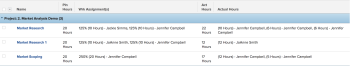

# View: Planned Hours vs. Actual Hours per assignment in task View {#view-planned-hours-vs-actual-hours-per-assignment-in-task-view}

This task view displays the total Planned Hours of a task,&nbsp;the number of Planned Hours allocated to each assignee, the total Actual Hours, and the number of Actual Hours logged by each assignee.





## Access requirements {#access-requirements}

You must have the following access to perform the steps in this article:

<table style="width: 100%;margin-left: 0;margin-right: auto;mc-table-style: url('../../../Resources/TableStyles/TableStyle-List-options-in-steps.css');" class="TableStyle-TableStyle-List-options-in-steps" cellspacing="0"> 
 <col class="TableStyle-TableStyle-List-options-in-steps-Column-Column1"> 
 <col class="TableStyle-TableStyle-List-options-in-steps-Column-Column2"> 
 <tbody> 
  <tr class="TableStyle-TableStyle-List-options-in-steps-Body-LightGray"> 
   <td class="TableStyle-TableStyle-List-options-in-steps-BodyE-Column1-LightGray" role="rowheader"><span class="mc-variable WFVariables.FullProdNameWF variable varname">Adobe Workfront</span> plan*</td> 
   <td class="TableStyle-TableStyle-List-options-in-steps-BodyD-Column2-LightGray"> <p>Any</p> </td> 
  </tr> 
  <tr class="TableStyle-TableStyle-List-options-in-steps-Body-MediumGray"> 
   <td class="TableStyle-TableStyle-List-options-in-steps-BodyE-Column1-MediumGray" role="rowheader"><span class="mc-variable WFVariables.FullProdNameWF variable varname">Adobe Workfront</span> license*</td> 
   <td class="TableStyle-TableStyle-List-options-in-steps-BodyD-Column2-MediumGray"> <p><span class="mc-variable WFVariables.WFLicense-Plan variable varname">Plan</span> </p> </td> 
  </tr> 
  <tr class="TableStyle-TableStyle-List-options-in-steps-Body-LightGray"> 
   <td class="TableStyle-TableStyle-List-options-in-steps-BodyE-Column1-LightGray" role="rowheader">Access level configurations*</td> 
   <td class="TableStyle-TableStyle-List-options-in-steps-BodyD-Column2-LightGray"> <p>Edit access to&nbsp;Reports,&nbsp;Dashboards,&nbsp;Calendars</p> <p>Edit access to Filters, Views, Groupings</p> <p>Note: If you still don't have access, ask your <span class="mc-variable WFVariables.AdminWF variable varname">Workfront administrator</span> if they set additional restrictions in your access level. For information on how a <span class="mc-variable WFVariables.AdminWF variable varname">Workfront administrator</span> can modify your access level, see <a href="create-modify-access-levels.md" class="MCXref xref">Create or modify custom access levels</a>.</p> </td> 
  </tr> 
  <tr class="TableStyle-TableStyle-List-options-in-steps-Body-MediumGray"> 
   <td class="TableStyle-TableStyle-List-options-in-steps-BodyB-Column1-MediumGray" role="rowheader">Object permissions</td> 
   <td class="TableStyle-TableStyle-List-options-in-steps-BodyA-Column2-MediumGray"> <p>Manage permissions to a report</p> <p>For information on requesting additional access, see <a href="request-access.md" class="MCXref xref">Request access to objects in Adobe Workfront</a>.</p> </td> 
  </tr> 
 </tbody> 
</table>

&#42;To find out what plan, license type, or access you have, contact your *`Workfront administrator`*.


## View Planned Hours vs. Actual Hours per assignment in a task View {#view-planned-hours-vs-actual-hours-per-assignment-in-a-task-view}


1. Go to a list of tasks.
1. From the `View` drop-down menu, select `New View`.

1. In the `Column Preview` area, eliminate all columns except for one.
1. Click the header of the remaining column, then click `Switch to Text Mode`.
1. Mouse over the text mode area, and click `Click to edit text`.
1.  Remove the text you find in the `Text Mode` box, and replace it with the following code:  


   ```
   column.0.descriptionkey=name<br>column.0.isInlineEditable=false<br>column.0.link.linkproperty.0.name=ID<br>column.0.link.linkproperty.0.valuefield=ID<br>column.0.link.linkproperty.0.valueformat=int<br>column.0.link.lookup=link.view<br>column.0.link.valuefield=objCode<br>column.0.link.valueformat=val<br>column.0.linkedname=direct<br>column.0.listsort=string(name)<br>column.0.namekey=name.abbr<br>column.0.querysort=name<br>column.0.section=0<br>column.0.shortview=false<br>column.0.stretch=0<br>column.0.valuefield=name<br>column.0.valueformat=HTML<br>column.0.width=150<br>column.1.descriptionkey=workrequired<br>column.1.isInlineEditable=false<br>column.1.linkedname=direct<br>column.1.listsort=doubleAsDouble(workRequired)<br>column.1.namekey=workrequired.abbr<br>column.1.querysort=workRequired<br>column.1.section=0<br>column.1.shortview=false<br>column.1.stretch=0<br>column.1.valuefield=workFieldLong<br>column.1.valueformat=compound<br>column.1.viewalias=workrequired<br>column.1.width=100<br>column.2.listdelimiter=<br>column.2.listmethod=nested(assignments).lists<br>column.2.name=Wrk Assignment(s)<br>column.2.stretch=0<br>column.2.type=iterate<br>column.2.valueexpression=CONCAT(right(CONCAT('~~~',{assignmentPercent}),3),'% (', {workRequired}/60 ,' Hours) - ',{assignedTo}.{name})<br>column.2.valueformat=HTML<br>column.2.width=300<br>column.3.descriptionkey=actualworkrequired<br>column.3.isInlineEditable=false<br>column.3.linkedname=direct<br>column.3.listsort=intAsInt(actualWorkRequired)<br>column.3.namekey=actualworkrequired.abbr<br>column.3.querysort=actualWork<br>column.3.section=0<br>column.3.shortview=false<br>column.3.stretch=100<br>column.3.valuefield=actualWorkFieldLong<br>column.3.valueformat=compound<br>column.3.viewalias=actualworkrequired<br>column.3.width=100<br>column.4.listdelimiter=<br>column.4.listmethod=nested(hours).lists<br>column.4.name=Actual Hours<br>column.4.stretch=0<br>column.4.type=iterate<br>column.4.valueexpression=CONCAT('(', {hours} ,' Hours) - ',{owner}.{name})<br>column.4.valueformat=HTML<br>column.4.width=300
   ```


1. Click `Save View`.


