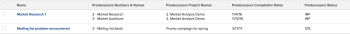

# View: predecessor details {#view-predecessor-details}

This task view shows details of the predecessors of the tasks using a collection view. In a collection view, you can display information about objects that are in a "one-to-many" relationship. In this case, each task (one) can have multiple predecessors (many). The view displays the name of the tasks, as well as its Predecessors' Names, Predecessors' Project Names, Predecessors' Planned Completion Dates, and Predecessors' Statuses.

For information about referencing collections in reports, see [Reference collections in a report](reference-collections-report.md).

## Access requirements {#access-requirements}

You must have the following access to perform the steps in this article:

<table style="width: 100%;margin-left: 0;margin-right: auto;mc-table-style: url('../../../Resources/TableStyles/TableStyle-List-options-in-steps.css');" class="TableStyle-TableStyle-List-options-in-steps" cellspacing="0"> 
 <col class="TableStyle-TableStyle-List-options-in-steps-Column-Column1"> 
 <col class="TableStyle-TableStyle-List-options-in-steps-Column-Column2"> 
 <tbody> 
  <tr class="TableStyle-TableStyle-List-options-in-steps-Body-LightGray"> 
   <td class="TableStyle-TableStyle-List-options-in-steps-BodyE-Column1-LightGray" role="rowheader">Adobe Workfront plan*</td> 
   <td class="TableStyle-TableStyle-List-options-in-steps-BodyD-Column2-LightGray"> 
Any
 </td> 
  </tr> 
  <tr class="TableStyle-TableStyle-List-options-in-steps-Body-MediumGray"> 
   <td class="TableStyle-TableStyle-List-options-in-steps-BodyE-Column1-MediumGray" role="rowheader">Adobe Workfront license*</td> 
   <td class="TableStyle-TableStyle-List-options-in-steps-BodyD-Column2-MediumGray"> 
Plan 
 </td> 
  </tr> 
  <tr class="TableStyle-TableStyle-List-options-in-steps-Body-LightGray"> 
   <td class="TableStyle-TableStyle-List-options-in-steps-BodyE-Column1-LightGray" role="rowheader">Access level configurations*</td> 
   <td class="TableStyle-TableStyle-List-options-in-steps-BodyD-Column2-LightGray"> 
Edit access to&nbsp;Reports,&nbsp;Dashboards,&nbsp;Calendars
 
Edit access to Filters, Views, Groupings
 
Note: If you still don't have access, ask your Workfront administrator if they set additional restrictions in your access level. For information on how a Workfront administrator can modify your access level, see <a href="create-modify-access-levels.md" class="MCXref xref">Create or modify custom access levels</a>.
 </td> 
  </tr> 
  <tr class="TableStyle-TableStyle-List-options-in-steps-Body-MediumGray"> 
   <td class="TableStyle-TableStyle-List-options-in-steps-BodyB-Column1-MediumGray" role="rowheader">Object permissions</td> 
   <td class="TableStyle-TableStyle-List-options-in-steps-BodyA-Column2-MediumGray"> 
Manage permissions to a report
 
For information on requesting additional access, see <a href="request-access.md" class="MCXref xref">Request access to objects in Adobe Workfront</a>.
 </td> 
  </tr> 
 </tbody> 
</table>

&#42;To find out what plan, license type, or access you have, contact your *`Workfront administrator`*.

## View predecessor details {#view-predecessor-details-1}

1. Go to a list of tasks.
1. From the `View` drop-down menu, select `New View`.

1. In the `Column Preview` area, eliminate all columns except for one.
1. Click the header of the remaining column, then click `Switch to Text Mode`.
1. Mouse over the text mode area, and click `Click to edit text`.
1. Remove the text you find in the `Text Mode` box, and replace it with the following code:  
   `<pre>column.0.displayname= column.0.linkedname=direct column.0.namekey=name column.0.querysort=name column.0.valuefield=name column.0.valueformat=HTML column.1.displayname=Predecessors Numbers & Names column.1.listdelimiter=  column.1.listmethod=nested(predecessors).lists column.1.textmode=true column.1.type=iterate column.1.valueexpression=CONCAT({predecessor}.{taskNumber},' - ',{predecessor}.{name}) column.1.valueformat=HTML column.2.displayname=Predecessors Project Names column.2.listdelimiter=  column.2.listmethod=nested(predecessors).lists column.2.textmode=true column.2.type=iterate column.2.valueexpression={predecessor}.{project}.{name} column.2.valueformat=HTML column.3.displayname=Predecessors Completion Dates column.3.listdelimiter=  column.3.listmethod=nested(predecessors).lists column.3.textmode=true column.3.type=iterate column.3.valueexpression={predecessor}.{plannedCompletionDate} column.3.valueformat=HTML column.4.displayname=Predecessors Status column.4.listdelimiter=  column.4.listmethod=nested(predecessors).lists column.4.textmode=true column.4.type=iterate column.4.valueexpression={predecessor}.{status} column.4.valueformat=HTML</pre>`

1.  Click `Save View`. 

