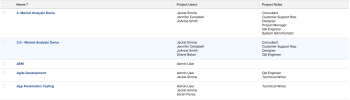

# View: list of project users with job roles

You can apply this view in a project list or report to display a list of users that are associated with the project, as well as a list of the job roles they are performing on the project.

The information in this report can also be found in the 

<!--
<MadCap:conditionalText data-mc-conditions="QuicksilverOrClassic.Quicksilver">
People area
</MadCap:conditionalText>
-->

`<MadCap:conditionalText data-mc-conditions="QuicksilverOrClassic.Quicksilver">  People area </MadCap:conditionalText>` of the project.

>[!TIP]
>
>If no job roles are listed for the users but you know that they are associated with job roles in their user profiles, this might mean they are assigned to tasks and issues but they might not be associated with a job role on the task or issue, or the users listed in the report are not the assignees on tasks and issues, but fulfill other roles on the project (for example, Owner or Sponsor.)

## Access requirements

You must have the following access to perform the steps in this article:

<table cellspacing="0"> 
 <col> 
 <col> 
 <tbody> 
  <tr> 
   <td role="rowheader"><em>Adobe Workfront</em> plan*</td> 
   <td> 
Any
 </td> 
  </tr> 
  <tr> 
   <td role="rowheader"><em>Adobe Workfront</em> license*</td> 
   <td> 
<em>Plan</em> 
 </td> 
  </tr> 
  <tr> 
   <td role="rowheader">Access level configurations*</td> 
   <td> 
Edit access to&nbsp;Reports,&nbsp;Dashboards,&nbsp;Calendars
 
Edit access to Filters, Views, Groupings
 
Note: If you still don't have access, ask your <em>Workfront administrator</em> if they set additional restrictions in your access level. For information on how a <em>Workfront administrator</em> can modify your access level, see <a href="../../../administration-and-setup/add-users/configure-and-grant-access/create-modify-access-levels.md" class="MCXref xref">Create or modify custom access levels</a>.
 </td> 
  </tr> 
  <tr> 
   <td role="rowheader">Object permissions</td> 
   <td> 
Manage permissions to a report
 
For information on requesting additional access, see <a href="../../../workfront-basics/grant-and-request-access-to-objects/request-access.md" class="MCXref xref">Request access to objects in Adobe Workfront</a>.
 </td> 
  </tr> 
 </tbody> 
</table>

&#42;To find out what plan, license type, or access you have, contact your *Workfront administrator*.

## View a list of project users with job roles

1. Go to a list of projects.
1. From the  `View` drop-down menu, select  `New View`.

1. In the `Column Preview`&nbsp;area, eliminate all columns except for one.
1. Click the header of the remaining column, then click `Switch to Text Mode`.
1. Mouse over the text mode area, and click  `Click to edit text`.
1. Remove the text you find in the  `Text Mode`&nbsp;box, and replace it with the following code:  
   <pre>column.0.link.valueformat=val column.0.linkedname=direct column.0.listsort=string(name) column.0.namekey=name.abbr column.0.querysort=name column.0.section=0 column.0.shortview=false column.0.stretch=100 column.0.valuefield=name column.0.valueformat=HTML column.0.width=200 column.1.displayname=Project Users column.1.listdelimiter=&lt;br&gt; column.1.listmethod=nested(projectUsers).lists column.1.textmode=true column.1.type=iterate column.1.valueexpression={user}.{name} column.1.valueformat=HTML column.2.displayname=Project Roles column.2.listdelimiter=&lt;br&gt; column.2.listmethod=nested(projectUserRoles).lists column.2.textmode=true column.2.type=iterate column.2.valueexpression={role}.{name} column.2.valueformat=HTML</pre>

1. Click `Save View`.

