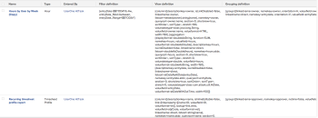

# View: reporting elements used in reports

This view displays the View, Filter, and Grouping used to build each report in Adobe Workfront when you use it in a list of reports.

You can see the 

```
valuefields
```

or 

```
valueexpressions
```

used in every element of the report.



## Access requirements

You must have the following access to perform the steps in this article:

<table cellspacing="0"> 
 <col> 
 <col> 
 <tbody> 
  <tr> 
   <td role="rowheader">Adobe Workfront plan*</td> 
   <td> <p>Any</p> </td> 
  </tr> 
  <tr> 
   <td role="rowheader">Adobe Workfront license*</td> 
   <td> <p>Plan </p> </td> 
  </tr> 
  <tr> 
   <td role="rowheader">Access level configurations*</td> 
   <td> <p>Edit access to&nbsp;Reports,&nbsp;Dashboards,&nbsp;Calendars</p> <p>Edit access to Filters, Views, Groupings</p> <p>Note: If you still don't have access, ask your Workfront administrator if they set additional restrictions in your access level. For information on how a Workfront administrator can modify your access level, see <a href="../../../administration-and-setup/add-users/configure-and-grant-access/create-modify-access-levels.md" class="MCXref xref">Create or modify custom access levels</a>.</p> </td> 
  </tr> 
  <tr> 
   <td role="rowheader">Object permissions</td> 
   <td> <p>Manage permissions to a report</p> <p>For information on requesting additional access, see <a href="../../../workfront-basics/grant-and-request-access-to-objects/request-access.md" class="MCXref xref">Request access to objects in Adobe Workfront</a>.</p> </td> 
  </tr> 
 </tbody> 
</table>

&#42;To find out what plan, license type, or access you have, contact your Workfront administrator.

## View reporting elements used in reports

1. Go to a list of reports.
1. From the `View` drop-down menu, select `New View`.

1. In the `Column Preview` area, eliminate all columns except for one.
1. Click the header of the remaining column, then click `Switch to Text Mode`.
1. Mouse over the text mode area, and click `Click to edit text`.
1. Remove the text you find in the `Text Mode` box, and replace it with the following code:
   <pre><em>column.0.descriptionkey=name</em><br><em>column.0.link.linkproperty.0.name=ID</em><br><em>column.0.link.linkproperty.0.valuefield=ID</em><br><em>column.0.link.linkproperty.0.valueformat=string</em><br><em>column.0.link.lookup=link.run</em><br><em>column.0.link.value=val(objCode)</em><br><em>column.0.listsort=string(name)</em><br><em>column.0.namekey=name.abbr</em><br><em>column.0.querysort=name</em><br><em>column.0.valuefield=name</em><br><em>column.0.valueformat=HTML</em><br><em>column.0.width=200</em><br><em>column.1.descriptionkey=objecttype</em><br><em>column.1.listsort=nested(view).string(uiObjCode)</em><br><em>column.1.namekey=objecttype.abbr</em><br><em>column.1.querysort=uiObjCode</em><br><em>column.1.valuefield=uiObjCode</em><br><em>column.1.valueformat=objCodeMessage</em><br><em>column.1.width=80</em><br><em>column.2.descriptionkey=enteredby</em><br><em>column.2.listsort=nested(enteredBy).string(lastName)</em><br><em>column.2.namekey=enteredby.abbr</em><br><em>column.2.querysort=enteredBy:lastName</em><br><em>column.2.valuefield=enteredBy:name</em><br><em>column.2.valueformat=HTML</em><br><em>column.2.width=130</em><br><em>column.3.displayname=Filter definition</em><br><em>column.3.textmode=true</em><br><em>column.3.valuefield=filter:definition</em><br><em>column.3.valueformat=HTML</em><br><em>column.4.displayname=View definition</em><br><em>column.4.textmode=true</em><br><em>column.4.valuefield=view:definition</em><br><em>column.4.valueformat=HTML</em><br><em>column.5.displayname=Grouping definition</em><br><em>column.5.textmode=true</em><br><em>column.5.valuefield=groupBy:definition</em><br><em>column.5.valueformat=HTML</em><br></pre>

1. Click `Save View`.

