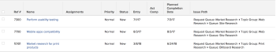

# View: submission path for issues

You can display the path through which an issue has been submitted in the view of an issue report. The path indicates the Queue, Topic Group, and Queue Topic where the issue was submitted originally.



## Access requirements

You must have the following access to perform the steps in this article:

<table cellspacing="0"> 
 <col> 
 <col> 
 <tbody> 
  <tr> 
   <td role="rowheader"><span>Adobe Workfront</span> plan*</td> 
   <td> <p>Any</p> </td> 
  </tr> 
  <tr> 
   <td role="rowheader"><span>Adobe Workfront</span> license*</td> 
   <td> <p><span>Plan</span> </p> </td> 
  </tr> 
  <tr> 
   <td role="rowheader">Access level configurations*</td> 
   <td> <p>Edit access to&nbsp;Reports,&nbsp;Dashboards,&nbsp;Calendars</p> <p>Edit access to Filters, Views, Groupings</p> <p>Note: If you still don't have access, ask your <span>Workfront administrator</span> if they set additional restrictions in your access level. For information on how a <span>Workfront administrator</span> can modify your access level, see <a href="../../../administration-and-setup/add-users/configure-and-grant-access/create-modify-access-levels.md" class="MCXref xref">Create or modify custom access levels</a>.</p> </td> 
  </tr> 
  <tr> 
   <td role="rowheader">Object permissions</td> 
   <td> <p>Manage permissions to a report</p> <p>For information on requesting additional access, see <a href="../../../workfront-basics/grant-and-request-access-to-objects/request-access.md" class="MCXref xref">Request access to objects in Adobe Workfront</a>.</p> </td> 
  </tr> 
 </tbody> 
</table>

&#42;To find out what plan, license type, or access you have, contact your `Workfront administrator`.

## View the submission path for issues

1. Go to a list of issues.
1. From the  `View` drop-down menu, select  `New View`.

1. In the `Column Preview` area, click `Add Column`.

1. Click the header of the new column, then click `Switch to Text Mode`.
1. Mouse over the text mode area, and click  `Click to edit text`.
1. Remove the text you find in the  `Text Mode`&nbsp;box, and replace it with the following code:

   ```
   displayname= Issue Path<br>linkedname=direct <br>namekey=displayQueueBreadcrumb <br>valuefield=displayQueueBreadcrumb <br>valueformat=HTML
   ```

   &nbsp;

1. Click `Save View`.

