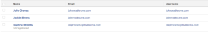

# View: username

As an administrator, people may ask you to remind them of their username and password. While the password cannot be displayed in any report, you may find it useful to create a view that displays the username for quick access to this information.

## Access requirements

You must have the following access to perform the steps in this article:

<table cellspacing="0"> 
 <col> 
 <col> 
 <tbody> 
  <tr> 
   <td role="rowheader">Adobe Workfront plan*</td> 
   <td> 
Any
 </td> 
  </tr> 
  <tr> 
   <td role="rowheader">Adobe Workfront license*</td> 
   <td> 
Plan 
 </td> 
  </tr> 
  <tr> 
   <td role="rowheader">Access level configurations*</td> 
   <td> 
Edit access to&nbsp;Reports,&nbsp;Dashboards,&nbsp;Calendars
 
Note: If you still don't have access, ask your Workfront administrator if they set additional restrictions in your access level. For information on how a Workfront administrator can modify your access level, see <a href="../../../administration-and-setup/add-users/configure-and-grant-access/create-modify-access-levels.md" class="MCXref xref">Create or modify custom access levels</a>.
 </td> 
  </tr> 
  <tr> 
   <td role="rowheader">Object permissions</td> 
   <td> 
Manage permissions to a report
 
For information on requesting additional access, see <a href="../../../workfront-basics/grant-and-request-access-to-objects/request-access.md" class="MCXref xref">Request access to objects in Adobe Workfront</a>.
 </td> 
  </tr> 
 </tbody> 
</table>

&#42;To find out what plan, license type, or access you have, contact your `Workfront administrator`.

## View username

To apply this view to a user list:

<ol> 
 <li value="1">Navigate to a list of users.</li> 
 <li value="2">Expand the View drop-down menu, then click New View.</li> 
 <li value="3">In the Column Preview area, eliminate all the columns in the view, except for one.</li> 
 <li value="4">On the remaining column, click Switch to Text Mode.</li> 
 <li value="5">Mouse over the text of the column and click Click to edit text.</li> 
 <li value="6"> 
Select all text in the&nbsp;Text Mode editor, and paste the text below:
<pre>column.0.descriptionkey=name column.0.link.linkproperty.0.name=ID column.0.link.linkproperty.0.valuefield=ID column.0.link.linkproperty.0.valueformat=int column.0.link.lookup=link.view column.0.link.valuefield=objCode column.0.link.valueformat=val column.0.linkedname=direct column.0.listsort=string(name) column.0.namekey=name.abbr column.0.querysort=name column.0.shortview=false column.0.stretch=0 column.0.valuefield=name column.0.valueformat=HTML column.0.width=150 column.1.descriptionkey=emailaddr column.1.linkedname=direct column.1.listsort=string(emailAddr) column.1.namekey=emailaddr.abbr column.1.querysort=emailAddr column.1.shortview=false column.1.stretch=0 column.1.valuefield=emailAddr column.1.valueformat=HTML column.1.width=150 column.2.description=Username column.2.linkedname=direct column.2.listsort=string(username) column.2.name=Username column.2.querysort=username column.2.shortview=false column.2.stretch=100 column.2.valuefield=username column.2.valueformat=HTML column.2.width=150</pre> </li> 
 <li value="7"> 
(Optional) To view the SSO Username, replace the code in the lines that start with column.2.valuefield&nbsp;to the following code:
<pre>column.2.description=ssoUsername column.2.linkedname=direct column.2.listsort=string(ssoUsername) column.2.name=ssoUsername column.2.querysort=ssoUsername column.2.shortview=false column.2.stretch=100 column.2.valuefield=ssoUsername column.2.valueformat=HTML column.2.width=150</pre> </li> 
 <li value="8"> 
Click Save View.
 
The view displays the name, email address and username of the users.
 
    
 </li> 
</ol>

