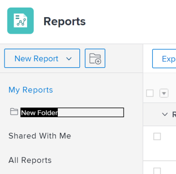

# Access and organize reports

You can use reports in *Adobe Workfront* to review or edit information about objects in the system. You can create your own reports, organize the reports that you create, and view reports that have been shared with you or shared publicly.

## Access requirements

You must have the following access to perform the steps in this article:

<table cellspacing="0"> 
 <col> 
 <col> 
 <tbody> 
  <tr> 
   <td role="rowheader"><em>Adobe Workfront</em> plan*</td> 
   <td> 
Any
 </td> 
  </tr> 
  <tr> 
   <td role="rowheader"><em>Adobe Workfront</em> license*</td> 
   <td> 
<em>Plan</em> 
 </td> 
  </tr> 
  <tr> 
   <td role="rowheader">Access level configurations*</td> 
   <td> 
Edit access to&nbsp;Reports,&nbsp;Dashboards,&nbsp;Calendars
 
Edit access to Filters, Views, Groupings
 
Note: If you still don't have access, ask your <em>Workfront administrator</em> if they set additional restrictions in your access level. For information on how a <em>Workfront administrator</em> can modify your access level, see <a href="../../../administration-and-setup/add-users/configure-and-grant-access/create-modify-access-levels.md" class="MCXref xref">Create or modify custom access levels</a>.
 </td> 
  </tr> 
  <tr> 
   <td role="rowheader">Object permissions</td> 
   <td> 
Manage permissions to a report
 
For information on requesting additional access, see <a href="../../../workfront-basics/grant-and-request-access-to-objects/request-access.md" class="MCXref xref">Request access to objects in Adobe Workfront</a>.
 </td> 
  </tr> 
 </tbody> 
</table>

&#42;To find out what plan, license type, or access you have, contact your *Workfront administrator*.

## View reports

To access reports that you have created or that have been shared with you or shared publicly:

<ol> 
 <li value="1"> <draft-comment>
   <MadCap:conditionalText data-mc-conditions="QuicksilverOrClassic.Quicksilver">
    From the 
    Main Menu 
    , click 
    Reports.
   </MadCap:conditionalText>
  </draft-comment><MadCap:conditionalText data-mc-conditions="QuicksilverOrClassic.Quicksilver">
   From the 
   Main Menu 
   , click 
   Reports.
  </MadCap:conditionalText> </li> 
 <li value="2">Click one of the following options, depending on the report that you want to view: 
  <ul>
   <li>Click My Reports to view reports that you have created.</li>
   <li>Click Shared with Me to view reports that others have shared with you.</li>
   <li>Click All Reports to view both reports that you have created and those that have been shared with you or shared publicly.</li>
  </ul></li> 
</ol>

## Organize reports that you create

You can use folders to organize the reports that you create. You cannot organize reports that have been shared with you, shared publicly, or system reports.

* [Create a new folder for reports](#creating-a-new-folder-for-reports) 
* [Add reports to a folder](#adding-reports-to-a-folder)

### Create a new folder for reports

<ol> 
 <li value="1"> <draft-comment>
   <MadCap:conditionalText data-mc-conditions="QuicksilverOrClassic.Quicksilver">
    From the 
    Main Menu 
    , click 
    Reports.
   </MadCap:conditionalText>
  </draft-comment><MadCap:conditionalText data-mc-conditions="QuicksilverOrClassic.Quicksilver">
   From the 
   Main Menu 
   , click 
   Reports.
  </MadCap:conditionalText> </li> 
 <li value="2">Click the New Folder icon. <draft-comment>
   
  </draft-comment></li> 
 <li value="3">Specify a name for the new folder, then press Enter.</li> 
 <li value="4">From the My Reports folder, add reports to the new folder. For information about adding a report to a new folder, see the <a href="#adding-reports-to-a-folder" class="MCXref xref">Add reports to a folder</a> section in this article. <note type="note">
    You can only add new folders to the 
   My Reports folder. You cannot add new folders or reports to the 
   Shared with Me or 
   All Reports folders.
  </note></li> 
</ol>

### Add reports to a folder

<ol> 
 <li value="1"> <draft-comment>
   <MadCap:conditionalText data-mc-conditions="QuicksilverOrClassic.Quicksilver">
    From the 
    Main Menu 
    , click 
    Reports.
   </MadCap:conditionalText>
  </draft-comment><MadCap:conditionalText data-mc-conditions="QuicksilverOrClassic.Quicksilver">
   From the 
   Main Menu 
   , click 
   Reports.
  </MadCap:conditionalText> </li> 
 <li value="2">Click My Reports. Or Click any folder nested under the My Reports folder.</li> 
 <li value="3">Drag a report from the report list into the folder where you want it to reside, and drop it when you reach the folder. <note type="note">
   You can only move reports from the 
   My Reports folder to other folders nested under 
   My Reports. You cannot move reports from or to the 
   Shared with Me or 
   All Reports folder to or from other folders.
  </note> <draft-comment>
   
  </draft-comment></li> 
</ol>

