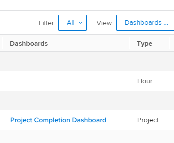
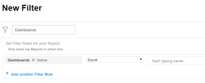

# Understand how&nbsp;to organize reports on a dashboard

## Access dashboard information in a report list

You can see whether a report is added to a dashboard in *Adobe Workfront*. This might be useful when deciding which reports you can keep and which can be deleted from the system. If reports are on dashboards, users might still be relying on them. We recommend not deleting reports that are listed on dashboards that users are using.  
For more information about adding reports to dashboards, see the article [Add a report to a dashboard](../../../reports-and-dashboards/dashboards/creating-and-managing-dashboards/add-report-dashboard.md).

You can see whether a report is added to a dashboard by doing one of the following:

* Building a view for a list of reports and including dashboard information in the columns
* Filtering a list of reports by one or several specific dashboards that you know are being actively used
* Building a report for the report object and using a view or a filter which include dashboard information

Anyone can build a view or a filter, but you must have Edit access to Reports in your access level to build a report.  
For more information about access to reports, see the article [Grant access to reports, dashboards, and calendars](../../../administration-and-setup/add-users/configure-and-grant-access/grant-access-reports-dashboards-calendars.md).  
For more information about building a report, see the article [Create a custom report](../../../reports-and-dashboards/reports/creating-and-managing-reports/create-custom-report.md).

## Access requirements

You must have the following access to perform the steps in this article:

<table cellspacing="0"> 
 <col> 
 <col> 
 <tbody> 
  <tr> 
   <td role="rowheader"><em>Adobe Workfront</em> plan*</td> 
   <td> 
Any
 </td> 
  </tr> 
  <tr> 
   <td role="rowheader"><em>Adobe Workfront</em> license*</td> 
   <td> 
<em>Plan</em> 
 </td> 
  </tr> 
  <tr> 
   <td role="rowheader">Access level configurations*</td> 
   <td> 
Edit access to&nbsp;Reports,&nbsp;Dashboards,&nbsp;Calendars
 
Edit access to Filters, Views, Groupings
 
Note: If you still don't have access, ask your <em>Workfront administrator</em> if they set additional restrictions in your access level. For information on how a <em>Workfront administrator</em> can modify your access level, see <a href="../../../administration-and-setup/add-users/configure-and-grant-access/create-modify-access-levels.md" class="MCXref xref">Create or modify custom access levels</a>.
 </td> 
  </tr> 
  <tr> 
   <td role="rowheader">Object permissions</td> 
   <td> 
Manage permissions to a report
 
For information on requesting additional access, see <a href="../../../workfront-basics/grant-and-request-access-to-objects/request-access.md" class="MCXref xref">Request access to objects in Adobe Workfront</a>.
 </td> 
  </tr> 
 </tbody> 
</table>

&#42;To find out what plan, license type, or access you have, contact your *Workfront administrator*.

## Display dashboard information in the View of a report list

To build a view with dashboard information for a report list:

<ol> 
 <li value="1"> <draft-comment>
   <MadCap:conditionalText data-mc-conditions="QuicksilverOrClassic.Quicksilver">
     Click the 
    Main Menu icon 
     in the upper-right corner of 
    <em>Workfront</em>, then click 
    Reports. 
   </MadCap:conditionalText>
  </draft-comment><MadCap:conditionalText data-mc-conditions="QuicksilverOrClassic.Quicksilver">
    Click the 
   Main Menu icon 
    in the upper-right corner of 
   <em>Workfront</em>, then click 
   Reports. 
  </MadCap:conditionalText> </li> 
 <li value="2">On the list of reports, click the View drop-down menu.</li> 
 <li value="3">Click New View.</li> 
 <li value="4">Click Add Column.</li> 
 <li value="5">Start typing "Dashboards" in the Start typing field name field.</li> 
 <li value="6">Under the Report object, select Dashboards.</li> 
 <li value="7">Click Save View. The dashboards that a report appears on display in the Dashboards column of the report list. <draft-comment>
   
  </draft-comment>  </li> 
</ol>

## Filter a report list by dashboard information

To filter a list of reports by dashboard information:

<ol> 
 <li value="1"> <draft-comment>
   <MadCap:conditionalText data-mc-conditions="QuicksilverOrClassic.Quicksilver">
     Click the 
    Main Menu icon 
     in the upper-right corner of 
    <em>Workfront</em>, then click 
    Reports. 
   </MadCap:conditionalText>
  </draft-comment><MadCap:conditionalText data-mc-conditions="QuicksilverOrClassic.Quicksilver">
    Click the 
   Main Menu icon 
    in the upper-right corner of 
   <em>Workfront</em>, then click 
   Reports. 
  </MadCap:conditionalText> </li> 
 <li value="2">On the list of reports, click the Filter drop-down menu.</li> 
 <li value="3">Click New Filter, then click Add a Filter Rule.</li> 
 <li value="4">Start typing "Dashboards" in the Start typing field name field. </li> 
 <li value="5">Under the Dashboards object, select Name.</li> 
 <li value="6">Select Equal in the modifier drop-down menu, then start typing the name of the dashboard you want to filter by. You can select multiple dashboards for your filter. <draft-comment>
   
  </draft-comment></li> 
 <li value="7">Click Save + Close. This displays a list of reports that are listed only on the specified dashboards. You can also build a report for the report object and use this filter in the report. </li> 
</ol>

