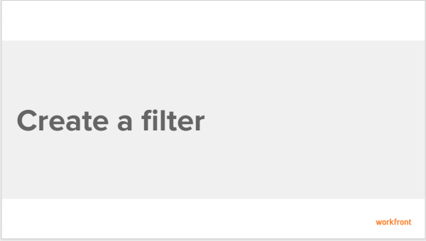

# Create custom filters to limit report information {#create-custom-filters-to-limit-report-information}

You can use filters to reduce the amount of information you display on the screen.

You can apply a quick filter to a list of objects to find an item in a list using a keyword. 

For information about quick filters, see the [Apply quick filters to lists](view-items-in-a-list.md#applying-quick-filters) section in [View items in a list](view-items-in-a-list.md) article.

You can also build a permanent filter that you can use numerous time on multiple lists and reports. The following information refers to creating a permanent filter. 

## Walk-through {#walk-through}

View the following video to learn how to create a filter.

The following video was recorded in `Workfront Classic`. However, the content also applies to `the new Workfront experience`.

 

## How-to steps {#how-to-steps}

1. Go to the report that contains the filter that you want to customize.
1. Click the **Filter** drop-down list.  
   

1.  Select the **Filter** that you want to customize, then click **Customize Filter**.

   Or

   Click **New Filter**.

   The interface builder for customizing the Filter is launched.

1. Do any of the following:  

    
    
    * Modify existing filter rules by clicking the existing rule and selecting a new option.
    * Add a filter rule by clicking **Add another Filter Rule**, begin typing the name of the option for which you want to add a rule in the **Start typing field name** box, then click it when it appears in the drop-down list. 
    
    
      Fields associated with the object of your filter are listed in the **Start typing field name** box. 
    
    * Click **AND** or **OR **when adding a new filter rule.  
      When adding filter rules, use the filter modifiers to establish the condition of your filter. For more information about filter modifiers, see [Filter and condition modifiers](filter-condition-modifiers.md).
    
    * Delete an existing filter rule by clicking the 'X' icon.
    
    

1.  (Optional) Click **Switch to Text Mode** to add a filter using the Text Mode interface.

   For more information about creating a filter using the text mode interface, see the section [Edit text mode in a filter](understand-text-mode.md#editing2) in the article [Understand Text Mode](understand-text-mode.md).

1. Click **Save Filter** to replace the current Filter with your changes.
1.  (Optional) If you no longer want to display a filter in the **Filter** drop-down menu, click **Remove Filter**.

   

   The My Filters dialog box is displayed.

   All filters that you have rights to remove are available to remove. Other filters are displayed as dimmed.

1. Click the (**x**) next to any filters you want to remove, then click **Done**.

## Additional information {#additional-information}

See also:

* [Learning Path for reports and dashboards](https://experience.workfront.com/s/reporting) 
* [Reporting elements: Filters, Views, and Groupings](reporting-elements-filters-views-groupings.md) 
* [Create and customize Filters](create-customize-filters.md) 
* [Understand Text Mode](understand-text-mode.md) 
* [Understand common uses of Text Mode](understand-common-uses-text-mode.md) 

