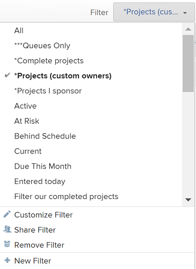

# Create and customize Filters {#create-and-customize-filters}

## Understand `Workfront` filters {#understand-workfront-filters}

You can use filters to reduce the amount of information you display on the screen. 

You can create the following types of filters in `Workfront`:

* [Permanent filters](#permanent-filters) 
* [Temporary filters](#temporary-filters) 

### Permanent filters  {#permanent-filters}

You can build filters one time and reuse them in several lists and reports. These are permanent filters.

You can create and save permanent filters in the following `Workfront` areas:

* Lists
* Reports
* Resource Planner  
  For information about filtering in the Resource Planner, see the article [Filter information in the Resource Planner](filter-resource-planner.md).

* Resource Scheduling areas  
  For information about filtering in the scheduling areas, see the article [Filter information in the Scheduling area](filter-scheduling-area.md).

* Home   
  For information about filtering items in the Home area, see the [Filter the Work List](display-items-in-home-work-list.md#filtering-by-item-type) section in the article [Display items in the Work List in the Home Area](display-items-in-home-work-list.md).

For information about removing a permanent filter, see the article [Remove Filters, Views, and Groupings](remove-filters-views-groupings.md). 

### Temporary filters {#temporary-filters}

You can use a one-time quick filter to quickly jump to an item in a list. This is a temporary filter and you cannot save it. 

For information about quick filters, see the section [Apply quick filters to lists](view-items-in-a-list.md#applying-quick-filters) in the article [View items in a list](view-items-in-a-list.md).

## Overview of filters in lists and reports {#overview-of-filters-in-lists-and-reports}

When working with lists and reports, you can customize existing filters, create filters based on existing filters, or create filters from scratch.  
For information about `Workfront` Lists, see the article [View items in a list](view-items-in-a-list.md).  
For information about `Workfront` reports, see the article [Get started with reports in Workfront](get-started-reports-workfront.md).

Consider the following when working with filters: 

* You can customize existing filters. All users who can view the filters can also see your changes. 

*  Your `Workfront administrator` must grant you access to Edit Filters, Views, and Groupings to create permanent filters. 

  For information about granting access to Filters, Views, and Groupings, see [Grant access to filters, views, and groupings](grant-access-fvg.md). 

* Your level of permissions to a filter determines how filters are saved. If you created the filter originally, you can save the changes, otherwise you are prompted to save a version of the filter that you are modifying. Keep in mind if you make changes to a filter you have shared with others the changes impact them as well.
* You can customize a filter that was shared with you only if the user who shared it granted you Manage access. For information about sharing a filter, see [Share a Filter, View, or Grouping](share-filter-view-grouping.md). 

>[!IMPORTANT] {type="important"}
>
>When creating or editing filters in reports, you must edit the report in order for the new filter to become the default filter for the report. When you edit just the filter, outside the report builder, the default filter of the report is not updated. For information about editing a report, see the article [Create a report](create-report.md).

* [Create custom filters in the builder interface](#create) 
* [Customize an existing filter](#customizing-an-existing-filter) 
* [Create filters using the Text Mode interface](#creating-filter-in-text-mode) 
* [Understand limitations about joining multiple filter rules](#limittions-of-or-filters) 
* [Create filters for complex fields](#complex-fields) 

### Create custom filters in the builder interface {#create-custom-filters-in-the-builder-interface}

You can create a filter using the standard builder interface in the following ways:

* From scratch
* Modifying an existing filter
* Copying an existing filter

For information about creating a filter using the standard interface, see the article [Create custom filters to limit report information](create-custom-filters-limit-report-information.md). 

### **Customize an existing filter**  {#customize-an-existing-filter}

1. Go to the report or list that contains the Filter that you want to customize. 
1. Click the **Filter** drop-down list.  
   

1. Select the **Filter** that you want to customize, then click **Customize Filter**.

1. The interface builder for customizing the Filter is launched.
1. Do any of the following:  

    
    
    * Modify existing filter rules by clicking the existing rule and selecting a new option.
    * Add a filter rule by clicking **Add another Filter Rule**, begin typing the name of the option for which you want to add a rule, then click it when it appears in the drop-down list.  
      Click **AND** or **OR **when adding a new filter rule.  
      When adding filter rules, use the filter modifiers to establish the condition of your filter. For more information about filter modifiers, see the article [Filter and condition modifiers](filter-condition-modifiers.md).
    
    * Delete an existing filter rule by clicking the 'X' icon.
    
    

1. Click **Save Filter** to replace the current Filter with your changes.

### **Create filters using the Text Mode interface**  {#create-filters-using-the-text-mode-interface}

You can build filters using the text mode interface. We recommend to build most of the filter statements using the standard interface, and to edit the code of the filter only as a final step. Building a filter from scratch using the text mode interface alone is not recommended. 

For more information about creating a filter using the text mode interface, see the section [Edit text mode in a filter](understand-text-mode.md#editing2) in the article [Understand Text Mode](understand-text-mode.md). 

### **Understand limitations about joining multiple filter rules**  {#understand-limitations-about-joining-multiple-filter-rules}

You can reference only five objects, excluding the object of the report, when you build a filter in `Workfront`. 

When you reach this limit within the builder, you can select fields that belong only to these six objects. You receive a warning when you have reached this limit. 

You cannot overcome this limitation when you build your filter in text mode. 

### ** Create filters for complex fields **  {#create-filters-for-complex-fields}

* [Create a filter for fields that contain commas](#filter-for-fields-with-commas) 
* [Create a filter for multi-select custom fields](#filter-for-multi-select) 

#### **Create a filter for fields that contain commas**  {#create-a-filter-for-fields-that-contain-commas}

When building a filter in text mode and filtering for field values that contain commas, you must add a slash ("/") before the commas separating the values, to ensure that the value is read as one filter option. This only applies for the following field types:

* Dropdowns
* Radio Buttons
* Checkboxes

For example, you have a radio button field on a project called "Color" and the options for it are:

* Red
* Blue
* Red, blue

If you want to build a filter that would find only projects where the third option is selected, the filter statement in the text mode interface should be:
`<pre>DE:check=red/, blue DE:check_Mod=in</pre>` This syntax ensures that the values are read together, as one option. If you omit the slash, `Workfront` reads the comma as an 'OR', in which case only the projects that have either the first or the second option would be selected. 

This syntax also applies when building prompts. For more information about using prompts, see the article [Add a prompt to a report](add-prompt-report.md).

#### **Create a filter for multi-select custom fields**  {#create-a-filter-for-multi-select-custom-fields}

You can report on multi-select custom fields. For example, Checkboxes.

However, when you want to exclude results that have only one of the options selected, the report will display any objects that have that option and any other option selected. 

For example, if you have a field with 3 options (A, B, and C), and select 2 of the 3 options (A and B, but not C) on an object, you can create a report with a filter with a qualifier of Not Equal for options A and B, and it will only filter out projects that have both A and B, but not only A, and not only B selected. If you create a filter with a qualifier for Not Equal for option A, it will only filter out objects with only A selected, but if A and B are selected, those objects still display in the report. 
