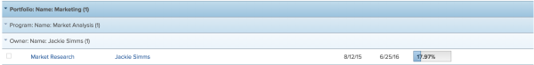

# Create and customize Groupings {#create-and-customize-groupings}

## Groupings in `Workfront` {#groupings-in-workfront}

You can add groupings to manage the layout of the information in your reports and lists.

You can add groupings to reports in the following ways: 

*  You can create groupings by editing existing groupings.

  For information about customizing an existing Grouping, see [Edit existing Groupings to organize report information](edit-existing-groupings-organize-report-information.md). 

*  You can create groupings from scratch.

  For information about creating a grouping from scratch, see [Create Groupings to organize report information](create-groupings-organize-report-information.md). 

By default, groupings are shown in a blue highlight in your report or list. The results of the report or list are listed under their individual grouping, with no highlight.

You can add up to three groupings to a report. You can organize your information with up to four groupings by creating a matrix report. For more information on matrix reports, see [Create a matrix report](create-matrix-report.md). 

In a standard grouping report, the first grouping is darker blue, the second and third groupings are lighter blue. You cannot customize the color of the highlight for your grouping, or the font of the grouping name. The number in parentheses after the name of the grouping represents the number of results under that grouping. If your report spans multiple pages, ensure that you display *All* the results in the report or list to get an accurate count for your results under each grouping. 

Consider the following when working with groupings:

* You can customize the information in existing groupings. All users who can view the groupings can also see your changes. 
*  Your `Workfront administrator` must grant you access to Edit Filters, Views, and Groupings to create groupings. 

  For information about granting access to Filters, Views, and Groupings, see [Grant access to filters, views, and groupings](grant-access-fvg.md).

* Your level of permissions to a grouping dictates how a grouping is saved. If you created the grouping originally, you can save the changes, otherwise you are prompted to save a version of the grouping. If you make changes to a grouping you have shared with others it impacts them as well. 
* You can customize a grouping that was shared with you only if the user who shared it granted you Manage access.&nbsp;For information about sharing a grouping, see [Share a Filter, View, or Grouping](share-filter-view-grouping.md). 
* You cannot edit a grouping in-line.
* You cannot group by multi-select custom fields (for example, Checkboxes), or by fields that can have multiple values (for example, Resource Manager). 

## Additional information about groupings {#additional-information-about-groupings}

You can further manage report information when using Groupings by aggregating the values in each column on the Grouping row, as well as sort your information by the field of your Grouping. You can also remove a Grouping when it is no longer needed. 

* [Aggregate values in groupings](#aggregat) 
* [Sort by a grouping](#sorting-by-a-grouping) 
* [Remove a grouping](#removing-a-grouping) 

### Aggregate values in groupings {#aggregate-values-in-groupings}

You can aggregate the data displayed in your report in your grouping line by summarizing the values in each column of the report. For more information about summarizing column data in a grouping, see [Create and customize Views](create-customize-views.md).

>[!NOTE]
>
>The following exceptions apply for parent objects (for example, parent tasks) when you are aggregating values for the following fields in groupings:
>
>
>
>*  All the number and currency fields except Actual Hours (for example, Planned/ Actual Labor Cost, Planned/ Actual Expense Cost, Planned/ Actual Cost, Planned Hours) aggregate only the values for the children tasks, and standalone tasks. They do not aggregate the values for the parent tasks or parents of parents. 
>*  Actual Hours aggregate the values for the main parent and the standalone tasks; they do not aggregate the numbers for the parents of parent tasks or the children tasks. 
>*  Custom data fields for number and currency values aggregate all tasks: parents, children, parents of parents, and standalone tasks. 
>
>

### Sort by a grouping {#sort-by-a-grouping}

Groupings cannot be sorted. Views can be sorted. In order to sort a list by the value captured in the grouping, you must include that same value in one of the columns of the view and apply the sorting in the view. This way, the list sorts by the value in the grouping indirectly (it sorts by the value in the view which is also captured in the grouping). For more information about creating views and sorting by values inside the views, see [Create and customize Views](create-customize-views.md). 

### Remove a grouping {#remove-a-grouping}

How you remove a grouping depends on whether you initially created the grouping, or the grouping was shared with you. You cannot remove a default grouping.

* **If you created the grouping and you remove it**, the grouping is removed from the `Workfront` system. The grouping is no longer available to any users who you previously shared it with.

* **If the grouping was shared with you and you remove it**, the grouping is removed only for you. The user who originally created it and any other users it has been shared with still have access to the grouping.

For information about removing a grouping, see the article [Remove Filters, Views, and Groupings](remove-filters-views-groupings.md). 
