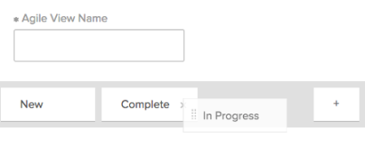

# Create and customize Views {#create-and-customize-views}

## Considerations about views {#considerations-about-views}

* You can customize existing views. All users who can view the views can also see your changes. 
*  Your `Workfront administrator` must grant you access to Edit Filters, Views, and Groupings to be able to create views. 

  For information about granting access to Edit Filters, Views, and Groupings, see [Grant access to filters, views, and groupings](grant-access-fvg.md).

* Your level of permissions to a view dictates how a view is saved. If you created the view originally, you can save the changes, otherwise you are prompted to save a version of the view. If you make changes to a view you have shared with others it impacts them as well. 
* You can customize a view that was shared with you only if the user who shared it granted you Manage access. For information about sharing a view, see [Share a Filter, View, or Grouping](share-filter-view-grouping.md).

You can customize existing views, create new views based on existing views, or create new Views from scratch. 

## Create or customize a view {#create-or-customize-a-view}

The process for creating or customizing a view differs depending on whether you are creating or customizing a standard view or an agile view.

* [Create or customize a standard view](#customizing-a-standard-view) 
* [Create or customize an Agile view](#customizing-an-agile-view) 

### Create or customize a standard view {#create-or-customize-a-standard-view}

You can create a new standard view, or you can customize an existing standard view that you previously created.

1. Click the** View** drop-down menu on any list where you want to create or customize a view. 
1. (Optional) To customize an existing view, select the standard View you want to customize.  
   Standard Views are available on any type of list in `Workfront`, such as a report, project list, or task list.

1. Click the **View** drop-down menu, then click **Customize View** or** New View**.  
   The Customize View dialog box is displayed.  

1.  In the **Column Preview** section, do any of the following:

    
    
    * Modify the value of any column by clicking the column title and then selecting a new field.
    * Add a column by clicking **Add Column**, begin typing the name of the column that you want to add, then click it when it appears in the drop-down list.
    * Adjust the order that columns appear by dragging the column title to a new location.     
        
        
        * (Optional) In the **Column Settings** area, click the **Summarize this column by** drop-down list, then select one of the available options for summarizing the information. When you choose this option, the information in your column is aggregated in the groupings of the report.  
          For date fields, you can summarize the values by the following options:        
            
            
            * Maximum
            * Minimum
            
            
          For number and currency fields, you can summarize the values by the following options:
        
            
            
            * Count
            * Sum
            * Average
            * Maximum
            * Minimum
            
            
        
        
          >[!NOTE]
          >
          >The following exceptions apply for parent objects (for example, parent tasks) when you are aggregating values for the following fields in groupings:
          >
          >    
          >    
          >    * All the number and currency fields except Actual Hours (for example, Planned/ Actual Labor Cost, Planned/ Actual Expense Cost, Planned/ Actual Cost, Planned Hours) aggregate only the values for the children tasks, and standalone tasks. They do not aggregate the values for the parent tasks or parents of parents.
          >    * Actual Hours aggregate the values for the main parent and the standalone tasks; they do not aggregate the numbers for the parents of parent tasks or the children tasks.
          >    * Custom data fields for number and currency values aggregate all tasks: parents, children, parents of parents, and standalone tasks. 
          >    
          >    

        
        
          For more information about using groupings in a report, see the article [Create and customize Groupings](create-customize-groupings.md).
        
        * (Optional) Click **Advanced Options** to specify the following information for the column:
        
        
        
        

        
        
          For more information about conditionally formatting views in reports, see the article [Use conditional formatting in Text Mode](use-conditional-formatting-text-mode.md).
        
        
        
    
    

1. (Conditional) If you clicked **Advanced Options**, click **Done**. 

1.  Click **Save View** to create a new View or to replace the current View with your changes.  
   Or  
   Click **Save as New View** to save your changes as a new View.

   >[!TIP] {type="tip"}
   >
   >The **Save as New View** is the only option available when you customize a `Workfront` native view . 

   Your access dictates how the View is saved. If you created the View originally, you can save the changes; otherwise, you are prompted to save a version. Keep in mind that changes you make to the View impact users with whom the View has been shared.

### Create or customize an Agile view {#create-or-customize-an-agile-view}

You can create a new Agile view or customize an existing Agile view that you previously created.

>[!IMPORTANT] {type="important"}
>
>Agile views are available only when viewing a project. 

For more information about Agile views, see the article [Manage a project in the Agile View](manage-projects-in-agile-view.md).

To create or customize an Agile view:

1. Go to the list of tasks on a project. 
1. Click the **Agile** icon.  
   

1. (Conditional) To customize an existing Agile view:
1.  `<li value="1">Click the <b>View</b> drop-down menu, then select the Agile View you want to customize. You cannot customize the default Agile view.</li>` `<li value="2">Click the <b>View</b> drop-down menu again, then click <b>Customize View</b>. </li>` 

1. (Conditional) To create a new Agile view, click **New View**.  
   The Customize Agile View dialog box is displayed.  

1. In the **Customize Agile View** dialog box, specify a name for the Agile view.   
   We recommend that you include the word "Agile" in your view name, so users know this is an Agile view.  
   This name is displayed in the **View** drop-down menu when selecting a view.

1.  Define the status columns to display on the story board in the agile view. These are the task statuses that are defined by the `Workfront administrator`, as described in [Create and customize system wide statuses](create-customize-statuses.md).

   Only system statuses are available to use on the Agile story board. If a status is available only for an individual group you are a member of, the status is not available on the agile story board. Furthermore, tasks that are in a status that is available only to a custom group are not visible when viewing the project in an Agile view.

   Users can move stories among these status columns on the Agile story board.  
   When defining status columns, you can do the following:

<table style="width: 100%;mc-table-style: url('../../../Resources/TableStyles/TableStyle-List-options-in-steps.css');" class="TableStyle-TableStyle-List-options-in-steps" cellspacing="0"> 
 <col style="width: 200px;" class="TableStyle-TableStyle-List-options-in-steps-Column-Column1"> 
 <col style="width: 50%;" class="TableStyle-TableStyle-List-options-in-steps-Column-Column2"> 
 <thead> 
  <tr> 
   <th class="TableStyle-TableStyle-List-options-in-steps-HeadH-Column1-"> </th> 
   <th class="TableStyle-TableStyle-List-options-in-steps-HeadG-Column2-"> </th> 
  </tr> 
 </thead> 
 <tbody> 
  <tr class="TableStyle-TableStyle-List-options-in-steps-Body-LightGray"> 
   <td class="TableStyle-TableStyle-List-options-in-steps-BodyE-Column1-LightGray"><b>Reorder status columns:</b> </td> 
   <td class="TableStyle-TableStyle-List-options-in-steps-BodyD-Column2-LightGray"> Drag a status column to the order where you want it to appear. </td> 
  </tr> 
  <tr class="TableStyle-TableStyle-List-options-in-steps-Body-MediumGray"> 
   <td class="TableStyle-TableStyle-List-options-in-steps-BodyE-Column1-MediumGray"><b>Remove status columns:</b> </td> 
   <td class="TableStyle-TableStyle-List-options-in-steps-BodyD-Column2-MediumGray">Click the (x) icon on the column that you want to remove.  You cannot remove the "New" status unless a custom status has been added to the view and that custom status equates with "New."  For information about creating a custom status, see <a href="create-customize-statuses.md" class="MCXref xref">Create and customize system wide statuses</a>.</td> 
  </tr> 
  <tr class="TableStyle-TableStyle-List-options-in-steps-Body-LightGray"> 
   <td class="TableStyle-TableStyle-List-options-in-steps-BodyB-Column1-LightGray"><b>Add status columns:</b> </td> 
   <td class="TableStyle-TableStyle-List-options-in-steps-BodyA-Column2-LightGray">Click the <b>Plus</b> icon, then select the status you want to add. All default system statuses are displayed, as well as any custom statuses that have been shared with you. You can configure up to 10 statuses to be displayed.</td> 
  </tr> 
 </tbody> 
</table>

1.  In the **Associate Card Color to** area, select from the following options: 

<table style="width: 100%;mc-table-style: url('../../../Resources/TableStyles/TableStyle-List-options-in-steps.css');" class="TableStyle-TableStyle-List-options-in-steps" cellspacing="0"> 
 <col style="width: 200px;" class="TableStyle-TableStyle-List-options-in-steps-Column-Column1"> 
 <col style="width: 50%;" class="TableStyle-TableStyle-List-options-in-steps-Column-Column2"> 
 <thead> 
  <tr> 
   <th class="TableStyle-TableStyle-List-options-in-steps-HeadH-Column1-"> </th> 
   <th class="TableStyle-TableStyle-List-options-in-steps-HeadG-Column2-"> </th> 
  </tr> 
 </thead> 
 <tbody> 
  <tr class="TableStyle-TableStyle-List-options-in-steps-Body-LightGray"> 
   <td class="TableStyle-TableStyle-List-options-in-steps-BodyE-Column1-LightGray"><b>Story:</b> </td> 
   <td class="TableStyle-TableStyle-List-options-in-steps-BodyD-Column2-LightGray">Any subtasks match the color of the parent task, so that the colors of all stories in any given swimlane are the same.  Colors are randomly assigned to tasks when they are created if the task does not have any subtasks or does not have a parent task.</td> 
  </tr> 
  <tr class="TableStyle-TableStyle-List-options-in-steps-Body-MediumGray"> 
   <td class="TableStyle-TableStyle-List-options-in-steps-BodyE-Column1-MediumGray"><b>Free Form:</b> </td> 
   <td class="TableStyle-TableStyle-List-options-in-steps-BodyD-Column2-MediumGray"> All cards are displayed as blue by default until a user changes the color manually, as described in the article <a href="categorize-stories-by-color.md" class="MCXref xref">Categorize stories by color on the Scrum board</a>. </td> 
  </tr> 
  <tr class="TableStyle-TableStyle-List-options-in-steps-Body-LightGray"> 
   <td class="TableStyle-TableStyle-List-options-in-steps-BodyE-Column1-LightGray"><b>Priority:</b> </td> 
   <td class="TableStyle-TableStyle-List-options-in-steps-BodyD-Column2-LightGray"> 
 Colors are associated with the story priority, as follows:
 
    <ul> 
     <li value="1">High = Red</li> 
     <li value="2">Medium = Yellow</li> 
     <li value="3">Low = Green If your Workfront administrator has configured custom priorities for your Workfront system, the highest priority is red, the second-highest is yellow, and the remaining are green.</li> 
    </ul> </td> 
  </tr> 
  <tr class="TableStyle-TableStyle-List-options-in-steps-Body-MediumGray"> 
   <td class="TableStyle-TableStyle-List-options-in-steps-BodyB-Column1-MediumGray"><b>Task Owner:</b> </td> 
   <td class="TableStyle-TableStyle-List-options-in-steps-BodyA-Column2-MediumGray"> All stories with the same primary assignee are the same color. The primary assignee is the user who was first assigned to the task. </td> 
  </tr> 
 </tbody> 
</table>

1.  In the **Agile** section, in the **Additional Fields** area, click **Add Field**, then select the field you want to add to story cards. (These are the same fields you can add when creating customizing a view or creating columns for a report.)  
   Repeat this process to add up to 3 additional fields to the story cards.  
   When you add fields to story cards, fields are view-only and display only when the field is populated.

   By default, the following types of data is displayed on the story card:

    
    
    * Story name with a link directly to the task
    * The project name with a link directly to the project  
      This link is displayed only when using the agile view on an iteration; it is not displayed when using an Agile view on a project.
    * The task description
    * Current commitment
    * View and edit the percent complete either by adjusting the percent complete itself or by adjusting the number of points or hours that are complete
    * Assigned Users
    
    
   You can display additional data (including custom data) on story cards. You might want to display additional fields on story cards for any number of reasons. For example, you might want to display the Customer ID if you are working on stories for multiple customers within the project, or you might want to display the Task Start Date. 

1. Click **Save**  
   Your access dictates how the View is saved. If you created the View originally, you can save the changes; otherwise, you are prompted to save a version. Keep in mind that changes you make to the View impact users with whom the View has been shared.

## Share a view {#share-a-view}

For information about how to share a view, see [Share a Filter, View, or Grouping](share-filter-view-grouping.md).

## Remove a view {#remove-a-view}

The ability to remove a view functions differently depending on whether you initially created the view, or the view was shared with you. You cannot remove a default view.

* **If you created the view and you remove it**, the view is removed from the `Workfront` system. The view is no longer available to any users who you previously shared it with.

* **If the view was shared with you and you remove it**, the view is removed only for you. The user who originally created it and any other users it has been shared with still have access to the view.

To remove a view:

1. To remove a standard view, ensure that you are currently viewing a standard view.  
   Or  
   To remove an Agile view, ensure that you are currently viewing an agile view.

1.  Go to a list of objects, and in the **View** drop-down menu, click **Remove View**.  
   The **My Views** dialog box is displayed.  
  
   If you are deleting a standard view, all standard views that you have rights to remove are available to remove. 

   If you are deleting an Agile view, all Agile views that you have rights to remove are available to remove. 

   Standard views or Agile views that you do not have rights to remove display as dimmed.  

1. Click the (**x**) next to any views you want to remove, then click **Done**.

