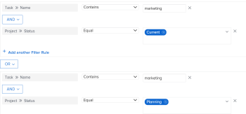

# Create or edit filters in *`Adobe Workfront`* {#create-or-edit-filters-in-adobe-workfront}

You can use filters to reduce the amount of information you display on the screen.

You can apply the following types of filters in  *`Adobe Workfront`*: 

*  A quick filter to a list of objects to find an item in a list using a keyword. 

  For information about quick filters, see [Apply the quick filter to a list](apply-quick-filter-list.md). 

*  A permanent filter that you can use numerous time on multiple lists and reports. This article describes how to create a permanent filter or edit an existing one. 

## Access requirements {#access-requirements}

You must have the following access to perform the steps in this article:

<table style="width: 100%;margin-left: 0;margin-right: auto;mc-table-style: url('../../../Resources/TableStyles/TableStyle-List-options-in-steps.css');" class="TableStyle-TableStyle-List-options-in-steps" cellspacing="0"> 
 <col class="TableStyle-TableStyle-List-options-in-steps-Column-Column1"> 
 <col class="TableStyle-TableStyle-List-options-in-steps-Column-Column2"> 
 <tbody> 
  <tr class="TableStyle-TableStyle-List-options-in-steps-Body-LightGray"> 
   <td class="TableStyle-TableStyle-List-options-in-steps-BodyE-Column1-LightGray" role="rowheader">Adobe Workfront plan*</td> 
   <td class="TableStyle-TableStyle-List-options-in-steps-BodyD-Column2-LightGray"> 
Any
 </td> 
  </tr> 
  <tr class="TableStyle-TableStyle-List-options-in-steps-Body-MediumGray"> 
   <td class="TableStyle-TableStyle-List-options-in-steps-BodyE-Column1-MediumGray" role="rowheader">Adobe Workfront license*</td> 
   <td class="TableStyle-TableStyle-List-options-in-steps-BodyD-Column2-MediumGray"> 
Plan 
 </td> 
  </tr> 
  <tr class="TableStyle-TableStyle-List-options-in-steps-Body-LightGray"> 
   <td class="TableStyle-TableStyle-List-options-in-steps-BodyE-Column1-LightGray" role="rowheader">Access level configurations*</td> 
   <td class="TableStyle-TableStyle-List-options-in-steps-BodyD-Column2-LightGray"> 
Edit access to Filters, Views, Groupings
 
Edit access to&nbsp;Reports,&nbsp;Dashboards,&nbsp;Calendars to create a filter in a report
 
Note: If you still don't have access, ask your Workfront administrator if they set additional restrictions in your access level. For information on how a Workfront administrator can modify your access level, see <a href="create-modify-access-levels.md" class="MCXref xref">Create or modify custom access levels</a>.
 </td> 
  </tr> 
  <tr class="TableStyle-TableStyle-List-options-in-steps-Body-MediumGray"> 
   <td class="TableStyle-TableStyle-List-options-in-steps-BodyB-Column1-MediumGray" role="rowheader">Object permissions</td> 
   <td class="TableStyle-TableStyle-List-options-in-steps-BodyA-Column2-MediumGray"> 
Manage permissions to a report to create or edit a filter in a report
 
Manage permissions to a filter to edit it
 
For information on requesting additional access, see <a href="request-access.md" class="MCXref xref">Request access to objects in Adobe Workfront</a>.
 </td> 
  </tr> 
 </tbody> 
</table>

&#42;To find out what plan, license type, or access you have, contact your *`Workfront administrator`*.

## Walk-through {#walk-through}

View the following video to learn how to create a filter.

This video was recorded in *`Adobe Workfront`* Classic. However, the content also applies to the new Workfront experience.

 

## How-to steps {#how-to-steps}

1. Go to a list or a report that contains the filter that you want to customize.
1.  Click the `Filter` icon . 
1.  
   Click `New Filter` at the top of the list of filters

   Or

   Hover over the filter you want to modify and click the `Edit` icon . 
   The interface builder for customizing the Filter launches.

1. Do any of the following:  

    
    
    * Modify existing filter rules by clicking the existing rule and selecting a new option.
    * Add a filter rule by clicking `Add another Filter Rule`, begin typing the name of the option for which you want to add a rule in the `Start typing field name` box, then click it when it appears in the drop-down list. 
    
    
      Fields associated with the object of your filter are listed in the `Start typing field name` box. 
    
    * Click `AND` or `OR`when adding a new filter rule.  
      When adding filter rules, use the filter modifiers to establish the condition of your filter. For more information about filter modifiers, see [Filter and condition modifiers](filter-condition-modifiers.md).
    
    
      >[!NOTE]
      >
      >When you connect a group of AND&nbsp;statements by multiple OR statements, you must repeat the fields that are not changing between the OR statements for each group of statements. 
      >
      >
      >      >
      >

      >
      >When you build a filter for tasks that contain the word "marketing" and are in projects with a status of Current or Planning, you must have the following filter rules:
      >`<pre>Task: Name Contains Marketing</pre>``<pre>AND</pre>``<pre>Project: Status Equals Current</pre>``<pre>OR</pre>``<pre>Task: Name Contains Marketing</pre>``<pre>AND</pre>``<pre>Project:&nbsp;Status Equal Planning</pre>`Although Task: Name Contains "marketing" does not change between the two AND filter groups, it must be repeated in the second group. 

    
    
    
    * Delete an existing filter rule by clicking the 'X' icon.
    
    

1.  (Optional) Click `Switch to Text Mode` to add a filter using the Text Mode interface.

   For more information about creating a filter using the text mode interface, see [Edit a filter using text mode](edit-text-mode-in-filter.md). 

1. Click `Save Filter` to replace the current Filter with your changes.
1.  (Optional) If you no longer want to display a filter in the `Filter` drop-down menu, click `Remove Filter`.

   The My Filters dialog box is displayed.

   All filters that you have rights to remove are available to remove. Other filters are displayed as dimmed.

1. Click the ( `x`) next to any filters you want to remove, then click `Done`.

## Additional information {#additional-information}

See also:

*  [Basic Report Creation Program for the new Workfront experience](https://one.workfront.com/s/basic-report-creation-program) 
* [Reporting elements: filters, views, and groupings](reporting-elements-filters-views-groupings.md) 
* [Filters overview in Adobe Workfront](filters-overview.md) 
* [Text Mode overview](understand-text-mode.md) 
* [Text mode syntax overview](text-mode-syntax-overview.md) 
* [Edit a filter using text mode](edit-text-mode-in-filter.md) 
* [Overview of common uses for Text Mode](understand-common-uses-text-mode.md) 

&nbsp;

&nbsp;
