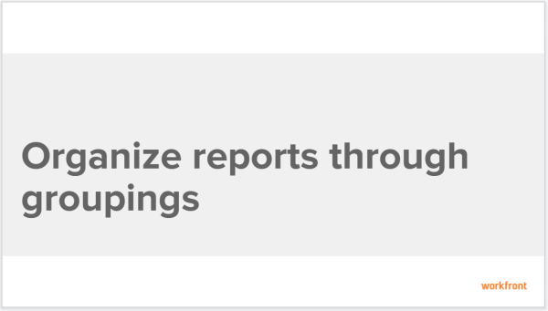

# Create Groupings to organize report information {#create-groupings-to-organize-report-information}

The results of a report or a list can be organized with a Grouping. Groupings categorize information based on a particular piece of information.

You can create a custom Grouping from scratch or customize an existing Grouping. Follow the steps below to create a Grouping from scratch.

## Walk-through {#walk-through}

View the following video to learn how to create groupings to organize the information in your reports.

The following video was recorded in `Workfront Classic`. However, the content also applies to `the new Workfront experience`.

 

## How-to steps {#how-to-steps}

1. Go to the report or the list where you want to create your custom grouping.
1. Click the **Grouping** drop-down menu.  

1. Click **New Grouping.**  
   The interface builder for creating the grouping launches.

1. In the **Grouping Preview** section, click **Add Grouping** to define how you want information in the report to be organized. A preview of what the grouping looks like in the report is shown below. 

1. Begin typing the name of the field that represents the way that you want to organize information in the report, then click it when it appears in the drop-down list.
1.  (Optional and conditional) When building a grouping in an updated list, select **Collapse this grouping by default** if you want the results in the grouping to display collapsed rather than expanded.&nbsp;This setting is disabled by default and the results of the grouping always display in the expanded list.

   For information about updated and legacy lists, see the section "The difference between updated and legacy lists"&nbsp;in the article [View items in a list](view-items-in-a-list.md).

   ` `**Tips: **`` 
    
    
    * When you manually adjust groupings when viewing a list, `Workfront` remembers your manual preference until you log out. When you log back in, the list displays according to this setting.
    *  The results of a grouping always display expanded after accessing them from a chart element or in a legacy list. In these cases, this setting is ignored. 
    
    

1. Repeat Steps `<MadCap:conditionalText data-mc-conditions="QuicksilverOrClassic.Quicksilver"> 4, 5, and 6</MadCap:conditionalText>` to define additional groupings.  
   You can define up to three groupings for organizing information. You can further organize your information with up to four groupings by creating a matrix report. For more information on matrix reports, see [Create a matrix report](create-matrix-report.md).

1. Click **Save Grouping**.

## Additional information {#additional-information}

See also: 

* [Learning Path for reports and dashboards](https://experience.workfront.com/s/reporting) 
* [Create and customize Groupings](create-customize-groupings.md) 
* [Reporting elements: Filters, Views, and Groupings](reporting-elements-filters-views-groupings.md) 
* [Edit existing Groupings to organize report information](edit-existing-groupings-organize-report-information.md) 

