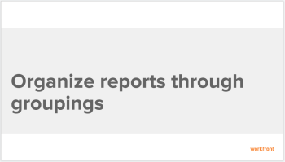
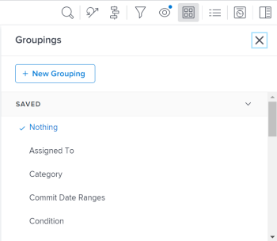
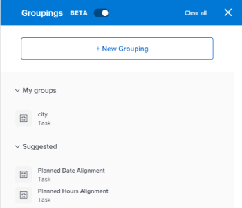
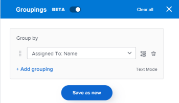
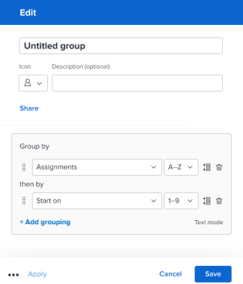

# Create groupings

The results of a report or a list can be organized with a grouping. Groupings categorize information based on a particular piece of information.

You can create a custom grouping from scratch or customize an existing grouping. Follow the steps below to create a grouping from scratch.

## Access requirements

You must have the following access to perform the steps in this article:

<table cellspacing="0"> 
 <col> 
 <col> 
 <tbody> 
  <tr> 
   <td role="rowheader"><em>Adobe Workfront</em> plan*</td> 
   <td> 
Any
 </td> 
  </tr> 
  <tr> 
   <td role="rowheader"><em>Adobe Workfront</em> license*</td> 
   <td> 
<em>Plan</em> 
 </td> 
  </tr> 
  <tr> 
   <td role="rowheader">Access level configurations*</td> 
   <td> 
Edit access to Filters, Views, Groupings
 
Edit access to&nbsp;Reports,&nbsp;Dashboards,&nbsp;Calendars to create a grouping in a report
 
Note: If you still don't have access, ask your <em>Workfront administrator</em> if they set additional restrictions in your access level. For information on how a <em>Workfront administrator</em> can modify your access level, see <a href="../../../administration-and-setup/add-users/configure-and-grant-access/create-modify-access-levels.md" class="MCXref xref">Create or modify custom access levels</a>.
 </td> 
  </tr> 
  <tr> 
   <td role="rowheader">Object permissions</td> 
   <td> 
Manage permissions to a report to edit a grouping in a report
 
For information on requesting additional access, see <a href="../../../workfront-basics/grant-and-request-access-to-objects/request-access.md" class="MCXref xref">Request access to objects in Adobe Workfront</a>.
 </td> 
  </tr> 
 </tbody> 
</table>

&#42;To find out what plan, license type, or access you have, contact your *Workfront administrator*.

## Walk-through

View the following video to learn how to create groupings to organize the information in your reports.

<!--

This video was recorded in <em>Adobe Workfront</em> Classic. However, the content also applies to the new Workfront experience.

-->

This video was recorded in *Adobe Workfront* Classic. However, the content also applies to the new Workfront experience.

## How-to steps

<ol> 
 <li value="1">Go to the report or the list where you want to create your custom grouping.</li> 
 <li value="2">Click the Grouping<draft-comment>
   <MadCap:conditionalText data-mc-conditions="QuicksilverOrClassic.Quicksilver">
     icon
   </MadCap:conditionalText>
  </draft-comment><MadCap:conditionalText data-mc-conditions="QuicksilverOrClassic.Quicksilver">
    icon
  </MadCap:conditionalText>.   <draft-comment>
   
  </draft-comment></li> 
 <li value="3">Click New Grouping. The interface builder for creating the grouping launches.</li> 
 <li value="4">In the Grouping Preview section, click Add Grouping to define how you want information in the report to be organized. A preview of what the grouping looks like in the report is shown below.</li> 
 <li value="5">Begin typing the name of the field that represents the way that you want to organize information in the report, then click it when it appears in the drop-down list.</li> 
 <li value="6"> <draft-comment>
   
(Optional and conditional) When building a grouping in an updated list, select Collapse this grouping by default if you want the results in the grouping to display collapsed rather than expanded.&nbsp;This setting is disabled by default and the results of the grouping always display in the expanded list.

  </draft-comment>
(Optional and conditional) When building a grouping in an updated list, select Collapse this grouping by default if you want the results in the grouping to display collapsed rather than expanded.&nbsp;This setting is disabled by default and the results of the grouping always display in the expanded list.
 <draft-comment>
   
 For information about updated and legacy lists, see the section <a href="../../../workfront-basics/navigate-workfront/use-lists/view-items-in-a-list.md#updated" class="MCXref xref">The difference between the updated and the legacy lists</a>&nbsp;in the article <a href="../../../workfront-basics/navigate-workfront/use-lists/view-items-in-a-list.md" class="MCXref xref">Get started with lists in&nbsp;Adobe Workfront</a>.

  </draft-comment>
 For information about updated and legacy lists, see the section <a href="../../../workfront-basics/navigate-workfront/use-lists/view-items-in-a-list.md#updated" class="MCXref xref">The difference between the updated and the legacy lists</a>&nbsp;in the article <a href="../../../workfront-basics/navigate-workfront/use-lists/view-items-in-a-list.md" class="MCXref xref">Get started with lists in&nbsp;Adobe Workfront</a>.
 <draft-comment>
   
Tips: </b>" data-mc-conditions="QuicksilverOrClassic.Quicksilver">
    <b>Tips: </b> 
    <ul> 
     <li>When you manually adjust groupings when viewing a list, <em>Workfront</em> remembers your manual preference until you log out. When you log back in, the list displays according to this setting.</li> 
     <li> 
The results of a grouping always display expanded after accessing them from a chart element or in a legacy list. In these cases, this setting is ignored.
 </li> 
    </ul> 
   

  </draft-comment>
  
Tips: </b>" data-mc-conditions="QuicksilverOrClassic.Quicksilver">
   <b>Tips: </b> 
   <ul> 
    <li>When you manually adjust groupings when viewing a list, <em>Workfront</em> remembers your manual preference until you log out. When you log back in, the list displays according to this setting.</li> 
    <li> 
The results of a grouping always display expanded after accessing them from a chart element or in a legacy list. In these cases, this setting is ignored.
 </li> 
   </ul> 
  
 </li> 
 <li value="7">Repeat Steps <draft-comment>
   <MadCap:conditionalText data-mc-conditions="QuicksilverOrClassic.Quicksilver">
    4, 5, and 6
   </MadCap:conditionalText>
  </draft-comment><MadCap:conditionalText data-mc-conditions="QuicksilverOrClassic.Quicksilver">
   4, 5, and 6
  </MadCap:conditionalText> to define additional groupings. You can define up to three groupings for organizing information. You can further organize your information with up to four groupings by creating a matrix report. For more information on matrix reports, see <a href="../../../reports-and-dashboards/reports/creating-and-managing-reports/create-matrix-report.md" class="MCXref xref">Create a matrix report</a>.</li> 
 <li value="8">Click Save Grouping.</li> 
</ol>

## Additional information

See also:

  <!--
  <li data-mc-conditions="QuicksilverOrClassic.Quicksilver"> 
<a href="https://one.workfront.com/s/basic-report-creation-program">Basic Report Creation Program for the new Workfront experience</a> 
 </li>
  -->

* [Basic Report Creation Program for the new Workfront experience](https://one.workfront.com/s/basic-report-creation-program) 
* [Groupings overview in Adobe Workfront](../../../reports-and-dashboards/reports/reporting-elements/groupings-overview.md) 
* [Reporting elements: filters, views, and groupings](../../../reports-and-dashboards/reports/reporting-elements/reporting-elements-filters-views-groupings.md) 
* [Edit existing groupings](../../../reports-and-dashboards/reports/reporting-elements/edit-existing-groupings.md)

<!--

<h1>Create or edit groupings in <em>Adobe Workfront</em></h1>

The highlighted information on this page refers to functionality not yet generally available. It is available only in the Preview Sandbox environment.

You can organize the results of a report or list with a grouping. Groupings categorize data based on a particular piece of information. For more information on groupings, see <a href="../../../reports-and-dashboards/reports/reporting-elements/groupings-overview.md" class="MCXref xref">Groupings overview in Adobe Workfront</a>.

You can create groupings in lists and reports in the following ways:

<ul>
<li> 
From scratch
 </li>
<li> 
Edit an existing grouping that you originally created or that was shared with you
 </li>
<li> 
Copy an existing grouping
 
To copy an existing grouping, you can edit it and save it as a new grouping.
 </li>
</ul>
<h2>Types of grouping-building interfaces</h2>

You can create groupings using the types of grouping builders described in the table below.

<table cellspacing="15">
<col>
</col>
<col>
</col>
<col>
</col>
<tbody>
<tr>
<td>Builder type </td>
<td>Grouping object </td>
<td>Where available </td>
</tr>
<tr>
<td>Standard builder </td>
<td>All objects</td>
<td>Reports and lists</td>
</tr> <draft-comment>
<tr data-mc-conditions="QuicksilverOrClassic.Quicksilver">
<td rowspan="2">

<em>Beta builder</em> 

 </td>
<td>

Projects

Tasks

Issues

 </td>
<td>

Lists

 </td>
</tr>
</draft-comment>
<tr data-mc-conditions="QuicksilverOrClassic.Quicksilver">
<td rowspan="2">

<em>Beta builder</em> 

 </td>
<td>

Projects

Tasks

Issues

 </td>
<td>

Lists

 </td>
</tr> <draft-comment>
<tr data-mc-conditions="QuicksilverOrClassic.Quicksilver">
<td colspan="2"> <note type="note">
<em>Beta builder</em>s for groupings are not available in reports.<![CDATA[                        ]]>
</note> </td>
</tr>
</draft-comment>
<tr data-mc-conditions="QuicksilverOrClassic.Quicksilver">
<td colspan="2"> <note type="note">
<em>Beta builder</em>s for groupings are not available in reports.<![CDATA[                        ]]>
</note> </td>
</tr>
</tbody>
</table> <draft-comment>

Consider the following when creating groupings using the different builders:

</draft-comment>

Consider the following when creating groupings using the different builders:

 <draft-comment>
<ul data-mc-conditions="QuicksilverOrClassic.Quicksilver">
<li>

You can switch back and forth between the standard builder and the <em>beta builder</em>, where the beta option is available.

 </li>
<li>

After you have enabled the <em>beta builder</em> in one area, it is the default experience for all areas where it is available.

 
Example: </b>"><b>Example: </b>If you enable the <em>beta builder</em> in a project list, it is the default experience for building task and issue groupings in lists as well. 
 </li>
<li> 
Groupings are available in both builders, regardless of which experience you used to originally build them. 
 
Example: </b>"><b>Example: </b>If you created a grouping using the standard builder, you can find and modify it in the <em>beta builder</em> interface as well. 
 </li>
</ul>
</draft-comment>
<ul data-mc-conditions="QuicksilverOrClassic.Quicksilver">
<li>

You can switch back and forth between the standard builder and the <em>beta builder</em>, where the beta option is available.

 </li>
<li>

After you have enabled the <em>beta builder</em> in one area, it is the default experience for all areas where it is available.

 
Example: </b>"><b>Example: </b>If you enable the <em>beta builder</em> in a project list, it is the default experience for building task and issue groupings in lists as well. 
 </li>
<li> 
Groupings are available in both builders, regardless of which experience you used to originally build them. 
 
Example: </b>"><b>Example: </b>If you created a grouping using the standard builder, you can find and modify it in the <em>beta builder</em> interface as well. 
 </li>
</ul>
<h2>Access requirements</h2>

You must have the following access to perform the steps in this article:

<table cellspacing="0">
<col>
</col>
<col>
</col>
<tbody>
<tr>
<td role="rowheader"><em>Adobe Workfront</em> plan*</td>
<td> 
Any
 </td>
</tr>
<tr>
<td role="rowheader"><em>Adobe Workfront</em> license*</td>
<td> 
<em>Request</em> or higher
 </td>
</tr>
<tr>
<td role="rowheader">Access level configurations*</td>
<td> 
Edit access to&nbsp;filters, views, and groupings
 <note type="note">
If you still don't have access, ask your
<em>Workfront administrator</em> if they set additional restrictions in your access level. For information on how a
<em>Workfront administrator</em> can modify your access level, see
<a href="../../../administration-and-setup/add-users/configure-and-grant-access/create-modify-access-levels.md" class="MCXref xref">Create or modify custom access levels</a>.
</note> </td>
</tr>
<tr>
<td role="rowheader">Object permissions</td>
<td> 
Manage access to a grouping to be able to modify or copy it
 
For information on requesting additional access, see <a href="../../../workfront-basics/grant-and-request-access-to-objects/request-access.md" class="MCXref xref">Request access to objects in Adobe Workfront</a>.
 </td>
</tr>
</tbody>
</table>

*To find out what plan, license type, or access you have, contact your <em>Workfront administrator</em>.

<h2>Create a grouping in the standard builder</h2>

Regardless of the method you use to create groupings, creating a grouping from scratch or from an existing grouping is similar.

<ol>
<li value="1"> 
Go to a list or a report where you want to create a grouping or that contains the grouping that you want to customize.
 </li>
<li value="2"> 
Click the Grouping<draft-comment>
<MadCap:conditionalText data-mc-conditions="QuicksilverOrClassic.Quicksilver">
icon
</MadCap:conditionalText>
</draft-comment><MadCap:conditionalText data-mc-conditions="QuicksilverOrClassic.Quicksilver">
icon
</MadCap:conditionalText>.
 
 <draft-comment>

</draft-comment> 
 </li>
<li value="3"> <draft-comment>

Click New Grouping at the top of the list of groupings.

Or

Hover over the grouping you want to modify and click the Edit icon .

</draft-comment>

Click New Grouping at the top of the list of groupings.

Or

Hover over the grouping you want to modify and click the Edit icon .

 
The builder for customizing the grouping opens.
 </li>
<li value="4"> 
In the Grouping Preview section, click Add Grouping to define how you want information in the report to be organized. A preview of what the grouping looks like in the report is shown below.
 </li>
<li value="5"> 
Begin typing the name of the field that represents the way that you want to organize information in the report, then click it when it appears in the drop-down list.
 </li>
<li value="6"> <draft-comment>

(Optional and conditional) When customizing a grouping in an updated list, select Collapse this grouping by default if you want the results in the grouping to display collapsed rather than expanded.&nbsp;This setting is disabled by default and the results of the grouping always display in the expanded list.

</draft-comment>
(Optional and conditional) When customizing a grouping in an updated list, select Collapse this grouping by default if you want the results in the grouping to display collapsed rather than expanded.&nbsp;This setting is disabled by default and the results of the grouping always display in the expanded list.
 <draft-comment>

 For information about updated and legacy lists, see the section <a href="../../../workfront-basics/navigate-workfront/use-lists/view-items-in-a-list.md#updated" class="MCXref xref">The difference between the updated and the legacy lists</a>&nbsp;in the article <a href="../../../workfront-basics/navigate-workfront/use-lists/view-items-in-a-list.md" class="MCXref xref">Get started with lists in&nbsp;Adobe Workfront</a>.

</draft-comment>
 For information about updated and legacy lists, see the section <a href="../../../workfront-basics/navigate-workfront/use-lists/view-items-in-a-list.md#updated" class="MCXref xref">The difference between the updated and the legacy lists</a>&nbsp;in the article <a href="../../../workfront-basics/navigate-workfront/use-lists/view-items-in-a-list.md" class="MCXref xref">Get started with lists in&nbsp;Adobe Workfront</a>.
 <draft-comment>

Tips: </b>" data-mc-conditions="QuicksilverOrClassic.Quicksilver">
<b>Tips: </b>
<ul>
<li>When you manually adjust groupings when viewing a list, <em>Workfront</em> remembers your manual preference until you log out. When you log back in, the list displays according to this setting.</li>
<li> 
The results of a grouping always display expanded after accessing them from a chart element or in a legacy list. In these cases, this setting is ignored.
 </li>
</ul>

</draft-comment>

Tips: </b>" data-mc-conditions="QuicksilverOrClassic.Quicksilver">
<b>Tips: </b>
<ul>
<li>When you manually adjust groupings when viewing a list, <em>Workfront</em> remembers your manual preference until you log out. When you log back in, the list displays according to this setting.</li>
<li> 
The results of a grouping always display expanded after accessing them from a chart element or in a legacy list. In these cases, this setting is ignored.
 </li>
</ul>

 </li>
<li value="7"> 
Repeat Steps <draft-comment>
<MadCap:conditionalText data-mc-conditions="QuicksilverOrClassic.Quicksilver">
4, 5, and 6
</MadCap:conditionalText>
</draft-comment><MadCap:conditionalText data-mc-conditions="QuicksilverOrClassic.Quicksilver">
4, 5, and 6
</MadCap:conditionalText> to define additional groupings.
 
You can define up to three groupings for organizing information. You can further organize your information with up to four groupings by creating a matrix report. For more information on matrix reports, see <a href="../../../reports-and-dashboards/reports/creating-and-managing-reports/create-matrix-report.md" class="MCXref xref">Create a matrix report</a>.
 </li>
<li value="8"> 
(Optional) Click Switch to Text Mode to add a grouping using the Text Mode interface.
 
For more information about creating a grouping using the text mode interface, see <a href="../../../reports-and-dashboards/reports/text-mode/edit-text-mode-in-grouping.md" class="MCXref xref">Edit text mode in a grouping</a>.
 </li>
<li value="9"> 
Click Save Grouping to create a new grouping.
 <draft-comment>

Or

</draft-comment>
Or
 <draft-comment>

Click Save as New Grouping to create a new grouping from the selected one.

</draft-comment>
Click Save as New Grouping to create a new grouping from the selected one.
 
The new grouping displays in the list of groupings.
 </li>
<li value="10"> 
(Optional) Remove groupings you no longer want to display in the list.
 
For information, see <a href="../../../reports-and-dashboards/reports/reporting-elements/remove-filters-views-groupings.md" class="MCXref xref">Remove filters, views, and groupings</a>.
 </li>
</ol> <draft-comment>

<h2>Create a grouping in the <em>beta builder</em></h2>
<h3>Enable the <em>beta builder</em></h3>

The <em>beta builder</em> toggle is disabled by default. You must enable it to use the <em>beta builder</em>.

<ol>
<li value="1">Go to a project, task, or issue list.</li>
<li value="2"> 
Click the Grouping icon , then enable the <em>beta builder</em> toggle.
 
The <em>beta builder</em> interface opens.
 <note type="tip">
The header of the grouping builder interface is blue when the
<em>beta builder</em> is enabled. This enables the
<em>beta builder</em> for all areas of
<em>Workfront</em> where it is available.
</note> 
  
 </li>
<li value="3"> 
Continue with <a href="#create" class="MCXref xref">Create a grouping in the beta builder</a>, below.
 </li>
</ol>
<h3>Create a grouping in the <em>beta builder</em></h3>
<ol>
<li value="1"> 
Go to a project, task, or issue list where you want to create a grouping, and click the Grouping icon .
 </li>
<li value="2"> 
Click New Grouping to create a new grouping.
 
Or
 
Hover over an existing grouping in the My groupings area, then click the Edit icon  to edit an existing grouping.
 
Or
 
Hover over an existing grouping in the My groupings area, select the More icon , and select Duplicate to copy a grouping.
 </li>
<li value="3"> 
Start typing the name of a field in the Group by area, then select it when it displays in the list.
 
You can also select Search all fields to view a list of all fields to group by. The fields in the advanced search are grouped by object category.
 <note type="tip">
As you build the grouping, the results appear immediately in the list.
</note> </li>
<li value="4"> 
(Optional) Click Add grouping to add a second or third grouping.
 
  
 </li>
<li value="5"> 
(Optional) To reorder the groupings, select a grouping and drag it to the new position.
 
Or
 
Select a grouping and use the keyboard arrow keys to change the order.
 </li>
<li value="6"> 
(Optional) Make other selections for the groupings as needed:

<ul>
<li> 
When grouping by date you must choose a date option such as week, month, or quarter.
 </li>
<li> 
Select  to set a grouping to be expanded by default.
 </li>
<li> 
Select  to delete a grouping.
 </li>
</ul> 
  
 </li>
<li value="7"> 
(Optional) Select Text Mode to continue building the grouping using the Text Mode interface.
 
For more information about creating a grouping using the text mode interface, see <a href="../../../reports-and-dashboards/reports/text-mode/edit-text-mode-in-grouping.md" class="MCXref xref">Edit text mode in a grouping</a>.
 </li>
<li value="8"> 
(Optional) To use the grouping as an ad hoc grouping without saving it:

<ul>
<li> 
When working in a new grouping, close the <em>beta builder</em>.
 </li>
<li> 
When editing an existing grouping, select Apply.
 </li>
</ul> </li>
<li value="9"> 
Select Save as new for a new grouping, or Save for an existing grouping.
 </li>
<li value="10"> 
Type a name for the grouping.
 </li>
<li value="11"> 
(Optional) Select an icon for the grouping to represent the field type.
 </li>
<li value="12"> 
(Optional) Type a description of the grouping.
 </li>
<li value="13"> 
Select Save.
 
The grouping is saved in the My groupings list.
 </li>
</ol>

</draft-comment>

<h2>Create a grouping in the <em>beta builder</em></h2>
<h3>Enable the <em>beta builder</em></h3>

The <em>beta builder</em> toggle is disabled by default. You must enable it to use the <em>beta builder</em>.

<ol>
<li value="1">Go to a project, task, or issue list.</li>
<li value="2"> 
Click the Grouping icon , then enable the <em>beta builder</em> toggle.
 
The <em>beta builder</em> interface opens.
 <note type="tip">
The header of the grouping builder interface is blue when the
<em>beta builder</em> is enabled. This enables the
<em>beta builder</em> for all areas of
<em>Workfront</em> where it is available.
</note> 
  
 </li>
<li value="3"> 
Continue with <a href="#create" class="MCXref xref">Create a grouping in the beta builder</a>, below.
 </li>
</ol>
<h3>Create a grouping in the <em>beta builder</em></h3>
<ol>
<li value="1"> 
Go to a project, task, or issue list where you want to create a grouping, and click the Grouping icon .
 </li>
<li value="2"> 
Click New Grouping to create a new grouping.
 
Or
 
Hover over an existing grouping in the My groupings area, then click the Edit icon  to edit an existing grouping.
 
Or
 
Hover over an existing grouping in the My groupings area, select the More icon , and select Duplicate to copy a grouping.
 </li>
<li value="3"> 
Start typing the name of a field in the Group by area, then select it when it displays in the list.
 
You can also select Search all fields to view a list of all fields to group by. The fields in the advanced search are grouped by object category.
 <note type="tip">
As you build the grouping, the results appear immediately in the list.
</note> </li>
<li value="4"> 
(Optional) Click Add grouping to add a second or third grouping.
 
  
 </li>
<li value="5"> 
(Optional) To reorder the groupings, select a grouping and drag it to the new position.
 
Or
 
Select a grouping and use the keyboard arrow keys to change the order.
 </li>
<li value="6"> 
(Optional) Make other selections for the groupings as needed:

<ul>
<li> 
When grouping by date you must choose a date option such as week, month, or quarter.
 </li>
<li> 
Select  to set a grouping to be expanded by default.
 </li>
<li> 
Select  to delete a grouping.
 </li>
</ul> 
  
 </li>
<li value="7"> 
(Optional) Select Text Mode to continue building the grouping using the Text Mode interface.
 
For more information about creating a grouping using the text mode interface, see <a href="../../../reports-and-dashboards/reports/text-mode/edit-text-mode-in-grouping.md" class="MCXref xref">Edit text mode in a grouping</a>.
 </li>
<li value="8"> 
(Optional) To use the grouping as an ad hoc grouping without saving it:

<ul>
<li> 
When working in a new grouping, close the <em>beta builder</em>.
 </li>
<li> 
When editing an existing grouping, select Apply.
 </li>
</ul> </li>
<li value="9"> 
Select Save as new for a new grouping, or Save for an existing grouping.
 </li>
<li value="10"> 
Type a name for the grouping.
 </li>
<li value="11"> 
(Optional) Select an icon for the grouping to represent the field type.
 </li>
<li value="12"> 
(Optional) Type a description of the grouping.
 </li>
<li value="13"> 
Select Save.
 
The grouping is saved in the My groupings list.
 </li>
</ol>

-->

# Create or edit groupings in *Adobe Workfront*

The highlighted information on this page refers to functionality not yet generally available. It is available only in the Preview Sandbox environment.

You can organize the results of a report or list with a grouping. Groupings categorize data based on a particular piece of information. For more information on groupings, see [Groupings overview in Adobe Workfront](../../../reports-and-dashboards/reports/reporting-elements/groupings-overview.md).

You can create groupings in lists and reports in the following ways:

* From scratch
* Edit an existing grouping that you originally created or that was shared with you
* Copy an existing grouping

  To copy an existing grouping, you can edit it and save it as a new grouping.

## Types of grouping-building interfaces

You can create groupings using the types of grouping builders described in the table below.

<table cellspacing="15"> 
 <col> 
 </col> 
 <col> 
 </col> 
 <col> 
 </col> 
 <tbody> 
  <tr> 
   <td>Builder type </td> 
   <td>Grouping object </td> 
   <td>Where available </td> 
  </tr> 
  <tr> 
   <td>Standard builder </td> 
   <td>All objects</td> 
   <td>Reports and lists</td> 
  </tr> 
  <tr data-mc-conditions="QuicksilverOrClassic.Quicksilver"> 
   <td rowspan="2"> 
    
 
     
<em>Beta builder</em> 
 
    
 </td> 
   <td> 
    
 
     
Projects
 
     
Tasks
 
     
Issues
 
    
 </td> 
   <td> 
    
 
     
Lists
 
    
 </td> 
  </tr> 
  <tr data-mc-conditions="QuicksilverOrClassic.Quicksilver"> 
   <td colspan="2"> 
Note: <em>Beta builder</em>s for groupings are not available in reports.<![CDATA[                        ]]>
 </td> 
  </tr> 
 </tbody> 
</table>

Consider the following when creating groupings using the different builders:

* 
  You can switch back and forth between the standard builder and the *beta builder*, where the beta option is available. 
* 
  After you have enabled the *beta builder* in one area, it is the default experience for all areas where it is available. ` `**Example: **`` `If you enable the *beta builder* in a project list, it is the default experience for building task and issue groupings in lists as well.` 

* `Groupings are available in both builders, regardless of which experience you used to originally build them.`

  ` `**Example: **`` `If you created a grouping using the standard builder, you can find and modify it in the *beta builder* interface as well.`

## Access requirements

You must have the following access to perform the steps in this article:

<table cellspacing="0"> 
 <col> 
 </col> 
 <col> 
 </col> 
 <tbody> 
  <tr> 
   <td role="rowheader"><em>Adobe Workfront</em> plan*</td> 
   <td> 
Any
 </td> 
  </tr> 
  <tr> 
   <td role="rowheader"><em>Adobe Workfront</em> license*</td> 
   <td> 
<em>Request</em> or higher
 </td> 
  </tr> 
  <tr> 
   <td role="rowheader">Access level configurations*</td> 
   <td> 
Edit access to&nbsp;filters, views, and groupings
 
Note: If you still don't have access, ask your <em>Workfront administrator</em> if they set additional restrictions in your access level. For information on how a <em>Workfront administrator</em> can modify your access level, see <a href="../../../administration-and-setup/add-users/configure-and-grant-access/create-modify-access-levels.md" class="MCXref xref">Create or modify custom access levels</a>.
 </td> 
  </tr> 
  <tr> 
   <td role="rowheader">Object permissions</td> 
   <td> 
Manage access to a grouping to be able to modify or copy it
 
For information on requesting additional access, see <a href="../../../workfront-basics/grant-and-request-access-to-objects/request-access.md" class="MCXref xref">Request access to objects in Adobe Workfront</a>.
 </td> 
  </tr> 
 </tbody> 
</table>

&#42;To find out what plan, license type, or access you have, contact your *Workfront administrator*.

## Create a grouping in the standard builder

Regardless of the method you use to create groupings, creating a grouping from scratch or from an existing grouping is similar.

<ol> 
 <li value="1"> 
Go to a list or a report where you want to create a grouping or that contains the grouping that you want to customize.
 </li> 
 <li value="2"> 
Click the Grouping<MadCap:conditionalText data-mc-conditions="QuicksilverOrClassic.Quicksilver">
     icon
   </MadCap:conditionalText>.
 
  
 </li> 
 <li value="3"> 
  
 
   
Click New Grouping at the top of the list of groupings.
 
   
Or
 
   
Hover over the grouping you want to modify and click the Edit icon .
 
  
 
The builder for customizing the grouping opens.
 </li> 
 <li value="4"> 
In the Grouping Preview section, click Add Grouping to define how you want information in the report to be organized. A preview of what the grouping looks like in the report is shown below.
 </li> 
 <li value="5"> 
Begin typing the name of the field that represents the way that you want to organize information in the report, then click it when it appears in the drop-down list.
 </li> 
 <li value="6"> 
(Optional and conditional) When customizing a grouping in an updated list, select Collapse this grouping by default if you want the results in the grouping to display collapsed rather than expanded.&nbsp;This setting is disabled by default and the results of the grouping always display in the expanded list.
 
 For information about updated and legacy lists, see the section <a href="../../../workfront-basics/navigate-workfront/use-lists/view-items-in-a-list.md#updated" class="MCXref xref">The difference between the updated and the legacy lists</a>&nbsp;in the article <a href="../../../workfront-basics/navigate-workfront/use-lists/view-items-in-a-list.md" class="MCXref xref">Get started with lists in&nbsp;Adobe Workfront</a>.
 
  
Tips: </b>" data-mc-conditions="QuicksilverOrClassic.Quicksilver">
   <b>Tips: </b> 
   <ul> 
    <li>When you manually adjust groupings when viewing a list, <em>Workfront</em> remembers your manual preference until you log out. When you log back in, the list displays according to this setting.</li> 
    <li> 
The results of a grouping always display expanded after accessing them from a chart element or in a legacy list. In these cases, this setting is ignored.
 </li> 
   </ul> 
  
 </li> 
 <li value="7"> 
Repeat Steps <MadCap:conditionalText data-mc-conditions="QuicksilverOrClassic.Quicksilver">
    4, 5, and 6
   </MadCap:conditionalText> to define additional groupings.
 
You can define up to three groupings for organizing information. You can further organize your information with up to four groupings by creating a matrix report. For more information on matrix reports, see <a href="../../../reports-and-dashboards/reports/creating-and-managing-reports/create-matrix-report.md" class="MCXref xref">Create a matrix report</a>.
 </li> 
 <li value="8"> 
(Optional) Click Switch to Text Mode to add a grouping using the Text Mode interface.
 
For more information about creating a grouping using the text mode interface, see <a href="../../../reports-and-dashboards/reports/text-mode/edit-text-mode-in-grouping.md" class="MCXref xref">Edit text mode in a grouping</a>.
 </li> 
 <li value="9"> 
Click Save Grouping to create a new grouping.
 
Or
 
Click Save as New Grouping to create a new grouping from the selected one.
 
The new grouping displays in the list of groupings.
 </li> 
 <li value="10"> 
(Optional) Remove groupings you no longer want to display in the list.
 
For information, see <a href="../../../reports-and-dashboards/reports/reporting-elements/remove-filters-views-groupings.md" class="MCXref xref">Remove filters, views, and groupings</a>.
 </li> 
</ol>

## Create a grouping in the *beta builder*

### Enable the *beta builder*

The *beta builder* toggle is disabled by default. You must enable it to use the *beta builder*.

<ol> 
 <li value="1">Go to a project, task, or issue list.</li> 
 <li value="2"> 
Click the Grouping icon , then enable the <em>beta builder</em> toggle.
 
The <em>beta builder</em> interface opens.
 <note type="tip">
   The header of the grouping builder interface is blue when the 
   <em>beta builder</em> is enabled. This enables the 
   <em>beta builder</em> for all areas of 
   <em>Workfront</em> where it is available.
  </note> 
  
 </li> 
 <li value="3"> 
Continue with <a href="#create" class="MCXref xref">Create a grouping in the beta builder</a>, below.
 </li> 
</ol>

### Create a grouping in the *beta builder*

<ol> 
 <li value="1"> 
Go to a project, task, or issue list where you want to create a grouping, and click the Grouping icon .
 </li> 
 <li value="2"> 
Click New Grouping to create a new grouping.
 
Or
 
Hover over an existing grouping in the My groupings area, then click the Edit icon  to edit an existing grouping.
 
Or
 
Hover over an existing grouping in the My groupings area, select the More icon , and select Duplicate to copy a grouping.
 </li> 
 <li value="3"> 
Start typing the name of a field in the Group by area, then select it when it displays in the list.
 
You can also select Search all fields to view a list of all fields to group by. The fields in the advanced search are grouped by object category.
 <note type="tip">
   As you build the grouping, the results appear immediately in the list.
  </note> </li> 
 <li value="4"> 
(Optional) Click Add grouping to add a second or third grouping.
 
  
 </li> 
 <li value="5"> 
(Optional) To reorder the groupings, select a grouping and drag it to the new position.
 
Or
 
Select a grouping and use the keyboard arrow keys to change the order.
 </li> 
 <li value="6"> 
(Optional) Make other selections for the groupings as needed:
 
  <ul> 
   <li> 
When grouping by date you must choose a date option such as week, month, or quarter.
 </li> 
   <li> 
Select  to set a grouping to be expanded by default.
 </li> 
   <li> 
Select  to delete a grouping.
 </li> 
  </ul> 
  
 </li> 
 <li value="7"> 
(Optional) Select Text Mode to continue building the grouping using the Text Mode interface.
 
For more information about creating a grouping using the text mode interface, see <a href="../../../reports-and-dashboards/reports/text-mode/edit-text-mode-in-grouping.md" class="MCXref xref">Edit text mode in a grouping</a>.
 </li> 
 <li value="8"> 
(Optional) To use the grouping as an ad hoc grouping without saving it:
 
  <ul> 
   <li> 
When working in a new grouping, close the <em>beta builder</em>.
 </li> 
   <li> 
When editing an existing grouping, select Apply.
 </li> 
  </ul> </li> 
 <li value="9"> 
Select Save as new for a new grouping, or Save for an existing grouping.
 </li> 
 <li value="10"> 
Type a name for the grouping.
 </li> 
 <li value="11"> 
(Optional) Select an icon for the grouping to represent the field type.
 </li> 
 <li value="12"> 
(Optional) Type a description of the grouping.
 </li> 
 <li value="13"> 
Select Save.
 
The grouping is saved in the My groupings list.
 </li> 
</ol>

