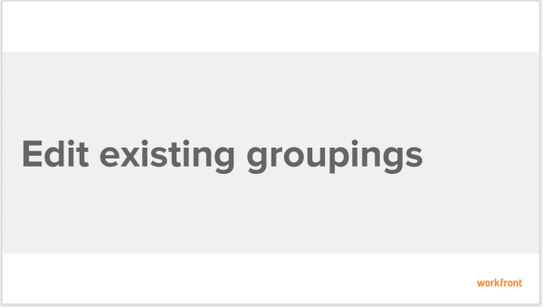

# Edit existing Groupings to organize report information {#edit-existing-groupings-to-organize-report-information}

You can customize an existing Grouping that you originally created or that was shared with you. Then, you can save it as a new Grouping.

## Walk-through {#walk-through}

View the following video to learn how to edit existing Groupings.

The following video was recorded in `Workfront Classic`. However, the content also applies to `the new Workfront experience`.

 

## How-to steps {#how-to-steps}

1. Go to a list of objects that contains the Grouping that you want to customize.
1. Click the **Grouping** drop-down list.
1. Select the Grouping that you want to customize.
1. Click the **Grouping** drop-down menu, then click **Customize Grouping**.  
  
  
   The interface builder for customizing the Grouping is launched.

1. In the **Grouping Preview** section, click **Add Grouping** to define how you want information in the report to be organized. A preview of what the grouping looks like in the report is shown below. 

1. Begin typing the name of the field that represents the way that you want to organize information in the report, then click it when it appears in the drop-down list.
1.  (Optional and conditional) When viewing an updated list, select **Collapse this grouping by default** if you want the results in the grouping to display collapsed rather than expanded.&nbsp;This setting is disabled by default and the results of the grouping always display in the expanded list. 

   For information about updated and legacy lists, see the section "The difference between updated and legacy lists"&nbsp;in the article [View items in a list](view-items-in-a-list.md).

   ` `**Tips: **`` 
    
    
    * When you manually adjust groupings when viewing a list, `Workfront` remembers your manual preference until you log out. When you log back in, the list displays according to this setting.
    *  The results of a grouping always display expanded after accessing them from a chart element or in a legacy list. In these cases, this setting is ignored. 
    
    

1. Repeat Steps `<MadCap:conditionalText data-mc-conditions="QuicksilverOrClassic.Quicksilver"> 5, 6, and 7</MadCap:conditionalText>` to define additional groupings.  
   You can define up to three groupings for organizing information. You can further organize your information with up to four groupings by creating a matrix report. For more information on matrix reports, see [Create a matrix report](create-matrix-report.md).

1. Click **Save Grouping** to replace the current grouping with your changes.

## Additional information {#additional-information}

See also: 

* [Learning Path for reports and dashboards](https://experience.workfront.com/s/reporting) 
* [Reporting elements: Filters, Views, and Groupings](reporting-elements-filters-views-groupings.md) 
* [Create and customize Groupings](create-customize-groupings.md) 
* [Create Groupings to organize report information](create-groupings-organize-report-information.md) 

