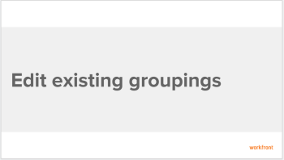
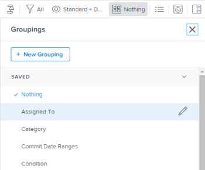

# Edit existing groupings

You can customize an existing grouping that you originally created or that was shared with you. Then, you can save it as a new grouping.

## Access requirements

You must have the following access to perform the steps in this article:

<table cellspacing="0"> 
 <col> 
 <col> 
 <tbody> 
  <tr> 
   <td role="rowheader"><em>Adobe Workfront</em> plan*</td> 
   <td> 
Any
 </td> 
  </tr> 
  <tr> 
   <td role="rowheader"><em>Adobe Workfront</em> license*</td> 
   <td> 
<em>Plan</em> 
 </td> 
  </tr> 
  <tr> 
   <td role="rowheader">Access level configurations*</td> 
   <td> 
Edit access to Filters, Views, Groupings
 
Edit access to&nbsp;Reports,&nbsp;Dashboards,&nbsp;Calendars to edit a grouping in a report
 
Note: If you still don't have access, ask your <em>Workfront administrator</em> if they set additional restrictions in your access level. For information on how a <em>Workfront administrator</em> can modify your access level, see <a href="../../../administration-and-setup/add-users/configure-and-grant-access/create-modify-access-levels.md" class="MCXref xref">Create or modify custom access levels</a>.
 </td> 
  </tr> 
  <tr> 
   <td role="rowheader">Object permissions</td> 
   <td> 
Manage permissions to a report to edit a grouping in a report
 
Manage permissions to a grouping 
 
For information on requesting additional access, see <a href="../../../workfront-basics/grant-and-request-access-to-objects/request-access.md" class="MCXref xref">Request access to objects in Adobe Workfront</a>.
 </td> 
  </tr> 
 </tbody> 
</table>

&#42;To find out what plan, license type, or access you have, contact your *Workfront administrator*.

## Prerequisites

You must create a grouping before you can edit it.

For information on creating a grouping, see [Create groupings](../../../reports-and-dashboards/reports/reporting-elements/create-groupings.md).

## Walk-through

View the following video to learn how to edit existing groupings.

<!--

This video was recorded in <em>Adobe Workfront</em> Classic. However, the content also applies to the new Workfront experience.

-->

This video was recorded in *Adobe Workfront* Classic. However, the content also applies to the new Workfront experience.

## How-to steps

<ol> 
 <li value="1">Go to a list of objects that contains the grouping that you want to customize.</li> 
 <li value="2">Click the Grouping<draft-comment>
   <MadCap:conditionalText data-mc-conditions="QuicksilverOrClassic.Quicksilver">
     icon
   </MadCap:conditionalText>
  </draft-comment><MadCap:conditionalText data-mc-conditions="QuicksilverOrClassic.Quicksilver">
    icon
  </MadCap:conditionalText>.</li> 
 <li value="3"> 
Select the grouping that you want to customize<draft-comment>
    <MadCap:conditionalText data-mc-conditions="QuicksilverOrClassic.Quicksilver">
     , then click the 
     Edit icon
    </MadCap:conditionalText>
   </draft-comment><MadCap:conditionalText data-mc-conditions="QuicksilverOrClassic.Quicksilver">
    , then click the 
    Edit icon
   </MadCap:conditionalText>.
 
 <draft-comment>
    
   </draft-comment> 
 <draft-comment>
   
The interface builder for customizing the grouping opens.

  </draft-comment>
The interface builder for customizing the grouping opens.
 </li> 
 <li value="4">In the Grouping Preview section, click Add Grouping to define how you want information in the report to be organized. A preview of what the grouping looks like in the report is shown below.</li> 
 <li value="5">Begin typing the name of the field that represents the way that you want to organize information in the report, then click it when it appears in the drop-down list.</li> 
 <li value="6"> <draft-comment>
   
(Optional and conditional) When viewing an updated list, select Collapse this grouping by default if you want the results in the grouping to display collapsed rather than expanded.&nbsp;This setting is disabled by default and the results of the grouping always display in the expanded list.

  </draft-comment>
(Optional and conditional) When viewing an updated list, select Collapse this grouping by default if you want the results in the grouping to display collapsed rather than expanded.&nbsp;This setting is disabled by default and the results of the grouping always display in the expanded list.
 <draft-comment>
   
For information about updated and legacy lists, see the section "The difference between updated and legacy lists"&nbsp;in the article <a href="../../../workfront-basics/navigate-workfront/use-lists/view-items-in-a-list.md" class="MCXref xref">Get started with lists in&nbsp;Adobe Workfront</a>.

  </draft-comment>
For information about updated and legacy lists, see the section "The difference between updated and legacy lists"&nbsp;in the article <a href="../../../workfront-basics/navigate-workfront/use-lists/view-items-in-a-list.md" class="MCXref xref">Get started with lists in&nbsp;Adobe Workfront</a>.
 <draft-comment>
   
Tips: </b>" data-mc-conditions="QuicksilverOrClassic.Quicksilver">
    <b>Tips: </b> 
    <ul> 
     <li>When you manually adjust groupings when viewing a list, <em>Workfront</em> remembers your manual preference until you log out. When you log back in, the list displays according to this setting.</li> 
     <li> 
The results of a grouping always display expanded after accessing them from a chart element or in a legacy list. In these cases, this setting is ignored.
 </li> 
    </ul> 
   

  </draft-comment>
  
Tips: </b>" data-mc-conditions="QuicksilverOrClassic.Quicksilver">
   <b>Tips: </b> 
   <ul> 
    <li>When you manually adjust groupings when viewing a list, <em>Workfront</em> remembers your manual preference until you log out. When you log back in, the list displays according to this setting.</li> 
    <li> 
The results of a grouping always display expanded after accessing them from a chart element or in a legacy list. In these cases, this setting is ignored.
 </li> 
   </ul> 
  
 </li> 
 <li value="7">Repeat Steps <draft-comment>
   <MadCap:conditionalText data-mc-conditions="QuicksilverOrClassic.Quicksilver">
    4, 5, and 6
   </MadCap:conditionalText>
  </draft-comment><MadCap:conditionalText data-mc-conditions="QuicksilverOrClassic.Quicksilver">
   4, 5, and 6
  </MadCap:conditionalText> to define additional groupings. You can define up to three groupings for organizing information. You can further organize your information with up to four groupings by creating a matrix report. For more information on matrix reports, see <a href="../../../reports-and-dashboards/reports/creating-and-managing-reports/create-matrix-report.md" class="MCXref xref">Create a matrix report</a>.</li> 
 <li value="8">Click Save<draft-comment>
   <MadCap:conditionalText data-mc-conditions="QuicksilverOrClassic.Quicksilver"> 
    as New
   </MadCap:conditionalText>
  </draft-comment><MadCap:conditionalText data-mc-conditions="QuicksilverOrClassic.Quicksilver"> 
   as New
  </MadCap:conditionalText> Grouping to replace the current grouping with your changes.</li> 
</ol>

## Additional information

See also:

  <!--
  <li data-mc-conditions="QuicksilverOrClassic.Quicksilver"> 
<a href="https://one.workfront.com/s/basic-report-creation-program">Basic Report Creation Program for the new Workfront experience</a> 
 </li>
  -->

* [Basic Report Creation Program for the new Workfront experience](https://one.workfront.com/s/basic-report-creation-program) 
* [Reporting elements: filters, views, and groupings](../../../reports-and-dashboards/reports/reporting-elements/reporting-elements-filters-views-groupings.md) 
* [Groupings overview in Adobe Workfront](../../../reports-and-dashboards/reports/reporting-elements/groupings-overview.md) 
* [Create groupings](../../../reports-and-dashboards/reports/reporting-elements/create-groupings.md)

