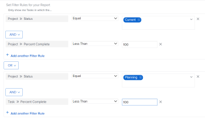
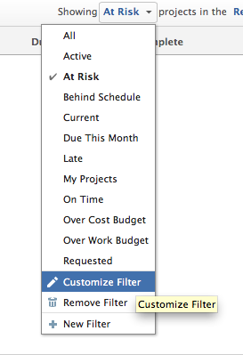
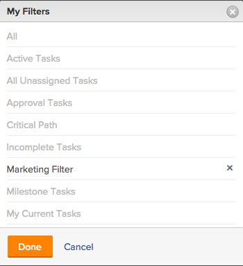

# Filters overview in *Adobe Workfront*

The highlighted information on this page refers to functionality not yet generally available. It is available only in the Preview Sandbox environment.

You can use filters in&nbsp;*Adobe Workfront* to reduce the amount of information you display on the screen in lists, reports, or other areas.&nbsp;

>[!NOTE]
>
>This article describes all areas where you can apply filters in&nbsp;*Workfront*, as well as general information about filters in lists and reports. Refer to the articles linked below to find out information about filters in specific areas other than lists and reports.

## Types of *Workfront* filters

There are several types of filters in *Workfront*. All filters fulfill the same purpose of limiting the amount of information you display on the screen.

The following are types of filters that you can use in&nbsp;*Workfront*:

<table cellspacing="3"> 
 <col> 
 <col> 
 <tbody> 
  <tr> 
   <td>Temporary filters</td> 
   <td> <p>A one-time quick filter based on a keyword search to quickly find an item in a list. </p> </td> 
  </tr> 
  <tr> 
   <td>Permanent filters for lists and reports</td> 
   <td>Built by <em>Workfront</em> or customized by you or other users. You can use them more than one time. If you have the correct access and permissions, you can name, save, and reuse them in several areas. You can also share these filters with other users. They are available in lists or reports of objects. </td> 
  </tr> 
  <tr> 
   <td>Temporary or permanent filters for special areas</td> 
   <td>Built by <em>Workfront</em> or customized by you or other users. You can save permanent filters and use more than one time, or you can apply them temporarily to serve your immediate needs, without saving them. Unsaved filters cannot be shared or deleted. They are available in special areas, as described in the section <a href="#filters" class="MCXref xref">Workfront filters for special areas</a> in this article. </td> 
  </tr> 
 </tbody> 
</table>

## *Workfront* temporary filters

Quick filters allow you to search for an item on the screen by using a keyword. After you refresh the page, the temporary quick filter is cleared. You cannot save temporary filters to reuse.

For information about quick filters, see [Apply the quick filter to a list](../../../workfront-basics/navigate-workfront/use-lists/apply-quick-filter-list.md).

## *Workfront* permanent filters for lists and reports

You can use permanent filters that you, others, or *Workfront* created in lists or reports of objects.

For information about objects in *Workfront* and which ones you can build reports for, see [Understand objects in Adobe Workfront](../../../workfront-basics/navigate-workfront/workfront-navigation/understand-objects.md).

For more information about filters in lists and reports, see the following articles:

* [Create or edit filters in Adobe Workfront](../../../reports-and-dashboards/reports/reporting-elements/create-filters.md) 
* [Remove filters, views, and groupings](../../../reports-and-dashboards/reports/reporting-elements/remove-filters-views-groupings.md) 
* [Share a filter, view, or grouping in Adobe Workfront](../../../reports-and-dashboards/reports/reporting-elements/share-filter-view-grouping.md) 
* 

  <!--
  <p class="preview" data-mc-conditions="QuicksilverOrClassic.Quicksilver,QuicksilverOrClassic.Draft mode"><a href="../../../reports-and-dashboards/reports/reporting-elements/delete-filters.md" class="MCXref xref">Delete filters</a> </p>
  -->

  [Delete filters](../../../reports-and-dashboards/reports/reporting-elements/delete-filters.md)

## *Workfront* filters for special areas

You can use either built-in filters or build custom filters in the following areas of *Workfront*:

<ul> 
 <li> <p>Home <br>For information, see the <a href="../../../workfront-basics/using-home/using-the-home-area/display-items-in-home-work-list.md#filtering-by-item-type" class="MCXref xref">Filter the Work List</a> section in the article <a href="../../../workfront-basics/using-home/using-the-home-area/display-items-in-home-work-list.md" class="MCXref xref">Display items in the Work List in the Home area</a>.</p> </li> 
 <li> <p>Requests area. You cannot customize filters in the Requests area. </p> <p>For information, see <a href="../../../manage-work/requests/create-requests/locate-submitted-requests.md" class="MCXref xref">Locate submitted requests</a>. </p> </li> 
 <li> <p>Timesheets. You can use built-in filtering criteria but you cannot build custom filters to reuse for the Timesheets area. </p> <p>For information, see <a href="../../../timesheets/timesheets/timesheets-overview.md" class="MCXref xref">Timesheets overview</a>. </p> </li> 
 <li>Resource Planner<br>For information, see the article <a href="../../../resource-mgmt/resource-planning/filter-resource-planner.md" class="MCXref xref">Filter information in the Resource Planner</a>.</li> 
 <li> <p>Utilization report</p> <p>For information, see the section <a href="../../../resource-mgmt/resource-utilization/view-utilization-information.md#filtering-utilization-information" class="MCXref xref">Filter utilization information</a> in the article <a href="../../../resource-mgmt/resource-utilization/view-utilization-information.md" class="MCXref xref">View resource utilization information </a>. </p> </li> 
 <li>Resource Scheduling areas<br>For information, see the article <a href="../../../resource-mgmt/resource-scheduling/filter-scheduling-area.md" class="MCXref xref">Filter information in the Scheduling area</a>.</li> 
 <li> <p><em>Workload Balancer</em> </p> <p>For information, see <a href="../../../resource-mgmt/workload-balancer/filter-information-workload-balancer.md" class="MCXref xref">Manage filters in the Workload Balancer</a>.</p> </li> <draft-comment>
  <li data-mc-conditions="QuicksilverOrClassic.Quicksilver"> <p>Analytics area</p> <p>For information, see <a href="../../../enhanced-analytics/use-enhanced-analytics-filters.md" class="MCXref xref">Apply filters in Enhanced analytics</a>. </p> </li>
 </draft-comment>
 <li data-mc-conditions="QuicksilverOrClassic.Quicksilver"> <p>Analytics area</p> <p>For information, see <a href="../../../enhanced-analytics/use-enhanced-analytics-filters.md" class="MCXref xref">Apply filters in Enhanced analytics</a>. </p> </li> <draft-comment>
  <li data-mc-conditions="QuicksilverOrClassic.Quicksilver"> <p>Blueprints area.&nbsp;This area is only available for <em>Workfront administrators</em>.</p> <p>For information, see <a href="../../../administration-and-setup/blueprints/blueprints-install.md" class="MCXref xref">Install a blueprint</a>. </p> </li>
 </draft-comment>
 <li data-mc-conditions="QuicksilverOrClassic.Quicksilver"> <p>Blueprints area.&nbsp;This area is only available for <em>Workfront administrators</em>.</p> <p>For information, see <a href="../../../administration-and-setup/blueprints/blueprints-install.md" class="MCXref xref">Install a blueprint</a>. </p> </li> <draft-comment>
  <li data-mc-conditions="QuicksilverOrClassic.Quicksilver"> <p><em>Scenario Planner</em> </p> <p>This is available only in <em>the new Adobe Workfront experience</em> and requires an additional license. For information about the <em>Workfront Scenario Planner</em>, see <a href="../../../scenario-planner/scenario-planner-overview.md" class="MCXref xref">The Adobe Workfront Scenario Planner overview</a>. </p> <note type="tip">
    You cannot customize filters in the
    <em>Scenario Planner</em>.
   </note> <p>You can use built-in filters for plans, initiatives, or projects and you can customize project filters in the <em>Scenario Planner</em>.</p> <p>For information, see the following articles:</p> 
   <ul> 
    <li> <p><a href="../../../scenario-planner/create-and-edit-plans.md" class="MCXref xref">Create and edit plans in the Adobe Workfront Scenario Planner</a> </p> </li> 
    <li> <p><a href="../../../scenario-planner/publish-scenarios-update-projects.md" class="MCXref xref">Update or create projects by publishing initiatives in the Adobe Workfront Scenario Planner</a> </p> </li> 
    <li> <p><a href="../../../scenario-planner/import-projects-to-plans.md" class="MCXref xref">Import projects to plans in the Adobe Workfront Scenario Planner</a> </p> </li> 
   </ul> </li>
 </draft-comment>
 <li data-mc-conditions="QuicksilverOrClassic.Quicksilver"> <p><em>Scenario Planner</em> </p> <p>This is available only in <em>the new Adobe Workfront experience</em> and requires an additional license. For information about the <em>Workfront Scenario Planner</em>, see <a href="../../../scenario-planner/scenario-planner-overview.md" class="MCXref xref">The Adobe Workfront Scenario Planner overview</a>. </p> <note type="tip">
   You cannot customize filters in the
   <em>Scenario Planner</em>.
  </note> <p>You can use built-in filters for plans, initiatives, or projects and you can customize project filters in the <em>Scenario Planner</em>.</p> <p>For information, see the following articles:</p> 
  <ul> 
   <li> <p><a href="../../../scenario-planner/create-and-edit-plans.md" class="MCXref xref">Create and edit plans in the Adobe Workfront Scenario Planner</a> </p> </li> 
   <li> <p><a href="../../../scenario-planner/publish-scenarios-update-projects.md" class="MCXref xref">Update or create projects by publishing initiatives in the Adobe Workfront Scenario Planner</a> </p> </li> 
   <li> <p><a href="../../../scenario-planner/import-projects-to-plans.md" class="MCXref xref">Import projects to plans in the Adobe Workfront Scenario Planner</a> </p> </li> 
  </ul> </li> <draft-comment>
  <li data-mc-conditions="QuicksilverOrClassic.Quicksilver"> <p>Goals </p> <p>This requires an additional license. For information about <em>Workfront Goals</em>, see <a href="../../../workfront-goals/goal-management/wf-goals-overview.md" class="MCXref xref">Adobe Workfront Goals overview</a>. </p> <p>You can use built-in filtering criteria but you cannot build custom filters to reuse for the Goals area. </p> <p>For information, see <a href="../../../workfront-goals/goal-management/filter-information-wf-goals.md" class="MCXref xref">Filter information in Adobe Workfront Goals</a>. </p> </li>
 </draft-comment>
 <li data-mc-conditions="QuicksilverOrClassic.Quicksilver"> <p>Goals </p> <p>This requires an additional license. For information about <em>Workfront Goals</em>, see <a href="../../../workfront-goals/goal-management/wf-goals-overview.md" class="MCXref xref">Adobe Workfront Goals overview</a>. </p> <p>You can use built-in filtering criteria but you cannot build custom filters to reuse for the Goals area. </p> <p>For information, see <a href="../../../workfront-goals/goal-management/filter-information-wf-goals.md" class="MCXref xref">Filter information in Adobe Workfront Goals</a>. </p> </li> 
</ul>

## Overview of filters in lists and reports

When working with lists and reports, you can filter information on the screen by using the following types of filters:

* built-in filters

* new filters you or others create from scratch
* customized existing filters that others created and shared with you
* copied and edited filters based on existing filters

>[!IMPORTANT]
>
>When creating or editing filters in reports, you must edit the report in order for the new filter to become the default filter for the report. When you edit just the filter, outside the report builder, the default filter of the report is not updated.  
>For information about editing a report, see the article [Create a custom report](../../../reports-and-dashboards/reports/creating-and-managing-reports/create-custom-report.md).

For information about *Workfront* Lists, see the article [Get started with lists in Adobe Workfront](../../../workfront-basics/navigate-workfront/use-lists/view-items-in-a-list.md).  
For information about *Workfront* reports, see the article [Get started with reports in Adobe Workfront](../../../reports-and-dashboards/reports/reporting/get-started-reports-workfront.md).

Consider the following when working with filters in lists or reports:

* You can customize existing filters in lists and reports. All users who have permissions to the filters can also see your changes.

* Your *Workfront administrator* must grant you access to Edit Filters, Views, and Groupings to create permanent filters.

  For information about granting access to Filters, Views, and Groupings, see [Grant access to filters, views, and groupings](../../../administration-and-setup/add-users/configure-and-grant-access/grant-access-fvg.md).

<ul> 
 <li> <p>Your level of permissions to a filter determines how filters are saved. If you created the filter originally, you can save the changes, otherwise you are prompted to save a version of the filter that you are modifying.</p> <note type="tip">
   Keep in mind if you make changes to a filter you have shared with others the changes impact them as well.
  </note> </li> 
 <li>You can customize a filter that was shared with you only if the user who shared it granted you Manage access. For information about sharing a filter, see <a href="../../../reports-and-dashboards/reports/reporting-elements/share-filter-view-grouping.md" class="MCXref xref">Share a filter, view, or grouping in Adobe Workfront</a>.</li> 
</ul>

## Elements of a filter

When you build a filter, you connect multiple elements together that make up filter statements. You can have multiple filter statements that define the criteria for your filter.

<!--

-->


A filter contains the following elements:

<table cellspacing="3"> 
 <col> 
 <col> 
 <tbody> 
  <tr> 
   <td>Object</td> 
   <td> <p>The <em>Workfront</em> database object of the filter. For information about what objects are reportable in <em>Workfront</em>, see <a href="../../../workfront-basics/navigate-workfront/workfront-navigation/understand-objects.md" class="MCXref xref">Understand objects in Adobe Workfront</a>. </p> <p>For example, projects, tasks, issues, users, documents can be the object of a filter. </p> </td> 
  </tr> 
  <tr> 
   <td>Field</td> 
   <td> <p>The attribute of the object that you are filtering by. </p> <p>For example, you can filter by Portfolio Name, or Project Owner. In these case, Name and Owner are fields of the Portfolio and Project objects. </p> </td> 
  </tr> 
  <tr> 
   <td> <p>Value</p> </td> 
   <td>The actual name of the field in <em>Workfront</em>.&nbsp;For example, Complete can be the value of a Project&nbsp;Status field. </td> 
  </tr> 
  <tr> 
   <td>Operator</td> 
   <td>Connects multiple filter statements. For information, see the section <a href="#filter" class="MCXref xref">Filter operators</a> in this article. </td> 
  </tr> 
  <tr> 
   <td>Modifier</td> 
   <td>Indicates what kind of information you want your data to match. For information, see the section <a href="#filter2" class="MCXref xref">Filter modifiers</a> in this article. </td> 
  </tr> 
 </tbody> 
</table>

## Filter operators

*Workfront* has 2 filter operators that connect each filter statement:

<ul> 
 <li> <p><span class="bold">AND</span>: When you join 2 filter statement by the AND&nbsp;operator you indicate that you want both filter statements to be met at the same time.</p> 
  <div> 
   <p>By default, the statements in a filter are joined by the AND&nbsp;operator.</p> 
  </div> </li> 
 <li> <p><span class="bold">OR</span>: When you join 2 filter statements by the OR operator you indicate that you want either statement to be met.</p> 
  <div> <note type="tip">
    When changing your AND statements to OR statements, the number of the items in your report should increase.
   </note> 
  </div> </li> 
</ul>

## Filter modifiers

You can use filter modifiers to indicate what kind of information you want your data to match. 

` `**Example: **`` You can filter for projects that have a Percent Complete of 100%. In this case, you can use the "equal" modifier in the following filter statement:

```
Project: Percent Complete Equal(Case Sensitive) 100
```

For more information about filter modifiers, see [Filter and condition modifiers](../../../reports-and-dashboards/reports/reporting-elements/filter-condition-modifiers.md).

## `Create filters in the builder interface`

You can create a filter using the standard builder interface in the following ways:

* From scratch
* Modify an existing filter
* Copy an existing filter

For information about creating a filter using the standard interface, see [Create or edit filters in Adobe Workfront](../../../reports-and-dashboards/reports/reporting-elements/create-filters.md).

## Create filters using the text mode interface

You can build filters using the text mode interface. We recommend to build most of the filter statements using the standard interface, and to edit the code of the filter only as a final step. Building a filter from scratch using the text mode interface alone is not recommended.&nbsp;

For more information about creating a filter using the text mode interface, see [Edit a filter using text mode](../../../reports-and-dashboards/reports/text-mode/edit-text-mode-in-filter.md).

## `Create filters for complex fields`

* [Create filters for fields whose values contain commas](#filter-for-fields-with-commas) 
* [Create filters for whose values are a multi-select custom field](#filter-for-multi-select)

### `Create filters for fields whose values contain commas`

When building a filter in text mode and filtering for field values that contain commas, you must add a slash ("/") before the commas separating the&nbsp;values, to ensure that the value is read as one filter option. This only applies for the following field types:

* Dropdowns
* Radio Buttons
* Checkboxes

For example, you have a radio button field on a project called "Color" and the options for it are:

* Red
* Blue
* Red, blue

If you want to build a filter that would find only projects where the third option is selected, the filter statement in the text mode interface should be:
<pre>DE:check=red/, blue<br>DE:check_Mod=in</pre>This syntax ensures that the values are read together, as one option. If you omit the&nbsp;slash, *Workfront* reads the comma as an 'OR', in which case only the projects that have either the first or the second option would be selected.&nbsp;

This syntax also applies when building prompts. For more information about using prompts, see [Add a prompt to a report](../../../reports-and-dashboards/reports/creating-and-managing-reports/add-prompt-report.md).

### `Create filters for whose values are a multi-select custom field`

You can report on multi-select custom fields.&nbsp;For example, you can report on fields that are checkboxes.

However, when you want to exclude results that have only one of the options selected, the report will display any objects that have that option and any other option selected.

For example, if you have a field with 3 options (A, B, and C), and select 2 of the 3 options (A and B, but not C) on an object, you can create a report with a filter with a qualifier of Not Equal for options A and B, and it will only filter out projects that have both A and B, but not only A, and not only B selected. If you create a filter with a qualifier for Not Equal for option A, it will only filter out objects with only A selected, but if A and B are selected, those objects still display in the report.

## `Limitations about joining multiple filter rules`

You can reference only five objects, excluding the object of the report, when you build a filter in *Workfront*.&nbsp;

When you reach this limit within the builder, you can select fields that belong only to these six objects. You receive a warning when you have reached this limit.&nbsp;

You cannot overcome this limitation when you build your filter in text mode.&nbsp;

<!--
<div data-mc-conditions="QuicksilverOrClassic.Draft mode">
<h1>Filters overview in <em>Adobe Workfront</em> </h1>
<p>You can use filters in&nbsp;<em>Adobe Workfront</em> to reduce the amount of information you display on the screen.&nbsp;</p> <note type="note">
This article describes all areas where you can apply filters in&nbsp;
<em>Workfront</em>, as well as general information about filters in lists and reports. Refer to the articles linked below to find out information about filters in specific areas other than lists and reports.
</note>
<h2><em>Workfront</em> filters</h2>
<p>There are several types of filters in <em>Workfront</em>. All filters fulfill the same purpose of limiting the amount of information you display on the screen. </p>
<p>The following are types of filters that you can use in&nbsp;<em>Workfront</em>:</p>
<table cellspacing="3">
<col>
<col>
<tbody>
<tr>
<td>Temporary filters</td>
<td> <p>A one-time quick filter based on a keyword search to quickly find an item in a list. </p> </td>
</tr>
<tr>
<td>Permanent filters</td>
<td>Built by <em>Workfront</em> or customized by you or other users that you can use more than one time. If you have the correct access and permissions, you can name, save, and reuse them in several areas. You can also share these filters with other users. </td>
</tr>
</tbody>
</table>
<h2><a name="permanent-filters"></a>Permanent filters</h2>
<p>You can build filters one time and reuse them in several lists and reports. These are permanent filters.</p>
<p>You can create and save permanent filters in the following <em>Workfront</em> areas:</p>
<ul>
<li>Lists</li>
<li>Reports</li>
<li>Resource Planner<br>For information about filtering in the Resource Planner, see the article <a href="../../../resource-mgmt/resource-planning/filter-resource-planner.md" class="MCXref xref">Filter information in the Resource Planner</a>.</li>
<li>Resource Scheduling areas<br>For information about filtering in the scheduling areas, see the article <a href="../../../resource-mgmt/resource-scheduling/filter-scheduling-area.md" class="MCXref xref">Filter information in the Scheduling area</a>.</li>
<li>Home <br>For information about filtering items in the Home area, see the <a href="../../../workfront-basics/using-home/using-the-home-area/display-items-in-home-work-list.md#filtering-by-item-type" class="MCXref xref">Filter the Work List</a> section in the article <a href="../../../workfront-basics/using-home/using-the-home-area/display-items-in-home-work-list.md" class="MCXref xref">Display items in the Work List in the Home area</a>.</li> <draft-comment>
<li data-mc-conditions="QuicksilverOrClassic.Quicksilver"> <p><em>Scenario Planner</em> </p> <p>This is available only in <em>the new Adobe Workfront experience</em> and requires an additional license. For information about the <em>Workfront Scenario Planner</em>, see <a href="../../../scenario-planner/scenario-planner-overview.md" class="MCXref xref">The Adobe Workfront Scenario Planner overview</a>. </p> <note type="tip">
You cannot customize filters in the
<em>Scenario Planner</em>.
</note> <p>You can apply filters to a list of plans, initiatives, or projects in the <em>Scenario Planner</em>. For information, see the following articles:</p>
<ul>
<li> <p><a href="../../../scenario-planner/create-and-edit-plans.md" class="MCXref xref">Create and edit plans in the Adobe Workfront Scenario Planner</a> </p> </li>
<li> <p><a href="../../../scenario-planner/publish-scenarios-update-projects.md" class="MCXref xref">Update or create projects by publishing initiatives in the Adobe Workfront Scenario Planner</a> </p> </li>
<li> <p><a href="../../../scenario-planner/import-projects-to-plans.md" class="MCXref xref">Import projects to plans in the Adobe Workfront Scenario Planner</a> </p> </li>
</ul> </li>
</draft-comment>
<li data-mc-conditions="QuicksilverOrClassic.Quicksilver"> <p><em>Scenario Planner</em> </p> <p>This is available only in <em>the new Adobe Workfront experience</em> and requires an additional license. For information about the <em>Workfront Scenario Planner</em>, see <a href="../../../scenario-planner/scenario-planner-overview.md" class="MCXref xref">The Adobe Workfront Scenario Planner overview</a>. </p> <note type="tip">
You cannot customize filters in the
<em>Scenario Planner</em>.
</note> <p>You can apply filters to a list of plans, initiatives, or projects in the <em>Scenario Planner</em>. For information, see the following articles:</p>
<ul>
<li> <p><a href="../../../scenario-planner/create-and-edit-plans.md" class="MCXref xref">Create and edit plans in the Adobe Workfront Scenario Planner</a> </p> </li>
<li> <p><a href="../../../scenario-planner/publish-scenarios-update-projects.md" class="MCXref xref">Update or create projects by publishing initiatives in the Adobe Workfront Scenario Planner</a> </p> </li>
<li> <p><a href="../../../scenario-planner/import-projects-to-plans.md" class="MCXref xref">Import projects to plans in the Adobe Workfront Scenario Planner</a> </p> </li>
</ul> </li> <draft-comment>
<li data-mc-conditions="QuicksilverOrClassic.Quicksilver"> <p>Goals </p> <p>This requires an additional license. For information about <em>Workfront Goals</em>, see <a href="../../../workfront-goals/goal-management/wf-goals-overview.md" class="MCXref xref">Adobe Workfront Goals overview</a>. </p> <p>For information, see <a href="../../../workfront-goals/goal-management/filter-information-wf-goals.md" class="MCXref xref">Filter information in Adobe Workfront Goals</a>. </p> </li>
</draft-comment>
<li data-mc-conditions="QuicksilverOrClassic.Quicksilver"> <p>Goals </p> <p>This requires an additional license. For information about <em>Workfront Goals</em>, see <a href="../../../workfront-goals/goal-management/wf-goals-overview.md" class="MCXref xref">Adobe Workfront Goals overview</a>. </p> <p>For information, see <a href="../../../workfront-goals/goal-management/filter-information-wf-goals.md" class="MCXref xref">Filter information in Adobe Workfront Goals</a>. </p> </li>
</ul>
<p>For information about removing a permanent filter, see the article <a href="../../../reports-and-dashboards/reports/reporting-elements/remove-filters-views-groupings.md" class="MCXref xref">Remove filters, views, and groupings</a>. </p>
<h2><a name="temporary-filters"></a>Temporary filters</h2>
<p>You can use a one-time quick filter to quickly jump to an item in a list. This is a temporary filter and you cannot save it. </p>
<p>For information about quick filters, see <a href="../../../workfront-basics/navigate-workfront/use-lists/apply-quick-filter-list.md" class="MCXref xref">Apply the quick filter to a list</a>. </p>
<h2><a name="creating-filters-in-lists-reports"></a>Overview of filters in lists and reports</h2>
<p>When working with lists and reports, you can customize existing filters, create filters based on existing filters, or create filters from scratch.<br>For information about <em>Workfront</em> Lists, see the article <a href="../../../workfront-basics/navigate-workfront/use-lists/view-items-in-a-list.md" class="MCXref xref">Get started with lists in&nbsp;Adobe Workfront</a>.<br>For information about <em>Workfront</em> reports, see the article <a href="../../../reports-and-dashboards/reports/reporting/get-started-reports-workfront.md" class="MCXref xref">Get started with reports in Adobe Workfront</a>.</p>
<p>Consider the following when working with filters: </p>
<ul>
<li>You can customize existing filters. All users who can view the filters can also see your changes. </li>
</ul>
<div>
<ul>
<li> <p>Your <em>Workfront administrator</em> must grant you access to Edit Filters, Views, and Groupings to create permanent filters. </p> <p>For information about granting access to Filters, Views, and Groupings, see <a href="../../../administration-and-setup/add-users/configure-and-grant-access/grant-access-fvg.md" class="MCXref xref">Grant access to filters, views, and groupings</a>. </p> </li>
</ul>
</div>
<ul>
<li>Your level of permissions to a filter determines how filters are saved. If you created the filter originally, you can save the changes, otherwise you are prompted to save a version of the filter that you are modifying. Keep in mind if you make changes to a filter you have shared with others the changes impact them as well.</li>
<li>You can customize a filter that was shared with you only if the user who shared it granted you Manage access. For information about sharing a filter, see <a href="../../../reports-and-dashboards/reports/reporting-elements/share-filter-view-grouping.md" class="MCXref xref">Share a filter, view, or grouping in Adobe Workfront</a>.</li>
</ul> <note type="important">
When creating or editing filters in reports, you must edit the report in order for the new filter to become the default filter for the report. When you edit just the filter, outside the report builder, the default filter of the report is not updated.
<br>For information about editing a report, see the article
<a href="../../../reports-and-dashboards/reports/creating-and-managing-reports/create-custom-report.md" class="MCXref xref">Create a custom report</a>.
</note>
<h2><a name="Create"></a> </h2>
<div>
<h2>Filter operators</h2>
<p><em>Workfront</em> has 2 filter operators that connect each filter statement:</p>
<ul>
<li> <p><span class="bold">AND</span>: When you join 2 filter statement by the AND&nbsp;operator you indicate that you want both filter statements to be met at the same time.</p>
<div>
<p>By default, the statements in a filter are joined by the AND&nbsp;operator.</p>
</div> </li>
<li> <p><span class="bold">OR</span>: When you join 2 filter statements by the OR operator you indicate that you want either statement to be met.</p>
<div> <note type="tip">
When changing your AND statements to OR statements, the number of the items in your report should increase.
</note>
</div> </li>
</ul>
</div>
<div>
<h2>Filter modifiers</h2>
<p>You can use filter modifiers to indicate what kind of information you want your data to match. </p>
<div class="example" data-mc-autonum="<b>Example: </b>">
<span class="autonumber"><span><b>Example: </b></span></span>
<p>You can filter for projects that have a Percent Complete of 100%. In this case, you can use the "equal" modifier in the following filter statement: </p>
<p><code>Project: Percent Complete Equal(Case Sensitive) 100</code> </p>
</div>
<p>For more information about filter modifiers, see <a href="../../../reports-and-dashboards/reports/reporting-elements/filter-condition-modifiers.md" class="MCXref xref">Filter and condition modifiers</a>. </p>
</div>
<h2>Create or edit filters in the builder interface</h2>
<p>You can create a filter using the standard builder interface in the following ways:</p>
<ul>
<li>From scratch</li>
<li>Modifying an existing filter</li>
<li>Copying an existing filter</li>
</ul>
<p>For information about creating or editing a filter using the standard interface, see the article <a href="../../../reports-and-dashboards/reports/reporting-elements/create-filters.md" class="MCXref xref">Create or edit filters in Adobe Workfront</a>.</p> <draft-comment>
<div data-mc-conditions="QuicksilverOrClassic.Draft mode">
<h3><a name="Customizing_an_Existing_Filter"></a><span class="bold">Customize an existing filter</span> </h3>
<ol>
<li value="1">Go to the report or list that contains the Filter that you want to customize. </li>
<li value="2">Click the <span class="bold">Filter</span> drop-down list.<br></li>
<li value="3">Select the <span class="bold">Filter</span> that you want to customize, then click <span class="bold">Customize Filter</span>.</li>
<li value="4">The interface builder for customizing the Filter is launched.</li>
<li value="5">Do any of the following:<br>
<ul>
<li>Modify existing filter rules by clicking the existing rule and selecting a new option.</li>
<li>Add a filter rule by clicking <span class="bold">Add another Filter Rule</span>, begin typing the name of the option for which you want to add a rule, then click it when it appears in the drop-down list.<br>Click <span class="bold">AND</span> or <span class="bold">OR</span> when adding a new filter rule.<br>When adding filter rules, use the filter modifiers to establish the condition of your filter. For more information about filter modifiers, see the article <a href="../../../reports-and-dashboards/reports/reporting-elements/filter-condition-modifiers.md" class="MCXref xref">Filter and condition modifiers</a>.</li>
<li>Delete an existing filter rule by clicking the 'X' icon.</li>
</ul></li>
<li value="6">Click <span class="bold">Save Filter</span> to replace the current Filter with your changes.</li>
</ol>
</div>
</draft-comment>
<div data-mc-conditions="QuicksilverOrClassic.Draft mode">
<h3><a name="Customizing_an_Existing_Filter"></a><span class="bold">Customize an existing filter</span> </h3>
<ol>
<li value="1">Go to the report or list that contains the Filter that you want to customize. </li>
<li value="2">Click the <span class="bold">Filter</span> drop-down list.<br></li>
<li value="3">Select the <span class="bold">Filter</span> that you want to customize, then click <span class="bold">Customize Filter</span>.</li>
<li value="4">The interface builder for customizing the Filter is launched.</li>
<li value="5">Do any of the following:<br>
<ul>
<li>Modify existing filter rules by clicking the existing rule and selecting a new option.</li>
<li>Add a filter rule by clicking <span class="bold">Add another Filter Rule</span>, begin typing the name of the option for which you want to add a rule, then click it when it appears in the drop-down list.<br>Click <span class="bold">AND</span> or <span class="bold">OR</span> when adding a new filter rule.<br>When adding filter rules, use the filter modifiers to establish the condition of your filter. For more information about filter modifiers, see the article <a href="../../../reports-and-dashboards/reports/reporting-elements/filter-condition-modifiers.md" class="MCXref xref">Filter and condition modifiers</a>.</li>
<li>Delete an existing filter rule by clicking the 'X' icon.</li>
</ul></li>
<li value="6">Click <span class="bold">Save Filter</span> to replace the current Filter with your changes.</li>
</ol>
</div> <draft-comment>
<h4 data-mc-conditions="QuicksilverOrClassic.Draft mode"><a name="Creating_a_New_Filter_Based_on_an_Existing_Filter."></a><span class="bold"> Create a Filter based on an existing Filter</span> </h4>
</draft-comment>
<h4 data-mc-conditions="QuicksilverOrClassic.Draft mode"><a name="Creating_a_New_Filter_Based_on_an_Existing_Filter."></a><span class="bold"> Create a Filter based on an existing Filter</span> </h4>
<ol> <draft-comment>
<li value="1" data-mc-conditions="QuicksilverOrClassic.Draft mode">Go to the report that contains the Filter that you want to use as the basis for your new Filter.</li>
</draft-comment>
<li value="1" data-mc-conditions="QuicksilverOrClassic.Draft mode">Go to the report that contains the Filter that you want to use as the basis for your new Filter.</li> <draft-comment>
<li value="2" data-mc-conditions="QuicksilverOrClassic.Draft mode">Click the <span class="bold">Filter</span> drop-down list.<br></li>
</draft-comment>
<li value="2" data-mc-conditions="QuicksilverOrClassic.Draft mode">Click the <span class="bold">Filter</span> drop-down list.<br></li> <draft-comment>
<li value="3" data-mc-conditions="QuicksilverOrClassic.Draft mode">Select the Filter that you want to use as the basis for your new Filter.</li>
</draft-comment>
<li value="3" data-mc-conditions="QuicksilverOrClassic.Draft mode">Select the Filter that you want to use as the basis for your new Filter.</li> <draft-comment>
<li value="4" data-mc-conditions="QuicksilverOrClassic.Draft mode">Click the<span class="bold"> Filter</span> drop-down list, then click <span class="bold">Customize Filter</span>.<br>The interface builder for customizing the Filter is launched.</li>
</draft-comment>
<li value="4" data-mc-conditions="QuicksilverOrClassic.Draft mode">Click the<span class="bold"> Filter</span> drop-down list, then click <span class="bold">Customize Filter</span>.<br>The interface builder for customizing the Filter is launched.</li> <draft-comment>
<li value="5" data-mc-conditions="QuicksilverOrClassic.Draft mode">Do any of the following:<br>
<ul>
<draft-comment>
<li data-mc-conditions="QuicksilverOrClassic.Draft mode">Modify existing filter rules by clicking the existing rule and selecting a new option.</li>
</draft-comment>
<li data-mc-conditions="QuicksilverOrClassic.Draft mode">Modify existing filter rules by clicking the existing rule and selecting a new option.</li><draft-comment>
<li data-mc-conditions="QuicksilverOrClassic.Draft mode">Add a filter rule by clicking <span class="bold">Add another Filter Rule</span>, begin typing the name of the option for which you want to add a rule, then click it when it appears in the drop-down list.<br>Click <span class="bold">AND</span> or <span class="bold">OR</span> when adding a new filter rule.</li>
</draft-comment>
<li data-mc-conditions="QuicksilverOrClassic.Draft mode">Add a filter rule by clicking <span class="bold">Add another Filter Rule</span>, begin typing the name of the option for which you want to add a rule, then click it when it appears in the drop-down list.<br>Click <span class="bold">AND</span> or <span class="bold">OR</span> when adding a new filter rule.</li><draft-comment>
<li data-mc-conditions="QuicksilverOrClassic.Draft mode">Delete an existing filter rule by clicking the <span class="bold">X</span> icon.</li>
</draft-comment>
<li data-mc-conditions="QuicksilverOrClassic.Draft mode">Delete an existing filter rule by clicking the <span class="bold">X</span> icon.</li>
</ul></li>
</draft-comment>
<li value="5" data-mc-conditions="QuicksilverOrClassic.Draft mode">Do any of the following:<br>
<ul>
<li data-mc-conditions="QuicksilverOrClassic.Draft mode">Modify existing filter rules by clicking the existing rule and selecting a new option.</li>
<li data-mc-conditions="QuicksilverOrClassic.Draft mode">Add a filter rule by clicking <span class="bold">Add another Filter Rule</span>, begin typing the name of the option for which you want to add a rule, then click it when it appears in the drop-down list.<br>Click <span class="bold">AND</span> or <span class="bold">OR</span> when adding a new filter rule.</li>
<li data-mc-conditions="QuicksilverOrClassic.Draft mode">Delete an existing filter rule by clicking the <span class="bold">X</span> icon.</li>
</ul></li> <draft-comment>
<li value="6" data-mc-conditions="QuicksilverOrClassic.Draft mode">Click <span class="bold">Save as New Filter</span> to save your changes as a new Filter.</li>
</draft-comment>
<li value="6" data-mc-conditions="QuicksilverOrClassic.Draft mode">Click <span class="bold">Save as New Filter</span> to save your changes as a new Filter.</li>
</ol> <draft-comment>
<h4 data-mc-conditions="QuicksilverOrClassic.Draft mode"><a name="Creating_a_new_Filter_from_Scratch"></a>Create a Filter from scratch</h4>
</draft-comment>
<h4 data-mc-conditions="QuicksilverOrClassic.Draft mode"><a name="Creating_a_new_Filter_from_Scratch"></a>Create a Filter from scratch</h4> <draft-comment>
<ol data-mc-conditions="QuicksilverOrClassic.Draft mode">
<li value="1">Go to the report where you want to create your new report.</li>
<li value="2">Click the <span class="bold">Filter</span> drop-down list.<br></li>
<li value="3">Click<span class="bold"> New Filter.</span><br>The interface builder for customizing the Filter is launched.</li>
<li value="4">Do either of the following:<br>
<ul>
<li>Modify existing filter rules by clicking the existing rule and selecting a new option.</li>
<li>Add a filter rule by clicking <span class="bold">Add another Filter Rule,</span> begin typing the name of the option for which you want to add a rule, then click it when it appears in the drop-down list.<br>Click <span class="bold">AND</span> or <span class="bold">OR</span> when adding a new filter rule.</li>
<li>Delete an existing filter rule by clicking the (<span class="bold">x</span>) icon.</li>
</ul></li>
<li value="5">Click <span class="bold">Save Filter</span>.</li>
</ol>
</draft-comment>
<ol data-mc-conditions="QuicksilverOrClassic.Draft mode">
<li value="1">Go to the report where you want to create your new report.</li>
<li value="2">Click the <span class="bold">Filter</span> drop-down list.<br></li>
<li value="3">Click<span class="bold"> New Filter.</span><br>The interface builder for customizing the Filter is launched.</li>
<li value="4">Do either of the following:<br>
<ul>
<li>Modify existing filter rules by clicking the existing rule and selecting a new option.</li>
<li>Add a filter rule by clicking <span class="bold">Add another Filter Rule,</span> begin typing the name of the option for which you want to add a rule, then click it when it appears in the drop-down list.<br>Click <span class="bold">AND</span> or <span class="bold">OR</span> when adding a new filter rule.</li>
<li>Delete an existing filter rule by clicking the (<span class="bold">x</span>) icon.</li>
</ul></li>
<li value="5">Click <span class="bold">Save Filter</span>.</li>
</ol>
<h2><a name="creating-filter-in-text-mode"></a>Create filters using the Text Mode interface</h2>
<p>You can build filters using the text mode interface. We recommend to build most of the filter statements using the standard interface, and to edit the code of the filter only as a final step. Building a filter from scratch using the text mode interface alone is not recommended. </p>
<p>For more information about creating a filter using the text mode interface, see <a href="../../../reports-and-dashboards/reports/text-mode/edit-text-mode-in-filter.md" class="MCXref xref">Edit a filter using text mode</a>. </p>
<h2><a name="complex-fields"></a>Create filters for complex fields</h2>
<ul>
<li><a href="#filter-for-fields-with-commas" class="MCXref xref">Create filters for fields whose values contain commas</a> </li>
<li><a href="#filter-for-multi-select" class="MCXref xref">Create filters for whose values are a multi-select custom field</a> </li>
</ul>
<h4><a name="filter-for-fields-with-commas"></a><span class="bold">Create a filter for fields that contain commas</span> </h4>
<p>When building a filter in text mode and filtering for field values that contain commas, you must add a slash ("/") before the commas separating the values, to ensure that the value is read as one filter option. This only applies for the following field types:</p>
<ul>
<li>Drop-downs</li>
<li>Radio buttons</li>
<li>Checkboxes</li>
</ul>
<p>For example, you have a radio button field on a project called "Color" and the options for it are:</p>
<ul>
<li>Red</li>
<li>Blue</li>
<li>Red, blue</li>
</ul>
<p>If you want to build a filter that would find only projects where the third option is selected, the filter statement in the text mode interface should be:</p>
<pre>DE:Color=red/, blue<br>DE:Color_Mod=in</pre>
<p>This syntax ensures that the values are read together, as one option. If you omit the slash, <em>Workfront</em> reads the comma as an 'OR', in which case only the projects that have either the first or the second option would be selected. </p>
<p>This syntax also applies when building prompts. For more information about using prompts, see the article <a href="../../../reports-and-dashboards/reports/creating-and-managing-reports/add-prompt-report.md" class="MCXref xref">Add a prompt to a report</a>.</p>
<h4><a name="filter-for-multi-select"></a>Create a filter for multi-select custom fields</h4>
<p>You can report on multi-select custom fields. For example, Checkboxes.</p>
<p> However, when you want to exclude results that have only one of the options selected, the report will display any objects that have that option and any other option selected. </p>
<p> For example, if you have a field with 3 options (A, B, and C), and select 2 of the 3 options (A and B, but not C) on an object, you can create a report with a filter with a qualifier of Not Equal for options A and B, and it will only filter out projects that have both A and B, but not only A, and not only B selected. If you create a filter with a qualifier for Not Equal for option A, it will only filter out objects with only A selected, but if A and B are selected, those objects still display in the report. </p>
<div>
<h2><a name="limittions-of-OR-filters"></a>Limitations about joining multiple filter rules</h2>
<p>You can reference only five objects, excluding the object of the report, when you build a filter in <em>Workfront</em>. </p>
<p> When you reach this limit within the builder, you can select fields that belong only to these six objects. You receive a warning when you have reached this limit. </p>
<p> You cannot overcome this limitation when you build your filter in text mode. </p>
</div> <draft-comment>
<h3 data-mc-conditions="QuicksilverOrClassic.Draft mode"><a name="removing-a-filter"></a>Removing a Filter from a list<![CDATA[	]]></h3>
</draft-comment>
<h3 data-mc-conditions="QuicksilverOrClassic.Draft mode"><a name="removing-a-filter"></a>Removing a Filter from a list<![CDATA[	]]></h3> <draft-comment>
<p data-mc-conditions="QuicksilverOrClassic.Draft mode">You can remove a filter from a list of filters that appears in the <span class="bold">Filter</span> drop-down menu in a list. Removing a filter from a list functions differently depending on whether you initially created the filter, or the filter was shared with you. You cannot remove a default filter.</p>
</draft-comment>
<p data-mc-conditions="QuicksilverOrClassic.Draft mode">You can remove a filter from a list of filters that appears in the <span class="bold">Filter</span> drop-down menu in a list. Removing a filter from a list functions differently depending on whether you initially created the filter, or the filter was shared with you. You cannot remove a default filter.</p>
<ul> <draft-comment>
<li data-mc-conditions="QuicksilverOrClassic.Draft mode"><span class="bold">If you created the filter and you remove it</span>, the filter is removed from the <em>Workfront</em> system. The filter is no longer available to any users who you previously shared it with.</li>
</draft-comment>
<li data-mc-conditions="QuicksilverOrClassic.Draft mode"><span class="bold">If you created the filter and you remove it</span>, the filter is removed from the <em>Workfront</em> system. The filter is no longer available to any users who you previously shared it with.</li> <draft-comment>
<li data-mc-conditions="QuicksilverOrClassic.Draft mode"><span class="bold">If the filter was shared with you and you remove it</span>, the filter is removed only for you. The user who originally created it and any other users it has been shared with still have access to the filter.</li>
</draft-comment>
<li data-mc-conditions="QuicksilverOrClassic.Draft mode"><span class="bold">If the filter was shared with you and you remove it</span>, the filter is removed only for you. The user who originally created it and any other users it has been shared with still have access to the filter.</li>
</ul> <draft-comment>
<p data-mc-conditions="QuicksilverOrClassic.Draft mode">To remove a filter:</p>
</draft-comment>
<p data-mc-conditions="QuicksilverOrClassic.Draft mode">To remove a filter:</p>
<ol> <draft-comment>
<li value="1" data-mc-conditions="QuicksilverOrClassic.Draft mode">In the <span class="bold">Filter</span> drop-down menu, click <span class="bold">Remove Filter</span>.<br>The My Filters dialog box is displayed.<br><br>All filters that you have rights to remove are available to remove. Other filters are displayed as dimmed.</li>
</draft-comment>
<li value="1" data-mc-conditions="QuicksilverOrClassic.Draft mode">In the <span class="bold">Filter</span> drop-down menu, click <span class="bold">Remove Filter</span>.<br>The My Filters dialog box is displayed.<br><br>All filters that you have rights to remove are available to remove. Other filters are displayed as dimmed.</li> <draft-comment>
<li value="2" data-mc-conditions="QuicksilverOrClassic.Draft mode">Click the (<span class="bold">x</span>) next to any filters you want to remove, then click <span class="bold">Done</span>.</li>
</draft-comment>
<li value="2" data-mc-conditions="QuicksilverOrClassic.Draft mode">Click the (<span class="bold">x</span>) next to any filters you want to remove, then click <span class="bold">Done</span>.</li>
</ol>
</div>
-->

# Filters overview in *Adobe Workfront*

You can use filters in&nbsp;*Adobe Workfront* to reduce the amount of information you display on the screen.&nbsp;

>[!NOTE]
>
>This article describes all areas where you can apply filters in&nbsp;*Workfront*, as well as general information about filters in lists and reports. Refer to the articles linked below to find out information about filters in specific areas other than lists and reports.

## *Workfront* filters

There are several types of filters in *Workfront*. All filters fulfill the same purpose of limiting the amount of information you display on the screen.

The following are types of filters that you can use in&nbsp;*Workfront*:

<table cellspacing="3"> 
 <col> 
 <col> 
 <tbody> 
  <tr> 
   <td>Temporary filters</td> 
   <td> <p>A one-time quick filter based on a keyword search to quickly find an item in a list. </p> </td> 
  </tr> 
  <tr> 
   <td>Permanent filters</td> 
   <td>Built by <em>Workfront</em> or customized by you or other users that you can use more than one time. If you have the correct access and permissions, you can name, save, and reuse them in several areas. You can also share these filters with other users. </td> 
  </tr> 
 </tbody> 
</table>

## Permanent filters

You can build filters one time and reuse them in several lists and reports. These are permanent filters.

You can create and save permanent filters in the following *Workfront* areas:

<ul> 
 <li>Lists</li> 
 <li>Reports</li> 
 <li>Resource Planner<br>For information about filtering in the Resource Planner, see the article <a href="../../../resource-mgmt/resource-planning/filter-resource-planner.md" class="MCXref xref">Filter information in the Resource Planner</a>.</li> 
 <li>Resource Scheduling areas<br>For information about filtering in the scheduling areas, see the article <a href="../../../resource-mgmt/resource-scheduling/filter-scheduling-area.md" class="MCXref xref">Filter information in the Scheduling area</a>.</li> 
 <li>Home <br>For information about filtering items in the Home area, see the <a href="../../../workfront-basics/using-home/using-the-home-area/display-items-in-home-work-list.md#filtering-by-item-type" class="MCXref xref">Filter the Work List</a> section in the article <a href="../../../workfront-basics/using-home/using-the-home-area/display-items-in-home-work-list.md" class="MCXref xref">Display items in the Work List in the Home area</a>.</li> 
 <li data-mc-conditions="QuicksilverOrClassic.Quicksilver"> <p><em>Scenario Planner</em> </p> <p>This is available only in <em>the new Adobe Workfront experience</em> and requires an additional license. For information about the <em>Workfront Scenario Planner</em>, see <a href="../../../scenario-planner/scenario-planner-overview.md" class="MCXref xref">The Adobe Workfront Scenario Planner overview</a>. </p> <note type="tip">
   You cannot customize filters in the
   <em>Scenario Planner</em>.
  </note> <p>You can apply filters to a list of plans, initiatives, or projects in the <em>Scenario Planner</em>. For information, see the following articles:</p> 
  <ul> 
   <li> <p><a href="../../../scenario-planner/create-and-edit-plans.md" class="MCXref xref">Create and edit plans in the Adobe Workfront Scenario Planner</a> </p> </li> 
   <li> <p><a href="../../../scenario-planner/publish-scenarios-update-projects.md" class="MCXref xref">Update or create projects by publishing initiatives in the Adobe Workfront Scenario Planner</a> </p> </li> 
   <li> <p><a href="../../../scenario-planner/import-projects-to-plans.md" class="MCXref xref">Import projects to plans in the Adobe Workfront Scenario Planner</a> </p> </li> 
  </ul> </li> 
 <li data-mc-conditions="QuicksilverOrClassic.Quicksilver"> <p>Goals </p> <p>This requires an additional license. For information about <em>Workfront Goals</em>, see <a href="../../../workfront-goals/goal-management/wf-goals-overview.md" class="MCXref xref">Adobe Workfront Goals overview</a>. </p> <p>For information, see <a href="../../../workfront-goals/goal-management/filter-information-wf-goals.md" class="MCXref xref">Filter information in Adobe Workfront Goals</a>. </p> </li> 
</ul>

For information about removing a permanent filter, see the article [Remove filters, views, and groupings](../../../reports-and-dashboards/reports/reporting-elements/remove-filters-views-groupings.md).

## Temporary filters

You can use a one-time quick filter to quickly jump to an item in a list. This is a temporary filter and you cannot save it.

For information about quick filters, see [Apply the quick filter to a list](../../../workfront-basics/navigate-workfront/use-lists/apply-quick-filter-list.md).

## Overview of filters in lists and reports

When working with lists and reports, you can customize existing filters, create filters based on existing filters, or create filters from scratch.  
For information about *Workfront* Lists, see the article [Get started with lists in Adobe Workfront](../../../workfront-basics/navigate-workfront/use-lists/view-items-in-a-list.md).  
For information about *Workfront* reports, see the article [Get started with reports in Adobe Workfront](../../../reports-and-dashboards/reports/reporting/get-started-reports-workfront.md).

Consider the following when working with filters:

* You can customize existing filters. All users who can view the filters can also see your changes.

* Your *Workfront administrator* must grant you access to Edit Filters, Views, and Groupings to create permanent filters.

  For information about granting access to Filters, Views, and Groupings, see [Grant access to filters, views, and groupings](../../../administration-and-setup/add-users/configure-and-grant-access/grant-access-fvg.md).

* Your level of permissions to a filter determines how filters are saved. If you created the filter originally, you can save the changes, otherwise you are prompted to save a version of the filter that you are modifying. Keep in mind if you make changes to a filter you have shared with others the changes impact them as well.
* You can customize a filter that was shared with you only if the user who shared it granted you Manage access. For information about sharing a filter, see [Share a filter, view, or grouping in Adobe Workfront](../../../reports-and-dashboards/reports/reporting-elements/share-filter-view-grouping.md).

>[!IMPORTANT]
>
>When creating or editing filters in reports, you must edit the report in order for the new filter to become the default filter for the report. When you edit just the filter, outside the report builder, the default filter of the report is not updated.  
>For information about editing a report, see the article [Create a custom report](../../../reports-and-dashboards/reports/creating-and-managing-reports/create-custom-report.md).

##

## Filter operators

*Workfront* has 2 filter operators that connect each filter statement:

<ul> 
 <li> <p><span class="bold">AND</span>: When you join 2 filter statement by the AND&nbsp;operator you indicate that you want both filter statements to be met at the same time.</p> 
  <div> 
   <p>By default, the statements in a filter are joined by the AND&nbsp;operator.</p> 
  </div> </li> 
 <li> <p><span class="bold">OR</span>: When you join 2 filter statements by the OR operator you indicate that you want either statement to be met.</p> 
  <div> <note type="tip">
    When changing your AND statements to OR statements, the number of the items in your report should increase.
   </note> 
  </div> </li> 
</ul>

## Filter modifiers

You can use filter modifiers to indicate what kind of information you want your data to match. 

` `**Example: **`` You can filter for projects that have a Percent Complete of 100%. In this case, you can use the "equal" modifier in the following filter statement:

```
Project: Percent Complete Equal(Case Sensitive) 100
```

For more information about filter modifiers, see [Filter and condition modifiers](../../../reports-and-dashboards/reports/reporting-elements/filter-condition-modifiers.md).

## Create or edit filters in the builder interface

You can create a filter using the standard builder interface in the following ways:

* From scratch
* Modifying an existing filter
* Copying an existing filter

For information about creating or editing a filter using the standard interface, see the article [Create or edit filters in Adobe Workfront](../../../reports-and-dashboards/reports/reporting-elements/create-filters.md).

### `Customize an existing filter`

1. Go to the report or list that contains the Filter that you want to customize. 
1. Click the `Filter` drop-down list.  

1. Select the `Filter` that you want to customize, then click `Customize Filter`.

1. The interface builder for customizing the Filter is launched.
1. Do any of the following:

  * Modify existing filter rules by clicking the existing rule and selecting a new option.
  * Add a filter rule by clicking `Add another Filter Rule`, begin typing the name of the option for which you want to add a rule, then click it when it appears in the drop-down list.  
    Click `AND` or `OR` when adding a new filter rule.  
    When adding filter rules, use the filter modifiers to establish the condition of your filter. For more information about filter modifiers, see the article [Filter and condition modifiers](../../../reports-and-dashboards/reports/reporting-elements/filter-condition-modifiers.md).
  
  * Delete an existing filter rule by clicking the 'X' icon.

1. Click `Save Filter` to replace the current Filter with your changes.

#### `Create a Filter based on an existing Filter`

<ol> 
 <li value="1" data-mc-conditions="QuicksilverOrClassic.Draft mode">Go to the report that contains the Filter that you want to use as the basis for your new Filter.</li> 
 <li value="2" data-mc-conditions="QuicksilverOrClassic.Draft mode">Click the <span class="bold">Filter</span> drop-down list.<br></li> 
 <li value="3" data-mc-conditions="QuicksilverOrClassic.Draft mode">Select the Filter that you want to use as the basis for your new Filter.</li> 
 <li value="4" data-mc-conditions="QuicksilverOrClassic.Draft mode">Click the<span class="bold"> Filter</span> drop-down list, then click <span class="bold">Customize Filter</span>.<br>The interface builder for customizing the Filter is launched.</li> 
 <li value="5" data-mc-conditions="QuicksilverOrClassic.Draft mode">Do any of the following:<br>
  <ul>
   <li data-mc-conditions="QuicksilverOrClassic.Draft mode">Modify existing filter rules by clicking the existing rule and selecting a new option.</li>
   <li data-mc-conditions="QuicksilverOrClassic.Draft mode">Add a filter rule by clicking <span class="bold">Add another Filter Rule</span>, begin typing the name of the option for which you want to add a rule, then click it when it appears in the drop-down list.<br>Click <span class="bold">AND</span> or <span class="bold">OR</span> when adding a new filter rule.</li>
   <li data-mc-conditions="QuicksilverOrClassic.Draft mode">Delete an existing filter rule by clicking the <span class="bold">X</span> icon.</li>
  </ul></li> 
 <li value="6" data-mc-conditions="QuicksilverOrClassic.Draft mode">Click <span class="bold">Save as New Filter</span> to save your changes as a new Filter.</li> 
</ol>

#### Create a Filter from scratch

<ol data-mc-conditions="QuicksilverOrClassic.Draft mode"> 
 <li value="1">Go to the report where you want to create your new report.</li> 
 <li value="2">Click the <span class="bold">Filter</span> drop-down list.<br></li> 
 <li value="3">Click<span class="bold"> New Filter.</span><br>The interface builder for customizing the Filter is launched.</li> 
 <li value="4">Do either of the following:<br>
  <ul>
   <li>Modify existing filter rules by clicking the existing rule and selecting a new option.</li>
   <li>Add a filter rule by clicking <span class="bold">Add another Filter Rule,</span> begin typing the name of the option for which you want to add a rule, then click it when it appears in the drop-down list.<br>Click <span class="bold">AND</span> or <span class="bold">OR</span> when adding a new filter rule.</li>
   <li>Delete an existing filter rule by clicking the (<span class="bold">x</span>) icon.</li>
  </ul></li> 
 <li value="5">Click <span class="bold">Save Filter</span>.</li> 
</ol>

## Create filters using the Text Mode interface

You can build filters using the text mode interface. We recommend to build most of the filter statements using the standard interface, and to edit the code of the filter only as a final step. Building a filter from scratch using the text mode interface alone is not recommended.

For more information about creating a filter using the text mode interface, see [Edit a filter using text mode](../../../reports-and-dashboards/reports/text-mode/edit-text-mode-in-filter.md).

## Create filters for complex fields

* [Create filters for fields whose values contain commas](#filter-for-fields-with-commas) 
* [Create filters for whose values are a multi-select custom field](#filter-for-multi-select)

#### `Create a filter for fields that contain commas`

When building a filter in text mode and filtering for field values that contain commas, you must add a slash ("/") before the commas separating the values, to ensure that the value is read as one filter option. This only applies for the following field types:

* Drop-downs
* Radio buttons
* Checkboxes

For example, you have a radio button field on a project called "Color" and the options for it are:

* Red
* Blue
* Red, blue

If you want to build a filter that would find only projects where the third option is selected, the filter statement in the text mode interface should be:
<pre>DE:Color=red/, blue<br>DE:Color_Mod=in</pre>This syntax ensures that the values are read together, as one option. If you omit the slash, *Workfront* reads the comma as an 'OR', in which case only the projects that have either the first or the second option would be selected.

This syntax also applies when building prompts. For more information about using prompts, see the article [Add a prompt to a report](../../../reports-and-dashboards/reports/creating-and-managing-reports/add-prompt-report.md).

#### Create a filter for multi-select custom fields

You can report on multi-select custom fields. For example, Checkboxes.

However, when you want to exclude results that have only one of the options selected, the report will display any objects that have that option and any other option selected.

For example, if you have a field with 3 options (A, B, and C), and select 2 of the 3 options (A and B, but not C) on an object, you can create a report with a filter with a qualifier of Not Equal for options A and B, and it will only filter out projects that have both A and B, but not only A, and not only B selected. If you create a filter with a qualifier for Not Equal for option A, it will only filter out objects with only A selected, but if A and B are selected, those objects still display in the report.

## Limitations about joining multiple filter rules

You can reference only five objects, excluding the object of the report, when you build a filter in *Workfront*.

When you reach this limit within the builder, you can select fields that belong only to these six objects. You receive a warning when you have reached this limit.

You cannot overcome this limitation when you build your filter in text mode.

### Removing a Filter from a list<![CDATA[	]]>

You can remove a filter from a list of filters that appears in the `Filter` drop-down menu in a list. Removing a filter from a list functions differently depending on whether you initially created the filter, or the filter was shared with you. You cannot remove a default filter.

* `If you created the filter and you remove it`, the filter is removed from the *Workfront* system. The filter is no longer available to any users who you previously shared it with.

* `If the filter was shared with you and you remove it`, the filter is removed only for you. The user who originally created it and any other users it has been shared with still have access to the filter.

To remove a filter:

<ol> 
 <li value="1" data-mc-conditions="QuicksilverOrClassic.Draft mode">In the <span class="bold">Filter</span> drop-down menu, click <span class="bold">Remove Filter</span>.<br>The My Filters dialog box is displayed.<br><br>All filters that you have rights to remove are available to remove. Other filters are displayed as dimmed.</li> 
 <li value="2" data-mc-conditions="QuicksilverOrClassic.Draft mode">Click the (<span class="bold">x</span>) next to any filters you want to remove, then click <span class="bold">Done</span>.</li> 
</ol>

