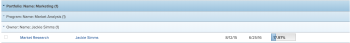
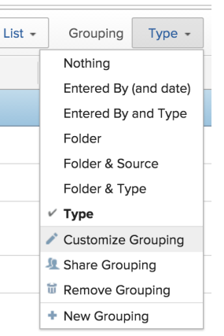
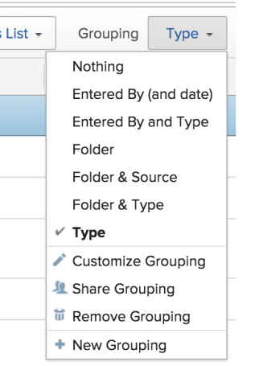

# Groupings overview in *Adobe Workfront*

You can add groupings to manage the layout of the information in your reports and lists.

You can add groupings to reports in the following ways:

* You can create groupings by editing existing groupings.

  For information about customizing an existing Grouping, see [Edit existing groupings](../../../reports-and-dashboards/reports/reporting-elements/edit-existing-groupings.md).

* You can create groupings from scratch.

  For information about creating a grouping from scratch, see [Create groupings](../../../reports-and-dashboards/reports/reporting-elements/create-groupings.md).

By default, groupings are shown in a blue highlight in your report or list. The results of the report or list are listed under their individual grouping, with no highlight.

You can add up to three groupings to a report. You can organize your information with up to four groupings by creating a matrix report. For more information on matrix reports, see [Create a matrix report](../../../reports-and-dashboards/reports/creating-and-managing-reports/create-matrix-report.md).

In a standard grouping report, the first grouping is darker blue, the second and third groupings are lighter blue. You cannot customize the color of the highlight for your grouping, or the font of the grouping name. The number in parentheses after the name of the grouping represents the number of results under that grouping. If your report spans multiple pages, ensure that you display *All* the results in the report or list to get an accurate count for your results under each grouping.

Consider the following when working with groupings:

* You can customize the information in existing groupings. All users who can view the groupings can also see your changes.
* Your *Workfront administrator* must grant you access to Edit Filters, Views, and Groupings to create groupings.

  For information about granting access to Filters, Views, and Groupings, see [Grant access to filters, views, and groupings](../../../administration-and-setup/add-users/configure-and-grant-access/grant-access-fvg.md).

* Your level of permissions to a grouping dictates how a grouping is saved. If you created the grouping originally, you can save the changes, otherwise you are prompted to save a version of the grouping. If you make changes to a grouping you have shared with others it impacts them as well.
* You can customize a grouping that was shared with you only if the user who shared it granted you Manage access.&nbsp;For information about sharing a grouping, see [Share a filter, view, or grouping in Adobe Workfront](../../../reports-and-dashboards/reports/reporting-elements/share-filter-view-grouping.md).
* You cannot edit a grouping inline.
* You cannot group by multi-select custom fields (for example, Checkboxes), or by fields that can have multiple values (for example, Resource Manager).

## Additional information about groupings

You can further manage report information when using Groupings by aggregating the values in each column on the Grouping row, as well as sort your information by the field of your Grouping. You can also remove a Grouping when it is no longer needed.

* [Aggregate values in groupings](#aggregat) 
* [Sort by a grouping](#sorting-by-a-grouping) 
* [Remove a grouping](#removing-a-grouping)

### Aggregate values in groupings

You can aggregate the data displayed in your report in your grouping line by summarizing the values in each column of the report. For more information about summarizing column data in a grouping, see [Views overview in Adobe Workfront](../../../reports-and-dashboards/reports/reporting-elements/views-overview.md).

>[!NOTE]
>
>The following exceptions apply for parent objects (for example, parent tasks) when you are aggregating values for the following fields in groupings:
>
>* All the number and currency fields except Actual Hours (for example, Planned/ Actual Labor Cost, Planned/ Actual Expense Cost, Planned/ Actual Cost, Planned Hours) aggregate only the values for the children tasks, and standalone tasks. They do not aggregate the values for the parent tasks or parents of parents. 
>* Actual Hours aggregate the values for the main parent and the standalone tasks; they do not aggregate the numbers for the parents of parent tasks or the children tasks. 
>* Custom data fields for number and currency values aggregate all tasks: parents, children, parents of parents, and standalone tasks.
>

### Sort by a grouping

Groupings cannot be sorted. Views can be sorted. In order to sort a list by the value captured in the grouping, you must include that same value in one of the columns of the view and apply the sorting in the view. This way, the list sorts by the value in the grouping indirectly (it sorts by the value in the view which is also captured in the grouping). For more information about creating views and sorting by values inside the views, see [Views overview in Adobe Workfront](../../../reports-and-dashboards/reports/reporting-elements/views-overview.md).

### Remove a grouping

How you remove a grouping depends on whether you initially created the grouping, or the grouping was shared with you. You cannot remove a default grouping.

* `If you created the grouping and you remove it`, the grouping is removed from the *Workfront* system. The grouping is no longer available to any users who you previously shared it with.

* `If the grouping was shared with you and you remove it`, the grouping is removed only for you. The user who originally created it and any other users it has been shared with still have access to the grouping.

For information about removing a grouping, see the article [Remove filters, views, and groupings](../../../reports-and-dashboards/reports/reporting-elements/remove-filters-views-groupings.md).

<!--

Old content

-->

Old content

<!--

The results of a report or a list can be organized with a grouping. Groupings categorize information based on a particular piece of information.

-->

The results of a report or a list can be organized with a grouping. Groupings categorize information based on a particular piece of information.

  <!--
  <li data-mc-conditions="QuicksilverOrClassic.Draft mode"><a href="#understanding-groupings" class="MCXref xref">Understanding Groupings</a> </li>
  -->

* [Understanding Groupings](#understanding-groupings)

  <!--
  <li data-mc-conditions="QuicksilverOrClassic.Draft mode"><a href="#creating-or-customizing-a-grouping" class="MCXref xref">Creating or Customizing a Grouping</a> </li>
  -->

* [Creating or Customizing a Grouping](#creating-or-customizing-a-grouping)

  <!--
  <li data-mc-conditions="QuicksilverOrClassic.Draft mode"><a href="#aggregating-values-in-groupings" class="MCXref xref">Aggregating Values in Groupings</a> </li>
  -->

* [Aggregating Values in Groupings](#aggregating-values-in-groupings)

  <!--
  <li data-mc-conditions="QuicksilverOrClassic.Draft mode"><a href="#sorting-by-a-grouping" class="MCXref xref">Sort by a grouping</a> </li>
  -->

* [Sort by a grouping](#sorting-by-a-grouping)

  <!--
  <li data-mc-conditions="QuicksilverOrClassic.Draft mode"><a href="#removing-a-grouping" class="MCXref xref">Remove a grouping</a> </li>
  -->

* [Remove a grouping](#removing-a-grouping)

<!--
<h2 data-mc-conditions="QuicksilverOrClassic.Draft mode">Understanding Groupings</h2>
-->

## Understanding Groupings

<!--

Your access level dictates how a grouping is saved. If you created the grouping originally, you can save the changes, otherwise you are prompted to save a version of the grouping. If you make changes to a grouping you have shared with others it impacts them as well. 

-->

Your access level dictates how a grouping is saved. If you created the grouping originally, you can save the changes, otherwise you are prompted to save a version of the grouping. If you make changes to a grouping you have shared with others it impacts them as well.

<!--

By default, groupings are shown in a blue highlight in your report or list. The results of the report or list are listed under their individual grouping, with no highlight.

-->

By default, groupings are shown in a blue highlight in your report or list. The results of the report or list are listed under their individual grouping, with no highlight.

<!--

You can add up to three groupings to a report. You can organize your information with up to four groupings by creating a matrix report. For more information on matrix reports, see <a href="../../../reports-and-dashboards/reports/creating-and-managing-reports/create-matrix-report.md" class="MCXref xref">Create a matrix report</a>.

-->

You can add up to three groupings to a report. You can organize your information with up to four groupings by creating a matrix report. For more information on matrix reports, see [Create a matrix report](../../../reports-and-dashboards/reports/creating-and-managing-reports/create-matrix-report.md).

<!--

In a standard grouping report, the first grouping is darker blue, the second and third groupings are lighter blue. You cannot customize the color of the highlight for your grouping, or the font of the grouping name. The number in parentheses after the name of the grouping represents the number of results under that grouping. If your report spans multiple pages, ensure that you display <em>All</em> the results in the report or list to get an accurate count for your results under each grouping. 

-->

In a standard grouping report, the first grouping is darker blue, the second and third groupings are lighter blue. You cannot customize the color of the highlight for your grouping, or the font of the grouping name. The number in parentheses after the name of the grouping represents the number of results under that grouping. If your report spans multiple pages, ensure that you display *All* the results in the report or list to get an accurate count for your results under each grouping.

<!--

  

-->

<!--

Consider the following when working with groupings:

-->

Consider the following when working with groupings:

  <!--
  <li data-mc-conditions="QuicksilverOrClassic.Draft mode">You can customize the information in existing groupings.</li>
  -->

* You can customize the information in existing groupings.

  <!--
  <li data-mc-conditions="QuicksilverOrClassic.Draft mode">You can create new groupings based on existing groupings.</li>
  -->

* You can create new groupings based on existing groupings.

  <!--
  <li data-mc-conditions="QuicksilverOrClassic.Draft mode">You can create new groupings from scratch.</li>
  -->

* You can create new groupings from scratch.

  <!--
  <li data-mc-conditions="QuicksilverOrClassic.Draft mode">You cannot edit a grouping in-line.</li>
  -->

* You cannot edit a grouping in-line.

  <!--
  <li data-mc-conditions="QuicksilverOrClassic.Draft mode">You cannot group by multi-select custom fields (for example, Checkboxes), or by fields that can have multiple values (for example, Resource Manager). </li>
  -->

* You cannot group by multi-select custom fields (for example, Checkboxes), or by fields that can have multiple values (for example, Resource Manager).

<!--
<h2 data-mc-conditions="QuicksilverOrClassic.Draft mode">Creating or Customizing a Grouping</h2>
-->

## Creating or Customizing a Grouping

  <!--
  <li data-mc-conditions="QuicksilverOrClassic.Draft mode"><a href="#customizing-an-existing-grouping" class="MCXref xref">Customizing an Existing Grouping</a> </li>
  -->

* [Customizing an Existing Grouping](#customizing-an-existing-grouping)

  <!--
  <li data-mc-conditions="QuicksilverOrClassic.Draft mode"><a href="#creating-a-new-grouping-based-on-an-existing-grouping" class="MCXref xref">Creating a New Grouping Based on an Existing Grouping</a> </li>
  -->

* [Creating a New Grouping Based on an Existing Grouping](#creating-a-new-grouping-based-on-an-existing-grouping)

  <!--
  <li data-mc-conditions="QuicksilverOrClassic.Draft mode"><a href="#creating-a-new-grouping-from-scratch" class="MCXref xref">Creating a New Grouping from Scratch</a> </li>
  -->

* [Creating a New Grouping from Scratch](#creating-a-new-grouping-from-scratch)

<!--
<h3 data-mc-conditions="QuicksilverOrClassic.Draft mode">Customizing an Existing Grouping</h3>
-->

### Customizing an Existing Grouping

<ol> <draft-comment>
  <li value="1" data-mc-conditions="QuicksilverOrClassic.Draft mode">Navigate to a list of objects that contains the grouping that you want to customize.</li>
 </draft-comment>
 <li value="1" data-mc-conditions="QuicksilverOrClassic.Draft mode">Navigate to a list of objects that contains the grouping that you want to customize.</li> <draft-comment>
  <li value="2" data-mc-conditions="QuicksilverOrClassic.Draft mode">Click the Grouping drop-down list.</li>
 </draft-comment>
 <li value="2" data-mc-conditions="QuicksilverOrClassic.Draft mode">Click the Grouping drop-down list.</li> <draft-comment>
  <li value="3" data-mc-conditions="QuicksilverOrClassic.Draft mode">Select the grouping that you want to customize.</li>
 </draft-comment>
 <li value="3" data-mc-conditions="QuicksilverOrClassic.Draft mode">Select the grouping that you want to customize.</li> <draft-comment>
  <li value="4" data-mc-conditions="QuicksilverOrClassic.Draft mode">Click the Grouping drop-down list, then click Customize Grouping.   The interface builder for customizing the Grouping is launched.</li>
 </draft-comment>
 <li value="4" data-mc-conditions="QuicksilverOrClassic.Draft mode">Click the Grouping drop-down list, then click Customize Grouping.   The interface builder for customizing the Grouping is launched.</li> <draft-comment>
  <li value="5" data-mc-conditions="QuicksilverOrClassic.Draft mode">In the Grouping Preview section, click Add Grouping to define how you want information in the report to be organized. A preview of what the grouping looks like in the report is shown below. </li>
 </draft-comment>
 <li value="5" data-mc-conditions="QuicksilverOrClassic.Draft mode">In the Grouping Preview section, click Add Grouping to define how you want information in the report to be organized. A preview of what the grouping looks like in the report is shown below. </li> <draft-comment>
  <li value="6" data-mc-conditions="QuicksilverOrClassic.Draft mode">Begin typing the name of the field that represents the way that you want to organize information in the report, then click it when it appears in the drop-down list.</li>
 </draft-comment>
 <li value="6" data-mc-conditions="QuicksilverOrClassic.Draft mode">Begin typing the name of the field that represents the way that you want to organize information in the report, then click it when it appears in the drop-down list.</li> <draft-comment>
  <li value="7" data-mc-conditions="QuicksilverOrClassic.Draft mode">Repeat Step 4 and Step 5 to define additional groupings. You can define up to three groupings for organizing information. You can further organize your information with up to four groupings by creating a matrix report. For more information on matrix reports, see <a href="../../../reports-and-dashboards/reports/creating-and-managing-reports/create-matrix-report.md" class="MCXref xref">Create a matrix report</a>.</li>
 </draft-comment>
 <li value="7" data-mc-conditions="QuicksilverOrClassic.Draft mode">Repeat Step 4 and Step 5 to define additional groupings. You can define up to three groupings for organizing information. You can further organize your information with up to four groupings by creating a matrix report. For more information on matrix reports, see <a href="../../../reports-and-dashboards/reports/creating-and-managing-reports/create-matrix-report.md" class="MCXref xref">Create a matrix report</a>.</li> <draft-comment>
  <li value="8" data-mc-conditions="QuicksilverOrClassic.Draft mode">Click Save Grouping to replace the current grouping with your changes.</li>
 </draft-comment>
 <li value="8" data-mc-conditions="QuicksilverOrClassic.Draft mode">Click Save Grouping to replace the current grouping with your changes.</li> 
</ol>

<!--
<h3 data-mc-conditions="QuicksilverOrClassic.Draft mode">Creating a New Grouping Based on an Existing Grouping</h3>
-->

### Creating a New Grouping Based on an Existing Grouping

   <!--
   <li value="1" data-mc-conditions="QuicksilverOrClassic.Draft mode">Go to the report that contains the grouping that you want to use as a basis for your new grouping.</li>
   -->

1. Go to the report that contains the grouping that you want to use as a basis for your new grouping.

   <!--
   <li value="2" data-mc-conditions="QuicksilverOrClassic.Draft mode">Click the Grouping drop-down list.</li>
   -->

1. Click the `Grouping` drop-down list.

   <!--
   <li value="3" data-mc-conditions="QuicksilverOrClassic.Draft mode">Select the Grouping that you want to use as the basis for the new grouping.</li>
   -->

1. Select the Grouping that you want to use as the basis for the new grouping.

   <!--
   <li value="4" data-mc-conditions="QuicksilverOrClassic.Draft mode">Click the Grouping drop-down list, then click Customize Grouping.  The interface builder for customizing the grouping is launched. </li>
   -->

1. Click the `Grouping` drop-down list, then click `Customize Grouping.`   
   The interface builder for customizing the grouping is launched.

   <!--
   <li value="5" data-mc-conditions="QuicksilverOrClassic.Draft mode">In the Grouping Preview section, click Add Grouping to define how you want information in the report to be organized. A preview of what the grouping looks like in the report is shown below. </li>
   -->

1. In the `Grouping Preview` section, click `Add Grouping` to define how you want information in the report to be organized. A preview of what the grouping looks like in the report is shown below.

   <!--
   <li value="6" data-mc-conditions="QuicksilverOrClassic.Draft mode">Begin typing the name of the field that represents the way that you want to organize information in the report, then click it when it appears in the drop-down list.</li>
   -->

1. Begin typing the name of the field that represents the way that you want to organize information in the report, then click it when it appears in the drop-down list.

   <!--
   <li value="7" data-mc-conditions="QuicksilverOrClassic.Draft mode">Repeat Step 4 and Step 5 to define additional groupings. You can define up to three groupings for organizing information. You can further organize your information with up to four groupings by creating a matrix report. For more information on matrix reports, see <a href="../../../reports-and-dashboards/reports/creating-and-managing-reports/create-matrix-report.md" class="MCXref xref">Create a matrix report</a>.</li>
   -->

1. Repeat Step 4 and Step 5 to define additional groupings.  
   You can define up to three groupings for organizing information. You can further organize your information with up to four groupings by creating a matrix report. For more information on matrix reports, see [Create a matrix report](../../../reports-and-dashboards/reports/creating-and-managing-reports/create-matrix-report.md).

   <!--
   <li value="8" data-mc-conditions="QuicksilverOrClassic.Draft mode">Click Save as New Grouping to save your changes as a new grouping.</li>
   -->

1. Click `Save as New Grouping` to save your changes as a new grouping.

<!--
<h3 data-mc-conditions="QuicksilverOrClassic.Draft mode">Creating a New Grouping from Scratch</h3>
-->

### Creating a New Grouping from Scratch

<ol> <draft-comment>
  <li value="1" data-mc-conditions="QuicksilverOrClassic.Draft mode">Go to the report where you want to create your new grouping.</li>
 </draft-comment>
 <li value="1" data-mc-conditions="QuicksilverOrClassic.Draft mode">Go to the report where you want to create your new grouping.</li> <draft-comment>
  <li value="2" data-mc-conditions="QuicksilverOrClassic.Draft mode">Click the Grouping drop-down list.  </li>
 </draft-comment>
 <li value="2" data-mc-conditions="QuicksilverOrClassic.Draft mode">Click the Grouping drop-down list.  </li> <draft-comment>
  <li value="3" data-mc-conditions="QuicksilverOrClassic.Draft mode">Click New Grouping. The interface builder for creating the grouping is launched.</li>
 </draft-comment>
 <li value="3" data-mc-conditions="QuicksilverOrClassic.Draft mode">Click New Grouping. The interface builder for creating the grouping is launched.</li> <draft-comment>
  <li value="4" data-mc-conditions="QuicksilverOrClassic.Draft mode">In the Grouping Preview section, click Add Grouping to define how you want information in the report to be organized. A preview of what the grouping looks like in the report is shown below. </li>
 </draft-comment>
 <li value="4" data-mc-conditions="QuicksilverOrClassic.Draft mode">In the Grouping Preview section, click Add Grouping to define how you want information in the report to be organized. A preview of what the grouping looks like in the report is shown below. </li> <draft-comment>
  <li value="5" data-mc-conditions="QuicksilverOrClassic.Draft mode">Begin typing the name of the field that represents the way that you want to organize information in the report, then click it when it appears in the drop-down list.</li>
 </draft-comment>
 <li value="5" data-mc-conditions="QuicksilverOrClassic.Draft mode">Begin typing the name of the field that represents the way that you want to organize information in the report, then click it when it appears in the drop-down list.</li> <draft-comment>
  <li value="6" data-mc-conditions="QuicksilverOrClassic.Draft mode">Repeat Step 4 and Step 5 to define additional groupings. You can define up to three groupings for organizing information. You can further organize your information with up to four groupings by creating a matrix report. For more information on matrix reports, see <a href="../../../reports-and-dashboards/reports/creating-and-managing-reports/create-matrix-report.md" class="MCXref xref">Create a matrix report</a>.</li>
 </draft-comment>
 <li value="6" data-mc-conditions="QuicksilverOrClassic.Draft mode">Repeat Step 4 and Step 5 to define additional groupings. You can define up to three groupings for organizing information. You can further organize your information with up to four groupings by creating a matrix report. For more information on matrix reports, see <a href="../../../reports-and-dashboards/reports/creating-and-managing-reports/create-matrix-report.md" class="MCXref xref">Create a matrix report</a>.</li> <draft-comment>
  <li value="7" data-mc-conditions="QuicksilverOrClassic.Draft mode">Click Save Grouping.</li>
 </draft-comment>
 <li value="7" data-mc-conditions="QuicksilverOrClassic.Draft mode">Click Save Grouping.</li> 
</ol>

<!--
<h2 data-mc-conditions="QuicksilverOrClassic.Draft mode">Aggregating Values in Groupings</h2>
-->

## Aggregating Values in Groupings

<!--

 You can aggregate the data displayed in your report in your grouping line by summarizing the values in each column of the report. For more information about summarizing column data in a grouping, see <a href="../../../reports-and-dashboards/reports/reporting-elements/views-overview.md" class="MCXref xref">Views overview in Adobe Workfront</a>.

-->

You can aggregate the data displayed in your report in your grouping line by summarizing the values in each column of the report. For more information about summarizing column data in a grouping, see [Views overview in Adobe Workfront](../../../reports-and-dashboards/reports/reporting-elements/views-overview.md).

>[!NOTE]
>
><!-->
>
The following exceptions apply for parent objects (for example, parent tasks) when you are aggregating values for the following fields in groupings:
>
>-->
>The following exceptions apply for parent objects (for example, parent tasks) when you are aggregating values for the following fields in groupings:
>
>  <!-->
>  <li data-mc-conditions="QuicksilverOrClassic.Draft mode"> All the number and currency fields except Actual Hours (for example, Planned/ Actual Labor Cost, Planned/ Actual Expense Cost, Planned/ Actual Cost, Planned Hours) aggregate only the values for the children tasks, and standalone tasks. They do not aggregate the values for the parent tasks or parents of parents. </li>>
>  -->
>* All the number and currency fields except Actual Hours (for example, Planned/ Actual Labor Cost, Planned/ Actual Expense Cost, Planned/ Actual Cost, Planned Hours) aggregate only the values for the children tasks, and standalone tasks. They do not aggregate the values for the parent tasks or parents of parents. 
>
>  <!-->
>  <li data-mc-conditions="QuicksilverOrClassic.Draft mode"> Actual Hours aggregate the values for the main parent and the standalone tasks; they do not aggregate the numbers for the parents of parent tasks or the children tasks. </li>>
>  -->
>* Actual Hours aggregate the values for the main parent and the standalone tasks; they do not aggregate the numbers for the parents of parent tasks or the children tasks. 
>
>  <!-->
>  <li data-mc-conditions="QuicksilverOrClassic.Draft mode"> Custom data fields for number and currency values aggregate all tasks: parents, children, parents of parents, and standalone tasks. </li>>
>  -->
>* Custom data fields for number and currency values aggregate all tasks: parents, children, parents of parents, and standalone tasks. 
>

<!--
<h2 data-mc-conditions="QuicksilverOrClassic.Draft mode">Sorting by a Grouping</h2>
-->

## Sorting by a Grouping

<!--

 Groupings cannot be sorted. Views can be sorted. In order to sort a list by the value captured in the grouping, you must include that same value in one of the columns of the view and apply the sorting in the view. This way, the list sorts by the value in the grouping indirectly (it sorts by the value in the view which is also captured in the grouping). For more information about creating views and sorting by values inside the views, see <a href="../../../reports-and-dashboards/reports/reporting-elements/views-overview.md" class="MCXref xref">Views overview in Adobe Workfront</a>. 

-->

Groupings cannot be sorted. Views can be sorted. In order to sort a list by the value captured in the grouping, you must include that same value in one of the columns of the view and apply the sorting in the view. This way, the list sorts by the value in the grouping indirectly (it sorts by the value in the view which is also captured in the grouping). For more information about creating views and sorting by values inside the views, see [Views overview in Adobe Workfront](../../../reports-and-dashboards/reports/reporting-elements/views-overview.md).

<!--
<h2 data-mc-conditions="QuicksilverOrClassic.Draft mode">Removing a Grouping</h2>
-->

## Removing a Grouping

<!--

The ability to remove a grouping functions differently depending on whether you initially created the grouping, or the grouping was shared with you. You cannot remove a default filter.

-->

The ability to remove a grouping functions differently depending on whether you initially created the grouping, or the grouping was shared with you. You cannot remove a default filter.

  <!--
  <li data-mc-conditions="QuicksilverOrClassic.Draft mode">If you created the grouping and you remove it, the grouping is removed from the <em>Workfront</em> system. The grouping is no longer available to any users who you previously shared it with.</li>
  -->

* `If you created the grouping and you remove it`, the grouping is removed from the *Workfront* system. The grouping is no longer available to any users who you previously shared it with.

  <!--
  <li data-mc-conditions="QuicksilverOrClassic.Draft mode">If the grouping was shared with you and you remove it, the grouping is removed only for you. The user who originally created it and any other users it has been shared with still have access to the grouping.</li>
  -->

* `If the grouping was shared with you and you remove it`, the grouping is removed only for you. The user who originally created it and any other users it has been shared with still have access to the grouping.

<!--

To remove a grouping:

-->

To remove a grouping:

   <!--
   <li value="1" data-mc-conditions="QuicksilverOrClassic.Draft mode">In the Grouping drop-down menu, click Remove Grouping. The My Groupings dialog box is displayed. All groupings that you have rights to remove are available to remove. Other groupings are displayed as dimmed.</li>
   -->

1. In the `Grouping` drop-down menu, click `Remove Grouping`.  
   The `My Groupings` dialog box is displayed.  
   All groupings that you have rights to remove are available to remove. Other groupings are displayed as dimmed.

   <!--
   <li value="2" data-mc-conditions="QuicksilverOrClassic.Draft mode">Click the (x) next to any groupings you want to remove, then click Done.</li>
   -->

1. Click the ( `x`) next to any groupings you want to remove, then click `Done`.

