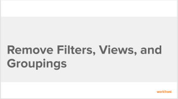

# Remove filters, views, and groupings

The highlighted information on this page refers to functionality not yet generally available. It is available only in the Preview Sandbox environment.

<!--

You can remove a filter, view, or grouping from the drop-down menus of lists and reports if you created them or they have been shared with you. You cannot remove default filters, views, or groupings.

<h2>Walk-through</h2>

View the following video to learn how to remove filters, views, and groupings in <em>Adobe Workfront</em>.
 <note type="note">
The video describes how to remove a grouping. However, removing views and filters is identical to removing a grouping.
</note>

This video was recorded in <em>Workfront Classic</em>. However, the content also applies to <em>the new Workfront experience</em>.

 

<h2>How-to steps</h2>

How you remove a reporting element depends on whether you initially created it, or it was shared with you.

For example, when removing a grouping:

<ul>
<li>If you created the grouping and you remove it, the grouping is removed from the <em>Workfront</em> system. The grouping is no longer available to any users who you previously shared it with.</li>
<li>If the grouping was shared with you and you remove it, the grouping is removed only for you. The user who originally created it and any other users it has been shared with still have access to the grouping.</li>
</ul>

To remove a filter, view, or grouping:

<ol>
<li value="1"> 
Go to a list of objects or a report.
 </li>
<li value="2"> 
In the Grouping, Filter, or View drop-down menus, click Remove Grouping, Remove Filter, or Remove View.
 
The My Groupings, My Filters, or My Viewsdialog box displays.
 
All reporting elements that you have rights to remove are available to remove. Other reporting elements are displayed as dimmed.
 </li>
<li value="3">Click the x icon next to any reporting element that you want to remove, then click Done.</li>
</ol>
<h2>Additional information</h2>

See also:

<ul> <draft-comment>
<li data-mc-conditions="QuicksilverOrClassic.Quicksilver"> 
<a href="https://one.workfront.com/s/basic-report-creation-program">Basic Report Creation Program for the new Workfront experience</a> 
 </li>
</draft-comment>
<li data-mc-conditions="QuicksilverOrClassic.Quicksilver"> 
<a href="https://one.workfront.com/s/basic-report-creation-program">Basic Report Creation Program for the new Workfront experience</a> 
 </li>
<li><a href="../../../reports-and-dashboards/reports/reporting-elements/reporting-elements-filters-views-groupings.md" class="MCXref xref">Reporting elements: filters, views, and groupings</a> </li>
<li><a href="../../../reports-and-dashboards/reports/creating-and-managing-reports/create-custom-report.md" class="MCXref xref">Create a custom report</a> </li>
<li><a href="../../../reports-and-dashboards/reports/reporting-elements/create-groupings.md" class="MCXref xref">Create groupings</a> </li>
<li><a href="../../../reports-and-dashboards/reports/reporting-elements/edit-existing-groupings.md" class="MCXref xref">Edit existing groupings</a> </li>
<li><a href="../../../reports-and-dashboards/reports/reporting-elements/filters-overview.md" class="MCXref xref">Filters overview in Adobe Workfront</a> </li>
<li><a href="../../../reports-and-dashboards/reports/reporting-elements/views-overview.md" class="MCXref xref">Views overview in Adobe Workfront</a> </li>
<li><a href="../../../reports-and-dashboards/reports/reporting-elements/groupings-overview.md" class="MCXref xref">Groupings overview in Adobe Workfront</a> </li>
</ul>

-->

You can remove a filter, view, or grouping from the drop-down menus of lists and reports if you created them or they have been shared with you. You cannot remove default filters, views, or groupings.

## Walk-through

View the following video to learn how to remove filters, views, and groupings in *Adobe Workfront*.

>[!NOTE]
>
>The video describes how to remove a grouping. However, removing views and filters is identical to removing a grouping.

This video was recorded in *Workfront Classic*. However, the content also applies to *the new Workfront experience*.

## How-to steps

How you remove a reporting element depends on whether you initially created it, or it was shared with you.

For example, when removing a grouping:

* `If you created the grouping and you remove it`, the grouping is removed from the *Workfront* system. The grouping is no longer available to any users who you previously shared it with.

* `If the grouping was shared with you and you remove it`, the grouping is removed only for you. The user who originally created it and any other users it has been shared with still have access to the grouping.

To remove a filter, view, or grouping:

1. Go to a list of objects or a report.
1. In the `Grouping`, `Filter`, or `View` drop-down menus, click `Remove Grouping`, `Remove Filter`, or `Remove View`.

   The `My Groupings`, `My Filters,` or `My Views`dialog box displays.

   All reporting elements that you have rights to remove are available to remove. Other reporting elements are displayed as dimmed.

1. Click the `x` icon next to any reporting element that you want to remove, then click `Done`.

## Additional information

See also:

* [Basic Report Creation Program for the new Workfront experience](https://one.workfront.com/s/basic-report-creation-program) 
* [Reporting elements: filters, views, and groupings](../../../reports-and-dashboards/reports/reporting-elements/reporting-elements-filters-views-groupings.md) 
* [Create a custom report](../../../reports-and-dashboards/reports/creating-and-managing-reports/create-custom-report.md) 
* [Create groupings](../../../reports-and-dashboards/reports/reporting-elements/create-groupings.md) 
* [Edit existing groupings](../../../reports-and-dashboards/reports/reporting-elements/edit-existing-groupings.md) 
* [Filters overview in Adobe Workfront](../../../reports-and-dashboards/reports/reporting-elements/filters-overview.md) 
* [Views overview in Adobe Workfront](../../../reports-and-dashboards/reports/reporting-elements/views-overview.md) 
* [Groupings overview in Adobe Workfront](../../../reports-and-dashboards/reports/reporting-elements/groupings-overview.md)

You can remove a filter, view, or grouping from lists and reports if you created them or they have been shared with you. You cannot remove default filters, views, or groupings.

## Access requirements

You must have the following:

<table cellspacing="0"> 
 <col> 
 </col> 
 <col> 
 </col> 
 <tbody> 
  <tr> 
   <td role="rowheader"><em>Adobe Workfront</em> plan*</td> 
   <td> 
Any 
 </td> 
  </tr> 
  <tr> 
   <td role="rowheader"><em>Adobe Workfront</em> license*</td> 
   <td> 
<em>Request</em> or higher
 </td> 
  </tr> 
  <tr> 
   <td role="rowheader">Access level configurations*</td> 
   <td> 
View or higher access to&nbsp;Filters, Views, Groupings
 
Note: If you still don't have access, ask your <em>Workfront administrator</em> if they set additional restrictions in your access level. For information on how a <em>Workfront administrator</em> can modify your access level, see <a href="../../../administration-and-setup/add-users/configure-and-grant-access/create-modify-access-levels.md" class="MCXref xref">Create or modify custom access levels</a>.
 </td> 
  </tr> 
  <tr> 
   <td role="rowheader">Object permissions</td> 
   <td> 
View permissions with access to share to the filter, view, or grouping you want to remove
 
For information on requesting additional access, see <a href="../../../workfront-basics/grant-and-request-access-to-objects/request-access.md" class="MCXref xref">Request access to objects in Adobe Workfront</a>.
 </td> 
  </tr> 
 </tbody> 
</table>

&#42;To find out what plan, license type, or access you have, contact your *Workfront administrator*.

## Considerations about removing filters, views, and groupings

How you remove a reporting element depends on whether you initially created it, or it was shared with you.

The following scenarios exist when you remove a grouping:

* `If you created the grouping and you remove it`, the grouping is removed from the *Workfront* system. The grouping is no longer available to any users who you previously shared it with.

* `If the grouping was shared with you and you remove it`, the grouping is removed only for you. The user who originally created it and any other users it has been shared with still have access to the grouping.

## Remove a filter, view, or grouping 

<!--
<MadCap:conditionalText data-mc-conditions="QuicksilverOrClassic.Draft mode">
using the standard builder
</MadCap:conditionalText>
-->

`<MadCap:conditionalText data-mc-conditions="QuicksilverOrClassic.Draft mode"> using the standard builder</MadCap:conditionalText>`

<!--

You can remove a filter, view, or a grouping for all lists of objects using the standard builder interface. 

-->

You can remove a filter, view, or a grouping for all lists of objects using the standard builder interface.

Removing filters, views, or groupings in *Workfront* is identical.

<ol> 
 <li value="1"> 
Go to a list of objects or a report.
 </li> <draft-comment>
  <li value="2" data-mc-conditions="QuicksilverOrClassic.Quicksilver"> 
(Conditional)&nbsp;From a list, click the Filter, View, or Grouping icon, then hover over the filter, view, or grouping you want to remove, click the More icon , then Remove. The filter, view, or grouping is removed. 
 </li>
 </draft-comment>
 <li value="2" data-mc-conditions="QuicksilverOrClassic.Quicksilver"> 
(Conditional)&nbsp;From a list, click the Filter, View, or Grouping icon, then hover over the filter, view, or grouping you want to remove, click the More icon , then Remove. The filter, view, or grouping is removed. 
 </li> 
 <li value="3"> 
 <draft-comment>
    <MadCap:conditionalText data-mc-conditions="QuicksilverOrClassic.Quicksilver">
     (Conditional)&nbsp;From a report, c
    </MadCap:conditionalText>
   </draft-comment><MadCap:conditionalText data-mc-conditions="QuicksilverOrClassic.Quicksilver">
    (Conditional)&nbsp;From a report, c
   </MadCap:conditionalText>lick the Grouping, Filter, or View drop-down menu and select Remove Grouping, Remove Filter, or Remove View.
 
The My Groupings, My Filters, or My Views dialog box displays.
 
All reporting elements that you have rights to remove are available to remove. Other reporting elements are displayed as dimmed.
 </li> 
 <li value="4"> 
Click the x icon next to any reporting element that you want to remove. 
 </li> 
 <li value="5"> 
(Conditional) Click Yes,&nbsp;Delete it if you selected to delete a filter, view, or grouping that you created and later shared with others.&nbsp;This deletes the filter, view, or grouping from the <em>Workfront</em> system.
 
  
Tip: </b>">
   <b>Tip: </b> 
   
 
    
Removing a filter, view, or grouping that you created without sharing it with others removes it from the system without asking for a confirmation. 
 
   
 
  
 </li> 
 <li value="6"> 
Click Done.
 </li> 
</ol>

<!--

<h2>Remove a filter<draft-comment>
<MadCap:conditionalText data-mc-conditions="QuicksilverOrClassic.Draft mode">
, view,
</MadCap:conditionalText>
</draft-comment><MadCap:conditionalText data-mc-conditions="QuicksilverOrClassic.Draft mode">
, view,
</MadCap:conditionalText> or grouping using the <em>beta builder</em></h2>

You cannot remove a filter or grouping using the <em>beta builder</em> interface. You can only delete them in a list of projects, tasks, or issues.&nbsp;The <em>beta builder</em> is not available for any other object lists or for views.

For more information, see <a href="../../../reports-and-dashboards/reports/reporting-elements/delete-filters.md" class="MCXref xref">Delete filters</a>.
 <draft-comment>

You can remove a filter or a grouping for lists of projects, tasks, or issues using the <em>beta builder</em> interface. The <em>beta builder</em> interface is not available for any other objects or for views.

<ol>
<li value="1"> 
Go to a list of projects, tasks, or issues.
 </li>
<li value="2"> 
Click the Filter<draft-comment>
<MadCap:conditionalText data-mc-conditions="QuicksilverOrClassic.Draft mode">
,
View,
</MadCap:conditionalText>
</draft-comment><MadCap:conditionalText data-mc-conditions="QuicksilverOrClassic.Draft mode">
,
View,
</MadCap:conditionalText>or Grouping icon.
 </li>
<li value="3"> 
Enable the <em>beta builder</em>, then locate the item under My filters, <draft-comment>
<MadCap:conditionalText data-mc-conditions="QuicksilverOrClassic.Draft mode">
My views,
</MadCap:conditionalText>
</draft-comment><MadCap:conditionalText data-mc-conditions="QuicksilverOrClassic.Draft mode">
My views,
</MadCap:conditionalText> or My groups, select the More icon  next to the item, then select Delete.
 </li>
<li value="4"> 
Select Delete on the confirmation message to permanently remove the filter, view, or grouping.
 </li>
</ol>

</draft-comment>

You can remove a filter or a grouping for lists of projects, tasks, or issues using the <em>beta builder</em> interface. The <em>beta builder</em> interface is not available for any other objects or for views.

<ol>
<li value="1"> 
Go to a list of projects, tasks, or issues.
 </li>
<li value="2"> 
Click the Filter<MadCap:conditionalText data-mc-conditions="QuicksilverOrClassic.Draft mode">
,
View,
</MadCap:conditionalText>or Grouping icon.
 </li>
<li value="3"> 
Enable the <em>beta builder</em>, then locate the item under My filters, <MadCap:conditionalText data-mc-conditions="QuicksilverOrClassic.Draft mode">
My views,
</MadCap:conditionalText> or My groups, select the More icon  next to the item, then select Delete.
 </li>
<li value="4"> 
Select Delete on the confirmation message to permanently remove the filter, view, or grouping.
 </li>
</ol>

-->

## Remove a filter`<MadCap:conditionalText data-mc-conditions="QuicksilverOrClassic.Draft mode"> , view,</MadCap:conditionalText>` or grouping using the *beta builder*

You cannot remove a filter or grouping using the *beta builder* interface. You can only delete them in a list of projects, tasks, or issues.&nbsp;The *beta builder* is not available for any other object lists or for views.

For more information, see [Delete filters](../../../reports-and-dashboards/reports/reporting-elements/delete-filters.md).

You can remove a filter or a grouping for lists of projects, tasks, or issues using the *beta builder* interface. The *beta builder* interface is not available for any other objects or for views.

<ol> 
 <li value="1"> 
Go to a list of projects, tasks, or issues.
 </li> 
 <li value="2"> 
Click the Filter<MadCap:conditionalText data-mc-conditions="QuicksilverOrClassic.Draft mode">
    , 
    View, 
   </MadCap:conditionalText>or Grouping icon.
 </li> 
 <li value="3"> 
Enable the <em>beta builder</em>, then locate the item under My filters, <MadCap:conditionalText data-mc-conditions="QuicksilverOrClassic.Draft mode">
    My views,
   </MadCap:conditionalText> or My groups, select the More icon  next to the item, then select Delete.
 </li> 
 <li value="4"> 
Select Delete on the confirmation message to permanently remove the filter, view, or grouping.
 </li> 
</ol>

