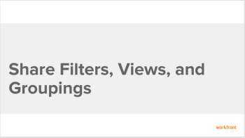
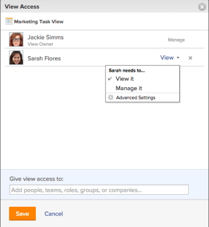

# Share a filter, view, or grouping in *Adobe Workfront*

The highlighted information on this page refers to functionality not yet generally available. It is available only in the Preview Sandbox environment.

Your *Adobe Workfront administrator* grants users access to view or edit objects when they assign access levels. For more information about granting access to objects, see [Create or modify custom access levels](../../../administration-and-setup/add-users/configure-and-grant-access/create-modify-access-levels.md).

Along with the access level that users are granted, you can also grant them permissions to view or edit specific objects that you created or have access to share. For more information about access levels and permissions, see [How access levels and permissions work together](../../../administration-and-setup/add-users/access-levels-and-object-permissions/how-access-levels-permissions-work-together.md).

You can share filters, views, and groupings that you have access to view with other users.

When a filter, view, or grouping is shared with you, you can apply that filter, view, or grouping to your lists. Depending on the access granted to you, you might be able to modify it and share it with other users.

For information about how to create a filter, view, or grouping, see the following articles:

* [Filters overview in Adobe Workfront](../../../reports-and-dashboards/reports/reporting-elements/filters-overview.md) 
* [Views overview in Adobe Workfront](../../../reports-and-dashboards/reports/reporting-elements/views-overview.md) 
* [Groupings overview in Adobe Workfront](../../../reports-and-dashboards/reports/reporting-elements/groupings-overview.md)

## Access requirements

You must have the following:

<table cellspacing="0"> 
 <col> 
 <col> 
 <tbody> 
  <tr> 
   <td role="rowheader"><em>Adobe Workfront</em> plan*</td> 
   <td> 
Any 
 </td> 
  </tr> 
  <tr> 
   <td role="rowheader"><em>Adobe Workfront</em> license*</td> 
   <td> 
<em>Request</em> or higher
 </td> 
  </tr> 
  <tr> 
   <td role="rowheader">Access level configurations*</td> 
   <td> 
View or higher access to&nbsp;Filters, Views, Groupings
 
Note: If you still don't have access, ask your <em>Workfront administrator</em> if they set additional restrictions in your access level. For information on how a <em>Workfront administrator</em> can modify your access level, see <a href="../../../administration-and-setup/add-users/configure-and-grant-access/create-modify-access-levels.md" class="MCXref xref">Create or modify custom access levels</a>.
 </td> 
  </tr> 
  <tr> 
   <td role="rowheader">Object permissions</td> 
   <td> 
View or higher permissions with access to share to a view, filter, or grouping
 
For information on requesting additional access, see <a href="../../../workfront-basics/grant-and-request-access-to-objects/request-access.md" class="MCXref xref">Request access to objects in Adobe Workfront</a>.
 </td> 
  </tr> 
 </tbody> 
</table>

&#42;To find out what plan, license type, or access you have, contact your *Workfront administrator*.

## Share a filter, view, or grouping

Sharing filters, views, or groupings in *Workfront* is identical.

<!--

You can share filters in select lists using the following interfaces:

<ul>
<li> 
Standard interface
 </li>
<li> 
<em>Beta builder</em> interface
 </li>
</ul>

Sharing filters in select lists is different depending on which interface you use to share the filter from. For information about the types of filter-building interfaces, see <a href="../../../reports-and-dashboards/reports/reporting-elements/create-filters.md" class="MCXref xref">Create or edit filters in Adobe Workfront</a>.

You can share views and groupings only in the standard interface.

<ul>
<li> <draft-comment>

<a href="#sharing" class="MCXref xref">Sharing filters, views, and groupings using the standard interface</a> 

</draft-comment>
<a href="#sharing" class="MCXref xref">Sharing filters, views, and groupings using the standard interface</a> 
 </li>
<li> <draft-comment>

<a href="#sharing2" class="MCXref xref">Sharing filters and groupings using the beta builder interface</a> 

</draft-comment>
<a href="#sharing2" class="MCXref xref">Sharing filters and groupings using the beta builder interface</a> 
 </li>
</ul> <draft-comment>
<h3 data-mc-conditions="QuicksilverOrClassic.Quicksilver,QuicksilverOrClassic.Draft mode">Sharing filters, views, and groupings using the standard interface</h3>
</draft-comment>
<h3 data-mc-conditions="QuicksilverOrClassic.Quicksilver,QuicksilverOrClassic.Draft mode">Sharing filters, views, and groupings using the standard interface</h3> <draft-comment>

Sharing filters, views, and groupings in the standard interface is identical.

</draft-comment>

Sharing filters, views, and groupings in the standard interface is identical.

-->

You can share filters in select lists using the following interfaces:

* Standard interface
* *Beta builder* interface

Sharing filters in select lists is different depending on which interface you use to share the filter from. For information about the types of filter-building interfaces, see [Create or edit filters in Adobe Workfront](../../../reports-and-dashboards/reports/reporting-elements/create-filters.md).

You can share views and groupings only in the standard interface.

* [Sharing filters, views, and groupings using the standard interface](#sharing) 
* [Sharing filters and groupings using the beta builder interface](#sharing2)

### Sharing filters, views, and groupings using the standard interface

Sharing filters, views, and groupings in the standard interface is identical.

<ol> 
 <li value="1">Go to a list of objects or a report.</li> 
 <li value="2"> <draft-comment>
   
(Conditional)&nbsp;From a list, click the Filter, View, or Grouping icon, then hover over the filter, view, or grouping you want to share, click the More icon , then Share.

  </draft-comment>
(Conditional)&nbsp;From a list, click the Filter, View, or Grouping icon, then hover over the filter, view, or grouping you want to share, click the More icon , then Share.
 <draft-comment>
   
From a report, click the Filter, View, or Grouping drop-down menu, then select the filter, view, or grouping you want to share.

  </draft-comment>
From a report, click the Filter, View, or Grouping drop-down menu, then select the filter, view, or grouping you want to share.
 </li> 
 <li value="3"> 
 <draft-comment>
    <MadCap:conditionalText data-mc-conditions="QuicksilverOrClassic.Quicksilver">
     (Conditional) If sharing from a report, c
    </MadCap:conditionalText>
   </draft-comment><MadCap:conditionalText data-mc-conditions="QuicksilverOrClassic.Quicksilver">
    (Conditional) If sharing from a report, c
   </MadCap:conditionalText>lick the Filter, View, or Grouping drop-down menu again, then click Share Filter, Share View, or Share Grouping. The <b>Filter Access</b>, <b>View Access</b>, or <b>Grouping Access</b> dialog box displays.
 
 <draft-comment>
    
   </draft-comment>   
 </li> 
 <li value="4"> 
Complete either of the following, depending on who you want to share with:
 
To share with individual users, teams, roles, groups, or companies: In the provided field, begin typing the name of the user, team, role, group, or company you want to share with, then click the name when it appears in the drop-down list. Repeat this process to share access with multiple users, teams, roles, groups, or companies.
 
To share with all users in the system: Click the Settings icon, then click Make this visible system-wide. Your administrator must select the Share System-wide option for this option to be available. For more information, see the articles <a href="../../../administration-and-setup/add-users/configure-and-grant-access/create-modify-access-levels.md" class="MCXref xref">Create or modify custom access levels</a> and <a href="../../../workfront-basics/grant-and-request-access-to-objects/permissions-reports-dashboards-calendars.md" class="MCXref xref">Share reports, dashboards, and calendars in Adobe Workfront</a>.
 </li> 
 <li value="5"> 
(Conditional) If you are sharing with individual users, teams, roles, groups, or companies, click the drop-down menu to define the level of access you want to grant.
 
   
 
You can select from the following options:
 
  <table cellspacing="0"> 
   <col> 
   <col> 
   <tbody> 
    <tr> 
     <td role="rowheader">View it</td> 
     <td> 
Select this option to allow the share recipients only to use the shared Filter, View, or Grouping. When this option is selected, recipients cannot make any modifications to the shared item.
 </td> 
    </tr> 
    <tr> 
     <td role="rowheader">Manage it</td> 
     <td> 
Select this option to allow the share recipients to use and modify the shared Filter, View, or Grouping.
 </td> 
    </tr> 
    <tr> 
     <td role="rowheader">Share it</td> 
     <td> 
Click Advanced Settings, then select or deselect the Share option, depending on whether you want the share recipients to be able to share with others.
 </td> 
    </tr> 
   </tbody> 
  </table> </li> 
 <li value="6"> 
Click Save.
 
Users with whom you shared the filter, view, or grouping can access it by clicking the Filter, View, or Grouping drop-down menu <draft-comment>
    <MadCap:conditionalText data-mc-conditions="QuicksilverOrClassic.Quicksilver">
     or icon 
    </MadCap:conditionalText>
   </draft-comment><MadCap:conditionalText data-mc-conditions="QuicksilverOrClassic.Quicksilver">
    or icon 
   </MadCap:conditionalText>and scrolling down to the Shared with me section.
 </li> 
</ol>

<!--

<h3>Sharing filters and groupings using the <em>beta builder</em> interface</h3>

When sharing filters and groupings from lists of projects, tasks, or issues, you can share them using the <em>beta builder</em> interface instead of the standard interface.

The <em>beta builder</em> interface is not available for any other objects in&nbsp;<em>Workfront</em>.

You cannot build filters or groupings in the <em>beta builder</em> interface when building reports.

Share a filter or grouping using the <em>beta builder</em> interface:

<ol>
<li value="1"> 
Go to a list of projects, tasks, or issues.
 </li>
<li value="2"> 
 Click the Filter icon  or Grouping icon , then enable the Beta setting  to access the <em>beta builder</em>. It is disabled by default.
 
This opens the beta filter builder interface.
 <note type="tip">
The header of the builder interface changes to blue when you enable the
<em>beta builder</em>. After you enable the
<em>beta builder</em> interface,
<em>Workfront</em> keeps it enabled for all areas where it is available.
</note> 
  
 </li>
<li value="3"> 
Review the following lists of filters or groupings:

<table cellspacing="0">
<col>
<col>
<tbody>
<tr>
<td role="rowheader">My filters / My groupings</td>
<td>Filters or groupings that you built and saved yourself.</td>
</tr>
<tr>
<td role="rowheader">Suggested</td>
<td>Filters or groupings that the <em>Workfront administrator</em> adds to your list of filters or groupings, either at the system level, or in your Layout Template.</td>
</tr>
<tr>
<td role="rowheader">Shared with me</td>
<td>Filters or groupings that others created and shared with you or that are shared system-wide.</td>
</tr>
</tbody>
</table> </li>
<li value="4"> 
Hover over a filter or grouping you have access to at least view and share, then click the More menu , then click&nbsp;Share.
 
  </img> 
 
The Filter sharing or Grouping sharing box displays.
 </li>
<li value="5"> 
Enable the View system wide setting.&nbsp;This gives anyone in <em>Workfront</em> permission to view the filter or grouping.
 
Or
 
Start typing the names of users, teams, roles, groups, or companies that you want to share with in the Give access to field.
 
  </img> 
 </li>
<li value="6"> 
(Optional)&nbsp;Click the right-pointing arrow next to the name of an entity to edit their permissions to the filter or grouping, then enable either the View or Manage option.
 
  </img> 
 </li>
<li value="7"> 
(Optional) Enable or disable the additional permissions for an entity by doing one of the following:

<ol>
<li value="1">Click View and disable the Share option. It is enabled by default.</li>
<li value="2"> 
Click Manage and disable either the Share or the Delete option. They are enabled by default.
 </li>
</ol> <note type="tip">
Users cannot receive a higher permission than their access level. If they don't have access to Edit filters or groupings in their access level, they cannot receive permissions to manage a filter or grouping.
<em>Workfront</em> disables the Manage option for these users and the option is dimmed.
</note> </li>
<li value="8"> 
Click Share. The filter or grouping is shared with the entities you specified.
 
The filters or groupings you shared display in the Shared with me section of the filter or grouping panel for those entities.
 
  
 </li>
</ol>

-->

### Sharing filters and groupings using the *beta builder* interface

When sharing filters and groupings from lists of projects, tasks, or issues, you can share them using the *beta builder* interface instead of the standard interface.

The *beta builder* interface is not available for any other objects in&nbsp;*Workfront*.

You cannot build filters or groupings in the *beta builder* interface when building reports.

Share a filter or grouping using the *beta builder* interface:

<ol> 
 <li value="1"> 
Go to a list of projects, tasks, or issues.
 </li> 
 <li value="2"> 
 Click the Filter icon  or Grouping icon , then enable the Beta setting  to access the <em>beta builder</em>. It is disabled by default.
 
This opens the beta filter builder interface.
 <note type="tip">
   The header of the builder interface changes to blue when you enable the 
   <em>beta builder</em>. After you enable the 
   <em>beta builder</em> interface, 
   <em>Workfront</em> keeps it enabled for all areas where it is available.
  </note> 
  
 </li> 
 <li value="3"> 
Review the following lists of filters or groupings:
 
  <table cellspacing="0"> 
   <col> 
   <col> 
   <tbody> 
    <tr> 
     <td role="rowheader">My filters / My groupings</td> 
     <td>Filters or groupings that you built and saved yourself.</td> 
    </tr> 
    <tr> 
     <td role="rowheader">Suggested</td> 
     <td>Filters or groupings that the <em>Workfront administrator</em> adds to your list of filters or groupings, either at the system level, or in your Layout Template.</td> 
    </tr> 
    <tr> 
     <td role="rowheader">Shared with me</td> 
     <td>Filters or groupings that others created and shared with you or that are shared system-wide.</td> 
    </tr> 
   </tbody> 
  </table> </li> 
 <li value="4"> 
Hover over a filter or grouping you have access to at least view and share, then click the More menu , then click&nbsp;Share.
 
  </img> 
 
The Filter sharing or Grouping sharing box displays.
 </li> 
 <li value="5"> 
Enable the View system wide setting.&nbsp;This gives anyone in <em>Workfront</em> permission to view the filter or grouping.
 
Or
 
Start typing the names of users, teams, roles, groups, or companies that you want to share with in the Give access to field.
 
  </img> 
 </li> 
 <li value="6"> 
(Optional)&nbsp;Click the right-pointing arrow next to the name of an entity to edit their permissions to the filter or grouping, then enable either the View or Manage option.
 
  </img> 
 </li> 
 <li value="7"> 
(Optional) Enable or disable the additional permissions for an entity by doing one of the following:
 
  <ol> 
   <li value="1">Click View and disable the Share option. It is enabled by default.</li> 
   <li value="2"> 
Click Manage and disable either the Share or the Delete option. They are enabled by default.
 </li> 
  </ol> <note type="tip">
   Users cannot receive a higher permission than their access level. If they don't have access to Edit filters or groupings in their access level, they cannot receive permissions to manage a filter or grouping. 
   <em>Workfront</em> disables the Manage option for these users and the option is dimmed.
  </note> </li> 
 <li value="8"> 
Click Share. The filter or grouping is shared with the entities you specified.
 
The filters or groupings you shared display in the Shared with me section of the filter or grouping panel for those entities.
 
  
 </li> 
</ol>

## Video walk-through

View the following video to learn how to share filters, views, and groupings in *Adobe Workfront*.

>[!NOTE]
>
>The video describes how to share a grouping. However, sharing views and filters is identical to sharing a grouping.

This video was recorded in *Workfront Classic*. However, the content also applies to *the new Workfront experience*.

<!--
<h2 data-mc-conditions="QuicksilverOrClassic.Draft mode">Additional information</h2>
-->

## Additional information

<!--

See also:

-->

See also:

  <!--
  <li data-mc-conditions="QuicksilverOrClassic.Draft mode"><a href="../../../reports-and-dashboards/reports/reporting-elements/reporting-elements-filters-views-groupings.md" class="MCXref xref">Reporting elements: filters, views, and groupings</a> </li>
  -->

* [Reporting elements: filters, views, and groupings](../../../reports-and-dashboards/reports/reporting-elements/reporting-elements-filters-views-groupings.md)

  <!--
  <li data-mc-conditions="QuicksilverOrClassic.Draft mode"><a href="../../../reports-and-dashboards/reports/creating-and-managing-reports/create-custom-report.md" class="MCXref xref">Create a custom report</a> </li>
  -->

* [Create a custom report](../../../reports-and-dashboards/reports/creating-and-managing-reports/create-custom-report.md)

  <!--
  <li data-mc-conditions="QuicksilverOrClassic.Draft mode"><a href="../../../reports-and-dashboards/reports/reporting-elements/create-groupings.md" class="MCXref xref">Create groupings</a> </li>
  -->

* [Create groupings](../../../reports-and-dashboards/reports/reporting-elements/create-groupings.md)

  <!--
  <li data-mc-conditions="QuicksilverOrClassic.Draft mode"><a href="../../../reports-and-dashboards/reports/reporting-elements/edit-existing-groupings.md" class="MCXref xref">Edit existing groupings</a> </li>
  -->

* [Edit existing groupings](../../../reports-and-dashboards/reports/reporting-elements/edit-existing-groupings.md)

  <!--
  <li data-mc-conditions="QuicksilverOrClassic.Draft mode"><a href="../../../reports-and-dashboards/reports/reporting-elements/filters-overview.md" class="MCXref xref">Filters overview in Adobe Workfront</a> </li>
  -->

* [Filters overview in Adobe Workfront](../../../reports-and-dashboards/reports/reporting-elements/filters-overview.md)

  <!--
  <li data-mc-conditions="QuicksilverOrClassic.Draft mode"><a href="../../../reports-and-dashboards/reports/reporting-elements/views-overview.md" class="MCXref xref">Views overview in Adobe Workfront</a> </li>
  -->

* [Views overview in Adobe Workfront](../../../reports-and-dashboards/reports/reporting-elements/views-overview.md)

  <!--
  <li data-mc-conditions="QuicksilverOrClassic.Draft mode"><a href="../../../reports-and-dashboards/reports/reporting-elements/groupings-overview.md" class="MCXref xref">Groupings overview in Adobe Workfront</a> </li>
  -->

* [Groupings overview in Adobe Workfront](../../../reports-and-dashboards/reports/reporting-elements/groupings-overview.md)

<!--

Old content

-->

Old content

<!--

You can share Filters, Views, and Groupings with other users.

-->

You can share Filters, Views, and Groupings with other users.

<!--

When a Filter, View, or Grouping is shared with you, you can apply that Filter, View, or Grouping to your lists. Depending on the access granted to you, you might be able to modify it and share it with other users.

-->

When a Filter, View, or Grouping is shared with you, you can apply that Filter, View, or Grouping to your lists. Depending on the access granted to you, you might be able to modify it and share it with other users.

<!--

For information about how to create a Filter, View, or Grouping, see <a href="../../../reports-and-dashboards/reports/reporting-elements/filters-overview.md" class="MCXref xref">Filters overview in Adobe Workfront</a> <a href="../../../reports-and-dashboards/reports/reporting-elements/views-overview.md" class="MCXref xref">Views overview in Adobe Workfront</a> and <a href="../../../reports-and-dashboards/reports/reporting-elements/groupings-overview.md" class="MCXref xref">Groupings overview in Adobe Workfront</a>.

-->

For information about how to create a Filter, View, or Grouping, see [Filters overview in Adobe Workfront](../../../reports-and-dashboards/reports/reporting-elements/filters-overview.md) [Views overview in Adobe Workfront](../../../reports-and-dashboards/reports/reporting-elements/views-overview.md) and [Groupings overview in Adobe Workfront](../../../reports-and-dashboards/reports/reporting-elements/groupings-overview.md).

  <!--
  <li data-mc-conditions="QuicksilverOrClassic.Draft mode"><a href="#sharing-a-filter-view-or-grouping" class="MCXref xref">Sharing a Filter, View, or Grouping</a> </li>
  -->

* [Sharing a Filter, View, or Grouping](#sharing-a-filter-view-or-grouping)

  <!--
  <li data-mc-conditions="QuicksilverOrClassic.Draft mode"><a href="#viewing-a-filter-view-or-grouping-that-has-been-shared-with-you" class="MCXref xref">Viewing a Filter, View, or Grouping That Has Been Shared with You</a> </li>
  -->

* [Viewing a Filter, View, or Grouping That Has Been Shared with You](#viewing-a-filter-view-or-grouping-that-has-been-shared-with-you)

  <!--
  <li data-mc-conditions="QuicksilverOrClassic.Draft mode"><a href="#removing-a-shared-filter-view-or-grouping" class="MCXref xref">Removing a Shared Filter, View, or Grouping</a> </li>
  -->

* [Removing a Shared Filter, View, or Grouping](#removing-a-shared-filter-view-or-grouping)

<!--
<h2 data-mc-conditions="QuicksilverOrClassic.Draft mode">Sharing a Filter, View, or Grouping</h2>
-->

## Sharing a Filter, View, or Grouping

<ol> <draft-comment>
  <li value="1" data-mc-conditions="QuicksilverOrClassic.Draft mode">Click the Filter, View, or Grouping drop-down menu, then select the Filter, View, or Grouping you want to share.</li>
 </draft-comment>
 <li value="1" data-mc-conditions="QuicksilverOrClassic.Draft mode">Click the Filter, View, or Grouping drop-down menu, then select the Filter, View, or Grouping you want to share.</li> <draft-comment>
  <li value="2" data-mc-conditions="QuicksilverOrClassic.Draft mode">Click the Filter, View, or Grouping drop-down menu again, then click Share Filter, Share View, or Share Grouping. The Filter Access, View Access, or Grouping Access dialog box is displayed. </li>
 </draft-comment>
 <li value="2" data-mc-conditions="QuicksilverOrClassic.Draft mode">Click the Filter, View, or Grouping drop-down menu again, then click Share Filter, Share View, or Share Grouping. The Filter Access, View Access, or Grouping Access dialog box is displayed. </li> 
 <li value="3"> <draft-comment>
   
Complete either of the following, depending on who you want to share with:

  </draft-comment>
Complete either of the following, depending on who you want to share with:
 <draft-comment>
   
To share with individual users, teams, roles, groups, or companies: In the provided field, begin typing the name of the user, team, role, group, or company you want to share with, then click the name when it appears in the drop-down list. Repeat this process to share access with multiple users, teams, roles, groups, or companies.

  </draft-comment>
To share with individual users, teams, roles, groups, or companies: In the provided field, begin typing the name of the user, team, role, group, or company you want to share with, then click the name when it appears in the drop-down list. Repeat this process to share access with multiple users, teams, roles, groups, or companies.
 <draft-comment>
   
To share with all users in the system: Click the Settings icon, then click Make this visible system-wide. Your administrator must select the Share System-wide option for this option to be available. For more information, see <a href="../../../administration-and-setup/add-users/configure-and-grant-access/create-modify-access-levels.md" class="MCXref xref">Create or modify custom access levels</a> and <a href="../../../workfront-basics/grant-and-request-access-to-objects/permissions-reports-dashboards-calendars.md" class="MCXref xref">Share reports, dashboards, and calendars in Adobe Workfront</a>.

  </draft-comment>
To share with all users in the system: Click the Settings icon, then click Make this visible system-wide. Your administrator must select the Share System-wide option for this option to be available. For more information, see <a href="../../../administration-and-setup/add-users/configure-and-grant-access/create-modify-access-levels.md" class="MCXref xref">Create or modify custom access levels</a> and <a href="../../../workfront-basics/grant-and-request-access-to-objects/permissions-reports-dashboards-calendars.md" class="MCXref xref">Share reports, dashboards, and calendars in Adobe Workfront</a>.
 </li> 
 <li value="4"> <draft-comment>
   
(Conditional) If you are sharing with individual users, teams, roles, groups, or companies, click the drop-down menu to define the level of access you want to grant. 

  </draft-comment>
(Conditional) If you are sharing with individual users, teams, roles, groups, or companies, click the drop-down menu to define the level of access you want to grant. 
 <draft-comment>
   
You can select from the following options:

  </draft-comment>
You can select from the following options:
 
  <ul> <draft-comment>
    <li data-mc-conditions="QuicksilverOrClassic.Draft mode">View it: Select this option to allow the share recipients only to use the shared Filter, View, or Grouping. When this option is selected, recipients cannot make any modifications to the shared item.</li>
   </draft-comment>
   <li data-mc-conditions="QuicksilverOrClassic.Draft mode">View it: Select this option to allow the share recipients only to use the shared Filter, View, or Grouping. When this option is selected, recipients cannot make any modifications to the shared item.</li> <draft-comment>
    <li data-mc-conditions="QuicksilverOrClassic.Draft mode">Manage it: Select this option to allow the share recipients to use and modify the shared Filter, View, or Grouping.</li>
   </draft-comment>
   <li data-mc-conditions="QuicksilverOrClassic.Draft mode">Manage it: Select this option to allow the share recipients to use and modify the shared Filter, View, or Grouping.</li> <draft-comment>
    <li data-mc-conditions="QuicksilverOrClassic.Draft mode">Share: Click Advanced Settings, then select or deselect the Share option, depending on whether you want the share recipients to be able to share with others.</li>
   </draft-comment>
   <li data-mc-conditions="QuicksilverOrClassic.Draft mode">Share: Click Advanced Settings, then select or deselect the Share option, depending on whether you want the share recipients to be able to share with others.</li> 
  </ul> </li> 
 <li value="5"> <draft-comment>
   
Click Save

  </draft-comment>
Click Save
 <draft-comment>
   
Users can access the shared Filter, View, or Grouping as described in <a href="#viewing-a-filter-view-or-grouping-that-has-been-shared-with-you" class="MCXref xref">Viewing a Filter, View, or Grouping That Has Been Shared with You</a>.

  </draft-comment>
Users can access the shared Filter, View, or Grouping as described in <a href="#viewing-a-filter-view-or-grouping-that-has-been-shared-with-you" class="MCXref xref">Viewing a Filter, View, or Grouping That Has Been Shared with You</a>.
 <draft-comment>
   
Users who you share the Filter, View, or Grouping with can access the shared Filter, View, or Grouping by clicking the Filter, View, or Grouping drop-down menu and scrolling down to the Shared with me section.

  </draft-comment>
Users who you share the Filter, View, or Grouping with can access the shared Filter, View, or Grouping by clicking the Filter, View, or Grouping drop-down menu and scrolling down to the Shared with me section.
 </li> 
</ol>

