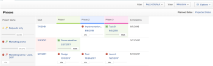
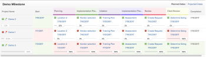
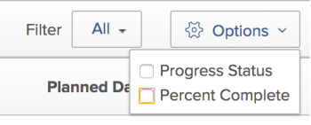

# Use the Milestone view

The Milestone view&nbsp;is available when viewing a project list or project report.

Before you can use the milestone view, Milestones need to be configured, Milestone Paths need to be added to projects, and Milestones need to be associated with tasks, as described in&nbsp;the articles [Create a milestone path](../../../administration-and-setup/customize-workfront/configure-approval-milestone-processes/create-milestone-path.md)&nbsp;and&nbsp; [Associate milestones with tasks](../../../manage-work/tasks/manage-tasks/associate-milestones-with-tasks.md).

The Milestone view is available when viewing a project list or&nbsp;project report. The following sections describe how to view and use the milestone view.

## Access requirements

You must have the following access to perform the steps in this article:

<table cellspacing="0"> 
 <col> 
 </col> 
 <col> 
 </col> 
 <tbody> 
  <tr> 
   <td role="rowheader"><em>Adobe Workfront</em> plan*</td> 
   <td> 
Any
 </td> 
  </tr> 
  <tr> 
   <td role="rowheader"><em>Adobe Workfront</em> license*</td> 
   <td> 
<em>Work</em> or higher 
 </td> 
  </tr> 
  <tr> 
   <td role="rowheader">Access level configurations*</td> 
   <td> 
View or higher access to&nbsp;Reports,&nbsp;Dashboards,&nbsp;Calendars
 
Note: If you still don't have access, ask your <em>Workfront administrator</em> if they set additional restrictions in your access level. For information on how a <em>Workfront administrator</em> can modify your access level, see <a href="../../../administration-and-setup/add-users/configure-and-grant-access/create-modify-access-levels.md" class="MCXref xref">Create or modify custom access levels</a>.
 </td> 
  </tr> 
  <tr> 
   <td role="rowheader">Object permissions</td> 
   <td> 
View permissions to a project report to apply the Milestone view to a report
 
For information on requesting additional access, see <a href="../../../workfront-basics/grant-and-request-access-to-objects/request-access.md" class="MCXref xref">Request access to objects in Adobe Workfront</a>.
 </td> 
  </tr> 
 </tbody> 
</table>

&#42;To find out what plan, license type, or access you have, contact your *Workfront administrator*.

## Switch to the Milestone view

1. Go to the list of projects or to the project report&nbsp;that contains the milestones you want to view.
1. Click the `View` drop-down menu, then click `Milestone`.

   The list or report displays in a Milestone view.

   For information about the milestone view, see the section [Milestone view overview](#understanding-the-milestone-view) in this article.

## Milestone view overview

The Milestone view is available on project lists and project reports. This view enables you to quickly view all milestones that are associated with tasks within&nbsp;the projects you are viewing.

For information about how to switch to the Milestone view, see the section [Switch to the Milestone view](#switching-to-the-milestone-view) in this article.

When viewing a project list or project report in the Milestone view, the following information&nbsp;is available:

<ul> 
 <li>Planned Dates or Projected Dates: Specify whether you want to display Planned Dates or Projected Dates in the Milestone view. Dates are displayed for the Start and Completion, as well as for each Milestone within the Milestone Path. If you are viewing Planned Dates and you also have Manage access to the project, you can edit the following dates directly from the Milestone view:&nbsp;(If you are viewing Projected Dates, the dates cannot be edited because Projected Dates are calculated and cannot be manually changed.)</li> 
 <ul> 
  <li>Project Start Dates: If a project is scheduled from the Start Date, you can manually change the Start Date of the project, and the Completion Date is then calculated.</li> 
  <li>Project Completion Dates: If a project is scheduled from the Completion Date, you can manually change the Completion Date of the project, and the Start Date is then calculated.</li> 
  <li>Task Completion Dates: You can manually update Completion&nbsp;for tasks directly from the Milestone view.</li> 
 </ul> 
 <li>Percent Complete: Displays the completion percentage of each task and project. You can disable the completion percentage from being displayed,&nbsp;as described in the section <a href="#configuring-whether-project-status-icons-and-percent-complete-are-displayed" class="MCXref xref">Configure what information displays in the Milestone view</a> in this article. You can adjust the completion percentage directly from the Milestone view, as described in the section <a href="#adjusting-percent-complete-in-the-milestone-view" class="MCXref xref">Adjust Percent Complete for tasks in the Milestone view</a> in this article.</li> 
 <li>Task status icons: A status icon is displayed next to each&nbsp;project and task in the Milestone view.  
  <ul> 
   <li>On Time </li> 
   <li>Behind </li> 
   <li>At Risk </li> 
   <li>Late </li> 
  </ul>
You can disable these status icons from being displayed, as described in the section <a href="#configuring-whether-project-status-icons-and-percent-complete-are-displayed" class="MCXref xref">Configure what information displays in the Milestone view</a> in this article. For more detailed&nbsp;information about each status type, see the article <a href="../../../manage-work/tasks/task-information/task-progress-status.md" class="MCXref xref">Task Progress Status overview</a>.
</li> 
 <li>Task status shading for completed tasks: After a task is marked Complete, the background of the task is shaded in the Milestone view to indicate whether the task was completed on time or late:</li> 
 <ul> 
  <li>Red shading for task column: The background of a task is red when the Progress Status is Late.</li> 
  <li>Green shading for task column: The background of a task is green when the Progress Status is On Time.</li> 
 </ul> 
 <li>Project status shading for the Project Start and Completion columns: 
  <ul> 
   <li>Project Start Column: The background of the Project Start column is red or green only when the Actual Start Date is populated: 
    <ul> 
     <li>Red shading for Project Start column: The background of the Project Start column is red when the Progress Status of the project is&nbsp;Late.</li> 
     <li>Green shading for Project Start column: The background of the Project Start column&nbsp;is green when the Progress Status of the project is&nbsp;On Time.</li> 
    </ul></li> 
   <li>Project Completion column: The background of the Project Completion column is red or green only when the Actual Completion Date is populated:  
    <ul> 
     <li>Red Shading for Project Completion column: The background of the Project Completion column is red when the Progress Status of the project is Late.</li> 
     <li>Green shading for the Project Completion column: The background of the Project Completion column is green when the Progress Status of the project is On Time.</li> 
    </ul></li> <note type="note">
    No color shading is assigned to the Start and Completion columns when the tasks have a Progress Status of At&nbsp;Risk or Behind. 
   </note> 
   

 
  </ul></li> 
 <li>Project name: The project name is displayed with a link to the project.</li> 
 <li>Project Condition icon: An icon is displayed next to the project name, indicating the condition of the project.</li> 
</ul>

## Configure what information displays in the Milestone view

You can configure whether the following elements are displayed in the Milestone view:

* Progress status icons
* Percent complete of projects and tasks

By default, project status icons and percent complete of projects display.

Any changes you make to these options apply only to you; other users are not affected. The changes you make are retained the next time you log in to *Adobe Workfront*.

To configure whether project status icons and completion percentage of projects display:

<ol> 
 <li value="1">Go to the list of projects or to the project report&nbsp;that contains the milestones you want to view.</li> 
 <li value="2">Click the View drop-down menu, then click Milestone. If you are viewing a list of projects inside a Portfolio or a Program, select the Milestone subtab. </li> 
 <li value="3">Click Options&nbsp;in the upper-right corner of the Milestone view. </li> 
 <li value="4"> 
Select from the following options:
 
  <table cellspacing="0"> 
   <col> 
   <col> 
   <tbody> 
    <tr> 
     <td role="rowheader">Progress Status</td> 
     <td> 
Select this option to display progress status icons next to each&nbsp;project and task.
 
This option is enabled by default.
 </td> 
    </tr> 
    <tr> 
     <td role="rowheader">Percent Complete</td> 
     <td> 
Select this option to display the completion percentage next to each project and task.
 
This option is enabled by default.
 </td> 
    </tr> 
   </tbody> 
  </table> </li> 
</ol>

## Adjust Percent Complete for tasks in the Milestone view

You can adjust the Percent Complete for tasks in the Milestone view.&nbsp;You cannot adjust the Percent Complete for a parent task (a task that contains subtasks).

To adjust the percent complete for a task in the Milestone view:

1. Go to the list of projects or to the project report&nbsp;that contains the milestones you want to view.
1. Click the `View` drop-down menu, then click `Milestone`.  

1. (Conditional) If completion percentages are not current displaying in the Milestone view, click  `Options` in the upper-right corner of the Milestone view, then ensure that `Percent Complete` is enabled.

1. Click the completion percentage below a task, specify a new percentage, then press Enter.

