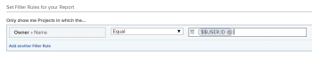

# Use user-based wildcards to generalize reports

You can generalize a report by using wildcards instead of specific information when building certain reporting elements. For example, if you want to create a report that shows the tasks assigned to a specific user, you can use the user's name in the Assigned To field of the filter. However, if you want to create a report that shows tasks assigned to the logged in user, regardless of who that user is, you can use a wildcard that indicates that when someone views the report it displays information pertaining only to them. This way, you build the report once but because you use a wildcard in the filter it produces different results every time someone else reads it.

You can use user-based wildcards when building the following reporting elements:

* Filters
* Custom prompts
* Views when adding rules for columns

## Access requirements

You must have the following access to perform the steps in this article:

<table cellspacing="0"> 
 <col> 
 <col> 
 <tbody> 
  <tr> 
   <td role="rowheader">Adobe Workfront plan*</td> 
   <td> 
Any
 </td> 
  </tr> 
  <tr> 
   <td role="rowheader">Adobe Workfront license*</td> 
   <td> 
Plan 
 </td> 
  </tr> 
  <tr> 
   <td role="rowheader">Access level configurations*</td> 
   <td> 
Edit access to Filters, Views, Groupings
 
Edit access to&nbsp;Reports,&nbsp;Dashboards,&nbsp;Calendars to edit reporting elements in a report
 
Note: If you still don't have access, ask your Workfront administrator if they set additional restrictions in your access level. For information on how a Workfront administrator can modify your access level, see <a href="../../../administration-and-setup/add-users/configure-and-grant-access/create-modify-access-levels.md" class="MCXref xref">Create or modify custom access levels</a>.
 </td> 
  </tr> 
  <tr> 
   <td role="rowheader">Object permissions</td> 
   <td> 
Manage permissions to a report to edit reporting elements in a report
 
Manage permissions to a view or filter to edit them
 
For information on requesting additional access, see <a href="../../../workfront-basics/grant-and-request-access-to-objects/request-access.md" class="MCXref xref">Request access to objects in Adobe Workfront</a>.
 </td> 
  </tr> 
 </tbody> 
</table>

&#42;To find out what plan, license type, or access you have, contact your `Workfront administrator`.

## Prerequisites

You must create a report before you can add a wildcard variable to it.

For instructions on creating reports, see [Create a report](../../../reports-and-dashboards/reports/creating-and-managing-reports/create-report.md).

## Walk-through

View the following video to learn how you can generalize the information in your reports and adapt them to the user who runs the report by using user-based wildcards.
This video was recorded in Adobe Workfront Classic. However, the content also applies to the new Workfront experience. 

## How-to steps

To insert a user-based wildcard in a report:

<ol> 
 <li value="1">Go to a report for which you want to insert a user-based wildcard.</li> 
 <li value="2">Click Report Actions, then Edit.</li> 
 <li value="3">Click the Filters tab.</li> 
 <li value="4">Click Add a Filter Rule.</li> 
 <li value="5"> 
Start typing the name of the field that you want to filter by. You must type fields that reference the user object or information about users.
 </li> 
 <li value="6"> 
Select Equal in the drop-down menu for the filter variable.
 <note type="tip">
   You must always select the 
   Equal filter variable when working with wildcards in 
   Adobe Workfront.
  </note> </li> 
 <li value="7"> 
In the Start typing name ... box, type: <code>$$USER.ID</code> or <code>$$USER.name</code> if you want the report to display information about the user who logs in, based on their name. You can insert other wildcards that refer to the logged-in user's Group, Team, Company, or other information.
 
For a complete list of user-based wildcards, see <a href="../../../reports-and-dashboards/reports/reporting-elements/understand-wildcard-filter-variables.md" class="MCXref xref">Wildcard filter variables</a>.
 
  
 </li> 
 <li value="8">Click Save + Close.</li> 
</ol>

## Additional information

See also:

* [Wildcard filter variables](../../../reports-and-dashboards/reports/reporting-elements/understand-wildcard-filter-variables.md) 
* [Create or edit filters in Adobe Workfront](../../../reports-and-dashboards/reports/reporting-elements/create-filters.md) 
* [Filters overview in Adobe Workfront](../../../reports-and-dashboards/reports/reporting-elements/filters-overview.md) 
* [Add a prompt to a report](../../../reports-and-dashboards/reports/creating-and-managing-reports/add-prompt-report.md) 
* [Use conditional formatting in Views](../../../reports-and-dashboards/reports/reporting-elements/use-conditional-formatting-views.md)

