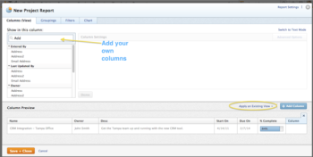

# Fields in lists and reports

>[!NOTE]
>
>The information in this article has been added to the Adobe Workfront glossary. This article will be deleted in the near future. For the Workfront glossary, see [Glossary of Adobe Workfront terminology](../../../workfront-basics/navigate-workfront/workfront-navigation/workfront-terminology-glossary.md).

<!--
Important: This article should be used as a reference to understand the fields that are visible through the report builder in Workfront. The fields available in the report builder are listed in the following table in alphabetical order. We are currently updating this information and as a result this table might not be complete. We will remove this disclaimer when we consider this information exhaustive.
-->

Workfront fields are available to be configured in the following reporting elements:

* Views
* Filters
* Groupings
* Prompts

For more information about reporting elements, see the article [Reporting elements overview](../../../reports-and-dashboards/reports/reporting-elements/reporting-elements-overview.md).

For more information about building reports, see<![CDATA[  ]]> [Create and manage reports](../../../reports-and-dashboards/reports/creating-and-managing-reports/create-manage-reports.md).

When creating a report, you can select what objects or fields associated with those objects you want to show in your report. Those will become your report columns, groupings, filters, or prompts. You can build standalone views, filters, and groupings for lists of objects, as well, in the same manner you would build them inside the report builder.&nbsp;

The following table is a list of commonly used objects and fields that you can display in reports and lists. Not all fields are available on all objects:&nbsp;&nbsp;

<!--
Object Name Description Actual Hours In a project, task, or issue report, Actual Hours are the sum of all hours logged on the project, task, or issue. Allocation Date You can find this field in the following types of reports: Resource Estimates Project (Financial Data) Budgeted Hour For a Resource Estimates or Project (Financial Data) report: Build these reports when trying to understand how resources are budgeted for work, or the amount of Planned Hours that is assigned to your resources. The Allocation Date is the first day (Sunday) of a week in which the allocation of a Job Role to a task starts. A resource (Job Role) can have as many Allocation Dates as it has weeks during the Duration of the tasks that it is assigned to. If tasks span over multiple months, then the first day of a month can also become an Allocation Date, if it falls within the Duration of the task. For example, you can have a Job Role assigned to a task that spans over 3 weeks and has 90 Planned Hours. These hours are spread evenly during the duration of the task, which makes every day assign 6 Planned Hours to your job role: Daily Planned Hours = Total Planned Hours/ Number of Work Days during the Duration of the task As a result, there are three Allocation Dates, one for every Sunday of every week during the Duration of the task, each with a certain number of Planned Hours associated with them. If the task starts in the middle of the last week of a month and ends two weeks after the beginning of a new month, the task will have four Allocation Dates: one for every Sunday of every week during the Duration of the task, and one for the first day of the new month. To make the most use of this information, we recommend that you build a Resource Estimates or a Project (Financial Data) report and add a matrix grouping for Allocation Date, and group the results weekly, monthly, quarterly, or yearly for the most accurate data. For information about building a matrix grouping, see the article Create a matrix report. For a Budgeted Hour report: Build this report when trying to understand the amount of Budgeted Hours that is allocated to your resources or to your projects in the Resource Planner. The Allocation Date is the first day (a Sunday) of the week for which you budgeted the hours in the Resource Planner. Tips: If a week spans for two months, it will generate two rows in the report: one corresponding to the first day of the week (Sunday of the first week which is during the first month), and the second row displays the first day of the second month. For example, if you budget 8 hours for a user for the week of June 30 (Sunday) - July 6 (Saturday), the two rows show an Allocation Date of June 30, and July 1. For information about budgeting resources in the Resource Planner, see the article Budget resources in the Resource Planner using the Project and Role views. Approver Decision In the Proof Approval report, displays proof approval decisions for proofs that are no longer active. Assigned To In a Task or Issue report, this field displays the Owner of the task or the issue, or the Primary Assignee. You can filter or group by this field, as well. Assignments In a Task or Issue report, this field displays a list of all entities (users, job roles, teams) that are assigned to the task or issue. You can filter by this field only in a text mode filter. You cannot group the report by this field. Assignment Users In a Task or Issue report, this field displays information about the users assigned to the tasks or issues. This field displays Primary Owners, as well as other users assigned to tasks or issues. Assignment Roles In a Task or Issue report, this field displays information about the job roles assigned to the tasks or issues. This field displays Primary Owners, as well as other job roles assigned to tasks or issues. Budget Status Shows whether the project is currently added to the capacity planner and if the budget calculation has been completed for it. If the project is not added to the capacity planner, its value is "Not Included." If the project is added to the Capacity Planner but is excluded from the budget calculation, the value is "Included but not Calculated." If the project is added to the Capacity Planner and included in the budget calculation, the value is "Included and Calculated." Budgeted Completion Date This is a deprecated field that shows the date when the budgeting of resources ends, as defined in the Legacy Resource Estimates area of the Business Case of a project, or the Capacity Planner. The field is available in project and task reports. Budgeted Cost or Project Budgeted Cost The Budgeted Cost for the project is calculated using the following formula: Budgeted Cost = Budgeted Expense Cost + Budgeted Labor Cost + Fixed Cost of the project The Budgeted Labor Cost in the calculation above refers to both labor costs for hours budgeted in the Legacy Resource Estimates area of a project (or in the Capacity Planner), and hours budgeted in the Resource Budgeting area of the Business Case (or in the Resource Planner). Important: The Capacity Planner and Legacy Resource Estimates areas are currently deprecated and will be removed from Workfront. You can locate the Budgeted Cost field based on the hours budgeted in the Resource Planner in the following areas and reports in Workfront: Business Case Summary Portfolio Optimizer (in the Cost field) In the following reports, in the Project Budgeted Cost field: Resource Estimates report Budgeted Hour report Project report Project (Financial Data) Task report Issue report You can locate the Budgeted Cost field based on the hours budgeted in the Capacity Planner in the following areas and reports in Workfront: Resource Estimates report Budgeted Hour report Project report Project (Financial Data) Task report Issue report For more information about calculating Budgeted Cost, see the article Calculate Budgeted Cost. Budgeted Hours or Bud. Hours or Pln. Bud. Hours These are the hours that you, as the Resource Manager, budget for your resources for the work they need to complete on projects. This field refers to both hours budgeted in the Legacy Resource Estimates area of a project (or in the Capacity Planner), and hours budgeted in the Resource Budgeting area of the Business Case (or in the Resource Planner). You can locate the Budgeted Hours from the Resource Planner in the following areas and reports in Workfront: Resource Planner Hours view (in the BDG column) Utilization report Hours view Resource Budgeting area of the Business Case (in the Hours field) Budgeted Hour report (the Bud. Hours field refers to hours budgeted for users; the Pln. Bud. Hours field refers to hours budgeted for roles or projects) You can locate the Budgeted Hours from the Capacity Planner in the following areas and reports in Workfront: Capacity Planner Legacy Resource Estimates area of the Business Case (in the Hours field) Resource Estimates report (in the Bud. Hours field) Budgeted Hour report (in the Budgeted Hours field) Project report Project (Financial Data) Task report Issue report The Capacity Planner and Legacy Resource Estimates areas are currently deprecated and will be removed from Workfront. For information about budgeting Users in the Resource Planner, see the article Budget resources in the Resource Planner using the Project and Role views. Budgeted Labor Cost or Resource Planner Budgeted Cost This is the cost associated with the hours that you, as the Resource Manager, budget for your resources for the work they need to complete on projects. The Budgeted Labor Cost in a project report is calculated using the following formula: Budgeted Labor Cost = SUM(Job Role Cost per Hour * Budgeted Hours per Job Role) This field refers to both labor costs for hours budgeted in the Legacy Resource Estimates area of a project (or in the Capacity Planner), and hours budgeted in the Resource Budgeting area of the Business Case (or in the Resource Planner). Important: The Capacity Planner and Legacy Resource Estimates areas are currently deprecated and will be removed from Workfront. You can locate the Budgeted Labor Cost field based on the hours budgeted in the Resource Planner in the following areas and reports in Workfront: Resource Planner Cost view (in the BDG column) Utilization report Cost view (in the Budgeted Cost column) Resource Budgeting area of the Business Case In the following reports, in the Resource Planner Budgeted Labor Cost field: Resource Estimates report Budgeted Hour report Project report Project (Financial Data) Task report Issue report You can locate the Budgeted Labor Cost based on the hours budgeted in the Capacity Planner in the following areas and reports in Workfront: Capacity Planner Legacy Resource Estimates area of the Business Case (in the Legacy Budgeted Labor Cost field) Resource Estimates report Budgeted Hour report Project report Project (Financial Data) Task report Issue report For more information about calculating the Budgeted Labor Cost, see the article Understand Budgeted Labor Cost and Budgeted Hours for projects Budgeted Start Date This is a deprecated field that shows the date when the budgeting of resources starts, as defined in the Legacy Resource Estimates area of the Business Case of a project, or the Capacity Planner. The field is available in project and task reports. Completion Day In a template or template task report, this is the day in the timeline of the template when the template task or the template completes. By default, the template has a Completion Day of 0 before you start adding template tasks to it. After adding the template tasks, the tasks and the template show a Completion Day of 1 because Workfront assumes a Duration of 1 Day for each new template task. When you start adding Task Constraints, Duration, or dependencies to your template tasks, the Completion Day might change to reflect these changes. For more information about the Completion Day in a template, see Edit project templates. Can Start Shows if a task is ready to start to be worked on. The system checks for the following things before it marks a task as "True" for the "Can Start" field: - If the task has a parent, it checks to see if the value of "Can Start" for the parent it set to "True". If the value for the parent is "False", then all the subtasks have the value of "Can Start" set to "False", as well. - It also checks to see if the predecessors of the task are complete. If they are complete, the "Can Start" value for the task is set to "True". If any of the predecessors is not complete, or has a status of "Complete - Pending Approval", then the "Can Start" value for the task is set to "False". Category A category is a custom form. You can build reports for this object and you can show it in other object reports, as well. Not all objects can have a custom form, or category. The following objects can have a custom form: - Project - Task - Issue - Portfolio - Document - Expense - Program - User - Company - Iteration Category Name When added as a column to the view of any of the following objects it displays a list of all custom forms associated with these objects: - Project - Task - Issue - Portfolio - Document - Expense - Program - User - Company - Iteration Condition It is a visual representation of the progress of a task, issue or project. For projects, the condition can be manually set by the project owner or it can be automatically set by Workfront, based on the progress status of the project. For more information about project condition, see the article Overview of Project Condition and Condition Type. The possible values for the project condition are: - On Target - At Risk - In Trouble For tasks, the condition is set manually by the task owner. The possible values for the task condition are: - Going Smoothly - Some Concerns - Major Roadblocks For more information about task condition, see the article Update Condition for tasks and issues. For issues, the condition is set manually by the issue owner. The possible values for the task condition are: - Going Smoothly - Some Concerns - Major Roadblocks Condition Update Shows the current condition of tasks, projects or issues. This option shows the most recent updates that the owners of tasks, projects or issues have provided in the 'Update Status' field, along with the new condition. Comments made on condition updates are not displayed in the 'Condition Update' column; only the main update is displayed. Constraint Date If you are using a Task Constraint that is tied to a specific date, such as Must Start On, then that specific date becomes the Constraint Date of the task. The following task constraints update the Constraint Date field: Must Start On Must Finish On Start No Later Than Start No Earlier Than Note: Constraint Date is only viewable in a report or customized view. Constraint Day If you are using a Task Constraint in a template task that is tied to a specific day, such as Must Start On, then that specific day becomes the Constraint Day of the template task. The following task constraints update the Constraint Day field: Must Start On Must Finish On Start No Later Than Start No Earlier Than Note: Constraint Day is only viewable in a report or customized view. Dashboards You can add this field in a report or a list of the report object, to display the dashboards on which the report is listed in a list. You can use this field to filter for reports that are listed on a specific dashboard, as well. For more information about including dashboard information on report object reports, see the “Understanding What Reports Are Listed on Dashboards” section in the article Access and organize reports. Days Late Shows a date difference between Planned Start and Today if the Actual Completion Date is missing. Also shows a date difference between Actual Completion and Planned Completion, when an Actual Completion Date is present. Duration This field appears on projects, tasks and issues. It is the number of days between the Planned Start and the Planned Completion Date of the object. For tasks, the Duration is an editable field if the Duration Type of the task is not Simple. If the Duration Type of the task is Simple, or if the Task Constraint is Fixed Dates, the Duration is a calculation performed by Workfront. For issues, the Duration is always an editable field and it should represent an estimate of a number of days that would require the issue to be resolved. For projects, the Duration is a calculation performed by Workfront and it represents the difference in days between the Planned Start of the earliest task and the Planned Completion of the latest task on the project. For more information about the difference between Duration and Planned Duration for tasks, see the article Difference between Planned Duration and Duration for tasks. End Date In a Rate report, this is the date when a new billing rate for a job role at the project level ends. The hours associated with the project that are before this date are multiplied by this billing rate to calculate the revenue on the project. Flags This is the same field as Status Icons, but it is only available for the following views: Templates Expenses For more information, see the article Built-in Status Icons in Views. Group Administrator In a Group report, this field displays the names of the users designated as Group Administrators in the Group. For more information, see Group administrators. Group with Administration Access In a Layout Template, Timesheet Profile, or Schedule report, this field displays the Groups whose Group Administrators have access to modify the template. You can also filter this report by this field. For more information about Group with Administration Access, see the article Create and manage layout templates. Handoff Date The date when a task becomes available for work. The Handoff Date is a calculation and cannot be set manually. For more information about the Handoff Date, see the article Task Handoff Date overview. (Hour) Owner In an Hour report, the Hour Owner is the user to whom the hours are attributed. This is different than the user who is actually logging the time. These two entities can sometimes be two different users. For more information about logging time for another user, see the article Log time. Kanban Flag In a Task Report or Issue Report, the Kanban Flag field displays the flag status that is set on the story on the Kanban board. Possible values are On Track, Ready to Pull, and Is Blocked. For more information about setting flag status on stories on the Kanban story board, see the article Use flags on stories on the Kanban board. Last 10 Viewers In a report list, it displays the names of up to 10 users who have viewed the report most recently. For more information about usage information in report lists, see the article View report usage. Last Condition Note Displays the update last entered on an object by the owner of the object. This field is helpful to display the owner's most recent activity or interaction on an object. The Last Condition Note column is empty if the note text of the last note of an object has been deleted. When a new note is entered on the object, it becomes the last note and it displays again in the column. Last Note Displays the update last entered on an object by any user. This field is helpful to display the most recent activity or interaction on an object. The Last Note column is empty if the text of the last note of an object has been deleted. When a new note is entered on the object, it becomes the last note and it displays again in the column. Last Viewed By In a report list, it displays information about the user who viewed the report last. For more information about usage information in report lists, see the article View report usage. Last Viewed Date In a report list, it displays the date on which the report was displayed last. For more information about usage information in report lists, see the article View report usage. Legacy Resource Pool The Legacy Resource Pool is a collection of job roles associated with a project or a user. The functionality of the Legacy Resource Pools is displayed in the tools available in the Legacy Resource Planning tab of the People area. For more information about Legacy Resource Planning, see the article Resource Planning. This is a deprecated field. License Type Limit: Planner Limit In a Group view or report, this shows the maximum number of Plan licenses that can be assigned to users who have the respective group designated as their Home Group. License Type Limit: Worker Limit In a Group view or report, this shows the maximum number of Work licenses that can be assigned to users who have the respective group designated as their Home Group. Note Text Displays the text of an update entered by an user on any object. Parameter A parameter is a custom field. You can build a report for all parameters, or custom fields in your system. Percent Complete A project, task, or issue field that shows what percentage of the work associated with the task, project, or issue is completed. You can update this field manually for issues and working tasks. For projects and parent tasks, this field is a roll-up from all the working tasks and you cannot update it manually. Planned Budgeted Hours In a Budgeted Hour report, this displays the amount of hours budgeted for Projects or Job Roles in the Resource Planner. For information about budgeting Projects or Roles in the Resource Planner, see the article Budget resources in the Resource Planner using the Project and Role views. For information about the Budgeted Hours report, see the article Report: Budgeted Hour. Planned Completion Date You can manually set the Planned Completion Date to a date of your choosing. If you do not set the Planned Completion Date, Workfront sets it automatically. When set automatically, the Planned Completion Date is: Planned Start Date + Duration For more information, see the article Set the project Planned Completion Date. Planned Cost A total of the Planned Labor Cost and the Planned Expense Cost of the project. This does not include the Planned Risk Cost on the project. Planned Duration A task's Planned Duration is usually the same as the task's Duration. It represents the difference in days between the Planned Start and the Planned Completion Dates of the task. When the task has a Duration Type of Effort Driven, the Planned Duration can differ from the Duration of the task, based on how many resources you assign to the task. For example, if a task with a Duration Type of Effort Driven has a Duration of 3 days and you assign one resource with a full time schedule to the task, the Planned Duration is 3 days, as well. If you assign three resources with a full time schedule to the same task, the Duration stays 3 days, but the Planned Duration becomes 1 day. The Planned Duration also changes the Planned Start and Planned Completion dates of the task, to reflect the new Planned Duration. As a result, the timeline of the project is affected as well. For more information about the difference between Duration and Planned Duration for tasks, see the article Difference between Planned Duration and Duration for tasks. Projects and issues don't have a Planned Duration. Planned Duration Minutes The Planned Duration Minutes of a project or an issue is the Duration of the project or issue in minutes. Tasks don't have a Planned Duration Minutes field. Template Tasks have a Planned Duration Minutes field which displays the Planned Duration of the task in minutes. Planned Expense Cost Total of the Planned Amounts of all the expenses on the project. Planned Hours This field appears on projects, tasks, and issues. It shows the amount of hours that the Project Owner estimates that each task or issue should take to complete. For tasks, you can manually update this field when the Duration Type of the task is Calculated Assignment. This field is calculated by Workfront when the Duration Type of the task is Calculated Work, Effort Driven, or Simple. For information about Task Duration, see the article Overview of Task Duration and Duration Type. Planned Hours are distributed equally to all the days within the duration of each task. They are stored in minutes in the Workfront database. Workfront calculates the Planned Hours of a Project by adding all Planned Hours from all the tasks on the project. You can manually update this field for Issues. Issue Planned Hours are not added to the Project Planned Hours. Planned Labor Cost For a task, the hourly rate of the user or role, multiplied by the number of hours assigned to the user or role. For a project, it is a total of all Planned Labor Costs of all the tasks. Whether the rate of the user or role is used depends on the Cost Type that is selected for the given task, as described in the section Modifying Cost Types for Individual Tasks in the article Track costs. Planned Risk Cost The total of the Potential Cost of all the risks on the project. This amount is not included in the Planned Cost of the project. Project Budgeted Cost See Budgeted Cost Proof Deadline In reports that contain the Document Version object (such as a Document Version report and Proof Approval report), displays the day of the week, date, time of day, and year of the proof deadline. Proof Decision In reports that contain the Document Version object (such as a Document Version report and Proof Approval report), displays the decision status of the proof (pending, changes required, or approved) Proof Name In reports that contain the Document Version object (such as a Document Version report and Proof Approval report), displays the proof name. Proof Pages In reports that contain the Document Version object (such as a Document Version report and Proof Approval report), displays the number of pages included in the proof. Proof Progress In reports that contain the Document Version object (such as a Document Version report and Proof Approval report), displays the progress status of the proof (Sent, Opened, Commented, Decision Made). For more information, see the section Proof progress overview in the article Proof progress and status overview. Rank In an Access Level report, you can manually indicate a Rank of the Access Level. This helps you, as the Workfront administrator, to visually identify the level of complexity associated with each Access Level. For example, you can give lower numbers for more complex (Plan-level) Access Levels, and higher numbers for less complex (Requestor-level) Access Levels. You cannot rank the standard Access Levels. Ready This is a field on a task report which indicates whether an Agile task has been marked as "Ready" on the backlog. This flag only applies to Agile tasks, which are tasks assigned to an Agile team. Rejection Issue In a project or a task report, this is the issue that is created when the approval for the project or the task is rejected. For information about rejection issues, see the article Create an approval process for work items. Resolve Issue/ Project/ Task In an issue report, use this field in views or filters to refer to the issue, the project, or the task that resolves the issue. For information about displaying resolving objects in reports, see the section Overview of Resolving and Resolvable Objects in the article Overview of Resolving and Resolvable Objects . Resource Managers Resource Managers can perform resource scheduling actions on a project. When you use this in a report, a list of resource managers is displayed, with each resource manager on the project separated by a comma (there can be up to 10 resource managers on a given project). For more information, see the article Designate Resource Managers for a project or template . Resource Manager IDs Use this option when creating a filter to find a specific resource manager. Begin typing the name of the resource manager that you want to use in the filter, then click the name when it appears in the drop-down list. Resource Managers can perform resource scheduling actions on a project. For more information, see the article Designate Resource Managers for a project or template . Resource Planner Budgeted Labor Cost See Budgeted Labor Cost. Resource Pool A collection of job roles associated with a project or a user. The functionality of the Resource Pools is displayed in the tools available in the Resource Planning tab of the People area in the Production environment. Resource Pools In project reports, Resource Pools show all the pools associated with a project. Resource Pools are collections of users that can be associated with a project. This object cannot be used in a grouping. For more information about the functionality of Resource Pools see the section Resource Planning. Resource Scope A task-level field that is applicable only when using a Task Constraint of Fixed Dates. For more information about the Fixed Dates Task Constraint, see the article Fixed Dates. The value of the Resource Scope on a task is intended to prevent other tasks from being assigned to the same user during the time frame of the task. For more information about Resource Scope, see the article Understanding Resource Scope. Scheduled Report When you build a report of reports, you can display information about the schedules of the report, if the report is scheduled for delivery using the Scheduled Report field. This field shows multiple values, one for each schedule of each report, in a bulleted list. For more information about scheduling reports, see the article Report delivery overview. Because this field shows multiple values, it cannot be used in a grouping. You can access it only in a filter or a view. Source Indicates the parent object of another object. For example, a document attached to a task has the name of the task in the Source field of a Document report or view; an issue logged under a project has the name of the project in the Source field of an Issue report or view. Start Date In a Rate report, this is the date when a new billing rate for a job role at the project level starts. The hours associated with the project that are after this date are multiplied by this billing rate to calculate the revenue on the project. Start Day In a template or template task report, this is the day in the timeline of the template when the template task or the template starts. By default, the template and any template tasks indicate a Start Day of 0. When you start adding Task Constraints, Duration, or dependencies to your template tasks, the Start Day might change to reflect these changes. For more information about the Start Day in a template, see Edit project templates. Status Shows the most recent status of tasks. This is the 'New,' 'In Process,' and 'Complete' statuses that users can select when updating a task. For more information about task status, see the article Update task status. Status Icons You can add the built-in Status Icons field as a column in your views to enhance visibility into key points about your objects, like: An object has documents attached An object is associated with an approval process An object has additional notes associated with it An expense is billable or reimbursable A task is on a critical path A user belongs to a company, a team, or is located in a different time zone You can add the Status Icons field in the views of the following objects: Tasks Issues Projects Template Tasks Templates Expenses Documents Users For more information, see the article Built-in Status Icons in Views. Status Update Shows the most recent status update on tasks. This option shows the most recent status updates that users have provided in the 'Update Status' field. (To show the 'New,' 'In Process,' and 'Complete' statuses, use the Status column.) Comments made on status updates are not displayed in the 'Status Update' column; only the main update is displayed. For more information on statuses, see the article Update task status. Subscribers Lists the subscribers to projects, tasks, or issues. When you use this field in a report, a list of subscribers displays, with each subscriber separated by a comma. For more information, see the article Subscribe to items in Adobe Workfront. Time Off You can build a Time Off report to view when users have indicated time off in their profile. Total Hours In a project report, Total Hours display the rounded sum of all hours on the project, the last time the project finances were calculated. Actual Hours reflect the exact hours logged on the project. Typically, the Actual Hours should match the Total Hours. If the Total Hours appears significantly different than the Actual Hours field, you must Recalculate Finances on the project. For more information about recalculating project finances, see the article Recalculate project finances. Thumbnail / Large Thumbnail In a Document list or report, it displays a preview of the document in a thumbnail. Do one of the following: Select Thumbnail to view a 33-66 pixel-wide thumbnail in the report. Select Large Thumbnail to view a 400 pixel-wide thumbnail in the report. The size of the thumbnail adjusts when you modify the width of the column in a list or report. View Icons This is the same field as Status Icons, but it is only available for the following views: Documents For more information, see the article Built-in Status Icons in Views. Views Last Month/ Quarter/ Year In a report list, it displays the number of times the report has been viewed during the last month, quarter, or year. For more information about usage information in report lists, see the article View report usage. Views This Month/ Quarter/ Year In a report list, it displays the number of times the report has been viewed during this month, quarter, or year. For more information about usage information in report lists, see the article View report usage.
-->

