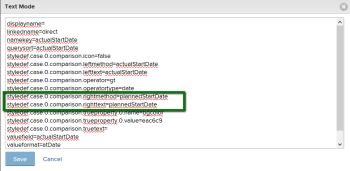

# Compare fields in conditional formatting

You can use conditional formatting to compare 2 different fields in a view and highlight them when certain criteria are met between the fields.

## Access requirements

You must have the following access to perform the steps in this article:

<table cellspacing="0"> 
 <col> 
 <col> 
 <tbody> 
  <tr> 
   <td role="rowheader"><em>Adobe Workfront</em> plan*</td> 
   <td> 
Any
 </td> 
  </tr> 
  <tr> 
   <td role="rowheader"><em>Adobe Workfront</em> license*</td> 
   <td> 
<em>Plan</em> 
 </td> 
  </tr> 
  <tr> 
   <td role="rowheader">Access level configurations*</td> 
   <td> 
Edit access to Filters, Views, Groupings
 
Edit access to&nbsp;Reports,&nbsp;Dashboards,&nbsp;Calendars to edit the view in a report
 
Note: If you still don't have access, ask your <em>Workfront administrator</em> if they set additional restrictions in your access level. For information on how a <em>Workfront administrator</em> can modify your access level, see <a href="../../../administration-and-setup/add-users/configure-and-grant-access/create-modify-access-levels.md" class="MCXref xref">Create or modify custom access levels</a>.
 </td> 
  </tr> 
  <tr> 
   <td role="rowheader">Object permissions</td> 
   <td> 
Manage permissions to a report to edit the view in a report
 
Manage permissions to a view
 
For information on requesting additional access, see <a href="../../../workfront-basics/grant-and-request-access-to-objects/request-access.md" class="MCXref xref">Request access to objects in Adobe Workfront</a>.
 </td> 
  </tr> 
 </tbody> 
</table>

&#42;To find out what plan, license type, or access you have, contact your *Workfront administrator*.

## Example: Compare Actual Start Date and Planned Start Date

For example, if the Actual Start Date of a task is after the Planned Start Date you can highlight the Planned Start Date column using conditional formatting.

To compare the Planned Start Date and Actual Start Date of task using conditional formatting:

<ol> 
 <li value="1">Go to a task view or a report.</li> 
 <li value="2">(Conditional) If you are working with a report, from the Columns (View) tab, click the header of the column you want to conditionally format to select it. For example, select the Actual&nbsp;Start Date column if you want to add the conditional formatting to it by comparing the Planned Start Date and the Actual Start Date fields.</li> 
 <li value="3">Click Advanced Options, then click Add a Rule for this Column.</li> 
 <li value="4">Enter the comparison criteria using existing values found in the builder and specify your conditional formatting. For example, we want to highlight tasks where the Actual Start Date is later than ( or greater than) the Planned Start Date. Select the Greater Than modifier, and select an actual date in the date field. &nbsp;</li> 
 <li value="5">(Optional) Select Apply to entire row if you want to apply the formatting to the entire row.</li> 
 <li value="6">Click Add Rule, then Done.</li> 
 <li value="7">Select the Actual Start Date column, then click Switch to Text Mode.</li> 
 <li value="8">Click to edit text mode then add the following line of text: <code>styledef.case.0.comparison.rightmethod= <field to compare></code> In our example:&nbsp;<code>styledef.case.0.comparison.rightmethod=plannedStartDate</code> <note type="note">
    If you are comparing a 
   <em>Workfront</em> native field, use camel case syntax for the name of the field. If you are comparing a custom field, use 
   DE:Actual Name of the Field for the name field you are comparing with the first field.
    For example, if you are comparing the 
   Actual Start Date with a custom field labeled 
   Delivery Date, add the following statement in your text mode code:
    
   <code>styledef.case.0.comparison.rightmethod=DE:Delivery Date</code>
  </note></li> 
 <li value="9">Ensure that the <code>righttext</code> line of code matches the statement in the <code>rightmethod</code> line of code. </li> 
 <li value="10">Click Save.</li> 
 <li value="11">Click Save + Close. The column highlights the fields that meet your criteria.</li> 
</ol>

