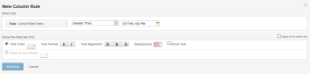

# Compare fields in conditional formatting {#compare-fields-in-conditional-formatting}

You can use conditional formatting to compare 2 different fields in a view and highlight them when certain criteria are met between the fields.


## Access requirements {#access-requirements}

You must have the following access to perform the steps in this article:

<table style="width: 100%;margin-left: 0;margin-right: auto;mc-table-style: url('../../../Resources/TableStyles/TableStyle-List-options-in-steps.css');" class="TableStyle-TableStyle-List-options-in-steps" cellspacing="0"> 
 <col class="TableStyle-TableStyle-List-options-in-steps-Column-Column1"> 
 <col class="TableStyle-TableStyle-List-options-in-steps-Column-Column2"> 
 <tbody> 
  <tr class="TableStyle-TableStyle-List-options-in-steps-Body-LightGray"> 
   <td class="TableStyle-TableStyle-List-options-in-steps-BodyE-Column1-LightGray" role="rowheader"><span class="mc-variable WFVariables.FullProdNameWF variable varname">Adobe Workfront</span> plan*</td> 
   <td class="TableStyle-TableStyle-List-options-in-steps-BodyD-Column2-LightGray"> <p>Any</p> </td> 
  </tr> 
  <tr class="TableStyle-TableStyle-List-options-in-steps-Body-MediumGray"> 
   <td class="TableStyle-TableStyle-List-options-in-steps-BodyE-Column1-MediumGray" role="rowheader"><span class="mc-variable WFVariables.FullProdNameWF variable varname">Adobe Workfront</span> license*</td> 
   <td class="TableStyle-TableStyle-List-options-in-steps-BodyD-Column2-MediumGray"> <p><span class="mc-variable WFVariables.WFLicense-Plan variable varname">Plan</span> </p> </td> 
  </tr> 
  <tr class="TableStyle-TableStyle-List-options-in-steps-Body-LightGray"> 
   <td class="TableStyle-TableStyle-List-options-in-steps-BodyE-Column1-LightGray" role="rowheader">Access level configurations*</td> 
   <td class="TableStyle-TableStyle-List-options-in-steps-BodyD-Column2-LightGray"> <p>Edit access to Filters, Views, Groupings</p> <p>Edit access to&nbsp;Reports,&nbsp;Dashboards,&nbsp;Calendars to edit the view in a report</p> <p>Note: If you still don't have access, ask your <span class="mc-variable WFVariables.AdminWF variable varname">Workfront administrator</span> if they set additional restrictions in your access level. For information on how a <span class="mc-variable WFVariables.AdminWF variable varname">Workfront administrator</span> can modify your access level, see <a href="create-modify-access-levels.md" class="MCXref xref">Create or modify custom access levels</a>.</p> </td> 
  </tr> 
  <tr class="TableStyle-TableStyle-List-options-in-steps-Body-MediumGray"> 
   <td class="TableStyle-TableStyle-List-options-in-steps-BodyB-Column1-MediumGray" role="rowheader">Object permissions</td> 
   <td class="TableStyle-TableStyle-List-options-in-steps-BodyA-Column2-MediumGray"> <p>Manage permissions to a report to edit the view in a report</p> <p>Manage permissions to a view</p> <p>For information on requesting additional access, see <a href="request-access.md" class="MCXref xref">Request access to objects in Adobe Workfront</a>.</p> </td> 
  </tr> 
 </tbody> 
</table>

&#42;To find out what plan, license type, or access you have, contact your *`Workfront administrator`*.


## Example: Compare Actual Start Date and Planned Start Date {#example-compare-actual-start-date-and-planned-start-date}

For example, if the Actual Start Date of a task is after the Planned Start Date you can highlight the Planned Start Date column using conditional formatting.


To compare the Planned Start Date and Actual Start Date of task using conditional formatting:


1. Go to a task view or a report.
1. (Conditional) If you are working with a report, from the `Columns (View)` tab, click the header of the column you want to conditionally format to select it.  
   For example, select the `Actual Start Date` column if you want to add the conditional formatting to it by comparing the Planned Start Date and the Actual Start Date fields.

1. Click `Advanced Options`, then click Add a `Rule for this Column`.

1. Enter the comparison criteria using existing values found in the builder and specify your conditional formatting.  
   For example, we want to highlight tasks where the Actual Start Date is later than ( or greater than) the Planned Start Date. Select the Greater Than modifier, and select an actual date in the date field.  
   &nbsp; 


1. (Optional) Select `Apply to entire row` if you want to apply the formatting to the entire row.
1. Click `Add Rule`, then `Done`.

1. Select the `Actual Start Date` column, then click `Switch to Text Mode`.

1. `Click to edit text` mode then add the following line of text:  


   ```
   styledef.case.0.comparison.rightmethod= <field to compare>
   ```

  
   In our example:&nbsp;

   ```
   styledef.case.0.comparison.rightmethod=plannedStartDate
   ```

  


   >[!NOTE]
   >
   >If you are comparing a *`Workfront`* native field, use camel case syntax for the name of the field. If you are comparing a custom field, use `DE:Actual Name of the Field` for the name field you are comparing with the first field.  
   >For example, if you are comparing the `Actual Start Date` with a custom field labeled `Delivery Date`, add the following statement in your text mode code:  
   >
   >
   >```   >
   >styledef.case.0.comparison.rightmethod=DE:Delivery Date
   >```   >
   >


1. Ensure that the 

   ```
   righttext
   ```

   line of code matches the statement in the 

   ```
   rightmethod
   ```

   line of code.  
   


1. Click `Save`.
1. Click `Save + Close`.  
   The column highlights the fields that meet your criteria.


