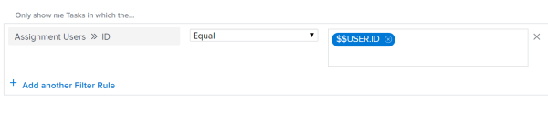
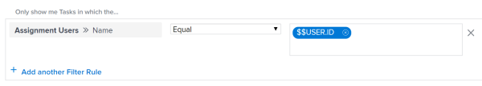

# Reports FAQs {#reports-faqs}

The following are frequently asked questions about reports.

## Why does my custom calculation for an hour difference not show the correct result in a column? {#why-does-my-custom-calculation-for-an-hour-difference-not-show-the-correct-result-in-a-column}

On a project report I have a calculation that subtracts Actual Hours (2) from Planned Hours (4). The result I am getting is 120 when it should be 2.  
My calculation is:
`<pre>valueexpression=SUB(workRequired,actualWorkRequired)</pre>` 

### Answer {#answer}

Fields using hours in `Workfront` are stored in minutes. When using the field in a calculation the result will be in minutes. To obtain the result in hours, you must divide the result of the calculation by 60.

The correct calculation is:  

`<pre>valueexpression=SUB(workRequired,actualWorkRequired)/60</pre>` 

## Why is the value of each of my chart elements in a report not displayed on the chart?  {#why-is-the-value-of-each-of-my-chart-elements-in-a-report-not-displayed-on-the-chart}

### Answer {#answer-1}

If you have more than 50 chart elements in a report chart, the value of each element does not display in the chart.  

When you have less than 50 elements in a chart, the value of each element displays in the chart. Consider adding a filter or modifying the groupings in the report to limit the amount of items you display in each element of the chart.  

## Why is my report returning too many results to display the chart? {#why-is-my-report-returning-too-many-results-to-display-the-chart}

When I run a report that has a chart, I see the error message "Whoa there... This report returned A LOT of data which makes the chart unreadable. Consider narrowing your results by adding a filter or changing the groupings in your chart."

### Answer {#answer-2}

This error means that your chart contains up to 618 distinct results—for example, more than 618 bars in a bar chart. To resolve the display issue, you need to refine the results by modifying your current filter and grouping selections.

For information on modifying filters and groupings, see the articles [Create and customize Filters](create-customize-filters.md) and [Create and customize Groupings](create-customize-groupings.md).

## Why do I see my tasks (or issues) when I access the same report (or calendar) as my coworker and they see their tasks instead? {#why-do-i-see-my-tasks-or-issues-when-i-access-the-same-report-or-calendar-as-my-coworker-and-they-see-their-tasks-instead}

### Answer {#answer-3}

The report or calendar might have a wildcard filter variable which points to the user who is logged in. In this case, the report shows information based on the user who is logged in. Adjust the filter to remove the wildcard that points to the logged in user.  

For a complete list of user-based wildcard filter variables, see [Understand wildcard filter variables](understand-wildcard-filter-variables.md).

## Why does the data in my report seem incomplete? {#why-does-the-data-in-my-report-seem-incomplete}

### Answer {#answer-4}

This can happen in most cases if you have a limited access that prevents you from seeing items in the system. Additionally, the items that you want to see are not shared with you.

The creator of the report can edit the report to run it with the access rights of a system administrator, or any Plan user who has access to see the data.

For more information, see [Run and deliver a report with the access rights of another user](run-deliver-report-access-rights-another-user.md).

## How do I report on tasks (or issues) that I am assigned to, whether I am the Owner on them or not? {#how-do-i-report-on-tasks-or-issues-that-i-am-assigned-to-whether-i-am-the-owner-on-them-or-not}

### Answer {#answer-5}

To see all tasks or issues assigned to you, whether you are the Owner (or Primary Assignee) or not, use the following filter in a task or issue report:

1. Access a task or issue report.
1. On the **Filters** tab, click **Add a Filter Rule**.

1. In the **Start typing field name ...** field, start typing **Assignment Users Name**, then select it when it appears in the list.  

   >[!NOTE]
   >
   >Do not use the **Assigned To Name **field, as this filters only for the tasks and issues for which you are the Primary Assignee, or Owner.

1. Select the **Equal** modifier.
1. Start typing *$$USER.ID* in the textbox and select it from the drop-down list that appears.  
   This ensures that you see all tasks and issues that are assigned to the logged in user. You can replace the wildcard with a specific user name.  
   

1. Click **Save + Close**.

## Why are the Add Issues/Add Tasks links not appearing at the bottom of my Issues and Tasks lists on a project? {#why-are-the-add-issues-add-tasks-links-not-appearing-at-the-bottom-of-my-issues-and-tasks-lists-on-a-project}

### Answer {#answer-6}

First, ensure that you have the correct access and permissions to add issues and tasks to a project. In this case, you should see the **Add Issues** and **Add Tasks** links at the bottom of the **Issues** and **Tasks** lists. However, if you have a **Grouping** applied to these lists, the links do not display. Remove the **Grouping** and the links should display so you can add issues and tasks to your projects.  
For information about creating Groupings, see [Create and customize Groupings](create-customize-groupings.md).

## Does the information in my report or dashboard refresh automatically? {#does-the-information-in-my-report-or-dashboard-refresh-automatically}

### Answer {#answer-7}

Information in reports or dashboards does not refresh automatically.

Information can be manually refreshed in a cached report.  
For more information about refreshing a cached report, see [Run a report](run-report.md).

Information can be manually refreshed in a cached dashboard.  
For more information about refreshing a cached dashboard, see the section [Display dashboards](get-started-dashboards.md#running-dashboards) in the article [Get started with dashboards](get-started-dashboards.md).

## Can ownership of a report change? {#can-ownership-of-a-report-change}

### Answer {#answer-8}

Ownership of a report cannot change. However, the user who created the report can allow other users to edit the report. The way you can allow users to edit a report depends on the type of user you are.

* System administrators can allow users with a Plan license to edit reports by configuring the Edit option in the Reports row to include the access to Create a report.  
  For more information, see [Grant access to reports, dashboards, and calendars](grant-access-reports-dashboards-calendars.md).

* Any end users with access to create and share reports can allow others to edit individual reports by sharing them and giving other users Manage permissions to them.  
  For more information, see [Share a report](share-report.md).

Users with permissions to view or manage other reports can copy them and they automatically become the report owner of the copied report.
