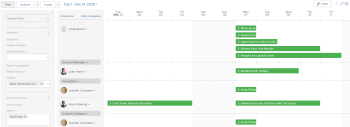

# Deprecation of Resource Scheduling tools in *`Adobe Workfront`* {#deprecation-of-resource-scheduling-tools-in-adobe-workfront}

The highlighted information on this page refers to functionality not yet generally available. It is available only in the Preview Sandbox environment.

We are currently in the process of deprecating all Scheduling tools from *`Adobe Workfront`* and replacing them with the *`Workload Balancer`*. 

>[!IMPORTANT] {type="important"}
>
>The deprecation of the Scheduling tools means that as of now, we are no longer implementing new feature functionality for the current Scheduling solution and we consider and prioritize only High and Critical severity defects for a fix. 

If you currently use Scheduling tools you may now consider discontinuing them and start using the *`Workload Balancer`*. A large part of functionality is already available in the *`Workload Balancer`*. For information, see the section [Feature availability](#understanding-legacy-tools-and-their-replacements) in this article. 

Over time, you can continue using the *`Workload Balancer`* for all your scheduling needs, as more capabilities become available in the near future. 

>[!IMPORTANT] {type="important"}
>
>You cannot use both Scheduling and the *`Workload Balancer`* at the same time to adjust user allocations. If you have managed user allocations in the Scheduling tools, the adjusted daily allocations do not transfer to the *`Workload Balancer`*. Similarly, if you have adjusted user allocations in the *`Workload Balancer`*, they do not transfer to the Scheduling tools. You must choose one tool to manage daily or weekly user allocations.

This article describes the deprecation timeline and it outlines the functionality you are now using in the Scheduling tools in comparison to what is currently available in the *`Workload Balancer`* and what will become available soon. A more exact timeline will be announced through the Announcement Center and this article will be updated as this process continues during the following months. 

For information about building up a plan to migrate to the *`Workload Balancer`*, see [Migrate from Resource Scheduling to the Workload Balancer](migrate-resource-scheduling-to-workload-balancer.md). 

>[!NOTE]
>
>Please note that the changes described in this article do not affect any other resource management tools.&nbsp;For example, they do not affect the Resource Planner or the Utilization&nbsp;report. 

##  Deprecation timeline highlights {#deprecation-timeline-highlights}

>[!IMPORTANT] {type="important"}
>
>Please use this article to understand the latest timeline for deprecating the Scheduling tools. Any updates to this timeline will be communicated in this article and in Announcement Center messages.

The following is a tentative timeline for the deprecation process of Resource Scheduling tools: 

*  [2020.4 release (November 2020)](#2020.4) 
*  [2021.4 release (October 2021)](#2021.4) 
*  [Milestone 1 (date to be determined)](#first) 
*  [Milestone 2 (date to be determined)](#second) 
*  [Milestone 3 (date to be determined)](#mileston) 
*  [Milestone 4 (after the first half of 2022)](#end) 

### 2020.4 release (November 2020) {#release-november}

*  New feature functionality is no longer implemented for the Scheduling solution
*  Only High and Critical severity defects will be prioritized for a fix
*  New *`Workload Balancer`* capabilities added to *`Workfront`*

### 2021.4 release (October 2021) {#release-october}

*  Workload Balancer is set as default for any first-time user of *`Workfront`*
*  Enhanced filters that can be shared and include additional fields

### Milestone 1 (date to be determined) {#milestone-date-to-be-determined}

*  All Resource Scheduling tools will be disabled for customers that have not used them within 60 days
*  New *`Workload Balancer`* capabilities added to  *`Workfront`*

### Milestone 2 (date to be determined) {#milestone-date-to-be-determined-1}

*  All Resource Scheduling tools will be disabled for customers that have not used them within 60 days
*  New *`Workload Balancer`* capabilities added to *`Workfront`*

### Milestone 3 (date to be determined) {#milestone-date-to-be-determined-2}

*  All Resource Scheduling tools will be disabled for customers that have not used them within 60 days
*  All new *`Workload Balancer`* features will be added only to *`The new Adobe Workfront experience`* 

### Milestone 4 (after the first half of 2022) {#milestone-after-the-first-half-of}

*  All Resource Scheduling tools will be disabled for all customers 
*  The *`Workload Balancer`* remains as the only tool to schedule resources in *`Workfront`*. 

## Feature availability {#feature-availability}

Unless otherwise specified, all Resource Scheduling features have been or will be available in the *`Workload Balancer`*. For information about the *`Workload Balancer`*, see [Overview of the Workload Balancer](overview-workload-balancer.md).

In addition to existing features, the *`Workload Balancer`* has or will have new functionality that did not exist in the Resource Scheduling tools, as shown in the following table: 

<table style="width: 100%;mc-table-style: url('../../Resources/TableStylesheets/Standard.css');" class="TableStyle-Standard" cellspacing="3"> 
 <col class="TableStyle-Standard-Column-Column1"> 
 <col class="TableStyle-Standard-Column-Column1"> 
 <col class="TableStyle-Standard-Column-Column1"> 
 <col class="TableStyle-Standard-Column-Column1"> 
 <col class="TableStyle-Standard-Column-Column1"> 
 <tbody> 
  <tr class="TableStyle-Standard-Body-LightGray"> 
   <td style="font-weight: bold;" rowspan="2" class="TableStyle-Standard-BodyE-Column1-LightGray">Features </td> 
   <td rowspan="2" class="TableStyle-Standard-BodyE-Column1-LightGray"> Resource Scheduling tools feature availability</td> 
   <td colspan="3" style="text-align: center;font-weight: normal;" class="TableStyle-Standard-BodyD-Column1-LightGray">Workload Balancer feature availability</td> 
  </tr> 
  <tr class="TableStyle-Standard-Body-MediumGray"> 
   <td style="text-align: center;font-weight: normal;" class="TableStyle-Standard-BodyE-Column1-MediumGray">Available now</td> 
   <td style="text-align: center;font-weight: normal;" class="TableStyle-Standard-BodyE-Column1-MediumGray">Available soon</td> 
   <td class="TableStyle-Standard-BodyD-Column1-MediumGray" style="text-align: center;">Not planned</td> 
  </tr> 
  <tr class="TableStyle-Standard-Body-LightGray"> 
   <td class="TableStyle-Standard-BodyE-Column1-LightGray"> 
Access tool from the <MadCap:conditionalText data-mc-conditions="QuicksilverOrClassic.Quicksilver">
      Resourcing 
     </MadCap:conditionalText>area
 </td> 
   <td style="text-align: center;" class="TableStyle-Standard-BodyE-Column1-LightGray">✓</td> 
   <td style="text-align: center;" class="TableStyle-Standard-BodyE-Column1-LightGray">✓</td> 
   <td style="text-align: center;" class="TableStyle-Standard-BodyE-Column1-LightGray">&nbsp;</td> 
   <td class="TableStyle-Standard-BodyD-Column1-LightGray">&nbsp;</td> 
  </tr> 
  <tr class="TableStyle-Standard-Body-MediumGray"> 
   <td class="TableStyle-Standard-BodyE-Column1-MediumGray">Separate areas for unassigned and assigned work</td> 
   <td style="text-align: center;" class="TableStyle-Standard-BodyE-Column1-MediumGray">✓</td> 
   <td style="text-align: center;" class="TableStyle-Standard-BodyE-Column1-MediumGray">✓</td> 
   <td style="text-align: center;" class="TableStyle-Standard-BodyE-Column1-MediumGray">&nbsp;</td> 
   <td class="TableStyle-Standard-BodyD-Column1-MediumGray">&nbsp;</td> 
  </tr> 
  <tr class="TableStyle-Standard-Body-LightGray"> 
   <td class="TableStyle-Standard-BodyE-Column1-LightGray">Apply and create filters for unassigned and assigned work</td> 
   <td style="text-align: center;" class="TableStyle-Standard-BodyE-Column1-LightGray">✓</td> 
   <td style="text-align: center;" class="TableStyle-Standard-BodyE-Column1-LightGray">✓</td> 
   <td style="text-align: center;" class="TableStyle-Standard-BodyE-Column1-LightGray">&nbsp;</td> 
   <td class="TableStyle-Standard-BodyD-Column1-LightGray">&nbsp;</td> 
  </tr> 
  <tr class="TableStyle-Standard-Body-MediumGray"> 
   <td class="TableStyle-Standard-BodyE-Column1-MediumGray">Access work items directly from the tool</td> 
   <td style="text-align: center;" class="TableStyle-Standard-BodyE-Column1-MediumGray">✓</td> 
   <td style="text-align: center;" class="TableStyle-Standard-BodyE-Column1-MediumGray">✓</td> 
   <td style="text-align: center;" class="TableStyle-Standard-BodyE-Column1-MediumGray">&nbsp;</td> 
   <td class="TableStyle-Standard-BodyD-Column1-MediumGray">&nbsp;</td> 
  </tr> 
  <tr class="TableStyle-Standard-Body-LightGray"> 
   <td class="TableStyle-Standard-BodyE-Column1-LightGray">Manually assign or unassign tasks and issues</td> 
   <td style="text-align: center;" class="TableStyle-Standard-BodyE-Column1-LightGray">✓</td> 
   <td style="text-align: center;" class="TableStyle-Standard-BodyE-Column1-LightGray">✓</td> 
   <td style="text-align: center;" class="TableStyle-Standard-BodyE-Column1-LightGray">&nbsp;</td> 
   <td class="TableStyle-Standard-BodyD-Column1-LightGray">&nbsp;</td> 
  </tr> 
  <tr class="TableStyle-Standard-Body-MediumGray"> 
   <td class="TableStyle-Standard-BodyE-Column1-MediumGray">Adjust individual allocations</td> 
   <td style="text-align: center;" class="TableStyle-Standard-BodyE-Column1-MediumGray">✓</td> 
   <td style="text-align: center;" class="TableStyle-Standard-BodyE-Column1-MediumGray">✓</td> 
   <td style="text-align: center;" class="TableStyle-Standard-BodyE-Column1-MediumGray">&nbsp;</td> 
   <td class="TableStyle-Standard-BodyD-Column1-MediumGray">&nbsp;</td> 
  </tr> 
  <tr class="TableStyle-Standard-Body-LightGray"> 
   <td class="TableStyle-Standard-BodyE-Column1-LightGray">Include issue time</td> 
   <td style="text-align: center;" class="TableStyle-Standard-BodyE-Column1-LightGray">✓</td> 
   <td style="text-align: center;" class="TableStyle-Standard-BodyE-Column1-LightGray">✓</td> 
   <td style="text-align: center;" class="TableStyle-Standard-BodyE-Column1-LightGray">&nbsp;</td> 
   <td class="TableStyle-Standard-BodyD-Column1-LightGray">&nbsp;</td> 
  </tr> 
  <tr class="TableStyle-Standard-Body-MediumGray"> 
   <td class="TableStyle-Standard-BodyE-Column1-MediumGray">Display projected dates </td> 
   <td style="text-align: center;" class="TableStyle-Standard-BodyE-Column1-MediumGray">✓</td> 
   <td style="text-align: center;" class="TableStyle-Standard-BodyE-Column1-MediumGray">✓</td> 
   <td style="text-align: center;" class="TableStyle-Standard-BodyE-Column1-MediumGray">&nbsp;</td> 
   <td class="TableStyle-Standard-BodyD-Column1-MediumGray">&nbsp;</td> 
  </tr> 
  <tr class="TableStyle-Standard-Body-LightGray"> 
   <td class="TableStyle-Standard-BodyE-Column1-LightGray">Display completed work</td> 
   <td style="text-align: center;" class="TableStyle-Standard-BodyE-Column1-LightGray">✓</td> 
   <td style="text-align: center;" class="TableStyle-Standard-BodyE-Column1-LightGray">✓</td> 
   <td style="text-align: center;" class="TableStyle-Standard-BodyE-Column1-LightGray">&nbsp;</td> 
   <td class="TableStyle-Standard-BodyD-Column1-LightGray">&nbsp;</td> 
  </tr> 
  <tr class="TableStyle-Standard-Body-MediumGray"> 
   <td class="TableStyle-Standard-BodyE-Column1-MediumGray">Show user time off, weekends, and schedule exceptions</td> 
   <td style="text-align: center;" class="TableStyle-Standard-BodyE-Column1-MediumGray">✓</td> 
   <td style="text-align: center;" class="TableStyle-Standard-BodyE-Column1-MediumGray">✓</td> 
   <td style="text-align: center;" class="TableStyle-Standard-BodyE-Column1-MediumGray">&nbsp;</td> 
   <td class="TableStyle-Standard-BodyD-Column1-MediumGray">&nbsp;</td> 
  </tr> 
  <tr class="TableStyle-Standard-Body-LightGray"> 
   <td class="TableStyle-Standard-BodyE-Column1-LightGray">Assign and unassign tasks and issues by dragging and dropping* </td> 
   <td style="text-align: center;" class="TableStyle-Standard-BodyE-Column1-LightGray">✓</td> 
   <td style="text-align: center;" class="TableStyle-Standard-BodyE-Column1-LightGray">✓ </td> 
   <td style="text-align: center;" class="TableStyle-Standard-BodyE-Column1-LightGray">&nbsp;</td> 
   <td class="TableStyle-Standard-BodyD-Column1-LightGray">&nbsp;</td> 
  </tr> 
  <tr class="TableStyle-Standard-Body-MediumGray"> 
   <td class="TableStyle-Standard-BodyE-Column1-MediumGray">Automatically assign tasks and issues</td> 
   <td style="text-align: center;" class="TableStyle-Standard-BodyE-Column1-MediumGray">✓</td> 
   <td style="text-align: center;" class="TableStyle-Standard-BodyE-Column1-MediumGray">&nbsp;</td> 
   <td style="text-align: center;" class="TableStyle-Standard-BodyE-Column1-MediumGray">&nbsp;</td> 
   <td class="TableStyle-Standard-BodyD-Column1-MediumGray">✓</td> 
  </tr> 
  <tr class="TableStyle-Standard-Body-LightGray" data-mc-conditions=""> 
   <td class="TableStyle-Standard-BodyE-Column1-LightGray">Quickly assign users based on roles* </td> 
   <td style="text-align: center;" class="TableStyle-Standard-BodyE-Column1-LightGray">✓</td> 
   <td style="text-align: center;" class="TableStyle-Standard-BodyE-Column1-LightGray">✓ </td> 
   <td style="text-align: center;" class="TableStyle-Standard-BodyE-Column1-LightGray">&nbsp;</td> 
   <td class="TableStyle-Standard-BodyD-Column1-LightGray">&nbsp;</td> 
  </tr> 
  <tr class="TableStyle-Standard-Body-MediumGray" data-mc-conditions=""> 
   <td class="TableStyle-Standard-BodyE-Column1-MediumGray">Quickly replace users* </td> 
   <td style="text-align: center;" class="TableStyle-Standard-BodyE-Column1-MediumGray">✓</td> 
   <td style="text-align: center;" class="TableStyle-Standard-BodyE-Column1-MediumGray">✓ </td> 
   <td style="text-align: center;" class="TableStyle-Standard-BodyE-Column1-MediumGray">&nbsp;</td> 
   <td class="TableStyle-Standard-BodyD-Column1-MediumGray">&nbsp;</td> 
  </tr> 
  <tr class="TableStyle-Standard-Body-LightGray" data-mc-conditions=""> 
   <td class="TableStyle-Standard-BodyE-Column1-LightGray">Quickly unassign users* </td> 
   <td style="text-align: center;" class="TableStyle-Standard-BodyE-Column1-LightGray">✓</td> 
   <td style="text-align: center;" class="TableStyle-Standard-BodyE-Column1-LightGray">✓ </td> 
   <td style="text-align: center;" class="TableStyle-Standard-BodyE-Column1-LightGray">&nbsp;</td> 
   <td class="TableStyle-Standard-BodyD-Column1-LightGray">&nbsp;</td> 
  </tr> 
  <tr class="TableStyle-Standard-Body-MediumGray"> 
   <td class="TableStyle-Standard-BodyE-Column1-MediumGray">Access tool from a team </td> 
   <td style="text-align: center;" class="TableStyle-Standard-BodyE-Column1-MediumGray">✓</td> 
   <td style="text-align: center;" class="TableStyle-Standard-BodyE-Column1-MediumGray">✓ </td> 
   <td style="text-align: center;" class="TableStyle-Standard-BodyE-Column1-MediumGray">&nbsp;</td> 
   <td class="TableStyle-Standard-BodyD-Column1-MediumGray">&nbsp;</td> 
  </tr> 
  <tr class="TableStyle-Standard-Body-LightGray"> 
   <td class="TableStyle-Standard-BodyE-Column1-LightGray">Access tool from a project </td> 
   <td style="text-align: center;" class="TableStyle-Standard-BodyE-Column1-LightGray">✓</td> 
   <td style="text-align: center;" class="TableStyle-Standard-BodyE-Column1-LightGray">✓ </td> 
   <td style="text-align: center;" class="TableStyle-Standard-BodyE-Column1-LightGray">&nbsp;</td> 
   <td class="TableStyle-Standard-BodyD-Column1-LightGray">&nbsp;</td> 
  </tr> 
  <tr class="TableStyle-Standard-Body-MediumGray"> 
   <td class="TableStyle-Standard-BodyE-Column1-MediumGray">Visible to all Plan users, without being designated a Resource Manager on the project.</td> 
   <td style="text-align: center;" class="TableStyle-Standard-BodyE-Column1-MediumGray">&nbsp;</td> 
   <td style="text-align: center;" class="TableStyle-Standard-BodyE-Column1-MediumGray">✓</td> 
   <td style="text-align: center;" class="TableStyle-Standard-BodyE-Column1-MediumGray">&nbsp;</td> 
   <td class="TableStyle-Standard-BodyD-Column1-MediumGray">&nbsp;</td> 
  </tr> 
  <tr class="TableStyle-Standard-Body-LightGray"> 
   <td class="TableStyle-Standard-BodyE-Column1-LightGray">Group information by project</td> 
   <td style="text-align: center;" class="TableStyle-Standard-BodyE-Column1-LightGray">&nbsp;</td> 
   <td style="text-align: center;" class="TableStyle-Standard-BodyE-Column1-LightGray">✓</td> 
   <td style="text-align: center;" class="TableStyle-Standard-BodyE-Column1-LightGray">&nbsp;</td> 
   <td class="TableStyle-Standard-BodyD-Column1-LightGray">&nbsp;</td> 
  </tr> 
  <tr class="TableStyle-Standard-Body-MediumGray"> 
   <td class="TableStyle-Standard-BodyE-Column1-MediumGray">Share the Workload Balancer with users with no access to the <MadCap:conditionalText data-mc-conditions="QuicksilverOrClassic.Quicksilver">
     Resourcing 
    </MadCap:conditionalText>area</td> 
   <td style="text-align: center;" class="TableStyle-Standard-BodyE-Column1-MediumGray">&nbsp;</td> 
   <td style="text-align: center;" class="TableStyle-Standard-BodyE-Column1-MediumGray">✓</td> 
   <td style="text-align: center;" class="TableStyle-Standard-BodyE-Column1-MediumGray">&nbsp;</td> 
   <td class="TableStyle-Standard-BodyD-Column1-MediumGray">&nbsp;</td> 
  </tr> 
  <tr class="TableStyle-Standard-Body-LightGray"> 
   <td class="TableStyle-Standard-BodyE-Column1-LightGray">Display and adjust allocations by week</td> 
   <td style="text-align: center;" class="TableStyle-Standard-BodyE-Column1-LightGray">&nbsp;</td> 
   <td style="text-align: center;" class="TableStyle-Standard-BodyE-Column1-LightGray">✓</td> 
   <td style="text-align: center;" class="TableStyle-Standard-BodyE-Column1-LightGray">&nbsp;</td> 
   <td class="TableStyle-Standard-BodyD-Column1-LightGray">&nbsp;</td> 
  </tr> 
  <tr class="TableStyle-Standard-Body-MediumGray"> 
   <td class="TableStyle-Standard-BodyE-Column1-MediumGray">Access users directly from the tool</td> 
   <td style="text-align: center;" class="TableStyle-Standard-BodyE-Column1-MediumGray">&nbsp;</td> 
   <td style="text-align: center;" class="TableStyle-Standard-BodyE-Column1-MediumGray">✓</td> 
   <td style="text-align: center;" class="TableStyle-Standard-BodyE-Column1-MediumGray">&nbsp;</td> 
   <td class="TableStyle-Standard-BodyD-Column1-MediumGray">&nbsp;</td> 
  </tr> 
  <tr class="TableStyle-Standard-Body-LightGray" data-mc-conditions=""> 
   <td class="TableStyle-Standard-BodyE-Column1-LightGray">Access more information about work items without navigating away, using the Summary panel*</td> 
   <td style="text-align: center;" class="TableStyle-Standard-BodyE-Column1-LightGray">&nbsp;</td> 
   <td style="text-align: center;" class="TableStyle-Standard-BodyE-Column1-LightGray">✓</td> 
   <td style="text-align: center;" class="TableStyle-Standard-BodyE-Column1-LightGray">&nbsp;</td> 
   <td class="TableStyle-Standard-BodyD-Column1-LightGray">&nbsp;</td> 
  </tr> 
  <tr class="TableStyle-Standard-Body-MediumGray"> 
   <td class="TableStyle-Standard-BodyE-Column1-MediumGray">Display and adjust allocation as a percentage value </td> 
   <td style="text-align: center;" class="TableStyle-Standard-BodyE-Column1-MediumGray">&nbsp;</td> 
   <td style="text-align: center;" class="TableStyle-Standard-BodyE-Column1-MediumGray">✓</td> 
   <td style="text-align: center;" class="TableStyle-Standard-BodyE-Column1-MediumGray">&nbsp;</td> 
   <td class="TableStyle-Standard-BodyD-Column1-MediumGray">&nbsp;</td> 
  </tr> 
  <tr class="TableStyle-Standard-Body-LightGray"> 
   <td class="TableStyle-Standard-BodyE-Column1-LightGray">Display the difference between the available and allocated time</td> 
   <td style="text-align: center;" class="TableStyle-Standard-BodyE-Column1-LightGray">&nbsp;</td> 
   <td style="text-align: center;" class="TableStyle-Standard-BodyE-Column1-LightGray">✓</td> 
   <td style="text-align: center;" class="TableStyle-Standard-BodyE-Column1-LightGray">&nbsp;</td> 
   <td class="TableStyle-Standard-BodyD-Column1-LightGray">&nbsp;</td> 
  </tr> 
  <tr class="TableStyle-Standard-Body-MediumGray"> 
   <td class="TableStyle-Standard-BodyE-Column1-MediumGray">Display user availability in a chart</td> 
   <td style="text-align: center;" class="TableStyle-Standard-BodyE-Column1-MediumGray">&nbsp;</td> 
   <td style="text-align: center;" class="TableStyle-Standard-BodyE-Column1-MediumGray">✓</td> 
   <td style="text-align: center;" class="TableStyle-Standard-BodyE-Column1-MediumGray">&nbsp;</td> 
   <td class="TableStyle-Standard-BodyD-Column1-MediumGray">&nbsp;</td> 
  </tr> 
  <tr class="TableStyle-Standard-Body-LightGray"> 
   <td class="TableStyle-Standard-BodyE-Column1-LightGray">Color-code work items and projects by Project&nbsp;Status</td> 
   <td style="text-align: center;" class="TableStyle-Standard-BodyE-Column1-LightGray">&nbsp;</td> 
   <td style="text-align: center;" class="TableStyle-Standard-BodyE-Column1-LightGray">✓</td> 
   <td style="text-align: center;" class="TableStyle-Standard-BodyE-Column1-LightGray">&nbsp;</td> 
   <td class="TableStyle-Standard-BodyD-Column1-LightGray">&nbsp;</td> 
  </tr> 
  <tr class="TableStyle-Standard-Body-MediumGray"> 
   <td class="TableStyle-Standard-BodyE-Column1-MediumGray">Automatically update Planned Hours as you adjust user allocation (for tasks with a Simple Duration Type)</td> 
   <td style="text-align: center;" class="TableStyle-Standard-BodyE-Column1-MediumGray">&nbsp;</td> 
   <td style="text-align: center;" class="TableStyle-Standard-BodyE-Column1-MediumGray">✓</td> 
   <td style="text-align: center;" class="TableStyle-Standard-BodyE-Column1-MediumGray">&nbsp;</td> 
   <td class="TableStyle-Standard-BodyD-Column1-MediumGray">&nbsp;</td> 
  </tr> 
  <tr class="TableStyle-Standard-Body-LightGray"> 
   <td class="TableStyle-Standard-BodyE-Column1-LightGray">Suggest assignments based on the user’s assignment pattern, existing Role or Team assignments </td> 
   <td style="text-align: center;" class="TableStyle-Standard-BodyE-Column1-LightGray">&nbsp;</td> 
   <td style="text-align: center;" class="TableStyle-Standard-BodyE-Column1-LightGray">✓ </td> 
   <td style="text-align: center;" class="TableStyle-Standard-BodyE-Column1-LightGray">&nbsp;</td> 
   <td class="TableStyle-Standard-BodyD-Column1-LightGray">&nbsp;</td> 
  </tr> 
  <tr class="TableStyle-Standard-Body-MediumGray"> 
   <td class="TableStyle-Standard-BodyB-Column1-MediumGray">Enhanced filters that can be shared and include additional fields</td> 
   <td style="text-align: center;" class="TableStyle-Standard-BodyB-Column1-MediumGray">&nbsp;</td> 
   <td style="text-align: center;" class="TableStyle-Standard-BodyB-Column1-MediumGray">✓</td> 
   <td style="text-align: center;" class="TableStyle-Standard-BodyB-Column1-MediumGray">&nbsp;</td> 
   <td class="TableStyle-Standard-BodyA-Column1-MediumGray">&nbsp;</td> 
  </tr> 
 </tbody> 
</table>

&#42; These features are available only in *`the new Adobe Workfront experience`*. 

&nbsp;
