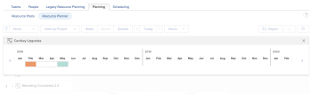

# Adjust budgeting dates in the *`Resource Planner`* {#adjust-budgeting-dates-in-the-resource-planner}

If you find that there are overallocations of your resources after you have budgeted them in the *`Resource Planner`*, you can explore what-if scenarios by moving the Budgeted Hours, FTE, or Costs to another time frame. Based on the findings in these scenarios, you can then adjust your budgeted Hours, FTE, or Cost.

Overallocations can appear when the Budgeted Hours, FTE, or Costs of your resources are higher then their Available Hours, FTE, or Costs. This generates a negative Net value. 

## Access requirements {#access-requirements}

You must have the following:

<table style="width: 100%;margin-left: 0;margin-right: auto;mc-table-style: url('../../Resources/TableStyles/TableStyle-List-options-in-steps.css');" class="TableStyle-TableStyle-List-options-in-steps" cellspacing="0"> 
 <col class="TableStyle-TableStyle-List-options-in-steps-Column-Column1"> 
 <col class="TableStyle-TableStyle-List-options-in-steps-Column-Column2"> 
 <tbody> 
  <tr class="TableStyle-TableStyle-List-options-in-steps-Body-LightGray"> 
   <td class="TableStyle-TableStyle-List-options-in-steps-BodyE-Column1-LightGray" role="rowheader">Adobe Workfront plan*</td> 
   <td class="TableStyle-TableStyle-List-options-in-steps-BodyD-Column2-LightGray"> 
Pro and higher
 </td> 
  </tr> 
  <tr class="TableStyle-TableStyle-List-options-in-steps-Body-MediumGray"> 
   <td class="TableStyle-TableStyle-List-options-in-steps-BodyE-Column1-MediumGray" role="rowheader">Adobe Workfront license*</td> 
   <td class="TableStyle-TableStyle-List-options-in-steps-BodyD-Column2-MediumGray"> 
Plan 
 </td> 
  </tr> 
  <tr class="TableStyle-TableStyle-List-options-in-steps-Body-LightGray"> 
   <td class="TableStyle-TableStyle-List-options-in-steps-BodyE-Column1-LightGray" role="rowheader">Access level configurations*</td> 
   <td class="TableStyle-TableStyle-List-options-in-steps-BodyD-Column2-LightGray"> 
Edit access to&nbsp;Resource Management that includes access to&nbsp;Edit priorities and budget hours in the Resource Planner
 
Edit access to Financial Data, Projects, and Users
 
Note: If you still don't have access, ask your Workfront administrator if they set additional restrictions in your access level. For information on how a Workfront administrator can change your access level, see <a href="create-modify-access-levels.md" class="MCXref xref">Create or modify custom access levels</a>.
 </td> 
  </tr> 
  <tr class="TableStyle-TableStyle-List-options-in-steps-Body-MediumGray"> 
   <td class="TableStyle-TableStyle-List-options-in-steps-BodyB-Column1-MediumGray" role="rowheader">Object permissions</td> 
   <td class="TableStyle-TableStyle-List-options-in-steps-BodyA-Column2-MediumGray"> 
Manage permissions to the projects you want to budget information for with ability to Manage Finances
 
For information on requesting additional access, see <a href="request-access.md" class="MCXref xref">Request access to objects in Adobe Workfront</a>.
 </td> 
  </tr> 
 </tbody> 
</table>

&#42;To find out what plan, license type, or access you have, contact your *`Workfront administrator`*.

## `Adjust Budgeting Dates`  {#adjust-budgeting-dates}

1.   Go to the *`Resource Planner`* and select `View by Project`.

   >[!NOTE]
   >
   >You can use the Adjust Budgeted Dates option only when you view the *`Resource Planner`* by project. 

1.  Hover over the name of a project, then click the `More` menu. 
1.  Click `Adjust Budgeting Dates`.  
   The project allocation timeline is displayed.  
   The time frame where the hours are currently budgeted is highlighted in orange if there is a budgeting conflict and in blue if there are no conflicts. 

   

1.  Drag and drop the highlighted time frame to another time to understand where there are no budgeting conflicts for the selected project. When you find a time frame where the Net value is positive, the highlighted time frame changes to blue. 
1. Click the "x" in the upper right corner of the project allocation timeline to close it. 
1.  Remove the budgeted hours from the existing timeline of the project and add them to the timeline that shows the most availability. 
1.  Click `Save`. 
1.  (Conditional and optional) If the time frames without budgeting conflicts are outside the timeline of the project, click the name of the project to access the project. 
1.  (Conditional and optional) Click `Edit Project`, then edit the `Planned Start Date` or the `Planned Completion Date` to modify the timeline of the project for the time frame with no budgeting conflicts.   
   For more information about editing projects, see the article [Edit projects](edit-projects.md).

1.  (Conditional and optional) Click `Save Changes`. 
1.  Return to the *`Resource Planner`* and re-enter the Budgeted Hours, FTEs, or Costs in the time frame without budgeting conflicts. 
1.  Click `Save`. 

