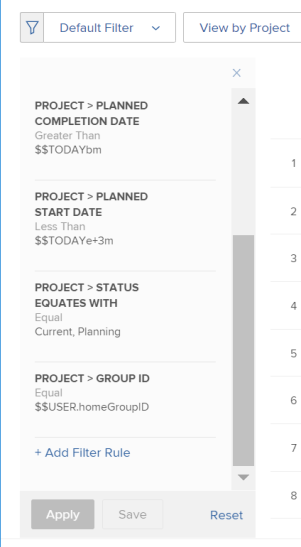
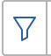
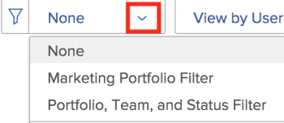
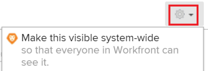

# Filter information in the `Resource Planner`

Using filters, you can modify what information displays in the `Resource Planner` from all the information that is stored in the system.

## Access requirements

You must have the following:

<table cellspacing="0"> 
 <col> 
 <col> 
 <tbody> 
  <tr> 
   <td role="rowheader">Adobe Workfront plan*</td> 
   <td> 
Pro and higher
 </td> 
  </tr> 
  <tr> 
   <td role="rowheader">Adobe Workfront license*</td> 
   <td> 
Review or higher
 </td> 
  </tr> 
  <tr> 
   <td role="rowheader">Access level configurations*</td> 
   <td> 
View or higher access to&nbsp;Projects, Users, and Resource Management 
 
Note: If you still don't have access, ask your Workfront administrator if they set additional restrictions in your access level. For information on how a Workfront administrator can change your access level, see <a href="../../administration-and-setup/add-users/configure-and-grant-access/create-modify-access-levels.md" class="MCXref xref">Create or modify custom access levels</a>.
 </td> 
  </tr> 
  <tr> 
   <td role="rowheader">Object permissions</td> 
   <td> 
View permissions or higher for projects
 
For information on requesting additional access, see <a href="../../workfront-basics/grant-and-request-access-to-objects/request-access.md" class="MCXref xref">Request access to objects in Adobe Workfront</a>.
 </td> 
  </tr> 
 </tbody> 
</table>

&#42;To find out what plan, license type, or access you have, contact your `Workfront administrator`.

## Overview of `Resource Planner` filters

To minimize the amount of information displayed in the `Resource Planner`, `Adobe Workfront` provides a Default Filter with preconfigured criteria. For information about the Default Filter, see the section [Overview of the Default Filter in the Resource Planner](#understanding-default-filter) in this article.

You can also build customized filters. For information of customizing filters in the `Resource Planner`, see the section [Create Resource Planner filters](#creating-custom-filters) in this article.

Consider the following when using filters in the `Resource Planner`:

* The filters you create are visible only to you. You can share filters to make them available to other users.
* As a `Workfront administrator`, you can only see filters you create or that are shared with you. 
* The filtered results do not change when you select a different view for the `Resource Planner`.  
  For more information about changing the view in the `Resource Planner`, see the "Project/ Role/ User view" selection section in [Resource Planner navigation overview](../../resource-mgmt/resource-planning/resource-planner-navigation.md).

* Applying a filter does not change the allocation and availability data in the `Resource Planner` for projects, roles, or users. A filter changes only the number of objects that you see in the `Resource Planner`. 

* Filtering applies to all the objects that display in the `Resource Planner` at the same time. For example, if you filter for a specific user, the `Resource Planner` displays only the following results:

  * Projects where that user is part of the Resource Pool (for the Project and Role views) or has an assignment on the project (for the User view)
  * Roles associated with the user on those projects  
    Other roles or users on the projects that the user is associated with do not display.

## Overview of the Default Filter in the `Resource Planner`

When you open the `Resource Planner` for the first time, `Workfront` applies the Default filter. You can edit the Default filter to filter for only the items you want displayed. For information on modifying a filters, see the section [Edit a filter in the Resource Planner](#editing-a-filter) in this article.

Consider the following when using the Default filter:

<ul> 
 <li>The Default Filter retrieves information only from projects with the following:
  <ul>
   <li>A Planned Completion Date that occurs after the first date of the current month</li>
   <li>A Planned Start Date that occurs before the last day of the fourth month from the current date</li>
   <li>
A Status of Current or Planning
</li>
  </ul><note type="important">
   The Default filter retrieves information from the projects occurring always within four months starting with the first day of the current month, regardless of the timeframe you select to the display in the 
   Resource Planner.
  </note></li> 
 <li>In the User View, all users in the system display but only the users associated with the filtered projects show hour information.</li> 
 <li>You can edit the information in the Default filter without saving the filter.</li> 
 <li>You can duplicate and edit a copy of the Default filter, change desired criteria in it, then save it as a new filter.</li> 
 <li> 
You cannot delete or share the Default filter.
 
  
 </li> 
</ul>

## Create `Resource Planner` filters

Creating a filter in the `Resource Planner` is identical for all the views.

Ensure that the prerequisites for viewing the correct information in the `Resource Planner` are in place before you create a filter.   
For information about meeting the necessary prerequisites for working with the `Resource Planner`, see the "Prerequisites for working in the `Resource Planner`" section in the [Resource Planner overview](../../resource-mgmt/resource-planning/get-started-resource-planner.md) article.

Consider the following as you create a filter:

* There is no limit on the number of objects you can filter for at one time.
* The available fields you can add to a filter change according to the object of the view you apply to the `Resource Planner`. For example, you can filter for Issue or Task fields only in the User View because these objects display only in the User View. If you build a filter for Issues or Tasks in the User view and then apply it to the Project or Role views, it is ignored because the fields don't exist in the Project or Role views. In this case, the filter appears unavailable.

To create a filter in the `Resource Planner`:

<ol> 
 <li value="1"> Click the Main Menu icon  in the upper-right corner of Adobe Workfront.</li> 
 <li value="2"> 
 Click Resourcing.
 
 The Planner displays by default. 
 
By default, the first time you access the Resource Planner, the Default Filter is applied. For more information about the Default filter, see the Overview of the Default Filter in the Resource Planner section in this article. 
 </li> 
 <li value="3">In the upper-left corner of the , click the Filter icon.  Or  Expand the Filter drop-down menu and click Add New Filter.   </li> 
 <li value="4"> 
 To build a filter using the built-in criteria, specify any of the following fields:
 
  <ul> 
   <li>Portfolio: Begin typing the name of the portfolio that contains the information you want to include in the Resource Planner, then click the name when it appears in the list. Repeat this process to include information from multiple portfolios.</li> 
   <li>Project Status: Expand the Project Status drop-down menu and select one or multiple project statuses available in the list. </li> 
   <li>Team: Begin typing the name of one or multiple teams associated with the users assigned to tasks in the projects you want to view.</li> 
   <li>Job Role: Begin typing the name of one or multiple job roles associated with the users assigned to tasks in the projects you want to view.</li> 
   <li>Pools: Begin typing the name of one or multiple Resource Pools that are associated with the projects (for the Project View), the users (for the User View), or associated with both the projects and the users (for the Role View) that you want to view. </li> 
   <li>Group: Begin typing the name of one or multiple groups associated with the users (in the User view) or projects (in the Project and Role views) that you want to view.</li> 
  </ul> </li> 
 <li value="5"> 
Click Add Filter Rule, then begin typing the field name that you want to filter by in the Type to filter items box. If the field is available, it populates for each object where it can be associated. 
 <note type="important">
   When referencing custom fields, you must type the field name and not the field label. The field label displays on a custom form attached to an object. For information about the difference between the label and the name of a custom field, see 
   <a href="../../administration-and-setup/customize-workfront/create-manage-custom-forms/create-or-edit-a-custom-form.md" class="MCXref xref">Create or edit a custom form</a>
   .
  </note> </li> 
 <li value="6">Click the name of the field to add it to the filter when it appears in the list. For more information about the fields you see in the list, see <a href="../../workfront-basics/navigate-workfront/workfront-navigation/workfront-terminology-glossary.md" class="MCXref xref">Glossary of Adobe Workfront terminology</a>. </li> 
 <li value="7"> 
(Optional) Select the filter and condition modifiers for the filter. The available modifiers are described in <a href="../../reports-and-dashboards/reports/reporting-elements/filter-condition-modifiers.md" class="MCXref xref">Filter and condition modifiers</a>. 
 
You can use user-based or date-based wildcards to filter for information associated with the logged-in user.  For information about supported wildcards in filters, see <a href="../../reports-and-dashboards/reports/reporting-elements/understand-wildcard-filter-variables.md" class="MCXref xref">Wildcard filter variables</a>. 
 </li> 
 <li value="8">Click Save<em> </em>to save the filter rule.</li> 
 <li value="9">(Optional) Click Add Filter Rule to add a new rule for another object or field.</li> 
 <li value="10"> 
Click Apply to apply the filter without saving it. 
 
Or 
 
Click Save Filter to save the filter. 
 </li> 
 <li style="font-style: normal;" value="11"> 
(Conditional) After you click Save, specify a name for the filter in the Filter Name box inside the Save Filter dialog box. This is a required field. 
 <note type="note"> 
   
If your filter name includes special characters, you use only the following characters:
 
   <ul> 
    <li>Comma</li> 
    <li>Slash</li> 
    <li>Hyphen</li> 
    <li>Underscore</li> 
   </ul> 
  </note> </li> 
 <li style="font-style: normal;" value="12"> 
Click Save.
 
The results in the Resource Planner are now filtered by the information you included in the filter rules. 
 </li> 
</ol>

## Apply an existing filter

When you or someone with access to the `Resource Planner` saves a filter, it becomes available to everyone using the `Resource Planner`.

To apply an existing filter:

<ol> 
 <li value="1">Go to the Resource Planner.</li> 
 <li value="2"> 
In the upper-left corner, expand the Filter drop-down menu.
 
You can see filters you created or others created and shared with you in this menu.   
 </li> 
 <li value="3">Select a filter in the drop-down menu. You can see filters that you or other users created in this menu. When you select a filter, it automatically reduces the amount of information that displays in the Resource Planner. </li> 
</ol>

## Edit a filter in the `Resource Planner`

You can edit a filter in the `Resource Planner` by doing one of the following:

* [Rename a filter](#renaming-a-filter) 
* [Edit the information in a filter](#editing-the-filter-criteria) 
* [Duplicate a filter](#duplicating-filter)

When you edit a filter, it is updated for all users in the system who have access to the `Resource Planner`.

### Rename a filter

You can change the name of a filter without changing its criteria. We recommend letting other users in the system know about this change, as filters are visible to other users. This change affects the lists of filters for everyone who can see the `Resource Planner`.

<ol> 
 <li value="1">Go to the Resource Planner and expand the Filter drop-down menu to select a saved filter. </li> 
 <li value="2">Expand the Filter drop-down menu. Locate the filter that you want to rename and hover over its name. </li> 
 <li value="3"> 
Select the Rename filter icon next to the name of the filter.
 
    
 </li> 
 <li value="4">Specify a new name for the filter in the Filter Name box.</li> 
 <li value="5">Click Save. The information included in the filter is the same, and the name is updated. </li> 
</ol>

### Edit the information in a filter

You can change the information you include in a filter without changing its name. We recommend letting other users in the system know about this change, as filters are visible to them. This change affects the lists of filters for everyone who can see the `Resource Planner`.

<ol> 
 <li value="1">Go to the Resource Planner and expand the Filter drop-down menu in the upper-left corner. </li> 
 <li value="2">Select an existing filter that you want to edit. </li> 
 <li value="3">Click the Filter icon.  </li> 
 <li value="4">Add new fields to the filter. For information about building filters, see <a href="#creating-custom-filters" class="MCXref xref">Create Resource Planner filters</a>.</li> 
 <li value="5">Hover over the existing fields selected for the filter, and click the Edit icon to select another field, or the Delete icon to delete the field. </li> 
 <li value="6">(Optional) Click Add Filter Rule to add new fields to the filter. For more information about defining filter criteria, see <a href="#creating-custom-filters" class="MCXref xref">Create Resource Planner filters</a>.</li> 
 <li value="7"> 
Click Apply to apply the filter without saving it. 
 
Or
 
Click Save to save the filter. The filter is saved with the same name but with new filtering criteria.
 </li> 
</ol>

### Duplicate a filter

You can duplicate an existing filter. The original filtering criteria remain the same in the duplicated filter and you can save the new filter by a new name.

<ol> 
 <li value="1">Go to the Resource Planner and expand the Filter drop-down menu in the upper-left corner. </li> 
 <li value="2">Hover over the name of a saved filter that you want to duplicate. </li> 
 <li value="3"> 
Click the Duplicate icon.
 
   The Duplicate Filter box is displayed.
 </li> 
 <li value="4">In the Filter Name field, specify a new name for the duplicated filter. The default name for the new filter is <em><Original Filter Name>(copy)</em>.</li> 
 <li value="5">Click Save. A new filter is created with the same criteria as the original filter and with a new name. <note type="note">
    Although you can have 2 filters by the same name and with identical criteria, we recommend that you save filters with unique filtering criteria and names in your 
   Resource Planner to avoid confusion.
  </note></li> 
</ol>

## Delete a filter

You can delete a filter when it is no longer needed. You cannot delete the Default Filter.

For information about the Default Filter, see the [Overview of the Default Filter in the Resource Planner](#understanding-default-filter) section in this article.

When you delete a filter, the filter is deleted for all `Workfront` users who have access to the `Resource Planner`. Before removing it, ensure the filter you want to remove is no longer used by anyone else who is working in the `Resource Planner`. A deleted filter cannot be recovered.

To remove a filter:

<ol> 
 <li value="1">Go to the Resource Planner.</li> 
 <li value="2">Expand the Filter drop-down menu.</li> 
 <li value="3">Locate the filter that you want to remove and hover over its name.</li> 
 <li value="4"> 
Select the Delete filter icon next to the name of the filter.
 
    
 </li> 
 <li value="5">Click Delete in the Delete Filter dialog box.</li> 
 <li style="list-style-type: none;" value="6">The filter is deleted and removed from the Resource Planner. </li> 
</ol>

## Share a filter

You can share a filter that you built or that you have access to share with other users. You cannot share the Default Filter, but you can duplicate it and share the copy.

>[!NOTE]
>
>All users, including `Workfront administrators`, can access only filters that they have built or that have been shared with them. You can share a filter with specific users to make a filter available to all `Resource Planner` users.

For information about the Default Filter, see the [Overview of the Default Filter in the Resource Planner](#understanding-default-filter) section in this article.

For information about duplicating filters, see the [Duplicate a filter](#duplicating-filter) section in this article.

<ol> 
 <li value="1">Go to the Resource Planner.</li> 
 <li value="2">Expand the Filter drop-down menu.</li> 
 <li value="3">Locate the filter that you want to share and hover over its name.</li> 
 <li value="4"> 
Select the Share filter icon next to the name of the filter.
 
  
 
The Filter Access dialog box displays.
 </li> 
 <li value="5"> 
(Optional) To make the filter available to all Resource Planner users, click the Settings icon, then select Make this visible system-wide.
 
  
 
 
 </li> 
 <li value="6">In the Give resource planner filter access to: box, start typing the names of users, teams, roles, groups, or companies that you want to share the filter with.</li> 
 <li value="7">Select from the following permissions levels:
  <ul>
   <li>View </li>
   <li>
Manage

For information about permissions in Workfront, see <a href="../../workfront-basics/grant-and-request-access-to-objects/sharing-permissions-on-objects-overview.md" class="MCXref xref">Overview of sharing permissions on objects in Adobe Workfront</a>
</li>
  </ul></li> 
 <li value="8"> 
(Optional) Click Advanced Settings to add permissions for each level by selecting them or remove permissions for each level by deselecting them.
 
  
 </li> 
 <li value="9"> 
Click Save.
 
The filter is shared with the entities that you selected and it appears in the Shared with me area. 
 
  
 </li> 
</ol>

