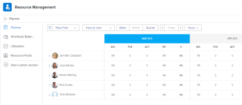

# Locate the *Resource Planner* in *Adobe Workfront*

You can use the *Resource Planner* to manage the allocation of your resources to projects. You can access the *Resource Planner* for multiple projects at the same time or for one project, from the project's Business Case area.

## Access requirements

You must have the following:

<table cellspacing="0"> 
 <col> 
 <col> 
 <tbody> 
  <tr> 
   <td role="rowheader"><em>Adobe Workfront</em> plan*</td> 
   <td> 
<em>Pro</em> and higher
 </td> 
  </tr> 
  <tr> 
   <td role="rowheader"><em>Adobe Workfront</em> license*</td> 
   <td> 
<em>Review</em> or higher
 
<em>Plan</em> or higher to locate the <em>Resource Planner</em> in the global area
 </td> 
  </tr> 
  <tr> 
   <td role="rowheader">Access level configurations*</td> 
   <td> 
View access or higher to&nbsp;Resource Management
 
Note: If you still don't have access, ask your <em>Workfront administrator</em> if they set additional restrictions in your access level. For information on how a <em>Workfront administrator</em> can modify your access level, see <a href="../../administration-and-setup/add-users/configure-and-grant-access/create-modify-access-levels.md" class="MCXref xref">Create or modify custom access levels</a>.
 </td> 
  </tr> 
  <tr> 
   <td role="rowheader">Object permissions</td> 
   <td> 
View permissions to projects and users 
 
For information on requesting additional access, see <a href="../../workfront-basics/grant-and-request-access-to-objects/request-access.md" class="MCXref xref">Request access to objects in Adobe Workfront</a>.
 </td> 
  </tr> 
 </tbody> 
</table>

&#42;To find out what plan, license type, or access you have, contact your *Workfront administrator*.

## Prerequisites

Ensure that all prerequisites for accessing and working with the *Resource Planner* are met before starting to use it. This way, you ensure that the *Resource Planner* displays the correct information before you start budgeting your resources.

For information about *Resource Planner* prerequisites, see [Get started with Resource Planning](../../resource-mgmt/resource-planning/get-started-resource-planning.md).

## Locate the *Resource Planner*

You can locate the Planner in two areas of *Workfront*, depending on whether you want to budget your resources for multiple projects, or for just one project.

* [Use the Resource Planner for multiple projects](#access) 
* [Use the Resource Planner for one project](#access2)

### Use the *Resource Planner* for multiple projects

When using the *Resource Planner* for multiple projects, the allocation numbers for your resources represent numbers across multiple projects.

To access the 

<!--
<MadCap:conditionalText data-mc-conditions="QuicksilverOrClassic.Quicksilver">
Planner section
</MadCap:conditionalText>
-->

`<MadCap:conditionalText data-mc-conditions="QuicksilverOrClassic.Quicksilver"> Planner section</MadCap:conditionalText>` in the 

<!--
<MadCap:conditionalText data-mc-conditions="QuicksilverOrClassic.Quicksilver">
Resourcing
</MadCap:conditionalText>
-->

`<MadCap:conditionalText data-mc-conditions="QuicksilverOrClassic.Quicksilver"> Resourcing </MadCap:conditionalText>`area:

<ol> 
 <li value="1"> <draft-comment>
   <MadCap:conditionalText data-mc-conditions="QuicksilverOrClassic.Quicksilver">
     Click the 
    Main Menu icon 
     in the upper-right corner of 
    <em>Adobe Workfront</em>.
   </MadCap:conditionalText>
  </draft-comment><MadCap:conditionalText data-mc-conditions="QuicksilverOrClassic.Quicksilver">
    Click the 
   Main Menu icon 
    in the upper-right corner of 
   <em>Adobe Workfront</em>.
  </MadCap:conditionalText> </li> 
 <li value="2"> 
 <draft-comment>
    <MadCap:conditionalText data-mc-conditions="QuicksilverOrClassic.Quicksilver">
     Click 
     Resourcing. The Planner displays by default. 
    </MadCap:conditionalText>
   </draft-comment><MadCap:conditionalText data-mc-conditions="QuicksilverOrClassic.Quicksilver">
    Click 
    Resourcing. The Planner displays by default. 
   </MadCap:conditionalText> For information about budgeting resources in the Planner, see the article <a href="../../resource-mgmt/resource-planning/budget-resources-project-role-views-resource-planner.md" class="MCXref xref">Budget resources in the Resource Planner using the Project and Role views</a>. 
 
 <draft-comment>
    
   </draft-comment> 
 </li> 
 <li value="3"> <draft-comment>
   <MadCap:conditionalText data-mc-conditions="QuicksilverOrClassic.Quicksilver">
    Hover over the left panel, and click 
    Resource Pools. 
   </MadCap:conditionalText>
  </draft-comment><MadCap:conditionalText data-mc-conditions="QuicksilverOrClassic.Quicksilver">
   Hover over the left panel, and click 
   Resource Pools. 
  </MadCap:conditionalText> For information about creating resource pools, see <a href="../../resource-mgmt/resource-planning/resource-pools/create-resource-pools.md" class="MCXref xref">Create resource pools in Adobe Workfront</a>.</li> 
</ol>

### Use the *Resource Planner* for one project

When using the *Resource Planner* for one project, the allocation numbers for your resources represent numbers for the selected project.

<ol> 
 <li value="1"> 
Go to a project you want to budget resources for.
 </li> 
 <li value="2"> <draft-comment>
   
Click Business Case in the left panel.

  </draft-comment>
Click Business Case in the left panel.
 </li> 
 <li value="3"> 
Scroll to the Resource Budgeting section of the Business Case.
 </li> 
 <li value="4"> 
Click Edit Resource Budgeting to add resource pools to your project and start budgeting your resources. 
 <note type="tip">
   You can only add a resource pool in the Resource Budgeting area of the Business Case when the project has no resource pools associated with it. When the project already has a Resource Pool, the users in the pool and their job roles display in the Resource Budgeting area by default. 
  </note> 
  
 
For information about budgeting resources for one project, see the article <a href="../../manage-work/projects/define-a-business-case/budget-resources-in-business-case.md" class="MCXref xref">Budget resources in the Business Case</a>.
 </li> 
</ol>

