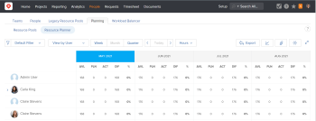

# Manage resources in the Resource Planner

<!--
This replaces this: Resource Planner overview
-->

<!--
*** The pink sections below have moved to the respective articles
-->

<!--
This should be restructured to walk users through how to plan resources:
-->

<ul> <!--
  where to start
 --> <!--
  prerequisites
 --> <!--
  benefits of resource planning
 --> <!--
  how to - and what tools to use: start in what view? follow with what view? go to user view to see who is allocated and adjust the timelines go to scheduling to assign tasks and see who is overallocated - link to scheduling here.
 --> <!--
  etc ...
 --> 
 <li> <!--
   ***
  --> <!--
   You can manage the allocation of your resources to the projects they are assigned to and forecast their availability for future work at the system level using Resource Planning tools. For an overview of the Resource Planning functionality available in Workfront, see Get started with Resource Planning .
  --> <h2>Understanding the Resource Planner</h2> 
As a Resource Manager, you can prioritize the projects you are working on, and budget your resource allocation for them to ensure that you have the best resources do the work.&nbsp;
 
By using the Resource Planner,&nbsp;you can&nbsp;easily understand the&nbsp;availability of your resources, and budget their allocations for future work at the system level, across all projects.
 
The Resource Planner has two purposes:&nbsp;
 
  <ul> 
   <li> To help Resource Managers budget the allocation of their job roles for the work that needs to be accomplished. You can use the Project and Role&nbsp;views to accomplish this. For more information about budgeting in the Resource Planner, see the&nbsp;<a href="#budgeting-allocations-in-the-resource-planner" class="MCXref xref">Budgeting&nbsp;Resources in the Resource Planner</a>&nbsp;section in this article. </li> 
   <li> To help Resource Managers and team managers view their users' availability and planned allocation to projects in the system. For more information about viewing the difference between the Available and Planned Hours for users in the Resource Planner, see the&nbsp; "<a href="#viewing-user-availability-in-the-rp" class="MCXref xref">Understanding User Availability in the Resource Planner</a>&nbsp;section in this article. </li> 
  </ul> 
For more information about what areas display in the Resource Planner and how to configure what information displays in these areas, see <a href="../../resource-mgmt/resource-planning/resource-planner-navigation.md" class="MCXref xref">Resource Planner navigation overview </a>.
 <note type="tip">
    You cannot use the Resource Planner to assign actual work (tasks and issues) to users or job roles. You must use the Resource Scheduling tools to assign work to users. For more information about Resource Scheduling, see the 
   <a href="../../resource-mgmt/resource-scheduling/resource-scheduling-overview.md" class="MCXref xref">Resource Scheduling</a> section.&nbsp; 
  </note> <h2>Prerequisites&nbsp;</h2> 
 To successfully use the Resource Planner, you must first ensure that your users, projects, tasks, and issues meet&nbsp;a set of prerequisites. These prerequisites are mandatory to display the correct information in the Resource Planner. 
 
 For&nbsp;more information about the prerequisites that must be met before you can start using the Resource Planner, see the <a href="../../resource-mgmt/resource-planning/get-started-resource-planning.md" class="MCXref xref">Get started with Resource Planning </a><a href="../../resource-mgmt/resource-planning/get-started-resource-planning.md" class="MCXref xref">Get started with Resource Planning </a> section in <a href="../../resource-mgmt/resource-planning/get-started-resource-planning.md" class="MCXref xref">Get started with Resource Planning </a>.
 <h2>Accessing the Resource Planner</h2>> 
  <ol> 
   <li value="1"> Go to the People area in the Global Navigation Bar. </li> 
   <li value="2"> Select the&nbsp;Planning tab. </li> 
   <li value="3"> Select the Resource Planner sub-tab.   Ensure that all prerequisites are met before starting to use the Resource Planner. This way, you ensure that the Resource Planner displays the correct information before you start budgeting your resources. For&nbsp;more information about the prerequisites that must be met before you can start using the Resource Planner, see the <a href="../../resource-mgmt/resource-planning/get-started-resource-planning.md" class="MCXref xref">Get started with Resource Planning </a><a href="../../resource-mgmt/resource-planning/get-started-resource-planning.md" class="MCXref xref">Get started with Resource Planning </a> section in <a href="../../resource-mgmt/resource-planning/get-started-resource-planning.md" class="MCXref xref">Get started with Resource Planning </a>.</li> 
  </ol><h2>Budgeting&nbsp;Resources in the Resource Planner</h2>
 The main function of the Resource Planner is to budget your resources for the work that needs to be completed on the projects where you are designated as a Resource Manager.&nbsp; 
 <note type="tip">
    You can budget your resources only if you apply the 
   View by Project or 
   View by Role views to the Resource Planner. 
  </note> 
  <ul> 
   <li><a href="#understanding-numbers-in-the-rp-when-budgeting-resources" class="MCXref xref">Understanding the Information in the Resource Planner when Budgeting Resources by Hours, FTE, or Cost</a></li> 
   <li><a href="#budgeting-in-the-planner-subsection" class="MCXref xref">Budgeting Resources in the Resource Planner</a></li> 
  </ul><h3>Understanding the Information in the Resource Planner when Budgeting Resources by Hours, FTE, or Cost</h3> <note type="tip">
    &nbsp;You may find that in your organization you need to budget your resources by Cost. 
    Budgeting by Cost is identical to budgeting by Hours or FTE, but you have to understand how the cost amounts are calculated for the Resource Planner. 
    For more information about how costs are calculated in the Resource Planner, see 
   <a href="../../resource-mgmt/resource-planning/calculate-costs-resource-planner.md" class="MCXref xref">Calculate costs in the Resource Planner </a>. 
  </note>
Before budgeting your resources, ensure you have a good understanding of what information displays in the Resource Planner:
 
  <ul> 
   <li>The work that needs to be done is defined by the amount of Planned Hours, FTE, or Cost.</li> 
   <li>The amount of time that users or job roles are available to do this work is defined by the Available Hours, FTE, or Cost. </li> 
  </ul>
This information is displayed in the Resource Planner for each resource and for each project.&nbsp;

 The following table shows the allocation and availability information that displays in the Resource Planner when applying either the Project or the Role&nbsp;view. You can view this information by Hours, FTE, or Cost&nbsp;values.&nbsp; 
 
  <table cellspacing="15"> 
   <col> 
   <col> 
   <col> 
   <tbody> 
    <tr> 
     <td>Column Name (Hours, FTE, or Cost)</td> 
     <td>Displayed&nbsp;by</td> 
     <td>Description</td> 
    </tr> 
    <tr> 
     <td rowspan="3">AVL  (Available Hours, FTE, or Cost)</td> 
     <td>Project&nbsp;</td> 
     <td>
The total of&nbsp;Hours, FTEs, or Cost for which&nbsp;all the users on the project are available to work according to their schedule, for&nbsp;the time frame selected.&nbsp;
</td> 
    </tr> 
    <tr> 
     <td>Role</td> 
     <td>
The total of&nbsp;Hours, FTEs, or Cost&nbsp;for which&nbsp;all the users associated with this role are available to work according to their schedule and their Percentage of FTE Availability&nbsp;for that specific role,&nbsp;for&nbsp;the time frame&nbsp;selected. 

Consider the following:&nbsp;
 
      <ul> 
       <li>If no user is associated with a job role, then the value for the Available Hours for the job role is zero.&nbsp;</li> 
       <li>If a user is associated with a&nbsp;Primary Job Role, but the Percentage of FTE Availability for the role is 0%, the job role Available Hours value is zero.</li> 
       <li>If the user is associated with Other Roles and the Percentage of FTE Availability for the roles is 0%, the Other Roles are not listed in the Resource Planner and the user displays only under their Primary Role.</li> 
      </ul>
For more information about the Percentage of FTE Availability for a job role, see <a href="../../administration-and-setup/add-users/create-and-manage-users/edit-a-users-profile.md" class="MCXref xref">Edit a user's profile</a>.

For more information about how the job role availability is calculated in the Resource Planner, see the "Calculating Job Role Availability" section in <a href="../../resource-mgmt/resource-planning/calculate-hours-fte-for-users-roles-resource-planner.md" class="MCXref xref">Overview of calculating hours and FTE for users and roles in the Resource Planner</a>.
</td> 
    </tr> 
    <tr> 
     <td>User</td> 
     <td>
Hours, FTEs, or Cost that the user is available to work, according to their schedule, for&nbsp;the time frame selected.&nbsp;This number subtracts the hours associated with the following:
 
      <ul> 
       <li>schedule exceptions</li> 
       <li>time off of the user</li> 
       <li>hours budgeted for other projects.&nbsp;</li> 
      </ul>
The Available&nbsp;Hours, FTEs, or Cost&nbsp;for a user change according the following: 
 
      <ul> 
       <li>how their schedule and FTE are calculated based on the Resource Management Preferences at the system level. For more information about calculating user and job role availability, see <a href="../../resource-mgmt/resource-planning/calculate-hours-fte-for-users-roles-resource-planner.md" class="MCXref xref">Overview of calculating hours and FTE for users and roles in the Resource Planner</a>.</li> 
      </ul> 
      <ul> 
       <li>the Project Planning Priority, if the user is budgeted for work. For more information about how Project Planning Priority affects the Available Hours of a user, see <a href="../../resource-mgmt/resource-planning/resource-planner-navigation.md" class="MCXref xref">Resource Planner navigation overview </a>.</li> 
      </ul>
If the user is scheduled for deactivation, the Available&nbsp;Hours, FTEs, or Cost&nbsp;for the days after the deactivation date are zero.  For more information about deactivating users, see <a href="../../administration-and-setup/add-users/create-and-manage-users/deactivate-a-user.md" class="MCXref xref">Deactivate a user</a>.
</td> 
    </tr> 
    <tr> 
     <td rowspan="4">PLN  (Planned&nbsp;Hours, FTE, or Cost)</td> 
     <td>Project</td> 
     <td>
The&nbsp;total of the Planned&nbsp;Hours, FTEs, or Cost&nbsp;from all the job roles or users listed under the project, including in the No Role or No User sections, for the time frame selected, and as displayed in the Project Details tab of the project.

The Planned Hours are equally distributed for the entire duration of the tasks on the project, based on the project plan.&nbsp;
</td> 
    </tr> 
    <tr> 
     <td>Role</td> 
     <td>
The total of the Planned Hours from all the tasks assigned to the role, during the time frame&nbsp;selected. 

The Planned Hours are distributed for the entire duration of the tasks assigned to this role, based on the task Planned Start and Completion Dates.&nbsp;

The No Role section will show the Planned Hours associated with tasks that are either unassigned, assigned to teams (whose hours&nbsp;are listed in the No User section), or assigned to users who are not associated with a job role. 
</td> 
    </tr> 
    <tr> 
     <td>User</td> 
     <td>
The Planned Hours from all the tasks assigned to the user in a specific role, during the time frame&nbsp;selected. 

The Planned Hours are distributed for the entire duration of the tasks assigned to the role associated with a user or assigned directly to the user.&nbsp;

The No User section will show the Planned Hours associated with tasks that are either unassigned or assigned to teams.&nbsp;
</td> 
    </tr> 
    <tr> 
     <td colspan="2">
<em>IMPORTANT Consider the following when viewing Planned Hours:</em>
 
      <ul> 
       <li><em>Although you cannot see information about task allocations in the Resource Planner in the Project and Role&nbsp;views, the amount of&nbsp;Planned Hours comes from the Planned Hours on the tasks in the projects. Planned Hours are equally distributed by the amount of the days within the duration of the task, for each resource assigned to the task. The following categories of tasks are included in calculating the Planned Hours for each resource:</em> 
        <ul> 
         <li><em>tasks assigned to users in Resource Pools, job roles, or teams on the project If tasks are assigned to teams, their allocation will appear under No Role and No User sections. You can see the Planned Hours associated with teams, but you cannot budget the hours, because no roles nor users are associated with the tasks. &nbsp;</em></li> 
         <li><em>unassigned tasks&nbsp;</em></li> 
        </ul></li> 
       <li><em>Planned Hours in the Resource Planner do not include Planned Hours associated with the following:</em> 
        <ul> 
         <li><em>parent tasks</em></li> 
         <li><em>tasks assigned to users with no Resource Pools</em></li> 
         <li><em>issues, when the&nbsp;Include hours from Issues&nbsp;setting is disabled.</em></li> 
        </ul></li> 
       <li><em>Planned Hours will not appear in the Resource Planner if the task Duration is zero.</em></li> 
      </ul></td> 
    </tr> 
    <tr> 
     <td rowspan="4"> BDG  (BudgetedHours, FTE, or Cost) </td> 
     <td>Project</td> 
     <td>
A manual entry to estimate how many hours, FTE, or Cost you budget for a&nbsp;project, for a selected time frame. 

In the Project view, the hours you budget for the project are distributed to the job roles listed under the project. The amount of Planned Hours for each role determines how the Budgeted Hours are distributed to the roles.&nbsp;

In the Role view, the hours you budget for the project are not distributed to the roles or the users on the project.&nbsp;
</td> 
    </tr> 
    <tr> 
     <td>Role</td> 
     <td>
A manual entry to estimate how many hours you budget&nbsp;for a&nbsp;role, for a selected time frame. 

If no user is associated with the job role, you cannot&nbsp;estimate the Budgeted Hours for the job role.&nbsp;

In the Role view, the hours you budget for the role are distributed to the projects listed under the role. The amount of Planned Hours for each project determines how the Budgeted Hours are distributed to the projects.&nbsp;

In the Project view, the hours you budget for the role are not distributed to the projects or the users associated with the role.&nbsp;
</td> 
    </tr> 
    <tr> 
     <td>User</td> 
     <td>
A manual entry to estimate how many hours you budget for a&nbsp;user, for a selected&nbsp;time frame.&nbsp;

 <note type="tip">
         &nbsp;You can estimate the Budgeted Hours for users who are not assigned to tasks, but are associated with a Resource Pool on a project because these users also appear in the Resource Planner. Their Planned Hours should be zero, however, if they are not assigned to tasks.&nbsp; 
       </note>
</td> 
    </tr> 
    <tr> 
     <td colspan="2"> <note type="tip">
        &nbsp;By default, the Budgeted Hours in the Resource Planner are zero for all resources and for all the projects. 
      </note>
<em>You can manually estimate the Budgeted Hours for users and roles, or you can use one of the links in the Project Options or Job Role Options menus to update them according to the number of Planned Hours. For more information about Project and Role Options, see <a href="#project-role-options" class="MCXref xref">Manage resources in the Resource Planner</a>.</em>

<em>You can report on Budgeted Hours, by selecting Resource Budgeted Hour as your report object for a new report.  For more information about what objects you can report on in Workfront, see the "Reporting on Objects" section in <a href="../../workfront-basics/navigate-workfront/workfront-navigation/understand-objects.md" class="MCXref xref">Understand objects in Adobe Workfront</a>.</em>&nbsp;
</td> 
    </tr> 
    <tr> 
     <td rowspan="4">VAR  (Hour,&nbsp;FTE, or ,Cost Variance)</td> 
     <td>Project</td> 
     <td>
The Hour, FTE, or Cost Variance shows whether you have enough Budgeted Hours for the project&nbsp;to accomplish all the Planned Hours for the project. 

The Project Hour, FTE, or Cost Variance is calculated using&nbsp;the&nbsp;following formula:

<em>Project Hour, FTE, or Cost Variance = Project Budgeted&nbsp;</em><em>Hours, FTE, or Cost</em><em>&nbsp;- Project Planned&nbsp;</em><em>Hours, FTE, or Cost</em>
</td> 
    </tr> 
    <tr> 
     <td>Role</td> 
     <td>
The Hour, FTE, or Cost Variance shows whether you have enough Budgeted&nbsp;Hours, FTE, or Cost&nbsp;for the role&nbsp;to accomplish the Planned Hours assigned to it. 

The Role Hour, FTE, or Cost Variance is calculated using&nbsp;the&nbsp;following formula:

<em>Role Hour, FTE, or Cost Variance = Role Budgeted&nbsp;</em><em>Hours, FTE, or Cost - Role Planned&nbsp;</em><em>Hours, FTE, or Cost</em>
</td> 
    </tr> 
    <tr> 
     <td>User</td> 
     <td>
The&nbsp;Hours, FTE, or Cost Variance shows whether you have enough Budgeted Hours for the user to accomplish the Planned Hours assigned to them. 

The User&nbsp;Hours, FTE, or Cost Variance is calculated using&nbsp;the&nbsp;following formula:

<em>User&nbsp;</em><em>Hours, FTE, or Cost Variance = User Budgeted&nbsp;</em><em>Hours, FTE, or Cost - User Planned Hours, FTE, or Cost</em>
</td> 
    </tr> 
    <tr> 
     <td colspan="2"> <note type="tip"> 
       <em> When the&nbsp;</em> 
      </note><em>Hours, FTE, or Cost Variance displays in red, you have estimated less Budgeted Hours than the Planned Hours of the actual work that needs to be completed. In this case, the Budgeted Hours might not be enough to complete the work.&nbsp;</em></td> 
    </tr> 
    <tr> 
     <td rowspan="4"> NET  (Net&nbsp;Hours, FTEs, or Cost) </td> 
     <td>Project</td> 
     <td>
The Net&nbsp;Hours, FTE, or Cost&nbsp;show how much Available time or cost is left, after you have budgeted them for the project. 

The Project Net&nbsp;Hours, FTEs, or Cost are calculated using&nbsp;this formula:

<em>Project Net&nbsp;</em><em>Hours, FTE, or Cost = Project Available&nbsp;</em><em>Hours, FTE, or Cost - Project Budgeted&nbsp;</em><em>Hours, FTE, or Cost</em>
</td> 
    </tr> 
    <tr> 
     <td>Role</td> 
     <td>
The Net&nbsp;Hours, FTE, or Cost show how many&nbsp;Available&nbsp;Hours, FTE, or Cost are left, after you have budgeted time for the role. 

The Role Net&nbsp;Hours, FTE, or Cost are calculated using&nbsp;this formula:

<em>Role Net&nbsp;</em><em>Hours, FTE, or Cost = Role&nbsp;Available&nbsp;</em><em>Hours, FTE, or Cost- Role Budgeted&nbsp;</em><em>Hours, FTE, or Cost</em>
</td> 
    </tr> 
    <tr> 
     <td>User</td> 
     <td>
The Net&nbsp;Hours, FTE, or Cost show how much Available time or cost is left, after you have budgeted them for the user. 

The User Net&nbsp;Hours, FTE, or Cost are calculated using&nbsp;this formula:

<em>User&nbsp;Net&nbsp;</em><em>Hours, FTE, or Cost = User&nbsp;Available&nbsp;</em><em>Hours, FTE, or Cost - User Budgeted&nbsp;</em><em>Hours, FTE, or Cost</em>
</td> 
    </tr> 
    <tr> 
     <td colspan="2">
 <note type="tip">
         &nbsp;When the Net&nbsp; 
       </note><em>Hours, FTE, or Cost display in red,&nbsp;the&nbsp;resource does not have enough Available time or cost</em><em>&nbsp;to complete the Budgeted time or cost estimated for their allocation. In this case, the&nbsp;resource is overallocated.&nbsp;</em>
</td> 
    </tr> 
   </tbody> 
  </table><h3>Budgeting Resources in the Resource Planner</h3>
You can budget the allocation of your resources by specifying an amount of Hours, FTE, or Cost that your resources can use to complete work on projects. Budgeting by FTE or Cost is identical to budgeting by Hours.&nbsp;

When you budget time or cost for a resource, the Available Hours, FTE, or Cost for the resource decreases by the amount budgeted. As a result the Available Hours, FTE, or Cost amounts for the projects that follow the project for which you are budgeting decreases for those users and roles on those projects.&nbsp;
 <note type="tip">
    You can budget your resources for a period of 15 years. If you budget resources for a project with a duration longer than 15 years the budgeting information might not be accurate. 
  </note>
 We recommend that you budget your resources in the Resource Planner by following these steps: 
 
  <ol> 
   <li value="1"> Decide whether you are going to budget hours for all the roles in your system or whether you are going to budget an amount of hours for several projects at a time. </li> 
   <li value="2"> (Conditional) If you want to budget a total number of hours or cost for all roles in the system, select the Role View in the Resource Planner. For information about budgeting resources by role, see <a href="../../resource-mgmt/resource-planning/budget-by-role-resource-planner-d.md" class="MCXref xref">Budget resources by role in the Resource Planner </a>. Or If you want to budget a total number of hours or cost for several projects in the system, select the Project View in the Resource Planner. For information about budgeting resources by project, see "Budgeting Resources by Project in the Resource Planner." </li> 
   <li value="3">(Optional) Go to the Scheduling tab and assign work to users. For more information about assigning work to users in the Scheduling tab, see <a href="../../resource-mgmt/resource-scheduling/manually-assign-items-scheduling-areas.md" class="MCXref xref">Manually assign unassigned tasks and issues in the Scheduling areas</a>.</li> 
  </ol>
Budgeting allocations for your resources in the Resource Planner is done in the following ways:
 
  <ul> 
   <li>Manually Or</li> 
   <li>Automatically, by using the Project and Role Options in the View by Project and View by Role views. &nbsp; For more information about the Project and Role Options, see the&nbsp;"Project and Role Options" section in <a href="../../resource-mgmt/resource-planning/resource-planner-navigation.md" class="MCXref xref">Resource Planner navigation overview </a>.</li> 
  </ul>
You can budget&nbsp;your resource allocations in the Resource Planner by estimating how many hours, FTE, or how much cost would be necessary for your users or roles to complete a project. You can also reserve a bulk number of hours, FTE, or cost amount for a project, by budgeting hours, FTE, or cost for the project.&nbsp;

 You can budget&nbsp; Hours, FTE, or Cost for your resources for any time frame displayed in the Resource Planner, independent of the timeline of the project. For example, if you want to indicate that your resources might not be available during the timeline of the project (where they are associated with Planned Hours), but they might be available during another time, you can do so by budgeting them for time frames where the Planned Hours are zero, if that is when they become available to work. You can change the timeline of the project to match your resource availability after you do this.&nbsp;
 <note type="tip">
    We recommend that you manually budget your&nbsp;Hours, FTE, or Cost&nbsp;for job roles or for users first. You can use the automatic options to budget time for your projects and resources only when you are sure that the amount of Planned Hours, FTE, or Cost should always match your Budgeted Hours, FTE, or Cost 
    For more information about using the automatic options for budgeting in the Resource Planner, see the "Project and Role Options" section in 
   <a href="../../resource-mgmt/resource-planning/resource-planner-navigation.md" class="MCXref xref">Resource Planner navigation overview </a>. 
  </note> 
  <ul> 
   <li><a href="#budgeting-in-the-project-view" class="MCXref xref">Budgeting Resources in the Project View</a></li> 
   <li><a href="#budgeting-in-the-role-view" class="MCXref xref">Budgeting Resources in the Role View</a></li> 
   <li><a href="#adjusting-budgeted-dates" class="MCXref xref">Adjusting Budgeting Dates</a></li> 
  </ul>
 Budgeting FTE or costs is identical with budgeting hours, where Workfront uses the FTE and cost values instead of hours for the resources you budget.&nbsp; 

 For more information about understanding how Costs are calculated in the Resource Planner, see&nbsp;<em><a href="../../resource-mgmt/resource-planning/calculate-costs-resource-planner.md" class="MCXref xref">Calculate costs in the Resource Planner </a>.</em>

Budgeting Resources in the Project View

**^^  To budget allocations in the Resource Planner in the&nbsp;Project&nbsp;view: 
 
  <ol> 
   <li value="1"> Go to the&nbsp;People&nbsp;area in the Global Navigation Bar. </li> 
   <li value="2"> Select the&nbsp;Planning&nbsp;tab. </li> 
   <li value="3"> Select the&nbsp;Resource Planner&nbsp;sub-tab. </li> 
   <li value="4"> (Conditional) Select the View by Project&nbsp;view.&nbsp; </li> 
   <li value="5"> Expand the projects and the job roles to manage the allocation for the project, job roles, or users. </li> 
   <li value="6"> To budget allocation for users do one of the following: &nbsp; 
    <ul> 
     <li> In the BDG column, manually specify a number of budgeted hours, FTE, or cost for the users. </li> 
     <li>Click the&nbsp;Options icon for the job role of the user, then click Set Users' Planned Hours as Budgeted. The Budgeted Hours of each user are calculated using the following formula: <em>User Budgeted Hours = User Planned Hours</em></li> 
    </ul></li> 
   <li value="7">To budget allocation for job roles, do one of the following:  
    <ul> 
     <li>In the BDG column, manually specify a number of budgeted hours, FTE, or cost for the job role.  <note type="tip">
        The Role Budgeted Hours are added to the Project Budgeted Hours.&nbsp; 
      </note></li> 
     <li>(Conditional) If you have budgeted hours for users, click the Options icon for the job role, then click Total Users' Budgeted Hours for Role. The Budgeted Hours for each role are calculated using the following formula: <em>Role Budgeted Hours = SUM(User Budgeted Hours)</em></li> 
     <li>Click the Options icon for the project, then click Set Roles' Planned Hours as Budgeted. The Budgeted Hours for each role are calculated using the following formula:  <note type="tip">
        Role Budgeted Hours = Role Planned Hours 
         The Role Budgeted Hours are added to the Project Budgeted Hours.&nbsp; 
      </note><a href="#project-role-options" class="MCXref xref">Manage resources in the Resource Planner</a> <note type="tip">
        Users can be budgeted for both Primary and Other (or secondary) Roles. The 
       Percentage of FTE Availability for the&nbsp;roles of the user must be a number different than 0% for&nbsp;the Available Hours to display a value in the Resource Planner for a job role. If a user is associated with a role with a 0% 
       Percentage of FTE Availability, the Available Hours value is zero for that job role. In this case, the role might show a negative 
       Net Value. 
      </note><em> For more information about&nbsp;the Percentage of FTE Availability for job roles, see <a href="../../administration-and-setup/add-users/create-and-manage-users/edit-a-users-profile.md" class="MCXref xref">Edit a user's profile</a>.&nbsp;</em></li> 
     <li>In the BDG column, manually specify a number of budgeted hours, FTE, or cost for the project.  <note type="tip">
        This distributes the number of Project Budgeted Hours to each role under the project. If the number of Project Budgeted Hours your specify equals the Project Planned Hours, the Role Budgeted Hours match the Role Planned Hours. If the number of Project Budgeted Hours you specify does not equal the Project Planned Hours, the Role Budgeted Hours are distributed according to the percentage of Planned Hours needed for each role.&nbsp; 
      </note> <em>For example, if a project has 20 Planned Hours, and they are distributed between two job roles (Consultant requires 12 Planned Hours and Engineer requires 8 Planned Hours), and you budget 30 hours for the Project, the hours are distributed as follows: the Consultant role receives 18 Budgeted Hours, and the Engineer role receives 12 Budgeted Hours.&nbsp;</em></li> 
    </ul></li> 
   <li value="8">To budget allocation for the project, do one of the following: 
    <ul> 
     <li>Budget the roles under the project, as described in Step 7. The Project Budgeted Hours is calculated by the following formula:&nbsp; <em>Project Budgeted Hours = SUM(Role Budgeted Hours)</em></li> 
     <li>In the BDG column, manually specify a number of budgeted hours, FTE, or cost for the project. This updates the Role Budgeted Hours, as described in Step 7. </li> 
    </ul></li> 
   <li value="9">Click Save. After you budget your resources in the Resource Planner, the Budgeted Hours for your resources and any cost associated with them are listed in the Business Case of every project. For more information about understanding the Resource Budgeting area of the Business Case, see the "Resource Budgeting" section in&nbsp;<a href="../../manage-work/projects/define-a-business-case/create-business-case.md" class="MCXref xref">Create a Business Case for a project in Adobe Workfront</a>.</li> 
   <li value="10"> (Optional) Select the User view to notice any user overallocations or underutilization between the Available and the Planned Hours for each user. Budgeted Hours are not visible in the User view.&nbsp; </li> 
  </ol>
Budgeting Resources in the Role View

To budget allocations in the Resource Planner in the&nbsp;Role&nbsp;view:
 
  <ol> 
   <li value="1">Go to the&nbsp;People&nbsp;area in the Global Navigation Bar.</li> 
   <li value="2">Select the&nbsp;Planning&nbsp;tab.</li> 
   <li value="3">Select the&nbsp;Resource Planner&nbsp;sub-tab.</li> 
   <li value="4">(Conditional) Select the View by Role&nbsp;view.&nbsp;</li> 
   <li value="5">Expand the job roles and the projects to manage the allocation for the project, job roles, or users.</li> 
   <li value="6">To budget allocation for users, do one of the following:&nbsp; 
    <ul> 
     <li>In the BDG column, manually specify a number of budgeted hours, FTE, or cost for the users. </li> 
     <li>Click the&nbsp;Options icon for the project, then click Set Users' Planned Hours as Budgeted. The Budgeted Hours of each user are calculated using the following formula: <em>User Budgeted Hours = User Planned Hours</em></li> 
    </ul></li> 
   <li value="7">To budget allocation for job roles, do one of the following:  
    <ul> 
     <li>In the BDG column, manually specify a number of budgeted hours, FTE, or cost for the job roles.  
       <note type="tip">
         This adds the Role Budgeted Hours to the Project Budgeted Hours. 
       </note></li> 
     <li>Click the Options icon for the job role, then click Set Projects' Planned Hours as Budgeted. The Role Budgeted Hours are calculated using the following formula: <em>Role Budgeted Hours = SUM(Project Budgeted Hours) </em>The Project Budgeted Hours are calculated using the following formula: <em>Project Budgeted Hours = Project Planned Hours</em></li> 
     <li>In the BDG column, manually specify a number of budgeted hours, FTE, or cost for the projects listed under the job role. This adds the number of Project Budgeted Hours to the role.&nbsp;<em> </em> 
       <note type="tip">
         Users can be budgeted for both Primary and Other (or secondary) Roles. The 
        Percentage of FTE Availability for the&nbsp;roles of the user must be a number different than 0% for&nbsp;the Available Hours to display a value in the Resource Planner for a job role. If a user is associated with a role with a 0% 
        Percentage of FTE Availability, the Available Hours value is zero for that job role. In this case, the role might show a negative 
        Net Value. 
       </note><em> For more information about&nbsp;the Percentage of FTE Availability for job roles, see <a href="../../administration-and-setup/add-users/create-and-manage-users/edit-a-users-profile.md" class="MCXref xref">Edit a user's profile</a>.</em><em> </em></li> 
    </ul></li> 
   <li value="8">To budget allocation for the project, do one of the following: 
    <ul> 
     <li>In the BDG column, manually specify a number of budgeted hours, FTE, or cost for the projects. This also updates the Budgeted Hours for the roles under which the project is listed.&nbsp;</li> 
     <li>Click the Options icon for the job role, then click Set Projects' Planned Hours as Budgeted. The Project Budgeted Hours are calculated by the following formula: <em>Project Budgeted Hours = Project Planned Hours</em> The Project Budgeted Hours are added to the Role Budgeted Hours.&nbsp;</li> 
     <li>(Conditional) If you have budgeted the hours for the users, click the Options icon for the project, then click Total Users' Budgeted Hours for Project. The Project Budgeted Hours is calculated using the following formula: <em>Project Budgeted Hours = SUM(User Budgeted Hours)</em> </li> 
    </ul></li> 
   <li value="9">Click Save.&nbsp; After you budget your resources in the Resource Planner, the Budgeted Hours for your resources and any cost associated with them are listed in the Business Case of every project. For more information about understanding the Resource Budgeting area of the Business Case, see the "Resource Budgeting" section in&nbsp;<a href="../../manage-work/projects/define-a-business-case/create-business-case.md" class="MCXref xref">Create a Business Case for a project in Adobe Workfront</a>.</li> 
   <li value="10">(Optional) Select the View by User view to notice any user overallocations or underutilization between the Available and the Planned Hours for each user. Budgeted Hours are not visible in the View by User view.&nbsp;</li> 
  </ol>
Adjusting Budgeting Dates

If you find that there are overallocations of your resources after you have budgeted them in the Resource Planner, you can move the Budgeted Hours, FTE, or Costs to another time frame.&nbsp;

Overallocations can appear when the Budgeted Hours, FTE, or Costs of your resources are higher then their Available Hours, FTE, or Costs. This generates a negative Net value.

To&nbsp;move the Budgeted Hours to a different time frame:
 
  <ol> 
   <li value="1"> Go to the Resource Planner and select View by Project. You can move the Budgeted Hours to another time frame only when you view the Resource Planner by project. </li> 
   <li value="2"> Mouse over the name of a project, then click the Options icon. </li> 
   <li value="3">Click Adjust Budgeting Dates. The project allocation timeline is displayed. The time frame where the hours are currently budgeted is highlighted in orange if there is a budgeting conflict and in blue if there are no conflicts.&nbsp; </li> 
   <li value="4">Drag and drop the highlighted time frame to another time to understand where there are no budgeting conflicts for the selected project. When you find a time frame where the Net value is positive, the highlighted time frame changes to blue.&nbsp;</li> 
   <li value="5">Click the "x" in the upper right corner of the project allocation timeline to close it and return to the Resource Planner to remove the Budgeted Hours, FTEs, or Costs from the current time frame, and add them to a time frame with no budgeting conflicts.</li> 
   <li value="6">Remove the budgeted hours from the existing timeline of the project.</li> 
   <li value="7">Click Save.</li> 
   <li value="8">(Conditional and Optional) If the time frames without budgeting conflicts are outside the timeline of the project, click&nbsp;the name of the project to access the project.&nbsp;</li> 
   <li value="9">(Conditional and Optional) Click Edit Project, then edit the Planned Start Date or the Planned Completion Date to modify the timeline of the project for the time frame with no budgeting conflicts.&nbsp;&nbsp; For more information about editing projects, see <a href="../../manage-work/projects/manage-projects/edit-projects.md" class="MCXref xref">Edit projects</a>.</li> 
   <li value="10">(Conditional and Optional) Click Save Changes.</li> 
   <li value="11">Return to the Resource Planner and re-enter the Budgeted Hours, FTEs, or Costs in the time frame without budgeting conflicts.&nbsp;</li> 
   <li value="12">Click Save.&nbsp;<em> </em>(this will have to be changed when the full functionality is out and they actually click Done to move the hours).&nbsp;</li> 
  </ol><h2>Understanding User Availability in the Resource Planner</h2>
 The second function of the Resource Planner is to understand the difference between the Available and Planned Hours or FTE for your resources. 

 <note type="tip">
     You cannot display the Available and Planned values in the User view by Cost.&nbsp; 
   </note>

Consider the following when viewing the Planned Hours or FTE against users' availability in the Resource Planner:&nbsp;
 
  <ul> 
   <li>You can view the Available and Planned Hours or FTE for users, job role, and projects in all views of the Resource Planner. However, you can display the difference between the amount of Planned Hours or FTE and the Available Hours or FTE for users only in the User view.&nbsp;You can then budget the allocation of your users according to this difference in the Project and Role&nbsp;views.&nbsp;</li> 
   <li> You can display the difference between the User Available and Planned Hours or FTE either as a number or as a percentage value. </li> 
   <li> The Available Hours or FTE are populated from the schedules associated with the users. Users not associated with a schedule show availability according to the Default Schedule. For more information about the Default Schedule, see <a href="../../administration-and-setup/set-up-workfront/configure-timesheets-schedules/create-schedules.md" class="MCXref xref">Create a schedule</a>. The Planned Hours or FTE are populated from the Planned Hours of the tasks on the projects.&nbsp; </li> 
   <li> When in the User view, you can expand each user to display a list of projects where that user is assigned, expand every project to display a list of roles that user can fulfill on those projects, then expand each role to display a list of tasks the user in that role is assigned to.&nbsp; If users have no job role associated with them, their Available and Planned Hours or FTE are listed in the No Role section. For more information about what fields and what items are displayed when applying the User&nbsp;view to the Resource Planner, see the "Project/ Role/ User View Selection" section in <a href="../../resource-mgmt/resource-planning/resource-planner-navigation.md" class="MCXref xref">Resource Planner navigation overview </a>.</li> 
  </ul>
 Refer to the following table for understanding the information displayed in the&nbsp;User view of the Resource Planner: 
 
  <table> 
   <col> 
   <col> 
   <col> 
   <tbody> 
    <tr> 
     <td>Column Name (Hours or FTE)</td> 
     <td>Displayed By</td> 
     <td>Description</td> 
    </tr> 
    <tr> 
     <td rowspan="5">AVL  (Available Hours or FTE)</td> 
     <td>User</td> 
     <td>The total of Available Hours or FTE for the user according to their schedule.&nbsp;</td> 
    </tr> 
    <tr> 
     <td>Project</td> 
     <td>This information is not available for the Project when applying the User view to the Resource Planner.&nbsp;</td> 
    </tr> 
    <tr> 
     <td>Role</td> 
     <td>
The total of Available Hours or FTE for the role according to the schedule of the user and the Percentage of FTE Availability of the role.
</td> 
    </tr> 
    <tr> 
     <td>Task or Issue</td> 
     <td>This information is not available for the Task or Issue.</td> 
    </tr> 
    <tr> 
     <td colspan="2"><em>NOTE&nbsp;For more information about how user and role availability is calculated based on the schedule of the user and the Percentage of FTE Availability of the role, see <a href="../../resource-mgmt/resource-planning/calculate-hours-fte-for-users-roles-resource-planner.md" class="MCXref xref">Overview of calculating hours and FTE for users and roles in the Resource Planner</a>.</em></td> 
    </tr> 
    <tr> 
     <td rowspan="5">PLN  (Planned Hours or FTE)</td> 
     <td>User</td> 
     <td> The total of Planned Hours or FTE from all the tasks assigned to the user on all the projects.  <note type="tip">
        This includes tasks that are assigned to the user but not associated with any job role and tasks that are not on projects of which you are the Resource Manager.&nbsp; 
      </note></td> 
    </tr> 
    <tr> 
     <td>Project</td> 
     <td> The total of Planned Hours or FTE from all the tasks assigned to a specific user on the project.  <note type="tip">
        This does not include the Planned Hours or FTE from tasks that are not assigned to any users.&nbsp; 
      </note></td> 
    </tr> 
    <tr> 
     <td>Role</td> 
     <td>
The total of Planned Hours or FTE from all the tasks assigned to the user in this role on the project.
 <note type="tip">
        This does not include the Planned Hours or FTE from tasks that are assigned to this role but not to this user in this role.&nbsp; 
      </note></td> 
    </tr> 
    <tr> 
     <td>Task or Issue</td> 
     <td>The Planned Hours or FTE associated with the task or the issue on the project.</td> 
    </tr> 
    <tr> 
     <td colspan="2"> For more information about Planned Hours and FTE in the Resource Planner, see "<a style="background-color: #ffffff;" href="#understanding-numbers-in-the-rp-when-budgeting-resources" class="MCXref xref">Understanding the Information in the Resource Planner when Budgeting Resources by Hours, FTE, or Cost</a>."</td> 
    </tr> 
    <tr> 
     <td rowspan="4">DIF  (Hour or FTE Difference)   </td> 
     <td>User</td> 
     <td>
The difference between the Available and Planned Hours or FTE of the user. 

The Hour or FTE difference is calculated using the following formula:

<em>User Hour or FTE Difference = User Available Hours or FTE - User Planned Hours or FTE</em>

 <note type="tip">
         If the value is displayed in negative red numbers, the user is overallocated.&nbsp; 
       </note>
</td> 
    </tr> 
    <tr> 
     <td>Project</td> 
     <td>This information is not available for the Project when applying the View by User view to the Resource Planner.&nbsp;</td> 
    </tr> 
    <tr> 
     <td>Role</td> 
     <td>
The difference between the Available and Planned Hours or FTE of the job role. 

The Hour or FTE difference is calculated using the following formula:

<em>Role Hour or FTE Difference = Role Available Hours or FTE - Role Planned Hours or FTE</em>

 <note type="tip">
         If the value is displayed in negative red numbers, the role is overallocated.&nbsp; 
       </note>
</td> 
    </tr> 
    <tr> 
     <td>Task or Issue</td> 
     <td> This information is not available for the Task or Issue&nbsp;when applying the User view to the Resource Planner.&nbsp; </td> 
    </tr> 
    <tr> 
     <td rowspan="5">Planned Hours or FTE Allocation Percentage (%)</td> 
     <td>User</td> 
     <td>
The allocation of the Planned Hours or FTE as a percentage of the Available Hours. The percentage of the Planned Hours Allocation is calculated using the following formula:

<em>User Planned Hours Allocation Percentage = (User Planned Hours/ User Available Hours) * 100</em>

The same calculation is used for FTE values.&nbsp;
</td> 
    </tr> 
    <tr> 
     <td>Project</td> 
     <td>This information is not available for the Project&nbsp;when applying the View by User view to the Resource Planner.</td> 
    </tr> 
    <tr> 
     <td>Role</td> 
     <td> The allocation of the Planned Hours or FTE as a percentage of the Available Hours. 
The percentage of the Planned Hours Allocation is calculated using the following formula:

<em>Role Planned Hours Allocation Percentage = (Role Planned Hours/ Role Available Hours) * 100</em>

The same calculation is used for FTE values.
</td> 
    </tr> 
    <tr> 
     <td>Task or Issue</td> 
     <td>This information is not available for the Task or Issue&nbsp;when applying the User view to the Resource Planner.</td> 
    </tr> 
    <tr> 
     <td colspan="2"> <note type="tip">
        If the value of the Planned Hours or FTE is zero, the Percentage Allocation is 0%. If the value of the Available Hours or FTE is zero, the Percentage Allocation cannot be calculated.&nbsp; 
      </note></td> 
    </tr> 
   </tbody> 
  </table><h2>Calculating FTE in the Resource Planner</h2>
You can display availability, allocation, and planned values in the Resource Planner in Hours, FTE, or Cost.

For more information about changing the information you display in the Resource Planner, see the "Hour/ FTE/ Cost View Selection" section in <a href="../../resource-mgmt/resource-planning/resource-planner-navigation.md" class="MCXref xref">Resource Planner navigation overview </a>.

For more information about how the Hours and FTE for users and roles are calculated in Workfront, see&nbsp;<a href="../../resource-mgmt/resource-planning/calculate-hours-fte-for-users-roles-resource-planner.md" class="MCXref xref">Overview of calculating hours and FTE for users and roles in the Resource Planner</a>.
<h2>Calculating Costs in the Resource Planner</h2>
Along with displaying availability, allocation, and planned values in the Resource Planner in Hours and FTE, you can also display them by Cost.&nbsp;

You must associate your users and your job roles with Cost per Hour rates in order to display information by Costs in the Resource Planner. For more information about associating Cost per Hour rates with job roles, see <a href="../../administration-and-setup/set-up-workfront/organizational-setup/create-manage-job-roles.md" class="MCXref xref">Create and manage job roles</a>. For more information about associating Cost per Hour rates with users, see <a href="../../administration-and-setup/add-users/create-and-manage-users/edit-a-users-profile.md" class="MCXref xref">Edit a user's profile</a>.

Consider the following when viewing information by Cost in the Resource Planner:
 
  <ul> 
   <li>The Cost of each type of hours is calculated using a different Cost Rate.</li> 
   <li>The Planned Cost is affected by the Cost Type of the tasks on the projects.</li> 
   <li>When applying the User View to the Resource Planner, you cannot display the allocation and availability information by Cost.&nbsp;</li> 
  </ul>
For more information about how Costs are calculated in the Resource Planner for users and roles, see <a href="../../resource-mgmt/resource-planning/calculate-costs-resource-planner.md" class="MCXref xref">Calculate costs in the Resource Planner </a>.
<h2> Filtering in the Resource Planner </h2>
 You can reduce the number of projects, roles, or users that display in the Resource Planner by creating a filter.  For more information, see <a href="../../resource-mgmt/resource-planning/filter-resource-planner.md" class="MCXref xref">Filter information in the Resource Planner</a> 

***

*** DO NOT DELETE OR CHANGE THIS ARTICLE. IT IS LINKED TO CONTEXTUAL HELP FOR THE RESOURCE PLANNER! ****

**^^ 

This section is linked to this:&nbsp;https://workfront.zendesk.com/knowledge/articles/115004285774/en-us?brand_id=662728

***Linked to MANY articles; also certain sections linked to other Res. Planning section articles - update when changing sections names: Understanding Areas of the Resource Planner, Calculating Costs in the Resource Planner.&nbsp;

Keep the following pink blurb for all articles in this NEW section:

MORE EDITS AS THE FEATURE DEVELOPS:

***KEEP THIS TILL AFTER 18.2: The information about adjusting budgeted dates will need updating when this functionality releases in 18.2.&nbsp;(this will have to be changed when the full functionality is out and they actually click Done to move the hours).&nbsp;

***Rewrite this from the perspective of usability and budgeting. Notes when rewriting:

- if you manually enter the Budgeted hours for a project, they are distributed in accordance to the % needed for all the job roles under the project and update the role budgeted hours; this does NOT update the user budgeted hours
</li> 
</ul>

[Filtering in the Resource Planner](#filtering-in-the-resource-planner) 
